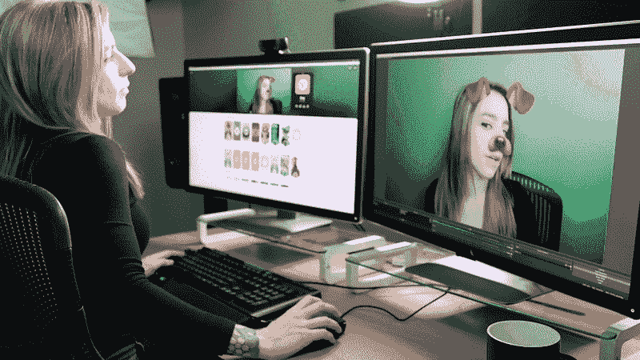
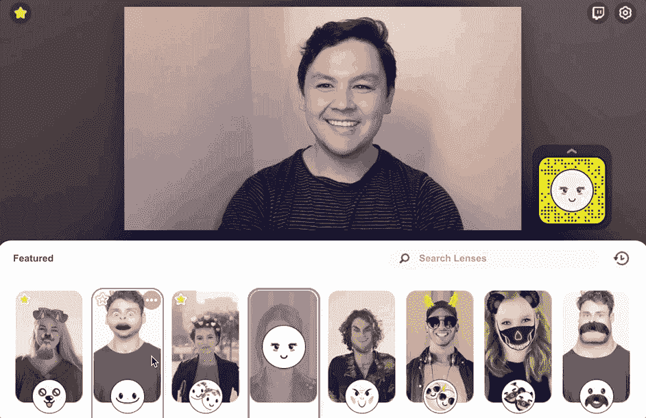

# 把这个拍下来！

> 原文：<https://medium.datadriveninvestor.com/snap-this-up-ed4da43e0d02?source=collection_archive---------17----------------------->

## 在新冠肺炎隔离期间，Snap Camera 的下载量激增

由 [**安东尼·布隆伯格**](https://www.anthonyblumberg.com/)

**Snap Camera 是这个时代完美的视频插件，随着越来越多的人依赖视频通话进行交流，它的下载量激增。**

最近的新冠肺炎疫情迫使许多人呆在室内。没有消息表明隔离将于何时结束。因此，增强您在家工作体验的解决方案现在风靡一时。像微软团队和 Slack 这样的应用程序的用户数量有所上升。一个不太可能的竞争者是 Snap Inc .的 Snap Camera 应用程序，它在这场危机中也受到了欢迎。

Snap Camera 于 2018 年 10 月推出，将 Snapchat 的标志性 AR 镜头带到了桌面上。但是你可能没听说过…直到现在。

 [## 外汇投资如何帮助偿还债务|数据驱动的投资者

### 外汇是对外汇市场的投资，不同国家的货币在外汇市场上进行兑换

www.datadriveninvestor.com](https://www.datadriveninvestor.com/2019/02/13/how-forex-investment-helps-to-repay-your-debts/) 

自本月初以来，Snap Camera 的下载量增长了 10 倍。该应用程序允许你在脸上使用 Snapchat-esuqe 过滤器。您可以通过视频电话向 Google Duo、Skype 和其他视频会议服务等平台播放图像。你甚至可以在 Twitch 和 YouTube 上叠加流媒体。Snap Camera 还附带了几个游戏主题的覆盖图，如《未知玩家的战场》中的头盔、《守望先锋》中的半藏等。

要开始，你只需要一个网络摄像头和 Snap Camera 应用程序，你可以从这里抓取。Snap Camera 在您的计算机上创建虚拟网络摄像头。当 Snap Camera 打开时，它会接收物理网络摄像头的输入，然后用选定的镜头放大它。这个增强的视频然后被输出到 Snap Camera 虚拟网络摄像头。然后，您可以使用快照相机作为输入源。观众可以复制一个镜头扫描一个可以在流媒体播放的快照代码。

抓拍相机除了给严峻的形势带来一点喜剧性的缓解之外，并不能真正提供任何东西。该应用程序正在成为 Snap Inc .较为成功的产品之一。谁知道在这样的危机中，有趣的面孔和狗过滤器会是每个人的归宿？

要查看更多关于我们正在经历的危机的报道——冠状病毒和我们最近的经济衰退——请查看我的网站:[https://www.anthonyblumberg.com/](https://www.anthonyblumberg.com/)

如果你学到了什么，请给我一些掌声，并留下你喜欢的评论！别忘了跟着我，注意安全！