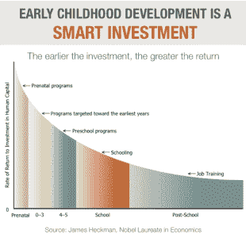
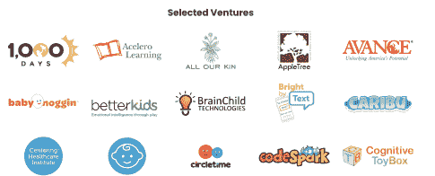
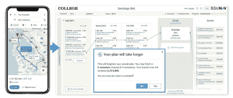
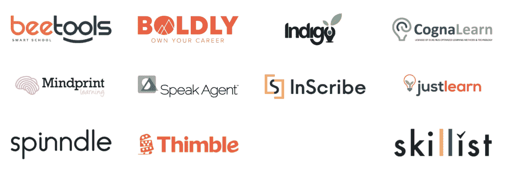

# learn launch 2020-跨界会议快照

> 原文：<https://medium.datadriveninvestor.com/snapshot-form-learnlaunch-2020-across-boundaries-conference-840b00696a2c?source=collection_archive---------12----------------------->

EdTech 现在的**趋势**是什么？你在投资什么？为什么？随着估值的上升，**教育科技**是否处于**泡沫**之中？教育技术到底是什么，有哪些成功的故事，或者所有失败的教训？世界各地如此**分散**多样的教育模式，有什么办法可以让它变得更好？**集中**和**分散**哪个更有效？我们是应该联合所有的系统，使其在所有国家都相似，还是应该使其多样化，以适应社会、文化和当地的偏好？

我没有密切关注教育科技，但我已经思考了所有这些问题一段时间，现在真的不知道如何在教育领域进行创新，它从哪里开始，在哪里结束，如果有的话？本周，我参加了 learn launch Conference[learn launch](https://learnlaunch.org/2020conference/)*，希望能对这个问题有一个更清晰的认识，并了解关于如何教和如何学的最新想法，以便最大限度地利用这个过程，让它变得有趣、有吸引力并尽可能高效。

 [## 教科书行业如何最终被颠覆，并将继续改变|数据驱动…

### 就此而言，教科书产业在美国乃至全世界都有着悠久的历史。事实上，他们已经…

www.datadriveninvestor.com](https://www.datadriveninvestor.com/2018/09/25/how-the-textbook-industry-has-finally-been-disrupted-and-will-continue-to-change/) 

以下是我所学到的🙂

现在市场上有什么，趋势是什么？

K12，SaaS，早期儿童，分析，学校经历和校外活动的交集。风投们试图找到如何混合这些领域，初创公司的创始人正在测试不同的解决方案，这些方案可以让它发挥作用，并在此基础上连接家长、学校代表、当前和未来的学生。早期教育(K12 之前)仍然很难解决，但是在这个领域已经有相当成功的参与者了。我们越早开始创新，结果就越好，以后需要的努力就越少。

《早期未来》展示了创新+对儿童早期的影响，并围绕早期教育和该领域的初创企业提供了丰富的知识资源。

**如何缩小技能差距、高等教育准入和提高毕业率？**

让我们来了解一下[edu nav](https://edunav.com/)——一个日程安排优化工具，它可以让你在整个学位范围内规划你的课程，尽可能将学习和工作结合起来。如果你不能参加的课程在别的地方提供，你可以在别的地方参加。我们可能想称之为影响力投资，因为它主要涉及缺乏教育的问题，机构正在使用金融工具来推动积极的变化。这是一个很棒的想法，当涉及到学生，学校，老师和破坏性的教学方法时，它带来了很大的灵活性和多样性。此外，这使得毕业率更高，因为学生不必选择，在城市的另一边上课或工作日。

**雇主怎么样？**

如今，雇主的一个非常重要的角色是了解新的一代。Z 一代(也叫 X 一代)希望得到信任和投资，他们真的会用他们完成的工作、完成的项目和在公司采取的举措来回报你。这不再是一个*清单*式的工作日。新一代正在进入劳动力市场，另一方需要做好准备来促进这种变化，并通过满足他们的需求来吸引他们，因为这正在成为一个由员工驱动的市场。

教育中的技术本身怎么样？

仍然有很多过时的技术，新的，颠覆性的工具应该被鼓励被聪明的头脑，老师，学生，管理人员使用。就技术开发基础设施而言，教育空间应该与市场上的所有其他公司没有什么不同。他们需要能够简化过程、促进教学实践并为学习带来乐趣的工具。

所以，我们为什么不从最开始做起，确保我们帮助学生根据他们的特殊需要和兴趣选择最好的大学。看看 [College Connect](https://www.collegeconnectllc.com/) ，这是一个移动应用程序，提供基于研究的、个性化的和按需的大学咨询课程。

在 **EdTech** space，在风险投资和创业方面，我遇到了一些人，他们强烈地以使命为导向，并真正关心首先使这个空间更容易进入，其次使这个空间更有吸引力、可持续和创新。所有风投都有令人惊叹的论点，并支持创新，但教育技术比所有其他技术都领先一步，他们让人们接受教育，让人们更广泛地接触机构和工具，这些工具可以被聪明的头脑所利用，然后他们提出进一步的解决方案，让我们的生活和工作变得更容易。但是，它始于教育、知识、机会和获得无限知识的平等机会，并进一步沿着这条路走向资本。

**2020 年跨界球场比赛半决赛**

整个秋季，来自全国各地的 100 多名申请人在早期教育、K-12、高等教育和劳动力教育领域的新兴企业中参加了 LearnLaunch 组织的四分之一决赛。十家公司在跨界会议上晋级半决赛，我想在这里介绍三家我觉得特别有趣的初创公司🙂

*   [**小猎犬学习**](https://www.beaglelearning.com/) 用于训练和测量批判性思维和解决问题的能力。它重新唤醒了学生的学习心态。

*   [**CapSource**](https://capstonesource.com/) 通过激动人心的定制体验式学习活动，实现行业合作伙伴、大学及其学生之间的协作。

如果你想了解更多关于参加会议的 EdTech 初创公司的信息，可以看看 ETS Accelerate & Breakthrough Cohort。

** learn launch cross Boundaries Conference 现已进入第八个年头，汇集了一个推动创新以改变学习方式的社区。来自新英格兰及其他地区的教育家、企业家、教育领袖、投资者、教育公司&技术创新者都是参加这一年度活动的社区成员。*

最初发表于[www.InvestingInPassion.com](http://www.InvestingInPassion.com)