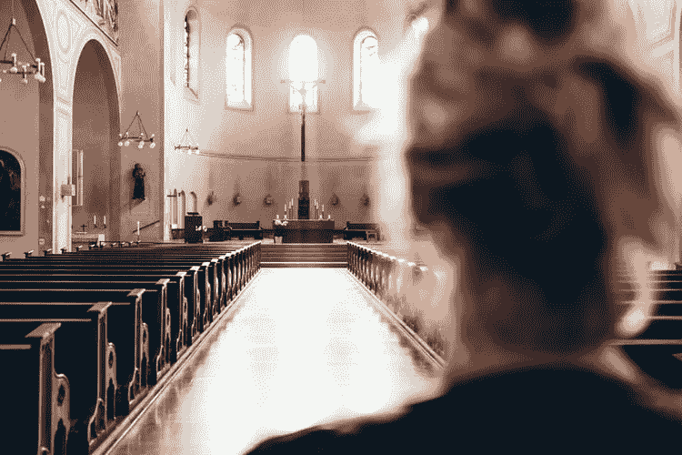

# 这就是人们信仰上帝的原因

> 原文：<https://medium.datadriveninvestor.com/so-this-is-why-people-believe-in-god-4e99f8876247?source=collection_archive---------4----------------------->

## 我自己可能还没到那一步，但我开始明白了。

Photo by [Thomas Vitali](https://unsplash.com/@thomasvitali) via Unsplash

我一生都在与信仰作斗争。当我还是个婴儿的时候，除了在霍利斯大街公理教会接受威尔斯牧师的洗礼之外，我的成长过程与教会和宗教无关。

我有一个意大利奶奶，她是一个虔诚的天主教徒，会告诉我她在向哪个圣人祈祷，为什么。她在门边放了一个十字架，会画一个十字，然后在进门时触摸它。

我家里有一本《圣经》,我想我小时候更着迷于电影般的书页，而不是真正的内容。

除了它在我成长过程中的缺席，我的宗教问题大部分是理智的。我认为它来自两件事:天生的分析头脑和英语学位。

前者让我质疑一切，后者给我灌输了一种倾向，认为圣经只不过是个寓言。告诉我你真的相信真的有一条会说话的蛇，一艘方舟，和一片分开的大海，你会永远失去我。

> 有时候，最好不要一直想所有的事情。直达。这对于正在康复的过度思考者来说尤其困难。

当你从那个地方来的时候，让事情顺其自然，让某种更高的力量去做它所做的事情，就是解脱。也很可怕。

有些事情是我们无法理解的。我发现最令人愤怒的说法是当可怕的事情发生时，有人说这是上帝的旨意。我受不了这个，不管我信不信，它都会让我对上帝发怒。你怎么敢把你的意志凌驾于我的之上？

当我去年因脑动脉瘤失去一个最好的朋友时，我发现这一点尤其正确。她是一个信徒，她的生活中有许多人去教堂。当有人告诉我她离开这个世界是上帝的旨意时，我做好了准备。我认为这只不过是一场闹剧。

尽管如此，在安静的时刻，当世界看起来很沉重，我无法理解生活的意义时，我觉得必须从超越我的东西那里寻找方向。最近，我看到这种需求越来越多。

> 我寻找的是安慰和对比我强大的东西的信任。难的是找出那是谁或什么。

在那些时刻，我明白了人们为什么信仰上帝。人们祈祷对我来说是有意义的。有些时候我们都会感到失落和困惑。我们在生活中寻找一种结果，这种结果会引导我们过上我们知道应该过的生活，但却总是看不到那条路。

对某事有信心是美好的。那里有一个甜蜜的放弃，它抓住了我正在寻找的放手。我们能找到的地方。对很多人来说，放手就是上帝。

对其他人来说，他们赋予了一个模糊的精神概念。宇宙。力量。神圣的。源头。的存在。这是可行的，但是我理解人们想要确切地知道他们在和谁说话，并且用一个合适的名字来称呼它。上帝啊。

 [## 释放结果的简单哲学|数据驱动的投资者

### 这是我们播客中帕迪·布鲁斯南的一段话。帕迪是一个正念和冥想老师，一个…

www.datadriveninvestor.com](https://www.datadriveninvestor.com/2020/03/16/a-simple-philosophy-to-unlock-results/) 

我有朋友祈祷，他们告诉我他们从中得到的解脱感。他们把他们想要的和需要的放在那里给上帝，并请求上帝指引他们那是什么。他们放弃了对事物外表的控制，并相信所发生的就是他们想要的。

对我来说，这是一种从未有过的解放。我明白为什么人们称之为荣耀。

我正处于精神上的风口浪尖，但我不知道那是什么。我还没准备好称之为上帝。我不知道我是否会去那里。这需要大量的思考和学习，但现在是我做这些工作的时候了。

也许如果我能超越火与硫磺和一大群人说上帝讨厌我的同性恋女儿，她会下地狱，我真的可以试试这件事。

瓦妮莎老爹是一名作家、编辑、植物迷、音乐迷，也是🎙 [***的主持人，我没有考虑过***](https://open.spotify.com/show/1iP4vTmQzpAzvEhj8jeDNs) *，一个关于观点的播客。如需联系信息或了解更多关于她的信息，请访问*[***【www.vanessatorre.com】***](http://www.vanessatorre.com/)*和* [***注册她的简讯***](https://lp.constantcontactpages.com/su/6TmEjuh/newkid) *。*

## *每次我尝试这种探索，结果都不令人满意:

 [## 我应该在教堂里哭吗？

### 我在教堂哭泣。几乎每次都是。有点尴尬。

medium.com](https://medium.com/@vanessatorre/am-i-supposed-to-cry-in-church-78a5e843222b)  [## 我因为同性恋权利离开了卫理公会教堂

### 归属感是我来的原因，也是我离开的原因

medium.com](https://medium.com/an-injustice/i-left-the-methodist-church-over-gay-rights-64986f6546e) 

**访问专家视图—** [**订阅 DDI 英特尔**](https://datadriveninvestor.com/ddi-intel)