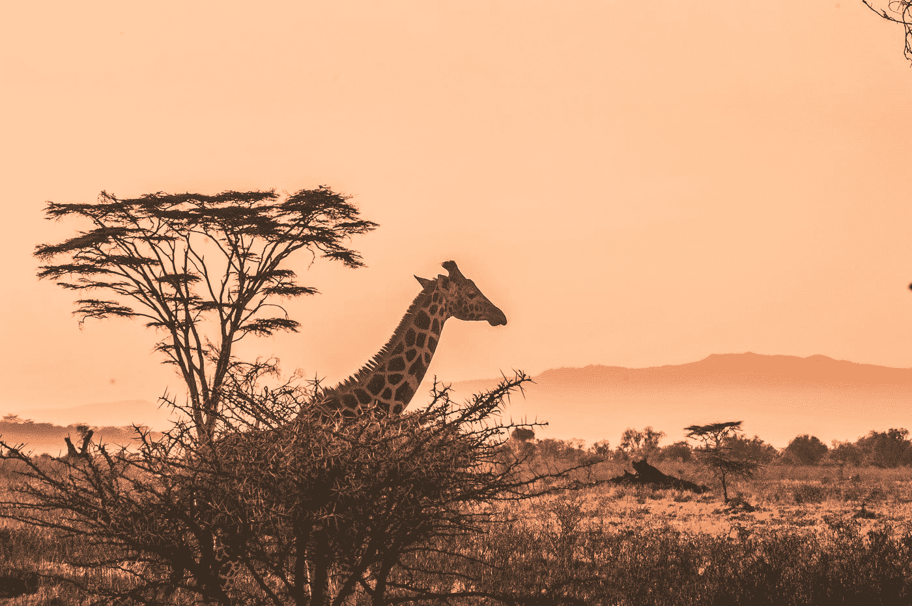
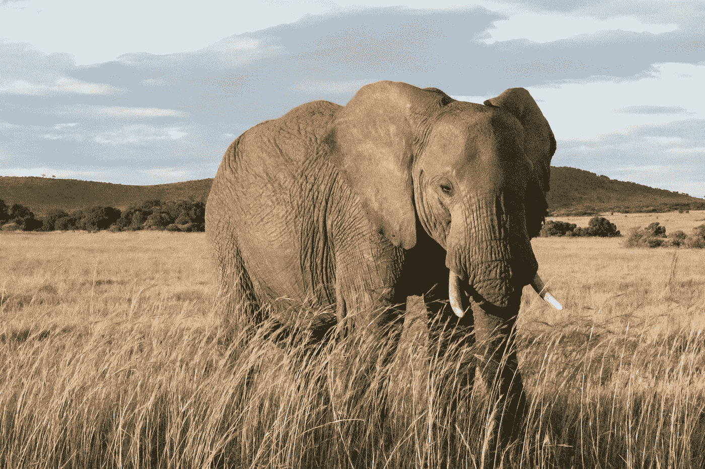
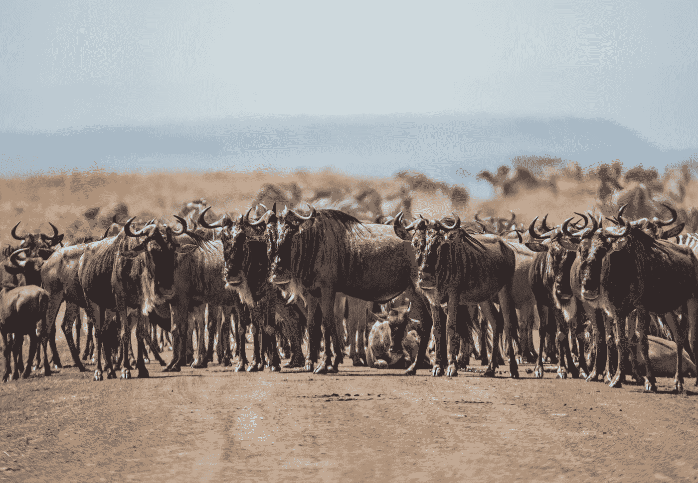

# 所以你想成为一名探险向导？

> 原文：<https://medium.datadriveninvestor.com/so-you-want-to-be-an-adventure-guide-38bd42d7a78b?source=collection_archive---------6----------------------->

Photo by [Harshil Gudka](https://unsplash.com/@hgudka97?utm_source=medium&utm_medium=referral) on [Unsplash](https://unsplash.com?utm_source=medium&utm_medium=referral)

## 它可能不像你想的那样:肯尼亚八天骑马旅行的教训

西蒙背靠着圆木。他一只眼睛盯着临时搭建的烤架上烤着的酥脆的羊排，一只眼睛盯着灌木丛。你必须在这些地方。谁也不能保证狮子或鬣狗不会离得太近而不舒服，而且众所周知，豺狼在偷吃食物时非常厚颜无耻——有时甚至是从狮子嘴里偷出来的。

“我真的很爱人们，”他说。“我真的愿意。我觉得它们很迷人。每个人都是如此不同，不同的事情让他们兴奋。”

我们在讨论向导，以及他作为另类狩猎旅行向导和经理的角色，我很喜欢他们的骑马项目。我们的马在另一片树荫下，在阴凉处，由我们的非洲工作人员照料和保护。其他骑手正在烈日下享受杜松子酒和滋补品，或者打着盹准备午餐盛宴。

这是我们的第六天。我们穿过危险的河流，和斑马一起以极快的速度奔跑，在非洲丛林中与交配的狮子和保护性的公象对峙。

Photo by [elCarito](https://unsplash.com/@elcarito?utm_source=medium&utm_medium=referral) on [Unsplash](https://unsplash.com?utm_source=medium&utm_medium=referral)

# 听起来非常浪漫，不是吗？

然而，真正的工作，一个好向导的真正挑战远远超出了丛林知识，对他们周围环境的深入了解，对我们来说，相当多的马，马具和动物行为的知识。在许多情况下，比如像 Simon 这样要求很高的职位，这些只是切入点。可以说是进入壁垒。

从很多方面来说，真正不得不被关注的动物是我们自己。

日复一日，西蒙观察着所有的骑手，挑选出一项特殊的技能或进行观察，这实际上让客户感到自豪。一些骑马游览肯尼亚丛林的人可能不是非常好的骑手，如果这是第一次来非洲，大多数人可能对丛林中一些非常真实的危险和冒险毫无准备。

 [## 精疲力竭耗尽了简单的答案|数据驱动的投资者

### “大多数卫生专业人员知道如何照顾病人，但不知道如何照顾自己。”医疗保健…

www.datadriveninvestor.com](https://www.datadriveninvestor.com/2019/01/15/burnout-exhausts-easy-answers/) 

当一对正在交配的狮子在马拉的私人角落里被人近距离观察时，我们大多数人都不知道该如何反应。我们必须控制紧张的马匹，保持我们自己的镇静，这样我们就不会将我们的恐惧传达给动物，并按照西蒙(或另一个向导)的指示去做。有时这意味着当每一个本能都在尖叫快跑时，我们要坚守阵地！

然而，日复一日，西蒙和我们的另一个向导梅根，一个非常能干的南非农家女孩，已经找到了一个与众不同的幸福家庭，花时间培养信心和承认小胜利。

他们很快就能看出谁可能会有麻烦，谁需要特别关注，谁可以不被打扰。在冒险中，非常真实的威胁可能潜伏在几乎任何低矮灌木丛的阴影中，知道你的费用不仅是必要的，它可以拯救生命。

通过称赞骑手的技能，通过指出他们如何为团队发现远处的动物，或者带着他们的马毫不费力地越过被大象推倒的树，导游们建立了信心、自豪和快乐。这些被训练用于比赛、狩猎和马球的马训练有素，乐于飞越障碍。我们比他们更没有信心(我的手在这里举得很高，不像其他骑手，他们在更大的树桩上轻松自如，让他们看起来像空中天使)。

我可以亲自证明，当我的小母马纳特拉在一个死胡同起飞，我看到前面一个低浅的水池。我尽我所能把她拉到一边，但我们有骑手在我们旁边飞驰。我鼓起勇气在坚硬的肯尼亚土地上打滚。接下来我所知道的是，她几乎没有改变步伐就干净利落地跳过了游泳池，我几乎为自己没有相信她的训练而感到尴尬。这是我们成长的方式。

经常有人问我如何成为一名导游。虽然有很多培训机构可以提供关于植物和动物的知识(例如，西蒙的学位是动物学)，但更多的实用知识在于知道如何欣赏和理解人。这篇文章很好地概述了所涉及的内容:

 [## 如何成为一名户外探险向导

### 想象一下:你正走在阿拉斯加荒野中央的一条小径上，周围环绕着美丽的山景…

trailandsummit.com](https://trailandsummit.com/how-to-become-an-outdoor-adventure-guide/) 

也许我最欣赏 Gaby Pilson 的文章的地方是，他非常干脆地告诉我，如果没有一些基本知识，你是无法进入这个领域的，无论是在户外，还是在与移动狩猎有关的 Offbeat 的情况下，你必须非常善于驾驭马匹。

然而，正如西蒙和梅根所展示的那样，我也见识过世界各地，真正的挑战在于领导力和管理技能。

冒险客户有他们自己的特质，有些可能会有问题。例如:

一个固执的客户决定与错误的动物自拍。一个大声说话的人，他的辱骂可能会破坏其他人的旅行(如果这个人对私下的警告没有反应，很可能会被退款并悄悄地邀请离开)。在我们的案例中，一个惊恐的客户在一条必须穿过的快速流动的溪流边上几乎僵在原地。这些都是一些人的例子，当他们处于高风险环境中时，不仅会对他们的环境造成威胁，还会对其他骑手造成威胁。

这就是导游真正的价值所在。

不耐烦、妄自尊大的导游更关心玩乐和炫耀，可能会错过至关重要的线索。这就是为什么招聘、培养合适的导游对任何探险公司的成功都至关重要。当涉及到像非洲丛林这样的高价值、高危险的环境时，丰富的经验和人际交往技巧的品质就非常重要。部分原因是该组织本身的历史。

西蒙和梅根都以自己的方式与《警声》的创始人特里斯坦·沃斯普伊(Tristan Voorspuy)进行了大量接触。Voorspuy 是一位传奇式的英国官员，他对非洲及其野生动物有着狂热的热爱。他的生命在 2017 年 3 月因干旱和牛的冲突而悲惨地结束。

Voorspuy，他非常能干的妻子 Cindy，家庭成员和一大批敬业的自然资源保护者继续他的工作，是西蒙年轻生活中的一个关键影响者(以及所有与他一起工作的向导)。他在训练中冷酷无情，要求严格，同时又下流、有趣，深受人们喜爱。西蒙将他的早期发展归功于他，而在他去世前几年几乎不认识他的梅根，非常想念她想问的许多问题的答案。

辛迪，一个训练有素的女骑手的小滑步，长期以来一直是马匹背后的大脑，管理着《警声》的无数活动部件。在这个产品中，渐进式骑行，能够信任一匹马是假设的，即使经验不足的骑手还没有完全决定他们确实可以。这就是为什么向导们为他们安排了工作，这样骑手们可以在他们的坐骑上放松，信任他们和他们自己，真正地融入他们神奇的环境中。

好的导游有优秀的导师。我在西蒙身上看到的一部分是，从 14 岁开始，他的生活就受到了沃尔斯普的强大早期影响，他既有动力又有灵感。这位年轻人已经成长为管理者，他展示了我在世界各地太多冒险旅行中所缺少的指导技能。西蒙把他的全部注意力放在那些花了一大笔钱来探索他所热爱的世界的人们身上。他和梅根不仅确保客户的安全和舒适，还让我们感受到一头冲进草地的纯粹兴奋。

许多导游提供冒险的内容，但可能缺乏同情心和同理心。几乎在每一次旅行中，都会有人因为这样或那样的原因而近乎恐慌，或者他们只是不够自信。一匹马太难驾驭了，一声咆哮离得太近了，让人不舒服。情绪成熟的导游记得他们在相同情况下的感受，并使用这些技巧让顾客感到被认可。很容易假设其他骑手都很好，而你不好，事实并非总是如此。

在一个案例中，我们有一位瑞士妇女，她害怕穿过雨水泛滥的马拉河。附近有河马，虽然西蒙已经用他的牛鞭为我们清出了一条路，但她非常紧张。在西蒙和梅根之间，她不仅顺利地穿越了，而且第二天她更有信心地再次穿越，而且由于前一天晚上的暴雨，水位甚至更高了。

一个真正伟大的向导，我的印象是 Simon 在一定程度上从 Voorspuy 那里学到了这一点，他以支持一个试探性的客户去承担深思熟虑的风险而自豪。这个女人被她的经历改变了，她的喜悦是显而易见的。

“这是我最喜欢的，”西蒙笑着说，最后一次翻动排骨。“我喜欢人们做一些他们认为自己做不到的事情。这改变了他们的生活。”

指导并不总是迷人的。当你试图治疗一匹被蚂蚁咬伤的马时，你可能会差点被踢到脸。你可能不得不追上一匹逃跑的坐骑，它已经和另一匹马一起消失在远处的山坡上，就像天空已经被寒冷的雨淋湿一样。你可能不得不放弃一个有趣的早晨骑行，因为有人需要你的马疾驰，而你带着那个客户稍微有点跛的坐骑回营地。

所有这些事情以及无数更多的事情都发生在我们的旅途中。导游们总是兴高采烈，充满笑声，乐于助人，最重要的是，他们会很快称赞工作做得好。在很多方面，也许很多人都没有注意到，他们默默的支持和轻松的出现带来了一定程度的享受，这是一个运行良好的冒险的标志。你可以理所当然地认为，你的完美饮料会在午餐时间准备好，你的马备好鞍，准备上马，前面的路为你的兴奋和快乐仔细思考。然而，你可能真的不知道为了让这一切看起来毫不费力付出了多少努力。指南是所有这些的驱动力。

指导听起来很迷人。它不是。在鸡尾酒会上，这听起来令人印象深刻，但它并没有真正说出高度专业的导游所经历的多年艰苦劳动、无尽的失败和整容。Voorspuy 自己身上带着伤疤，有着太用力、太过分和付出代价的痕迹。但结果是，他知道什么是可能的。这也是他成为优秀导师的部分原因。

想当导游？有些是天生的。有些人可以进入其中。但是正如西蒙在为饥饿的顾客把美味的排骨堆到盘子里时说的，“百分之九十五都是人。”

说得好。

Photo by [David Clode](https://unsplash.com/@davidclode?utm_source=medium&utm_medium=referral) on [Unsplash](https://unsplash.com?utm_source=medium&utm_medium=referral)