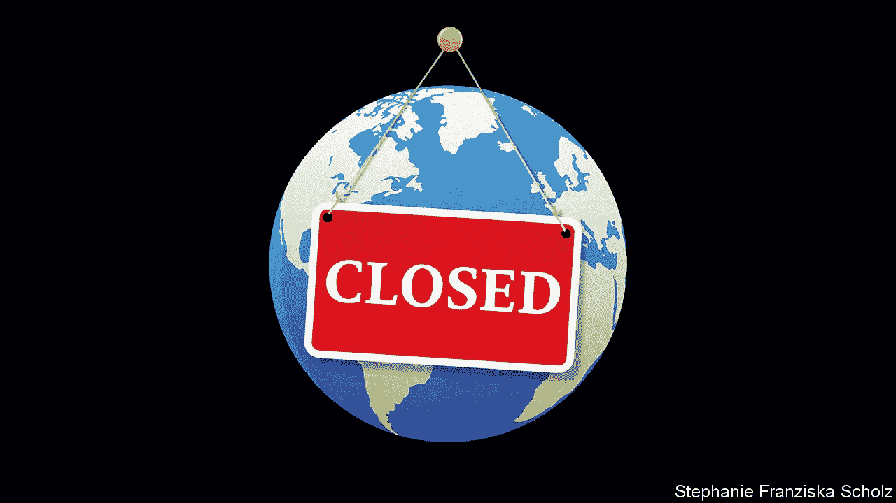
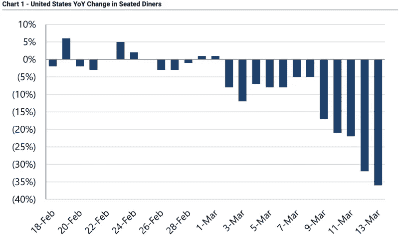
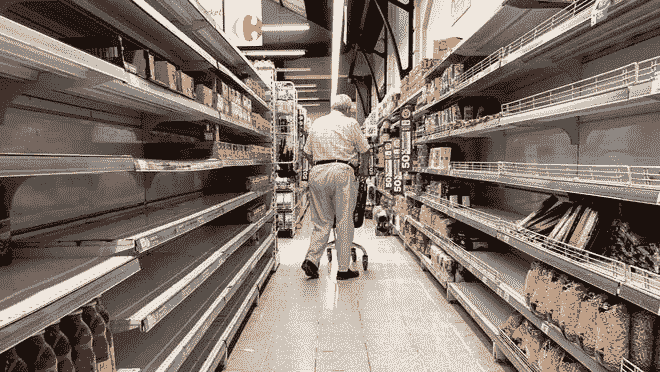
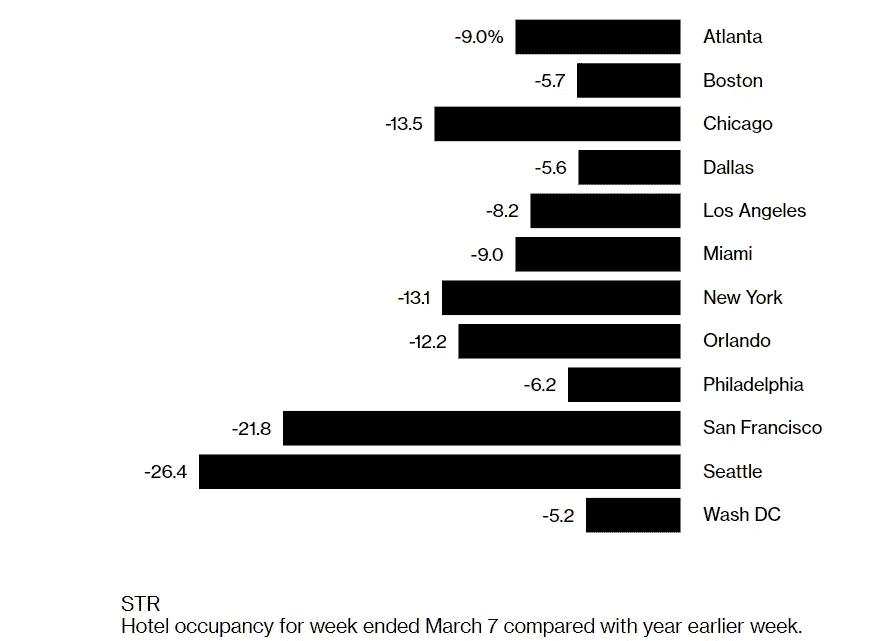
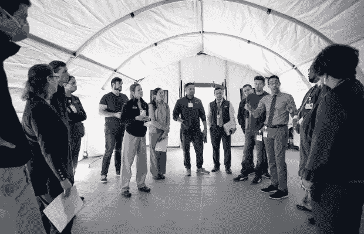

# 为什么冠状病毒会改变经济和我们的生活方式

> 原文：<https://medium.datadriveninvestor.com/social-and-economic-impacts-of-coronavirus-30ef5b97c104?source=collection_archive---------11----------------------->

## 从新冠肺炎吸取的教训第二部分。

Source: The Economist

随着冠状病毒继续在世界各地传播，这种流行病将如何以及何时结束还有很多不确定性。然而，它已经对我们的日常生活造成了重大干扰:人们在家工作，学校停课，NBA 暂停赛季，等等。

更糟糕的是，人们正在囤积。为了应对卫生纸和洗手液等特定商品的抢购，主要零售商已经实施了一些购买限制。

很难预测冠状病毒疫情将如何结束。随着越来越多的国家被封锁，世界正在暂停。为了了解接下来可能会发生什么，下面是我们已经看到的冠状病毒爆发对经济和社会的一些影响。

## 在家工作(WFH)

M 任何科技公司，如亚马逊、苹果、脸书、英特尔、微软和推特，已经要求他们的员工在家工作，以帮助防止新型冠状病毒的传播。许多学校和大学正在关闭。甚至国会也计划指导国会山的工作人员在家工作。

数百万远程工作人员的需求激增将推动对更快互联网的需求。电信和有线电视公司将不得不升级他们的设备来支持更多的工作负载。反过来，它可能会推动 5G 的需求和更快的采用。

 [## 为什么包容性财富指数比 GDP 更能衡量社会进步？|数据驱动型…

### 你不需要成为一个经济奇才或金融大师就能知道 GDP 的定义。即使你从未拿过 ECON 奖…

www.datadriveninvestor.com](https://www.datadriveninvestor.com/2019/03/08/why-inclusive-wealth-index-is-a-better-measure-of-societal-progress-than-gdp/) 

短期来看，随着越来越多的人在家工作，生产率将会下降。许多工程师可能有一段时间无法在实验室里使用他们的设备。因此，产品开发进度将会延迟。

从长远来看，公司尤其是高科技行业的公司可能会改变对在家工作的员工的看法。如果他们认为生产率没有差别，一些公司可能会鼓励更多的人在家工作。另一方面，如果项目进度落后，公司可能会决定不再在家工作。

我们不知道员工将不得不在家工作多久，但在危机结束后，世界各地的公司将有更多在家工作的数据。

## 社交距离时代:请不要握手！

由于冠状病毒是一种传染病，人们都在小心避免被感染。人们不是握手，而是撞肘。甚至德国总理安格拉·默克尔的握手也被她的内政部长公开拒绝，因为担心冠状病毒。人们正在认真对待它。更令人困惑的是，彼此之间的安全距离是多少。一些人建议你和他人保持至少 6 英尺的距离。

*German Interior Minister Horst Seehofer refuses to shake the hand of German Chancellor Angela Merkel for hygienic reasons before a migration summit at the Chancellery in Berlin, Germany, March 2, 2020\. Reuters.*

社交距离带来的更大问题是人们不出门，因为他们试图避免传染。例如，在冠状病毒爆发期间，人们远离餐馆、体育场或任何有大量人群聚集的地方。因此，世界各地的体育赛事和教堂服务都暂停了。

冠状病毒对全国的餐馆造成了毁灭性的影响。下面的图表显示了三月份的业务量下降了多少。许多餐馆不是关门了就是已经歇业了。其中许多是小企业。他们的工人正在失去工作和医疗福利。随着未来几周越来越多的州禁止在家用餐，情况预计会变得更糟。世界上许多小企业的未来看起来很黯淡。

Source: Yahoo Finance

## 抱歉，我们关门了

Source: USA TODAY

由于社交距离的结果，许多大型零售商，如耐克、Urban Outfitters、安德玛和 Abercrombie & Fitch，为了公共安全关闭了他们在美国的所有商店。没有这些核心商店，去购物中心和购物中心的人会少很多。像梅西百货和 J C Penney 这样的传统连锁零售商已经在走下坡路了。冠状病毒危机将加速实体店的消亡。

冠状病毒恐慌已经推动网上购物激增。例如，许多对在好市多或当地杂货店排长队感到沮丧的人已经转向网上购物。最后，网上购物可能会吸引消费者。

## 亟需摆脱过度旅游

不久前，我们听到来自世界各地许多城市的居民抱怨过度旅游。大量的游客涌入他们的城镇，造成了交通堵塞和污染。许多当地居民再也无法承受了。

由于旅游业受到冠状病毒爆发的破坏，许多热门旅游景点的当地居民可能会得到他们一直渴望的休息。如果我们看下面的图表，我们可以看到酒店入住率下降了很多，特别是在受冠状病毒影响最严重的城市。

很难说旅游业什么时候会复苏。也许我们必须等待恐惧消退。从短期来看，这将对旅游业以及航空公司和酒店等相关行业造成毁灭性打击。

## 冠状病毒暴露了我们医疗保健系统的弱点

US hospitals brace for ‘tremendous strain’ from coronavirus. Source: San Jose Mercury News.

随着冠状病毒继续在全球蔓延，世界各国一个接一个地继续为如何遏制冠状病毒而斗争。虽然我们拥有美国最好的医疗技术和人员，但我们的资源有限，可能没有足够的医护人员来应对重大疫情。除此之外，许多人没有健康保险。这将暴露出我们医疗保健系统的弱点。

在短期内，我们可能会看到由于病毒爆发，许多国家的卫生保健系统处于崩溃的边缘。危机结束后，世界各地的公民很可能会支持政府增加医疗支出。但是要应对像冠状病毒这样的疾病爆发，需要大量的投资。

## 对抗冠状病毒的最佳方法:不要感染冠状病毒

Source: Techlink

T 对付[冠状病毒](https://spectrum.ieee.org/the-human-os/biomedical/devices/predicting-the-coronavirus-next-moves)的最好方法就是首先不要感染[冠状病毒](https://spectrum.ieee.org/tag/coronavirus)。随着医生和医护人员的短缺，保护他们免受冠状病毒感染变得更加重要。

与受感染患者接触的人越少越好。如果某些辅助人员没有必要出现在病人区域，他们最好避开。医护人员不必直接与疑似携带病毒的人互动，许多任务，如运送食品和药品以及消毒房间，都可以委托给机器人。

许多人担心工作会被机器人抢走。但这是人们不会介意放弃给机器人的工作领域之一，因为它很危险。展望未来，我们将看到越来越多的机器人部署在世界各地的医院中。

## 接下来是什么

我们不知道冠状病毒疫情将如何结束，以及会产生哪些挥之不去的影响。虽然现在的重点是找到冠状病毒的治疗方法并遏制疫情，但我们不能忽视对经济的影响。一些行业，如旅游业，已经看到所有活动停止。在好转之前，情况可能会变得更糟。我们现在不应该恐慌，但我们应该为长期经济低迷的可能性做好准备。

你也可以在推特上找到我。

## 参考

 [## 技术如何帮助对抗冠状病毒-人工智能、大数据…

### 从新冠肺炎吸取的教训第一部分。

medium.com](https://medium.com/swlh/how-technology-is-helping-in-the-fight-against-coronavirus-1e14eb90ec33)  [## 新冠肺炎:只有偏执狂才能生存

### 从新冠肺炎吸取的教训第三部分。

medium.com](https://medium.com/datadriveninvestor/reopening-economy-only-the-paranoid-survive-e3ca50840143)  [## 遏制冠状病毒:对全球经济有什么风险？-沃顿知识

### 2 月 24 日，星期一，股票指数暴跌，因为有报道称中国爆发了冠状病毒…

knowledge.wharton.upenn.edu](https://knowledge.wharton.upenn.edu/article/will-coronavirus-impact-global-economy/)  [## 冠状病毒在美国的经济影响和可能的经济政策反应

### 一种流行病学威胁，如导致新冠肺炎病的新型冠状病毒，可能会产生破坏性影响…

www.americanprogress.org](https://www.americanprogress.org/issues/economy/news/2020/03/06/481394/economic-impact-coronavirus-united-states-possible-economic-policy-responses/)  [## 科技如何帮助对抗冠状病毒

### 人工智能、大数据、无人机和机器人

medium.com](https://medium.com/swlh/how-technology-is-helping-in-the-fight-against-coronavirus-1e14eb90ec33)