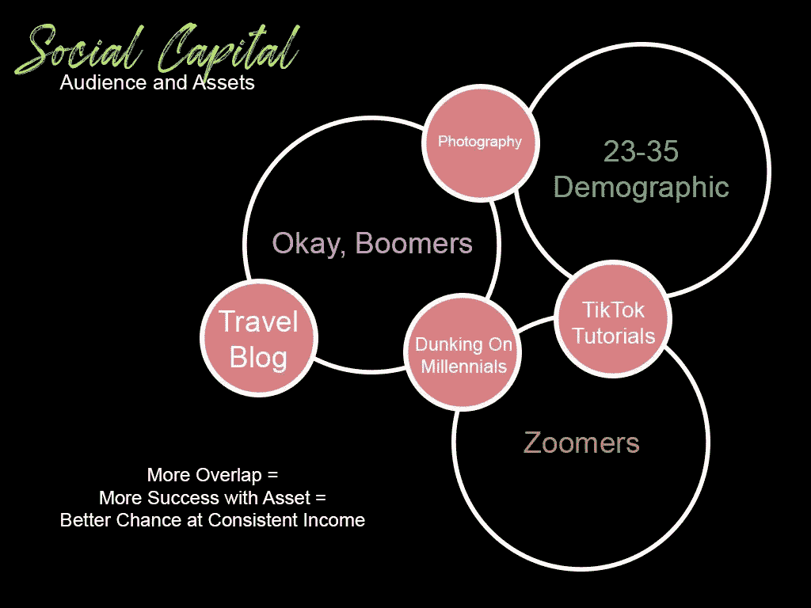
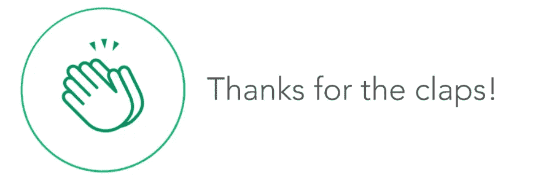

# 社会资本

> 原文：<https://medium.datadriveninvestor.com/social-capital-69a345f78f03?source=collection_archive---------17----------------------->

我在我的[分支机构、赞助商和合作伙伴](http://kinoalyse.net/affiliates-sponsors-partners/)内容以及我的咨询中谈了很多关于社会资本的内容。如果你在这里，欢迎你迈出品牌发展的第一步，利用社交媒体与你的观众和潜在客户交流。跟着一起做你的生意，当然，还有给我提任何关于[创意产业不和谐的问题。](http://discord.com/invite/UHxUbcz)

## **社会资本心理学**

社会资本有许多不同的形式，但根源相同:人类是群居动物，我们希望一起工作，解决问题，并组织起来。社会资本的例子可以归结为“重要的不是你知道什么，而是你认识谁。”从社会角度来看，从互动中获得的利益是应用社会资本，即。，帮助某人梳理他们的狗，通过口碑带来更多付费客户。反过来说，社会资本也可能有负面影响，比如名誉受损。考虑到没有社会资本的人也没有互动。

## 社会资本和商业

“善待他人”可能是我们个人生活中的一个主导因素，但社会资本是如何帮助或伤害我们的企业的呢？如上所述，一个社区内的积极影响往往会使拥有积极社会资本的个人获得更多与他人合作的机会。对于不好的一面，首先，想想糟糕的 Yelp 评论:受损的声誉会让潜在客户在使用你的服务时三思。其次，想象一下你经历过的那些半途而废的一流服务。该企业可能不再收到你的付款，因为他们的声誉不佳。

最后，中性社会资本是你们大多数人都在实践的东西。开始在推特上发帖。

我看见你了。去贴点东西。如果你不发布内容，没人知道你的存在。

## 规划社会资本

你的商业实体可能有受众、客户和/或与其他公司的协议(如附属公司)。在这些圈子里，具体的品牌机会应该与你的资产一起考虑。这也确保了你不会因为发布与你当前的受众完全不一致的内容而疏远他们。

简而言之，社会资本是有益的，因为它描绘了你的资产和受众之间的积极关系。

# 社会资本

营销你的品牌的第一个关系是你的观众和你的资产之间的关系。弗兰奶奶可能对你夸张的香蕉服装生意不感兴趣。大概吧。

社会资本图表通常对视觉学习者有用，但是你可以随意使用你喜欢的风格。

## 资产

你的资产是用来推广你的品牌、服务或产品的任何东西。这方面的例子包括照片、社交媒体受众、博客、视频、证明等..你可以在平台上用来做广告的任何东西都是一种资产，我保证，你拥有的比你想象的更多。举个例子，我和一位政治评论家谈论他的资产，我们列出了一个长长的清单: [PrimeCayes 的咨询](https://www.twitch.tv/videos/704409691)。

## 观众

展望未来，考虑“受众”包括 B2B 和附属机构等..策划的时候，也可以策划未来你想打击的受众。如果你因为没有管理你的社交媒体(或使用社交媒体管理工具)而缺乏人口统计数据，尝试一下谁已经与你接触，并计划至少再吸引一个。

对于我们的第一个例子，考虑婴儿潮一代和我的目的地摄影业务。我的旅游博客对婴儿潮一代有吸引力，但对其他人群就没那么大吸引力了。然而，我发现我的摄影资产击中了我的千禧一代，所以他们把摄影作为一种资产分享，这意味着当我发布一张照片时，我可以把两者都作为目标。

抖音教程不太适合婴儿潮一代，但我想为我的千禧一代提供另一项资产。现在，我拥有婴儿潮一代和千禧一代的两种资产。

但是我也想打 Zoomers！抖音为他们工作，为什么不参与！

现在，每当我发表文章时，抖音教程也可以用来针对千禧一代和 Zoomers。

很简单，对吧？

现在，我如何连接婴儿潮和 Zoomers？他们有什么共同点，也坚持我的摄影品牌，嘿，我是我的品牌？

灌篮千禧一代。迷因。我在 Twitter 上发布的许多帖子更多地是为了塑造性格，而不是专注于商业，这些帖子可以用来瞄准婴儿潮一代和 Zoomers。它有点迟钝，当然，它会随着你的品牌而剧烈变化。

# 关系和可信度

回想一下[的附属机构、赞助商和合作伙伴](http://kinoalyse.net/affiliates-sponsors-partners/)品牌和营销都有助于建立互动关系。互联网使得与数量惊人的人联系成为可能，你应该将其中的一小部分人视为你尚未开发的受众。

这也有助于建立信誉，让你保持诚实。将你的资产吸引给不匹配的受众会损害你的声誉。这也适用于潜在的赞助商和附属机构。记录下你的社会资本，你的营销将会有所转变。

人类渴望互动，而社会资本是在你的个人生活和职业生活中展示这些联系的一种方式。考虑你的资产和你的观众。将它们绘制在一起，并意识到你生产的内容具有广泛的价值。如果你的社会资本为零，你就不需要制作达芬奇级别的微博:去发微博吧！我们将利用整个九月的时间来开发社交媒体。

对于那些被布置了这篇文章作为家庭作业的人来说，第一步已经完成了。你应该知道你的资产和受众可能是什么，并几乎准备好接受我们的咨询。

欢迎参加[创意产业倡议](http://discord.com/invite/UHxUbcz)。让我们开始吧。🙂

[创意产业抽动](https://www.twitch.tv/kinoalyse) | [推特](http://www.twitter.com/kinoalyse) | [Instagram](http://www.instagram.com/kinoalyse) | [脸书](http://www.facebook.com/kinoalyse) | [创意产业资源](http://www.patreon.com/kinoalyse) | [创意产业聊天](https://discord.com/invite/jZu4FV9)

