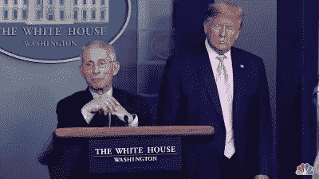
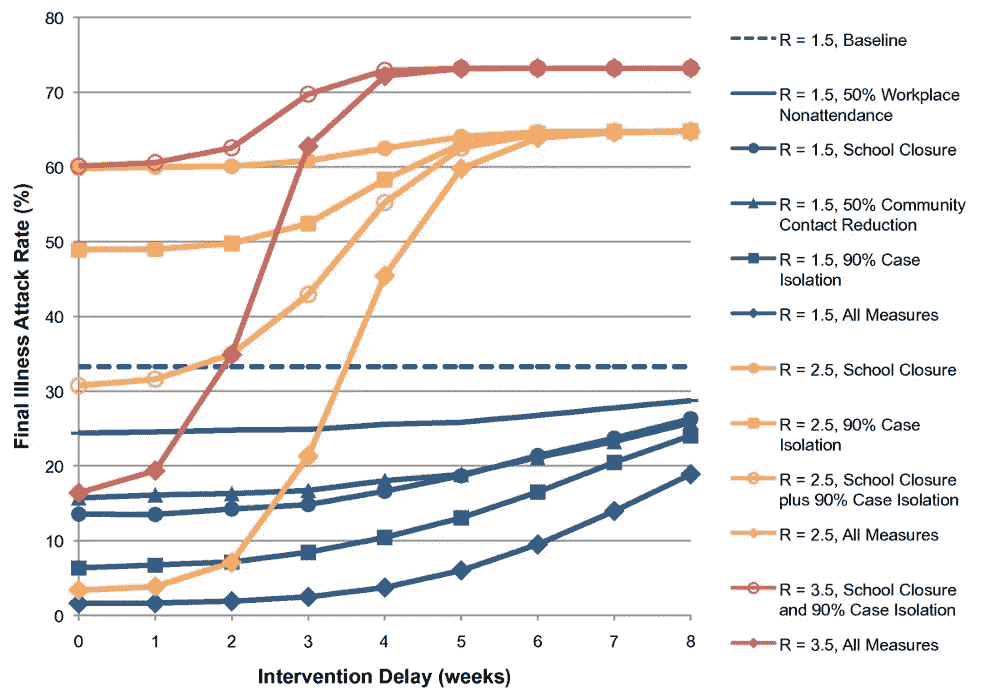
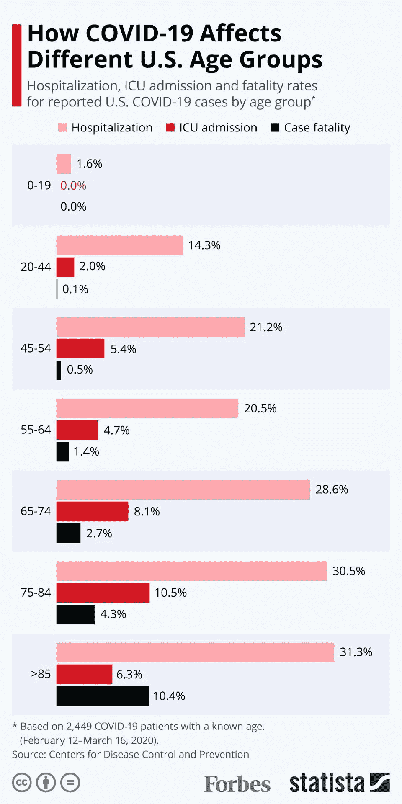

# 社交距离有助于阻止传播

> 原文：<https://medium.datadriveninvestor.com/social-distancing-helps-stop-the-spread-3c105c6a7b00?source=collection_archive---------16----------------------->

## 社交距离如何保持你和公众的健康

玛丽·梅伦，也叫伤寒玛丽，是一名爱尔兰厨师，在 1883 年到 1884 年间移民到美国，最终在纽约找到了为富裕家庭做饭的工作。在感染了大约 50 人之后，她被发现是一名无症状的伤寒带菌者。在她第一次被隔离后，她在纽约的北兄弟岛上度过了大约四分之一世纪，后来被释放并继续感染人类。她死在了岛上。

[Dr. Fauci explains the importance of social distancing as President Trump looks on](https://www.nbcwashington.com/news/local/dr-fauci-discusses-if-social-distancing-is-working/2264387/)

玛丽·梅伦的故事与今天的疫情有关。社交距离是最重要的。视觉资本家[的一份报告，根据 Signer Laboratory](https://www.visualcapitalist.com/the-math-behind-social-distancing/) 研究的数据，显示了当没有社交距离发生时，平均在 5 天内，一个受感染的人可以进一步感染大约 2.5 个人——而在 30 天内，一个人可以感染 406 个人。在大都市，这一数字可能更高，在其他情况下可能更低。在社会暴露减少 50%的情况下，在 5 天的时间里，一个人将感染 1.25 个人，在 30 天的时间里将感染 15 个人。在社交接触减少 75%的情况下，感染 2.5 人需要 30 天。

[The Effectiveness Of Social Distancing](https://bmcpublichealth.biomedcentral.com/articles/10.1186/1471-2458-9-117/figures/1)

目前的疫情被认为有 2.5 的[R。这意味着一个被感染的人平均会将病毒传染给 2.5 个人。](https://www.ncbi.nlm.nih.gov/pubmed/32097725)[研究](https://bmcpublichealth.biomedcentral.com/articles/10.1186/1471-2458-9-117)显示，对于一个 30 000 人的群体来说，如果他们正常生活，那么在 8 周内，65%的人会被感染。随着全面的社会距离，即学校关闭、隔离和在家工作，即使在两周的延迟后实施，病毒也只会感染 7%的人口。

 [## 为什么包容性财富指数比 GDP 更能衡量社会进步？|数据驱动…

### 你不需要成为一个经济奇才或金融大师就能知道 GDP 的定义。即使你从未拿过 ECON 奖…

www.datadriveninvestor.com](https://www.datadriveninvestor.com/2019/03/08/why-inclusive-wealth-index-is-a-better-measure-of-societal-progress-than-gdp/) 

[Visual By The CDC](https://www.forbes.com/sites/niallmccarthy/2020/03/19/how-the-coronavirus-is-impacting-different-us-age-groups-infographic/)

基于从钻石公主收集的数据，欧洲疾病预防和控制中心的研究显示，约 17.9%的人口对该病毒无症状。

那么，从个人的角度来看，社会距离并不是专门为了他们的安全，而是为了其他人的安全。这是因为一个人不住院的概率大于一个人住院的概率。然而，社会距离的目的是确保住院治疗不超过医院治疗病人的能力。因此，社会距离是一种简单的做法，人们可以采取这种做法，以确保医院能够照顾目前受到影响的病人，这样国家就可以开始“使曲线变平”。