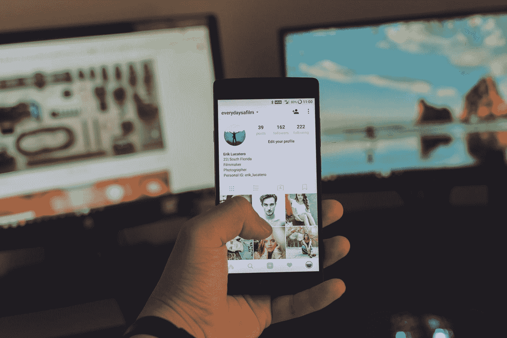
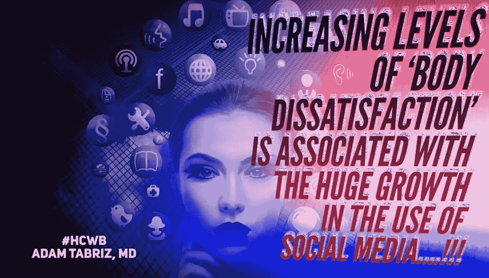
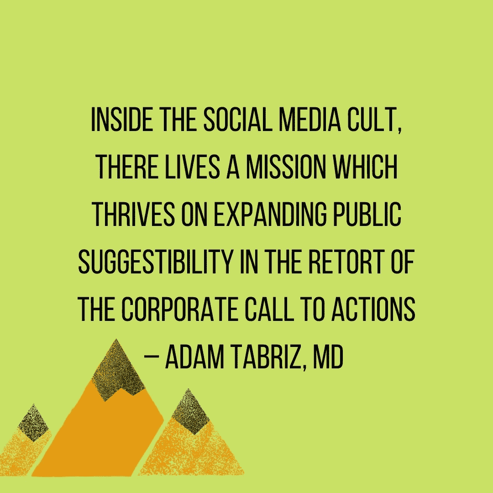
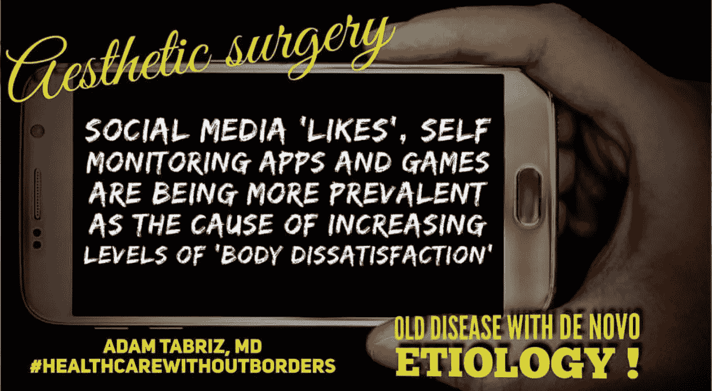
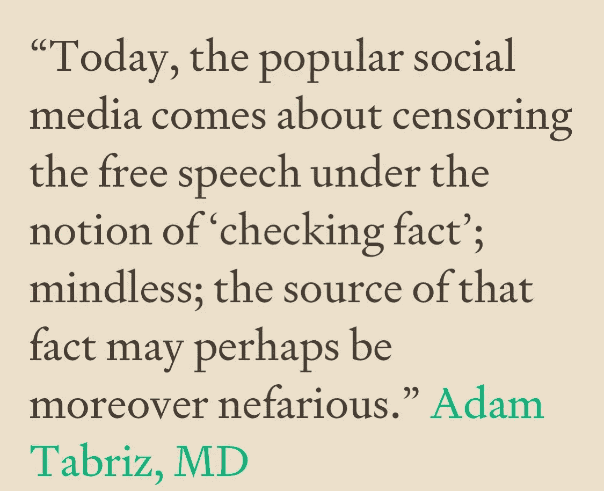

# 社交媒体和秘密审查通过赞助流行度超过可信度

> 原文：<https://medium.datadriveninvestor.com/social-media-and-covert-censorship-by-sponsoring-popularity-over-credibility-9fbec64b5ba8?source=collection_archive---------10----------------------->

## 基于主流倾向推广“喜欢”、“关注者”、“问候”和“鼓掌”；压制式审查制度的体现

Photo by [Erik Lucatero](https://unsplash.com/@erik_lucatero?utm_source=medium&utm_medium=referral) on [Unsplash](https://unsplash.com?utm_source=medium&utm_medium=referral)

[**原载于数据驱动投资人**](https://www.datadriveninvestor.com/2020/11/19/social-media-and-covert-censorship-by-sponsoring-popularity-over-credibility/)

“喜欢”按钮，如选项、鼓掌、关注或推荐按钮，是社交网络平台、互联网论坛、新闻网站和博客中的一个功能，用户可以在这里表达他们喜欢、喜欢或支持的特定内容。在过去的十年里，它们的效用变得更加多样、广泛和具有战略性。它们用于在虚拟公共场所连接人们。然而，社交媒体所有者优先考虑谁看到什么行动会增加曝光率和喜欢，其中大多数与真正平等的表达和支持机会几乎没有关系。

社交媒体是现代人生活中的主要工具。当今世界上几乎每个人都在使用某种形式的社交媒体。与大多数人的想法相反，社交媒体并不是一个新工具。它可能起源于 1840 年连接美国的电报的出现。然后，柏拉图系统开始于 1960 年，由伊利诺伊大学创建，随后由控制数据公司进行商业销售。

今天，更复杂的社交媒体版本对整个世界来说都是免费的。现代社交媒体强大而互动。这种以计算机为媒介的技术可以促进各种人类需求，例如创建或共享信息、想法、职业兴趣和其他表达形式。今天，使用现代社交平台，我们可以创建虚拟社区和网络。

社交媒体实施的口号是“免费”。众所周知，社交媒体公司通过公共信息交易赚了很多钱。后一类实体有效地利用了信息力量，并以多种方式加以利用。人们可以举出在这一过程中影响一般心态和行为的例子，就像我们四年前目睹的俄罗斯干预美国总统选举一样。

今天的社交媒体不仅仅是一个简单的社交交流系统，而是一个工具，如果以特定的方式使用，对个人和公民自由的损害可能比纯粹的大众媒体审查更大，并阻碍言论和表达自由。社交媒体已经变得富有创造性，使用各种互动工具来吸引人群，并刺激各种术语，如整合按钮或掌声。因此，他们使用这种策略，激励社交媒体参与者开展特定的活动。

公司证明了“**鼓掌**、“**喜欢**、“**追随**”是基于可信度对信息进行优先排序，但在现实中，情况并非如此。如今，包括社交媒体在内的几乎每个行业都是大数据行业。数据挖掘实践和人工智能(AI)让社交媒体在主张实时言论自由和信息审查方面占据了上风。

# 言论自由和表达自由是个人权利

言论和表达自由是一个有趣的话题。尽管听起来很简单，但它在历史上面临着重大的语义操纵。一个纯粹的自由言论可能会被描绘成仇恨或种族主义，甚至在没有非法行为的情况下受到惩罚。这一直是某些在社交媒体行业拥有绝对控制权的团体成员干涉什么应该或不应该被视为言论自由的借口。

不管是苦是甜，自由的言论和表达是个人自由和自主的首要和最重要的支持者。言论自由从来都不意味着听众会感到愉快；也不意味着听起来充满仇恨。自由表达的质量在旁观者的耳朵里。

# 言论自由是关于证明自己的平等机会

言论自由而没有拯救宝贵的平等机会，不管听起来如何，都是歧视。除非我们在任何时候都有同样的机会，否则我们永远无法表达我们的观点，从而得到公正的反馈。如今的社交媒体比以往任何时候都更加隔离。一群群志同道合的人聚集在一起，相互拍拍对方的背，表示同情。通常，这些集群最终会出现在互联网上一堆群组的底部。那些获得最大曝光特权的人很受欢迎，这给媒体带来了更多的财政利润。

任何关于是否限制言论自由的争论都会破坏其价值。自由表达是珍贵的，因为它的抑制会危及我们的独立性。

Photo by [Brian Wangenheim](https://unsplash.com/@brianisalive?utm_source=medium&utm_medium=referral) on [Unsplash](https://unsplash.com?utm_source=medium&utm_medium=referral)

这种对言论自由条件的不感兴趣，并拒绝不带偏见地对其进行定义，似乎是植根于“自由主义”的原则。这往往将言论自由奉为一项权利，或许是最高权利，只有在典型的自由主义或左翼社会中，这些权利才值得保护。因此，为了维护这样一种权利，我们似乎不能列举我们通常如何使用它的价值。人们会通过强调言论自由的重要性来揭露那些不太有价值或毫无价值的言论，或者更糟的是，禁止言论。

在实际场景中，社交媒体是由其工艺大师和他们的意识形态设计的工具。我们永远不能过度依赖社交媒体的言辞和口号，因为我们可能最终会在某个时候转向有利于特定企业目标的方向。他们会决定什么是有价值的演讲，什么不是！

一个通过权利认识自己的社会必须保护自己的边界。它必须根据“正确”的定义来定义自己，而不是用担忧来压倒自己，或者根本不去考虑在保护范围内的事情。因此，对社交媒体中无限制言论和表达的保护掩盖了我们对有价值言论的看法。

具有讽刺意味的是，自由言论的自由定义目前正通过社交媒体的声音传达为我们今天可以轻松定义的日常用语。与此同时，普遍的看法是完全主观的。相反，言论自由不是日常用语。每个人都承认在危险但道德的情况下不受限制的言论的例外，但没有人想寻求这种例外中隐含的意义。

 [## 社交媒体和通过赞助受欢迎度超过可信度的秘密审查|数据驱动的投资者

### “喜欢”按钮，如选项、鼓掌、关注或推荐按钮，是社交网络平台、互联网…

www.datadriveninvestor.com](https://www.datadriveninvestor.com/2020/11/19/social-media-and-covert-censorship-by-sponsoring-popularity-over-credibility/) 

# 言论自由是进步的本质

有时，我们甚至可以在表面上有害的言论中找到价值，比如“弥补社会价值”。这是今天社交媒体算法所抑制的东西。当然，向每个人展示令人满意的语言会适得其反，不管有多少喜欢或掌声。在社交媒体中自由表达是探索生活中有争议问题、寻找解决方案和共同点的本质。

限制社交媒体的自由表达是对网络中立的垄断。观察到的事实支持这一推理。分析一个包含 1010 万美国脸书用户的数据集表明，拥有自由主义意识形态的用户比他们的保守派对手更不容易接触到阻碍他们政治视野的新闻内容。对雅虎的另一个分析。搜索查询得出的结论是，一个问题越右倾，在其搜索结果中就可以发现越多的负面态度。在同样的程度上，更多的曝光获得更多的喜欢和掌声。

# 言论垄断剥夺了人们获取信息的权力

信息的力量势不可挡。有了无限的信息来源，社交媒体只知道我们的个性、喜欢和不喜欢，但也有策略地操纵我们执行任何没有意识愿望的任务。社交媒体是选择性条件学习的完美工具。无论何时何地，无论出于何种原因，它都会回报用户。因此，它也是促进行为改变的完美工具，符合社交媒体策划者的标准。社交媒体是操纵公众情绪、促进特定行为以及在保护社区的基本原理下压制其他行为的理想工具。

社交媒体已经有效地在全球范围内建立了一种“暴民心态”它确保了他们的同龄人如何利用人们采取个人态度，跟随趋势，或购买商品。从传统意义上来说，当个人身处一个大群体中时，就会产生暴民或从众心理，因此更倾向于失去个人认同感或遵循标准约束去做其他人正在做的事情。今天，我们不必在相同的物理环境中与社交媒体暴民联系。这种虚拟的群体心理正在迅速成为从众心理中一种强大的营销工具，而喜欢和鼓掌则体现了一种从众心理。

今天，企业和政治派别利用人群操纵策略来推广他们的产品、服务和**意识形态**。后者被定义为“故意使用基于人群心理学概念的程序，以吸引、控制或影响人群的欲望，从而将其行为导向特定的行动。意识到社交媒体用户可以像暴民一样做出反应，企业现在有几个社交媒体渠道来迅速而经济地利用大众。

 [## “社交媒体最令人难以置信的时尚之一是直觉命名一群…

medium.com](https://medium.com/@Adamtabriz/one-of-the-most-mind-boggling-fads-of-social-media-is-its-intuition-to-denominate-a-group-of-3aa4d37fe2a6) 

随着越来越多的政府利用社交媒体操纵公众舆论，社交媒体操纵正在收获；这对个人自由的威胁越来越大。社交媒体路线和掌声的新常态包括有毒信息，这些信息很容易通过强大的新工具在全球范围内传播，这些工具通过策略进行定位和放大，比如谁可以关注谁，喜欢谁的帖子。

根据牛津大学[的](https://nakedsecurity.sophos.com/2019/09/30/social-media-manipulation-as-a-political-tool-is-spreading)研究项目，算法、自动化和**大数据**的使用塑造了公众舆论——也就是说，计算宣传正在成为“人类日常生活中无处不在的方方面面。

# 社交媒体，拍手，点赞，关注；好的，坏的，丑陋的

社交媒体和曝光率决定了一个人获得多少掌声、喜欢或关注，但却有偏见。“喜欢”等按钮是一种在线衡量标准，旨在向网站的社交媒体添加内容验证。今天的用户通常专注于制作大量可见的社交媒体指标。从个人用户到公司再到名人，每个人都在自己的社交媒体帖子上争夺许多“赞”。这就是为什么产生大量的社交媒体指标不仅仅是受欢迎程度。当一个帖子产生赞、评论和分享时，由于算法的原因，它会自动获得更多的可见性。

人类享受关注，并不断寻求认可。我们在社交媒体上分享的赞、掌声、评论和帖子很重要。它们触及了我们内心的一些核心元素，以及我们的嗜好、欲望、焦虑和快乐。社交媒体体验对人的思想来说是有益的和难以置信的解放。然而，在同样的程度上，它对个人自由也是有害的。社交媒体喜欢和鼓掌的最险恶的部分是一个特定的系统如何利用它们来促进特定的想法并压制其余的想法。因为喜欢、评论和分享会影响消费者对社交媒体营销信息的看法。用户依靠启发式线索来评估在线数据的可信度、信息质量和有用性。

研究表明，用户在评估在线影响力指标(如喜欢、评论和分享)时，依赖于特定的可见提示。

 [## “的确对某些人来说；社交媒体是社会政治两极分化的鼓吹者…

medium.com](https://medium.com/@Adamtabriz/indeed-for-some-the-social-media-is-the-devils-advocate-of-sociopolitical-polarization-83aeb8ad141d) 

**社交媒体审查**利用感知偏差现象发挥作用。很可能，感知偏见在正在进行的新冠肺炎疫情中发挥了作用，它将 2-3%的死亡率夸大到 50%。感知偏见也在**政治**中扮演着重要角色。当政治人物瞄准有影响力的人来传递他们的话语时，他们使用感知偏差来使一个信息看起来更受欢迎，这是；社交媒体高效传达的东西。

今天，[媒体以一种有偏见的方式报道新闻](https://www.sciencedirect.com/science/article/pii/S2590005620300102)，可以想象这会影响新闻消费者的信念并改变他们的行为。社交媒体只宣传主流，尤其是自由派。

# 社交媒体喜欢更多的是受欢迎程度而不是可信度，更多的是战略而不是战术。

人们普遍认为，社交媒体的战术立场是建立虚拟公共空间。它旨在为人们提供一个会面和交流思想的环境。然而，就像政治受限社区中的任何公共场所一样，社交媒体也有其特定的独裁者。例如，社交媒体和[用户生成的内容越来越多地将](https://reutersinstitute.politics.ox.ac.uk/sites/default/files/2017-11/The%20rise%20of%20social%20media%20and%20its%20impact%20on%20mainstream%20journalism.pdf)推向中心舞台，塑造了新闻业向解释性新闻发展的战略方向和习惯。出于这个原因，社交媒体的战术使命被创造受欢迎感的战略使命所取代。

垄断性的社交媒体系统是一个开放的自由空间，开放的对话是其主要驱动力，与之相反，健康的信息交流将为建立可信度奠定基础。所以喜欢和鼓掌意味着真诚。但不幸的是，今天，[虚假点击](https://www.denverpost.com/2014/01/10/likes-and-followers-dont-necessarily-equate-with-credibility/)点赞和追随市场为社交媒体带来了另一项业务。很多人甚至买过假账号，收集过假关注者，只是为了显示自己的人气和可信度。此外，社交媒体上许多可见的[喜欢和分享导致人们](https://www.niemanlab.org/2020/08/lots-of-visible-likes-and-shares-on-social-lead-people-to-spread-more-misinformation/)传播更多的错误信息。当人们看到一个内容被喜欢并经常分享时，他们倾向于自己分享它。

社交媒体是交流思想、分享观点和为大多数问题寻找更好解决方案的绝佳工具。然而，这是在维护最纯粹的言论和表达自由的情况下。此外，基于这一理念，媒体行使网络中立性，并不带偏见地公平接触每一个人。只有在像鼓掌、分享、关注和喜欢这样的回应之后，才会反映出信息传达者的真实可信度。在此之前:

> 社交媒体所做的最完美的伪装是他们隐藏的基于主流倾向的促进“喜欢”、“追随者”、“问候”和“鼓掌”的指控；审查制度的缩影，仅仅因为主流不喜欢他们的帖子就消灭了少数人的意见。—医学博士亚当·塔布里兹

 [## 社交媒体所做的完美伪装是他们隐藏的促进“喜欢”、“追随者”的责任…

medium.com](https://medium.com/@Adamtabriz/the-perfect-sham-done-by-social-media-is-their-hidden-charge-of-promoting-likes-followers-d3f591a507f8)  [## 福利——官僚主义驱动与人性驱动

### 一个政治化的概念，修辞上雄心勃勃，结果自相矛盾

medium.com](https://medium.com/an-idea/welfare-bureaucracy-driven-vs-humanity-motivated-6745c89ff5a2)  [## “社交媒体是我们与新世界互动的放大镜。

medium.com](https://medium.com/@Adamtabriz/social-media-is-the-magnifying-glass-of-our-interaction-with-the-new-world-5a4e925c5ee7)  [## “社交媒体最令人震惊的是它促使主流人群闲逛的倾向……

medium.com](https://medium.com/@Adamtabriz/the-most-stunning-about-social-media-is-its-propensity-to-prompt-mainstream-gathering-to-loiter-5a41e8c594df) 

**进入专家视角—** [**订阅 DDI 英特尔**](https://datadriveninvestor.com/ddi-intel)