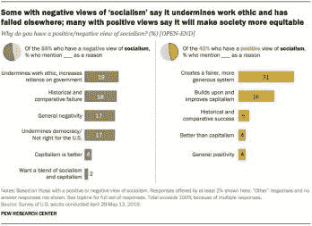

# 社会主义、裙带资本主义和对个人性格的普遍漠视

> 原文：<https://medium.datadriveninvestor.com/socialism-crony-capitalism-and-the-prevalent-disregard-for-individual-disposition-7865359e14e5?source=collection_archive---------13----------------------->

Capitalism

# 人类的真实世界

在生存领域内，人类属于大多数面向社会的居住者的范畴。几个世纪以来，公民人类惊人地掌握了他们最有才华的个人的技能。从此以后，他们能够成功地将信息技术用于解决最复杂的障碍。为了进一步提高，无论是为了方便还是精确，这个物种的直立属以文明的名义建立了无数的文化网络。然而，尽管有压倒性的社会完整性，人类一再拒绝尊重一个基本概念，即个人多样性和个人与社会重力之间的对比。

# 蚂蚁生活的比较一瞥

几个世纪以来，后者在建立社会中不同教派之间的差异方面发挥了重要作用。为了详细说明它的含义，我想比较一下其他物种，在这里是“蚂蚁”

蚂蚁世界是一个协作的世界，因为它缺乏指定的领导。在过去的几十年里，科学家们一直在研究各种蚂蚁的行为。它由破译与群体生存相关的指令的方法组成。然而，他们仍然在寻找他们如何协调行为的线索。世界上最广为人知的蚁群扩展了 3700 多英里，完全是由个体蚂蚁的协作努力建成的。

 [## 保护主义、政治和经济动荡|数据驱动的投资者

### 美国股市昨日出现 400 多点的大幅反转，为未来的事情发出了警告信号。市场…

www.datadriveninvestor.com](https://www.datadriveninvestor.com/2018/06/28/protectionism-politics-economic-turmoil/) 

剩下的推测是蚂蚁可以通过它们的相互作用有效地自我组织。根据科学家的说法，这种有组织的合作之所以盛行，是因为没有人负责他们的团队。蚂蚁没有计划，没有领袖，仅仅通过自我组织和合作生存。蚂蚁能够从琐碎中创造出令人难以置信的结构。蚁群的描述是对超级有机体的描述，这种现象被定义为行为像单个有机体的物种的集合。

# 蚂蚁产生集体智慧

蚂蚁以他们的集体智慧而闻名，尽管他们没有能力组成一个明智的联盟。因此，令人难以置信和鼓舞的是，这些有着小脑袋的小昆虫能创造出如此非凡的物质。蚂蚁天生支持复杂的分散网络的进程。它们所做的一切都是基于许多个体蚂蚁的相互作用，而不是由一个领导者来分配任务。他们只需遵循一些特定的要求，就能使该系统成为一个妙招。

黛博拉·戈登(Deborah Gordon)是斯坦福大学的生物学教授，也是《工作中的蚂蚁:昆虫社会是如何组织起来的，蚂蚁遭遇:互动网络和蚁群行为》一书的作者。没有中央管理，作为一个单一的单元，他们必须依靠简单的互动，如触摸天线。

尽管人类对社会环境中合作提供的重要性有着应有的成熟和理解，但在实现蚂蚁日复一日忍受的事情上却完全落后了。因此，陈述是合理的；低等灵长类动物对社会交往有更好的掌握和概念。然而，人类以善于交际而自豪，呼吁社会团结和集体价值观。

# 作为个体的人类

个人是一个独特的实体，而个性是一种与其他人分离的状态。每个人都有独特的目标、权利和责任。具体的定义是至关重要的，而区分它在生物学，法学和哲学领域。

虽然个性和个人主义通常会随着年龄、时间、经验和财富而成熟，但在当前标准下，一个理性的成人自我被该国的现行法律视为“人”，即使该个人否认诸如“我不遵守指示”等个人责任。从法律的角度来看，[个人](https://en.wikipedia.org/wiki/Individual)要对执行他们的行动、决定、指令负责，并受到起诉。

从一个人成年开始，随着投票权、税收和兵役的授予，个人有权携带武器，个人被认为是有责任的。伴随着等级制度，一个人对其成就的最终回报和对失败的责任是在人类社会结构的顶端。

Socialism

# 作为社会人的人类

正如[弗里茨·海德](https://en.wikipedia.org/wiki/Fritz_Heider)和[玛丽·西美尔](https://en.wikipedia.org/wiki/Marianne_Simmel)在 1944 年写下的著名作品“两个三角形和一个圆绕着一个矩形转动的动画”所指出的那样，人类标准的自然状态表明了他们自动的社会本质。海德尔和西美尔的文章提出，对特定形状的感知不是直观的；因为任何刺激和情境的形式都必须引发这种感知。

# 作为社会动物的人类

作为群居动物，人类天生熟悉他人，因此基于西美尔和海德尔的理论，对亚里士多德的著名格言的积极解释需要被抛弃。个人的社会地位必然是塑造思想、行为、生理和神经活动的主要推动力。尽管如此，超越人类思维、荷尔蒙和理解力的动机需要一个堡垒，确认社交是一种挑战、自动的和无限的。这样的问题源于前面已经谈到的因素。他们所依赖的社会过程在被认为可行之前必须首先被触发。人类可能倾向于通过社会视角来看待这个领域，但这不是自动的。

尽管拥有超越其他物种的能力，包括心智、同理心、将同理心转化为关怀和慷慨，但人类始终无法精确有效地利用这些能力。

# 忠诚的意义

人们天生就致力于承诺、道德关怀和与人类内在球体合作的壮举，但通常是以那些圈子之外的人们为代价取得成功的。我们的慷慨不是没有限度的；相比之下，它是宗派性的。为了支持后一种现象，荷尔蒙催产素通过许多考虑在形成社会契约中起着至关重要的作用。因此，它被证明有助于一个人的内群体的联合，但也能增加保护一个人免受外群体攻击的能力。自我牺牲的群体内的爱与群体间的战争共同进化，重视相互忠诚的社会往往是那些最有可能支持对外群体暴力的社会。

# 竞争还是合作

采纳的能力为那些加强竞争的人提供了一个视角，同时也促进了合作。它只是突出了我们喜欢的人的情感和欲望，突出了我们所鄙视的人的自私和不道德的动机。

此外，对于个人来说，思考他人的心理，他们首先需要动机，并拥有必要的认知补救措施。动机和认知是有限的，正如他们的社交能力一样。它的能力阻碍了任何希望从同理心、仁慈和同情的角度促进他人考虑的干预。人们普遍认为，我们最有价值的社交能力所依赖的工作记忆的源泉会在某个时候枯竭。

这也是一个普遍的概念，因为我们的社会能力主要是非自动的、关注群体的和有限的，因此我们可以放弃对亚里士多德的陈述的强有力的解释。与此同时，人类“天生具有社会性”的概念使人相信，人类需要其他人才能生存，他们往往永远准备好进行社会交往，并且应该检查慈善功能的社会特征是至关重要的。

# 文明史和治理史

人类个性和社会等级的概念延续了“文明”它代表了一种复杂的生存方式，最初出现在古代人开始进化城市殖民地结构的时候。

文明的出现可以追溯到美索不达米亚，也就是现在的伊拉克和埃及。公元前 2500 年，印度河流域的国家扩张；公元前 1500 年，中国扩张；公元前 1200 年，中美洲扩张，现在的墨西哥扩张。

文化最终扩展到每一个大陆，除了南极洲。每个社会都拥有独特的特质，包括庞大的人口中心、不朽的建筑、独特的艺术风格；共享沟通策略；管理领土的系统，复杂的劳动分工，将人们划分为社会和经济阶层。总的来说，各种文化通过建造巨大的纪念馆和建筑来努力保护他们的遗产，这在今天和几千年前一样有效。

# 共享通信

交流是不同文明共有的另一个要素。它包括口语、字母、数字系统、符号、思想、符号、插图和表现。共享通信有助于技术、贸易、文化[交流](http://www.datadriveninvestor.com/glossary/exchange/)和政府的基本基础设施在整个人口中形成和共享。所有文明都信任可以追溯到古罗马的政府行政官僚机构。错综复杂的劳动大军雕刻着每一个州；也就是说，成员执行不同的专门任务。

在不稳定的文明中，种植一种农作物的农民依赖另一种农作物来获得不同的食物、衣服、住所和信息。与单一农业社会相反，在单一农业社会中，特定社区的成员自力更生，为自己提供食物、住所和衣服。

依赖贸易的社会的驱动者通常是义务足迹军团。最后，文明发展的关键是它们迫使人们分成不同阶级的历史规律。这是一个复杂的概念，可以分为两部分:收入和工作类型。这种转变水平的形式传统上是有问题的，并且会发生几代人。

# 回顾历史

回顾历史，人们通常可以重温文明的繁荣和衰落。关于历史学家如何根据启蒙运动衰落的三种模式来表明他们的理由，有各种流行的理由。这包括内部变化、外部压力和环境变化。然而，文明的衰落从来不是单一事件或模式的结果。有时候，文化碰巧完全“消失”了。社会动力是内部向新文明转变的普遍力量。

突然的人口转变或人口结构的转变可能会导致一个文明的基础设施崩溃。人口可能会因移民或一个异常健康的时代而兴旺。或者它们可能由于疾病、极端天气或其他环境情况而收缩。在某种程度上，社区甚至可以重新定义自己。随着社会的发展，大都市地区可能会变得越来越大，并且在文化上与农村和农业社区分离。

# 领地的崩溃

巨大的领土可能会扩展到大片地区，语言、文化和习俗可能会淡化帝国居民的身份。

# 玛雅文明

内部变化导致了在中美洲繁荣了一千多年的玛雅文明的崩溃，就是这样一个例子。“古典玛雅”的崩溃发生在 800 年代，相对较快。痢疾和致命的出血热等疾病导致成千上万的玛雅人死亡和残疾。

一个文明受到外部压力的可以理解的例子发生在外国入侵或持续的战争中。保护一个文明的边界可能是极其昂贵的，并且以发展或维持一种文化的其他方面为代价授权一个活跃的军队。外部压力可能导致文明的突然终结，不管是否采纳另一种文明。

# 阿兹特克帝国

阿兹特克帝国的崩溃和欧洲征服者的到来是外部压力的例证。外部压力往往导致社会的逐渐瓦解。我们通常认为的古埃及的暴跌很好地说明了数百年来外部摩擦如何重新定义了一个文明。埃及在其边境上遇到了长期的、间歇性的冲突，例如南方的努比亚人、中东的亚述人和西方的利比亚人。后来，古埃及与希腊和罗马的文明对抗。

干旱、洪水和海啸等自然灾害是影响文明的自然灾害。

# 社会主义的开端

社会主义的出现可以追溯到 1789 年的法国大革命，伴随着社会政治变革。在席卷欧洲的 1848 年革命之前，卡尔·马克思和弗里德里希·恩格斯撰写的共产主义宣言是基于被称为“科学社会主义”的原始社会主义意识形态后来，在 19 世纪最后三分之一的时间里，欧洲出现了社会民主党，他们从马克思主义中发现了自己。澳大利亚工党是世界上第一个民选的社会党。它于 1899 年在昆士兰殖民地成立了为期一周的政府。在 20 世纪上半叶，苏联和其他共产党代表了社会主义，其经济发展模式和由国家授权的中央计划节俭的创造拥有所有生产资料。然而，其他趋势谴责他们认为缺乏民主。

# 社会主义与混合经济的适应

随着时间的推移，社会主义政府组织了多样化的经济，部分国有化和社会利益。今天，我们可以担保无数形式的社会主义和资本主义与社会主义的混合模式。总的来说，今天的社会主义适用于任何强调人口而非个人的政治或经济假设。与社会主义相关的是，它应该控制和管理房地产和自然资源。因此,“社会主义”一词在历史上是指各种经济和政治制度。纵观历史，我们观察到它有不同的形式，包括乌托邦主义、无政府主义、苏联共产主义和社会民主主义。

# 资本主义的起源

资本主义的历史是兼收并蓄的，历史上受到重大批评。成熟的资本主义已经在 16 至 17 世纪的大不列颠和荷兰的西北欧出现。在随后的几个世纪里，资本主义遭遇了各种不同的策略、规模。它与经济稳定和财富领域的一系列启示有关。当前的资本主义结构已成为全世界的主导金融体系。

# 为什么人们不喜欢社会主义？

通常，社会主义的批评者将矛头指向其破坏职业道德的倾向。相比之下，那些有积极印象的人解释；它促进平等。

#HCWB

[皮尤研究中心](https://www.people-press.org/2019/10/07/in-their-own-words-behind-americans-views-of-socialism-and-capitalism/)在 2019 年早些时候发现，55%的美国人对“社会主义”持负面看法，而 42%的人表达了乐观的观点。大约 65%的人说他们有一个“资本主义”的好主意，三分之一的人持否定态度。那些认为社会主义不利的人把它描绘成对资本主义的巨大威胁。与此同时，其他认为它适用的人则宣称情况正好相反。这是因为它建立在资本主义的目的之上。尽管如此，那些对社会主义持乐观态度的人表达了对一个再次融合社会主义和资本主义的体系的明确偏好。

# 为什么人们不喜欢资本主义？

对资本主义的批评来自许多政治和哲学策略，包括无政府主义、社会主义、宗教和民族主义观点。对[资本主义](https://en.wikipedia.org/wiki/Criticism_of_capitalism)的批判从传达对资本主义总体教义的争论到传达对资本主义的特殊解释的争论。一小撮人推测，遏制资本主义的消极方面只能通过选民的起义来实现。然而，一些人认为结构性剧变可以通过政治改革缓慢到来。许多批评者支持资本主义的优点，并努力通过某种形式的社会监督来平衡资本主义，通常是通过国家立法。对资本主义批判的核心是，资本主义本质上是剥削性的，不可持续的。这造成了经济不平等，是反民主的，导致人权的侵蚀，并刺激帝国主义的扩散和战争。

# 资本主义和社会主义:比喻解释为苹果和橘子

那些支持个人主权社会主义规范的人不会要求公民做他们自己，而不是作为个人。相反，他们认为这将建立一个强调人类合作或社会维度的社会网络，让每个人都生活得更好，同时保持竞争动力。此外，个人社会主义大概要求每个人通过接受我们相互依赖的现实和理解我们从“合作”中获得的东西来理解我们是谁。这样我们就可以完成日常任务，比如吃饭、穿衣、接受医疗保健。事实上，口号是“协作”,如果我们有社会支持，就能发挥我们的全部潜力。有争议的定义主要是在集体主义的背景下将 [co](https://medium.com/datadriveninvestor/the-concept-of-collaboration-and-consolidation-exploiting-our-differences-to-unify-on-a-common-45922b9ecc46) operation 等同起来。在某种意义上，它把[社会主义](https://www.peoplesworld.org/article/socialism-and-the-individual-are-they-compatible/)称为繁衍后代，个人主义的最高形式。

# 理性个人主义的概念

与个人社会主义的概念相反，人们可以阅读迈克尔·A·贝特勒的另一个理论，名为“理性的个人主义:有限政府和资本主义的道德争论”，国际实践者出版社。这一概念在情景上有所扩展——就像在面临经济困境时，人们经常求助于政府来获得援助，这并不奇怪。不承认这些好处，不批准行政扩张，就会延长充满挑战的时刻，改变社会进程，使之更接近成熟的社会主义。

# 有限政府和个人主义

商人兼教授迈克尔·贝特勒是建立有限政府和自由市场的倡导者。他的观点是理性个人主义的基础。他富有启发性的散文为 21 世纪政治和经济领域的分歧原则提供了一个易于理解的解释。拜特勒引用许多有影响力的思想家，强调社会主义和资本主义的政策，推断社会主义是不道德的，而资本主义是唯一道德的[政治经济体系](https://www.carolinajournal.com/opinion-article/individualism-and-capitalism/)。“此外，社会主义是不可持续的，因为它违反了生产先于消费的基本经济原则。在一个以集体主义为基础的社会里，生产最终会减少。根据集体规范，个人无权从其工作中充分受益。因此；没有生产的持续消费将导致过度的赤字支出和政府干预的增加。

# 极端社会经济模式

这两个极端的社会经济模型类似于苹果或橘子的味道。在这两种情况下，不管采用哪种方法，个人的心态、态度和知识都是系统是否被认为吉祥的重要决定因素。在这两种情况下，都有一个明确的实现形式，但由特定的先决条件。这包括意识形态、教育和人口基数经济同质性的状况。换句话说，社会结构越统一，就越自然地将整个社会维持在同一标准上。

# 文化多样性和个人主义的重新出现

文化多样性的扩大和个人身份的进一步分化与他们对资本主义的倾向成正比，更准确地说是“理性个人主义”，如迈克尔·贝特勒所描述的。这就是为什么混合模型伴随着科学和经济的发展而出现。然而，不幸的是，社会主义和资本主义的定义和宣传。在这种混乱中，行政部门错误地试图将某种形式的社会项目纳入福利或社会权利的范畴。很明显，在 21 世纪的世界里，没有真正的社会主义、资本主义或承认个人主权的社会。在我们能够理解一个给定问题的根源之前，我们需要承认个人的作用。同时，我们必须理解他们的特殊期望，这为人民和政府的立场打开了大门。

 [## 语义转移；社会工程和百年来被忽视的现代专制|数据驱动…

### 我们看到的、做的或感觉到的一切都有意义。从语言学上来说，我们需要特定的信息或信念来传达…

www.datadriveninvestor.com](http://www.datadriveninvestor.com/2020/02/14/semantic-shift-societal-engineering-and-the-centuries-old-neglected-modern-autocracy/) 

# 人民与政府

美国第二任总统，世界上最早的经济学家之一约翰·亚当斯曾经说过！

> "自由一旦失去，就永远失去了。"

他正确地认为政府是人民的公仆。

历史上，由美国政府组成的政府已经变成了自我解放的力量。他们只是变成了一个极度渴望税收的超级帝国。政府经常在海外搜寻资源，这些资源由军队和对全球货币体系的控制来支撑。

# 权利法案

《权利法案》的制定巩固了美国的法律基础。后者反映了对该法案为何以负面意义存在的思考。以及如何约束政府的行为，而不是指定公民的权利。它的目的很明显是保护人民免受政府的迫害，而不是相反。在一个复杂的系统中，要求社会主义制度所描述的国家干预是一个方便的问题。保持个性是人类与生俱来的要求的反映。混合模式带来的漏洞不可避免地会导致利益冲突。

# 封闭系统、开放市场和社会经济地位

资本主义和自由市场政策都是基于供求规律的经济环境。它们都与决定商品和服务的价格和生产有关。然而，资本主义关注的是财富的产生以及资本和生产要素的所有权。相比之下，自由市场体系专注于财富或商品和服务的交换。资本主义的一些重要方面是公司和所有者之间的竞争、私有制和产生利润的动机。尽管在资本主义社会中，自由市场根据供求关系来定义商品的生产、定价和服务；但是，某些政府法令可能会出现。

另一方面，在特定的资本主义体系中，私人所有者可以保持对市场的垄断，阻止自由竞争。在自由市场中，很少或根本没有政府监管。这是一个买卖双方在自愿同意一个合理的价格或服务价格的情况下自由交易的系统。

# 封闭的市场经济

在一个封闭的经济或市场中，国家不与外部经济体进行贸易。私营经济倾向于自给自足，这意味着没有进口进入这个国家，也没有出口离开这个国家。封闭经济的目的是在国内为国内消费者提供他们所需的一切。今天没有开放的自由市场经济，因为百分之百的私有经济是不存在的。从自由体系到封闭体系，主流体系承载着一种形式的经济框架。

# 社会主义并不适合每个人，尤其是个人

需要密切关注的一个主要因素是，每一种解决方案，无论是社会主义、资本主义、自由市场还是紧缩经济，在某个时代和社会背景下都相当有效。但是没有一个能够持续很长时间。政府经常试图创造混合经济模式来维持生计。时至今日，许多国家仍在进行这种不一致的延续。但是，几乎在所有情况下，有一点是普遍的。这是对个人态度的普遍忽视，部分原因是他们各自的政府。相反，充其量(如果不是专制的话)政权几乎完全依赖民粹主义言论的集体思维来实施一个总是描绘出可能承载所有社会政治情景中最好一面的政策图景的系统。

# 民粹主义的出现

大众的态度是对社会主义和资本主义的普遍行为的能指，因此，受[语义漂移](https://en.wikipedia.org/wiki/Semantic_change)和[社会工程](https://en.wikipedia.org/wiki/Social_engineering_(political_science))以及对社会主义和资本主义的压倒性情绪的影响。

在被认为是社会人之前，人类首先是一个个体。人类、社会性质和个人主义的对立特征的冲突，以及剖析和整合的便利性，完全决定了仅仅通过试验和失败就能形成解决方案。一个人必须学会区分集体或集体努力和独立协作。也许是时候从进化阶梯中物种的向下进化中吸取教训了。

蚂蚁与其公民机构的其他成员一起努力改善生活。因此，当务之急是认识到我们可以在一个社会中保持我们的个人主义和独立性，同时尊重我们共同的社会价值观。普遍福利社会主义的基础是迷人的，资本主义的竞争本质也是如此。尽管如此，随着人类知识基础的扩大以及由此带来的期望，尊重个人主权变得更加重要，这与社会主义的规范是不一致的。

【http://www.datadriveninvestor.com】原载于 2020 年 2 月 21 日**。**

* [## 当今人口保健和实际个性化医疗的两面性

### 公共卫生是通过预防疾病、促进健康和延长每个人生命的科学

medium.com](https://medium.com/datadriveninvestor/the-duplicity-of-the-present-day-population-healthcare-and-factual-personalized-medicine-fa2e7768a604)*