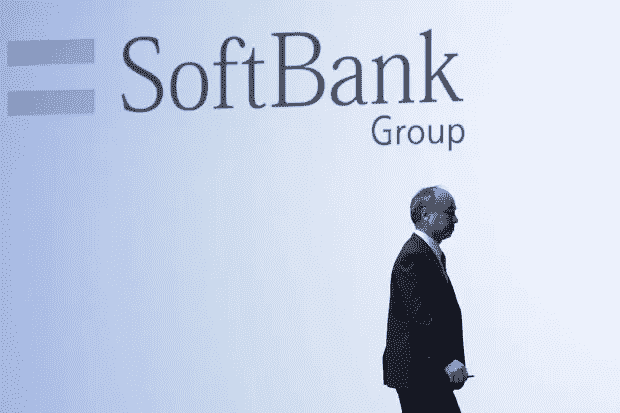

# 软银的愿景基金受到围攻

> 原文：<https://medium.datadriveninvestor.com/softbanks-vision-fund-under-siege-a9168a302a04?source=collection_archive---------7----------------------->

## 为 WeWork、OYO 和许多其他初创公司提供资金的日本企业集团面临更多问题。这是风险投资史上最大的灾难吗？

安东尼·布隆伯格

> **软银的问题越来越多。它的下一个目标可能是优步这样的拼车公司。**

**软银的**大型**愿景基金**下个月可能会再减记 20 亿美元。这个大胆的实验是如何出错的。

软银集团宣布计划出售价值 410 亿美元的资产后，其股票在最近几周飙升。该计划受到了投资者的欢迎，但是软银创始人兼首席执行官孙正义承认他的大胆设想已经偏离了轨道。

当他在 2016 年推出软银愿景基金时，他颠覆了硅谷和风险投资。该基金筹集了 990 亿美元的资本——这是一个令人震惊的战略，旨在以创纪录的时间将初创企业转变为大型上市公司。

 [## 利用股市相关性的最佳方式|数据驱动的投资者

### 当阿尔弗雷德·温斯洛·琼斯开创了世界上第一个“对冲”基金(后来“d”被去掉了)时，他让其他投资者大吃一惊…

www.datadriveninvestor.com](https://www.datadriveninvestor.com/2020/02/02/the-best-way-to-use-stock-market-correlations/) 

这种想法证明了向优步科技公司(股票代码:**优步**)、WeWork 和 **DoorDash** 等公司注入大量资金的合理性。

但最近几个月，该基金一直是一系列战略失误和投资失败的头条新闻的主题。

在过去的一周里，曾经是该基金最有价值的财产之一的 WeWork 起诉了软银，因为软银撤回了从 WeWork 股东手中购买 30 亿美元股票的计划。在取消交易的过程中，**软银**称该房产租赁公司正在接受调查，并且未能满足各种成交条件。软银已经对这笔投资进行了 46 亿美元的减记，这一举动发生在经济关闭之前。

在接下来的几周和几个月里，疫情很可能会引发另一波 Vision Fund 的减记，甚至一些破产。愿景基金仅适度投资于抗病毒领域，如云软件和医疗保健。

在华尔街和 T2——硅谷的风险投资中心——人们普遍对**愿景基金的**困境幸灾乐祸，这是一些人预料到的。

“投资者愿意投资一只规模惊人的基金，用于结构可疑的杠杆化科技投资，这进一步表明了一个繁荣、不容置疑的市场，”**橡树资本管理**联合创始人**霍华德·马克斯**在 2017 年写给客户的信中写道。事实证明，他的谨慎是有先见之明的。

软银**美元的泛滥导致一些公司追求边际回报的不良商业行为，他们在这个过程中焚烧了大量美元。专家们一致认为，可能会有有价值的业务从该基金中产生，但这是一项基本上已经完成的实验，不太可能再次出现。**

愿景基金的一位发言人表示，大量的资本支出为其投资组合公司提供了所需的现金，使其能够以最小的债务需求度过困难时期。这位发言人补充道，该基金是多元化的，Masa 已经开始推动他的愿景基金公司关注利润，这是思维上的一个巨大转变。

尽管如此，Masa 预计**愿景基金**内部将会出现一波破产潮。他最近说愿景基金的 88 家公司中有 15 家可能会倒闭。

专家们认为**愿景基金**的故事是独一无二的错误。一些人称**愿景基金**“一场穿越海洋、席卷一切的海啸，现在已经过去了，”

果然，软银已经暂停了一个更大的续作的计划，即**愿景基金 2** 。但是软银及其投资组合公司的痛苦远未结束。

相反，未来几周可能会出现痛苦的资产减记，这是由**愿景基金在上市公司中的**尴尬处境所迫使的。作为软银集团的一个分支，愿景基金提供了其他基金没有的详细信息。像红杉、凯鹏华盈和安德森·霍洛维茨这样的风险基金经理不会每个季度都向公众发布最新消息。他们可以庆祝胜利者，同时悄悄地消灭失败者。对于**愿景基金**，随着每一个负面新闻的出现，审查也在增加。

由于会计规则，该基金将不得不在 3 月季度因其持有的优步股票遭受 4 亿美元的损失，因为该股票在此期间下跌了 6%。**优步**表示，在受疫情重创的市场，乘坐量下降了 40%至 60%；其他打车公司可能也受到了类似的伤害。

这对**愿景基金**来说是个问题，该基金已经汇集了无与伦比的拼车资产。除了对优步的 77 亿美元投资，该基金还向中国的滴滴投资了 118 亿美元，向新加坡的 Grab 投资了 30 亿美元，向印度的 Ola 投资了 2 . 5 亿美元。

总的来说，大约 40%的**愿景基金**与运输和物流公司有关——花费了 330 亿美元。在全球疫情的背景下，这已成为一场毁灭性的赌博。

软银预计在 5 月份公布 3 月份的季度业绩时，可能会减记每笔拼车投资的账面价值。迄今为止,**愿景基金**已经在其交通投资组合中减记了 14 亿美元。随着该公司更新其投资价值，假设**优步**趋势扩展到全球拼车行业，5 月份的减记总额可能达到 20 亿美元。

**DoorDash** 是**愿景基金的**运输和物流赌注中的另一个。这家食品配送公司正与竞争对手 Grubhub、Postmates 和 Uber Eats 激烈争夺市场份额。虽然 DoorDash 已经秘密申请首次公开募股，但在当前环境下，它上市的可能性很小。

甚至在新冠肺炎之前，IPO 市场的疲软一直是愿景基金宏大计划中的一个主要障碍。基于上市公司投资者最终会买单，为企业支付更多的假设，巨大的私人公司估值是合理的。但是**优步 11 个月前的** IPO 并没有按计划进行；股票一开市就跌了，比发行价跌了 40%。自 2 月份以来，IPO 市场实际上已经关闭，看不到复苏的迹象。

虽然**基金**的设计寿命为 14 年，但**软银**积极地部署其资本，在三年内投资 810 亿美元，分布在 91 家公司。

该基金已分配了 106 亿美元，主要反映了两个大的发薪日:2018 年 8 月由**沃尔玛(WMT)** 收购总部位于印度的电子商务公司 **Flipkart** ，以及及时购买芯片制造商**英伟达(NVDA)** 的股份，该股份于 2019 年初出售。**基金**表示，它仍有 150 亿美元的干粉用于后续发行，但它不再增加新的头寸。

受 WeWork 的 IPO 失败的刺激，Vision Fund 的投资组合在去年下半年开始显示出压力的迹象。**软银**和**愿景基金**共向这家房地产管理公司投资了 142.5 亿美元，但该公司去年 8 月提交的 IPO 文件引发了对财务表现和公司治理的担忧，WeWork 最终撤回了 IPO 计划。软银为 WeWork(T21)提供了一揽子救助计划，现在持有这家陷入困境的公司的多数股份，约占愿景基金投资组合的 5%。

**基金**还有其他房地产投资，包括住宅经纪公司 **Compass** ，该公司最近裁员 15%，以及房屋翻转公司 **Opendoor** ，鉴于当前环境，该公司已暂停购房。房地产总支出达到 101 亿美元，这部分股权现在价值 79 亿美元，占总资金的 10%。

约 19%的**愿景基金**与消费者业务相关，包括 **Oyo Rooms** 的股份，在病毒关闭期间，Oyo Rooms 的酒店与业内其他酒店一起遭受损失。消费者投资组合中有一些有希望的赌注，包括 23 亿美元的抖音母公司的股份和 25 亿美元的韩国电子商务公司的股份。

迄今为止，**愿景基金**已经通过首次公开募股实现了八次退出。其中一半是医疗保健公司: **Vir Biotechnology (VIR)、10x Genomics (TXG)、Guardant Health (GH)、**和**Ping An Good Health and Technology(PANHF)。但是当世界一心一意关注全球健康危机的时候，视觉基金只有 6%的资产用于医疗保健。事后看来，软银错过了这个机会。**

尽管**Masa**长期宣称对人工智能和大数据有信心，但**愿景基金**的资产中只有 4%投资于企业计算和云计算。**愿景基金**持有协作通信平台 **Slack Technologies (WORK)** 和软件公司 **Automation Anywhere** 和 **Cohesity** 的股份，但鉴于大量基于云的企业软件公司在 2019 年上市，以及 2020 年疫情对云计算的日益关注，这一小小的曝光成为另一个失误。

行业专家一致承认，风险投资行业本身为软银的愿景基金奠定了基础。他们强调，20 年前，公司在其生命周期中很早就上市了。但随着初创企业保持私有的时间越来越长，它们需要额外的资本来源。

该行业乐于回应。

资金从非传统参与者涌入“晚期”风险投资，包括主权财富基金、私募股权基金如 **TPG** 和**通用大西洋**，以及共同基金公司如**富达**、**威灵顿管理**和 **T .罗普莱斯**。愿景基金将这一目标推进了一步。

Masa 的大部分资金来自主权财富基金。该基金一半以上的现金来自两个中东国家——450 亿美元来自沙特阿拉伯的公共投资基金，150 亿美元来自阿布扎比的穆巴达拉投资公司。**软银集团**自身投资了 325 亿美元，并得到了一些科技公司的额外支持，包括**苹果(AAPL)** 和**富士康**各 20 亿美元，以及**夏普**10 亿美元。T42 愿景基金本质上成为了一家与中东产油国主权财富基金的合资企业。

该基金的结构不同寻常，40%的资本以优先股的形式筹集，固定回报率为 7%。一旦支付了息票，这些优先股就不会获得任何资本收益。作为首选结构的结果，**非软银**投资者的风险降低了，但获利更少。在回报强劲的时期，软银的表现相当不错。当基金的回报率超过 8%时，将收取 20%的绩效费(优先股加上 1%的管理费)。

最终，**愿景基金**旨在为**软银**带来超高回报，但额外的回报带来了巨大的风险，现在这种风险正在显现。按照目前的投资组合规模，在回报不均衡的年份，该基金将欠优先股持有者 22 亿美元，现金从**愿景基金**储备中支付。实际上，基金投资者将会得到回报，而软银和 Masa 感受到了最大的痛苦。

这是 Masa 的命运逆转，他将对中国电子商务巨头阿里巴巴集团的 2000 万美元投资变成了价值 1380 亿美元的股份。那场胜利是有史以来最伟大的胜利之一，但那是 20 年前的事了。

在**软银**甚至**愿景基金**，都是 **Masa** 说了算。作为目前最大的股东，他控制着软银 T21，并且他是愿景基金投资委员会的三名成员之一，对交易有最终决定权。这是他决定输赢的游戏，历史将据此做出判断:他是终极逃脱大师，正在准备他的第三幕吗？还是一个追逐泡沫的人，他理应得到市场给予他的折扣？

在新冠肺炎环球疫情开始之前，Masa 向人们展示了类似罗夏的图像，以此来表达观点。“看一个影子，”他说。“即使在 24 小时内，你的影子的长度也有显著的不同，即使你的身高在 24 小时内没有变化。看着影子的长度，人们会感到害怕或过于自信。”在接下来的几个月里， **Son** 将会发现这是日落还是日出，同时试图阻止风险投资史上最大的灾难。

看看我之前关于软银和他们问题的开始的文章: [**这些创业公司融资数十亿然后裁员数千**](https://medium.com/datadriveninvestor/these-startups-raised-billions-and-then-laid-off-thousands-a87b5b69310) **。**

如果你喜欢这篇报道，看看我的网站:[https://anthonyblumberg.com/](https://anthonyblumberg.com/)并留下评论！