# 使用梯度下降的 Softmax 分类器(从头开始)

> 原文：<https://medium.datadriveninvestor.com/softmax-classifier-using-gradient-descent-and-early-stopping-7a2bb99f8500?source=collection_archive---------0----------------------->

Some drawing of an Iris that I found on Google Images

# **简介**

我最近从零开始创建了一个机器学习模型，用于解决一个分类问题。具体地，该模型是使用梯度下降的 Softmax 分类器。我的希望是，您将继续使用这篇文章来创建和修改您自己的 Softmax 分类器，并学习我们正在使用的函数背后的一些理论。

在我们进入模型的复杂性之前，我要求大家事先了解以下一些主题，以免陷入未知:

*   交叉熵
*   梯度下降
*   一次热编码

如果你碰巧不知道这些话题，我会自己解释或者参考一些我认为最有帮助的材料。

我把我在这篇文章中获得的知识归功于 [Aurélien Geron](https://github.com/ageron) ( [动手机器学习](https://www.amazon.com/Hands-Machine-Learning-Scikit-Learn-TensorFlow/dp/1492032646))和 [Josh Starmer](https://www.youtube.com/channel/UCtYLUTtgS3k1Fg4y5tAhLbw) ，所以如果你对这些话题中的任何一个不熟悉，我肯定会从他们中的任何一个/两个开始。先不说这个，让我们开始吧！

# **车型**

在我们深入研究任何代码之前，理解我们实际上在创建什么是很重要的。

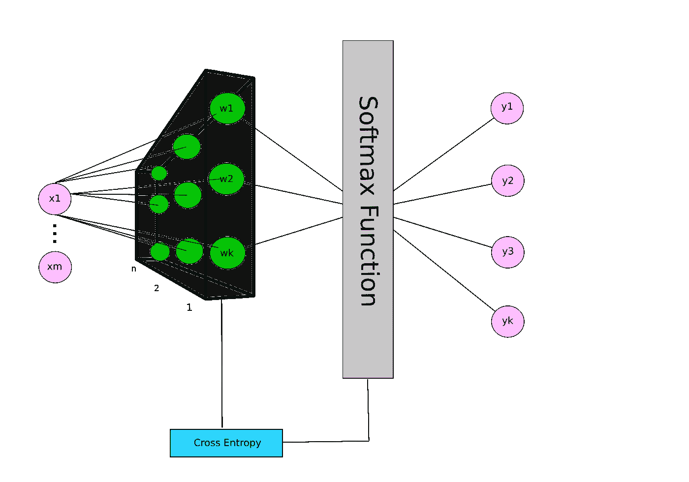

上面，你会看到一个我创建的很好的视觉效果，它(希望)足够容易理解。我们有一些输入( ***x*** )，一些权重( ***w*** )，一个激活函数( **softmax** )，一个代价函数(**交叉熵**)。如果这个图让你感到困惑，不要担心，我会单独解释每个部分发生了什么。让我们从输入和权重开始。

# 第 1 部分(输入和权重)

对于我们训练数据的一个实例( ***x*** )，我们将拥有*个特征( *x1，x2，…，xn* )，因此我们的数据将如下所示:*

*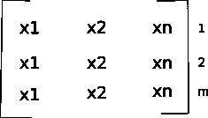*

*features (n) : length of data (m)*

*我们将在训练数据中为每个类别*设置 ***n*** 权重，因此权重将如下所示:**

**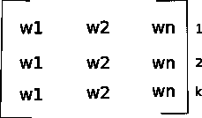**

**features (n) : classes in data (k)**

**Softmax 分类的第一步是给定我们的训练数据和权重的实例，计算每个类 k 的分数。从数学上讲，这看起来会像下面这样:**

**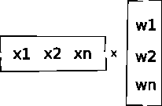**

**换句话说:**

**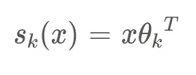**

**Calculates a score for an instance of **x** given class **k**. (Eq. 1)**

**现在我们可以开始写一些代码了，因为我们已经引入了一些函数。首先，我们应该创建一个具有构造函数、得分函数和训练函数的类。**

**在我继续之前，我想提一个建议。其中一些函数处理矩阵，因此代码可能有些难以理解；因此，我恳求大家用垃圾数据来测试这些函数，并尽可能多地打印出来。**

**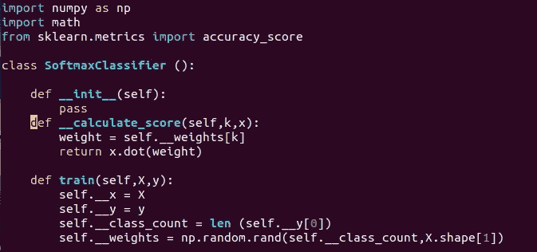**

**我们的类将假设我们的标签是 [one-hot-encoded](https://medium.com/@michaeldelsole/what-is-one-hot-encoding-and-how-to-do-it-f0ae272f1179) ，所以我们标签的一个实例的长度实际上将告诉我们有多少个类( ***k*** )。我们用这个作为我们的权重，这是一个***k****x***n***矩阵。***

**我们的得分函数将如下所示:**

**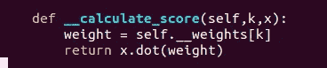**

**该函数的参数是实例 ***x*** 和索引 ***k*** 。索引告诉我们在计算分数时要使用哪些权重。如果你没注意到，我其实没用情商。1 因为以下属性:**

**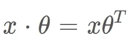**

**这意味着在 ***x*** 和 ***w*** 之间做**点积**就足够了，不需要转置任何向量。**

**使用此代码，您将成功完成 Softmax 分类器的第一部分，如下所示:**

**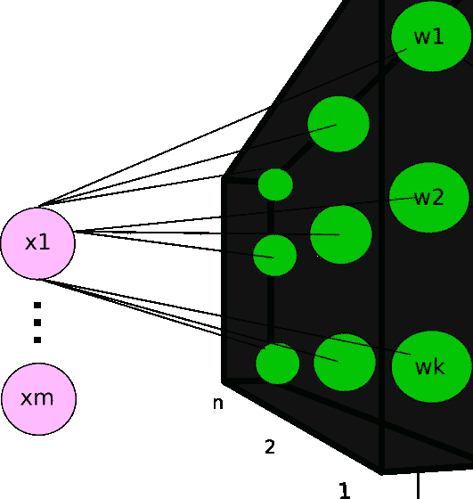**

**现在，我们可以转到模型的**激活功能**部分。**

# **第 2 部分(Softmax 函数)**

**Softmax 函数的目的是给我们一个有意义的输出，可用于训练或预测。激活函数看起来像这样:**

**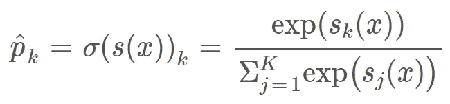**

**Equation 4–20 (Hands-On Machine Learning p.148)**

**这个函数实际上比看起来简单得多。我们本质上是在获取实例 ***x*** 是类 ***k*** 的概率。这就像你之前在概率/统计课上无疑遇到过的袋中球问题。**

**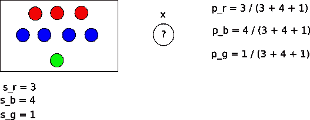**

**Ball-In-Hat problem. Probability that x is red, blue, or green.**

**唯一的区别是分数是通过 ***自然指数函数*** 作为一种处理低于 0 分的分数的方法。**

**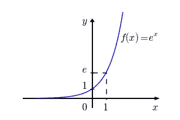**

**Natural Exponential Function. Notice y is never negative.**

**关于 softmax 激活功能的更详细的解释可以在[这里](https://medium.com/data-science-bootcamp/understand-the-softmax-function-in-minutes-f3a59641e86d)找到。现在是代码！**

**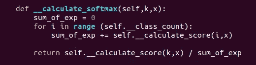**

**注意，这个函数的参数是实例 ***x*** 和索引 ***k*** ，它们与 score 函数的参数完全相同。softmax 函数循环执行 ***i*** 次，其中 ***i*** 是类的数量，给定类 **i** ，我们将 **x** 的分数相加。最后，给定**参数** ***k，*** ，我们计算出 **x** 的得分，并将其除以指数之和。**

# **第三部分(交叉熵:理论)**

**没有成本函数，任何机器学习模型都是不完整的。对于那些不知道什么是成本函数的人来说，它只是一个通过比较我们的**预测**结果和我们的**真实**标签来测量我们的模型在训练期间的性能的函数。**

**交叉熵植根于信息论，可以由比我聪明得多的人更详细地解释，但我将尝试强调我认为重要的东西。请注意，如果你对学习交叉熵理论不感兴趣，你应该跳到第 4 部分。**

**首先，什么是熵？熵，就信息论而言，是你从一个概率分布 ***p*** 中得到的**最小平均信息量**。熵也正好告诉你概率分布是多么不可预测。让我举一个例子，这样我们可以解析这个解释并获得更好的理解。**

**让我们假设我们是预测天气的气象学家。我们的工作是通过发送尽可能少的信息来通知新闻台明天的天气情况。看下面的例子:**

**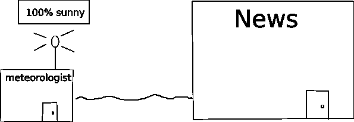**

**我们可以看到我们的概率分布 ***p*** 是 100%晴天。这意味着，在这个镇上，无论发生什么，永远都是晴天。如果天气总是晴朗的，我们想要计算这个概率分布的熵，其中熵是从气象学家那里接收的**最小信息量**，熵也是*、*、的**不可预测性，我们会发现熵是**、*、* 0。**这是因为如果一直是晴天，我们就没必要给新闻发什么信息了。新闻人已经知道他们的城镇是并且将永远是阳光明媚的。这种分布也没有不可预测性，因为天气除了晴朗之外没有任何机会。****

**让我们看另一个天气的例子:**

**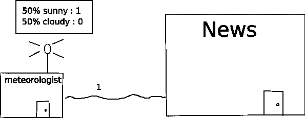**

**我们可以看到概率分布 ***p*** 在晴天和阴天之间平均分配。如果我们想向新闻人发送最少的信息来通知他们天气情况，我们将不得不使用位(1 和 0)。因为天气多云或晴朗的可能性相等，所以我们可以用 1 代表晴朗，用 0 代表多云，这意味着我们正好给新闻人发送了一位。由于熵是新闻人接收的最小信息量，我们的熵就是 **1** 。这也表明这个概率分布比之前的例子更加**不可预测**，之前的例子的熵值为 **0** 。这是有意义的，因为这种概率分布有更多的城镇可以忍受的天气类型。下面，您将看到常用于计算熵的函数:**

**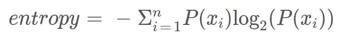**

**那么交叉熵在哪里起作用呢？交叉熵是**平均消息长度**，其中信息来自**真**分布 ***p*** ，但是我们正在传输具有消息长度的数据，就好像分布是 ***q*** 。最高级别的交叉熵是两个概率分布之间的差异的度量， ***p*** 和**

***先来看看 ***p*** :***

**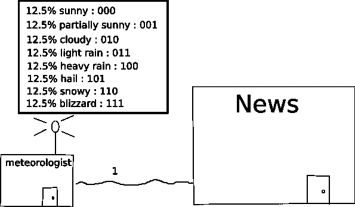**

**给定有 8 种不同天气类型的 ***p*** ，其中每种天气类型出现的可能性相同，我们的熵将是 **3** 。**

**现在我们来看看 ***q*** :**

**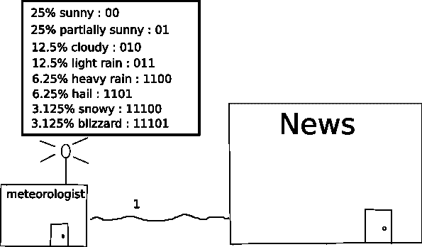**

*****q*** 的熵将是 **2.5625** 。**

**我应该注意到每种天气类型的位数与百分比有关。例如，两位表示特定天气类型每 4 天(1/2)发生一次，5 位表示特定天气类型每 32 天发生一次(1/2⁵).我还要注意的是 ***q*** 加起来并不是 100%。这是故意的，为了有完整的位。**

**当我们问这个问题时，交叉熵就起作用了，**如果我们发送的信息位来自于 *q* 分布，但是天气的概率分布实际上是 *p* 呢？**这样，交叉熵就回答了这个问题，**q*与 *p* 有多大不同？*****

*我们来考虑一下**暴雪**天气类型。气象学家假设暴风雪只在百分之 **3.125%** 的时间里发生( ***q*** 是估计的分布)，但实际上暴雪发生的时间**12.5%**(***p***是真实的分布)。由于我们使用了 ***q*** 来构造我们的消息长度，我们将发送 **5** 位(11101) **12.5%** ，而实际上我们应该发送 **3** 。这不是最佳的，因为它使我们的平均消息长度超过了它应有的长度。*

*交叉熵将为我们提供概率分布 ***p*** 的消息长度，其中我们的消息(模型)是由 ***q*** 、构成的，它为我们提供了一个可以用来与 ***p*** 的熵进行比较的数字。在这种情况下，我们的交叉熵将是 **3.5** 。这是使用以下函数计算的:*

*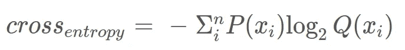*

*如果***p***=***q***，那么交叉熵就简单地等于 ***p、*** 的熵既然两个分布没有区别；否则，交叉熵将等于:*

*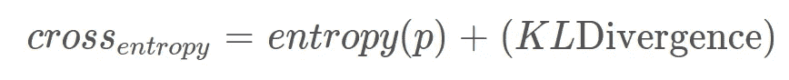*

*当训练我们的模型时，我们有效地试图将 KL-Divergence 最小化到 0。*

*交叉熵与 Softmax 分类器有关，因为 softmax 函数将为我们提供一些概率分布*，例如***【x***，并且我们试图让它与真正的标签 ***p*** 匹配，例如 ***x*** 。交叉熵会给出我们当前分布 ***q*** 的代价(误差)。**

# **第 4 部分(交叉熵:代码)**

**现在我们对交叉熵的理论有了更好的理解，我们终于可以开始编码了。**

**我们将对交叉熵使用以下函数:**

**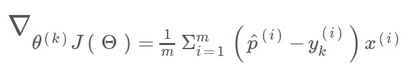**

**Equation 4–22\. Cross entropy cost function (Hands-On Machine Learning p.149)**

**如果你以前从未见过这个交叉熵成本函数的梯度版本，这里的是一个衍生到这个变体的论坛帖子。**

**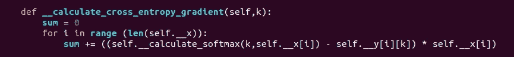**

**这里的代码与上面提供的函数几乎相同，所以我不解释代码。如果您在理解所发生的事情时有困难，我将再次建议您在整个函数中使用 print 语句。**

# **第 5 部分(调整权重)**

**现在我们有了给定类别 ***k*** 的权重的**成本**，我们将使用它们来稍微调整它们的值，这将有望使我们更接近它们的最优值。这种训练形式被称为**梯度下降**。我不会深入讨论梯度下降，因为我相信 Josh Starmer 已经很好地解释了它，你可以在这里找到。**

**如果你已经知道梯度下降，或者你刚刚看完 Josh Starmer 对它的解释，你会知道我们需要一个**学习率**，它通知模型在训练的每次迭代中应该改变多少权重。**

**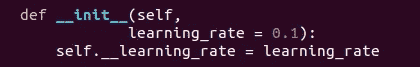**

**一旦模型知道学习率是多少，它就可以开始改变权重，如下所示:**

**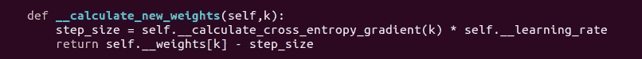**

# ****第六部分(训练模型)****

**我们终于可以开始训练模型了！我们现在要做的就是利用我们创建的所有函数，这对于我们如何构建模型来说非常简单；然而，模型还需要知道一件事。它需要知道它需要训练多长时间，我们可以很容易地提供，如下所示:**

**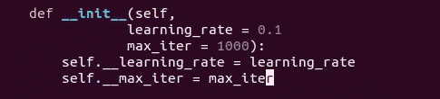**

**现在，培训部分非常简单:**

**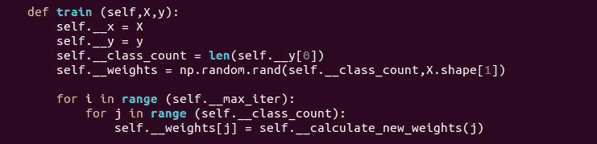**

**对于每次迭代，我们将为每个可能的类计算一组新的权重。一旦训练完成，我们将有希望拥有一个模型，可以准确地预测我们的数据实例的正确类别。**

# ****第 7 部分(测试模型)****

**我们快完成了！一旦模型被训练，我们现在想看看我们的模型能做得多好，所以我们必须创建一个能预测一些测试数据的函数。代码如下所示:**

**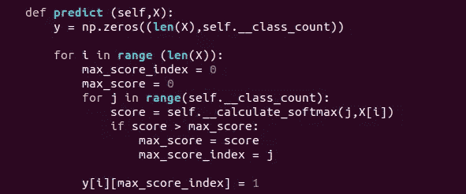**

**从我们的模型中获得预测并不太复杂。我们需要一个 **y** 矩阵，即**nx**k，它将保存我们所有的预测作为**单热编码**值。给定一组测试数据，我们迭代每个实例，计算实例 ***x*** 相对于每个类 **k** 的得分。然后，我们选择具有最高 softmax 值的类，并在其索引处插入一个 **1** 。******

# **第八部分(数据集)**

**我故意将训练集留到最后，因为这个模型应该适用于任何多类分类问题。非常欢迎你使用任何你想要的数据集，只要它是多类的而不是多标签的。你可以在这里阅读分类[的不同变体。](https://www.quora.com/What-is-the-difference-between-multilabel-and-multiclass-classification)**

**对于这个例子，我将使用 Scikit-Learn 提供的 [**虹膜**](https://scikit-learn.org/stable/auto_examples/datasets/plot_iris_dataset.html) 数据集。数据集非常简单。我们有以下形式的数据:**

**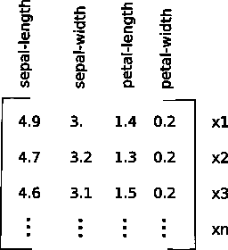**

**我们的标签是这样的:**

**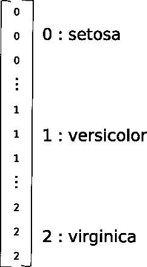**

**如果您还记得前面的内容，在将标签传递给模型之前，我们还必须对标签进行一次热编码。下面是对序号标签值进行编码的相应代码。**

**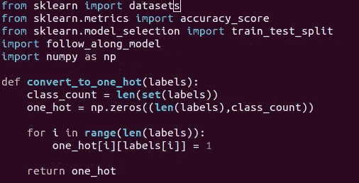**

**在这个函数中，我们通过获取标签的**集合**的长度来获得类的数量。如果你不知道，取一个列表的**集合**，会返回一个没有重复的列表；因此，我们将得到一个长度只有 3 个元素的列表。然后我们创建一个形状为***n***x***k***的矩阵。最后，我们在每个标签实例的正确位置插入一个 1。**

# **第 9 部分(实现模型)**

**最后冲刺！我们在本教程的最后一部分。我们最终可以为我们的模型提供一些数据，对其进行训练，并根据训练集进行预测。这段代码非常容易阅读，所以我不会详细介绍它:**

**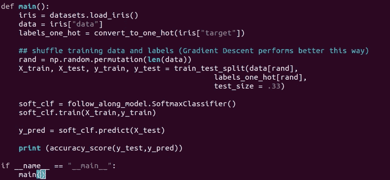**

# **挑战**

**在你决定解决这个问题之前，我恳求你改进和定制你的 Softmax 分类器，以进一步提高准确率！**

**以下是一些你可以尝试的事情:**

*   **实施提前停止**
*   **实现最小步长**
*   **降低每次迭代的学习率。**

# ****结论****

**恭喜你！您已经从头开始创建了一个 Softmax 分类器。希望你一路走来学到了一些东西，如果你有任何问题或建议，请在下面留下评论。你可以在这里访问完整的源代码[，在这里](https://github.com/FezTheImmigrant/OReillyBookCodeAlong/blob/master/Chapter%204%20-%20Training/soft_max_scratch.py)访问[。编码快乐！](https://github.com/FezTheImmigrant/OReillyBookCodeAlong/blob/master/Chapter%204%20-%20Training/chapter_4_exercise_12.py)**