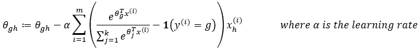

# Softmax 回归

> 原文：<https://medium.datadriveninvestor.com/softmax-regression-bda793e2bfc8?source=collection_archive---------0----------------------->

## 用 Python 从头开始构建 Softmax 回归模型！

MNIST Handwritten Digits Dataset.

在我之前的[文章](https://medium.com/datadriveninvestor/fundamental-of-logistic-regression-4244cbc9aa3c)中，我们了解了用于二元分类的**逻辑回归**。然而，在实际应用中，可能有两个以上的类别需要分类，例如，数字分类。在这种情况下，我们称之为多项逻辑回归或也称为 **Softmax 回归**。

## Softmax 方程的推导

考虑一个涉及 k 个类别的分类问题。
设 **x** 为**特征向量**和 **y** 为对应类，其中**y**∈{ 1，2，…，k} 。

现在，我们将对给定 x， **P(y|x)** 的 y 的概率进行建模，这是给定特征时 y 成为任一类别的概率向量:

> 回想一下，在[逻辑回归](https://medium.com/datadriveninvestor/fundamental-of-logistic-regression-4244cbc9aa3c)中，y=1 相对于 y=0 的**对数比被假设为与**自变量 x** 成线性关系。**

使用相同的类比，我们可以假设 y=i 相对于 y=k 的**对数奇数与**独立变量 x** 具有线性关系。**

由于 j=1，2，3，…，k 的 P(y=j|x)之和等于 1，所以:

通过替换:

上面推导出的方程被称为 **Softmax 函数**。从推导中可以看出，给定 x，y=i 的概率可以用 softmax 函数来估计。

**模型概要:**

weight vector associated with class g.

weight matrix where each element corresponds to a feature of a class.

Figure: illustration of the softmax regression model.

利用输出概率向量，我们可以将输入分类为具有最高概率的类。

## 最大似然估计

在我们继续之前，让我们先介绍一下**指示器函数**，如果自变量为真，它输出 1，否则它将输出 0。

Indicator function.

为了得到训练数据的似然性，我们需要计算给定 x⁽ⁱ⁾的 y=y⁽ⁱ⁾对于 i=1，2，3，…，m 的所有概率(m 是训练数据的总数)

利用 P(y⁽ⁱ⁾|x⁽ⁱ⁾的表达式，我们可以如下计算似然函数 L(θ):

> 似然函数是模型对样本数据的拟合优度相对于模型参数(θ)的度量。

正如在每个机器学习任务中一样，我们的最终目标是通过最小化损失函数来优化权重。在这种情况下，我们将似然函数作为模型性能的度量。

> 注意:可能性越高，模型越好。

所以，我们需要最大化似然函数，而不是最小化它。

正如在关于逻辑回归的文章中所提到的，优化过程通常涉及微分，这比乘法容易得多。所以，我们对似然函数取自然对数，这就是所谓的对数似然函数。

事实是**max f(x)=–min–f(x)**。因此，我们实际上可以最小化对数似然函数的负值，以避免与通常涉及最小化损失函数的其他机器学习模型的优化过程混淆。

简化损失函数:

注意，在最后两步中，l=1 至 k 的求和项σ**1**(y⁽ⁱ⁾=l)**消失，因为它等于 1，如下所述:**

最后，我们的损失函数是对数似然函数的负值。我们将使用梯度下降算法通过最小化损失函数来优化权重。

损失函数相对于权重矩阵任何元素的偏导数为:

梯度下降每次迭代的更新规则:

## Python 中的 Softmax 回归

我们将使用的数据集是 [MNIST 手写数字](http://yann.lecun.com/exdb/mnist/)图像，这些图像可以通过使用 [Keras](https://keras.io/) 库来加载。

完整的编码在下面的 Python 笔记本中:

感谢您的阅读，希望您喜欢这篇文章并从中获得知识。

 [## 软件开发过程:如何选择正确的过程？数据驱动的投资者

### 软件是任何企业组织成功的生命线。没有软件的帮助，一个…

www.datadriveninvestor.com](https://www.datadriveninvestor.com/2020/01/16/software-development-process-how-to-pick-the-right-process/)