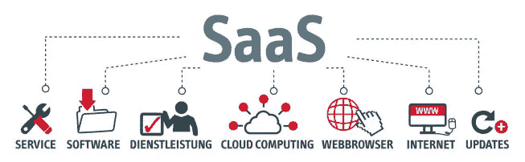

# 软件即服务(SaaS)

> 原文：<https://medium.datadriveninvestor.com/software-as-a-service-saas-7cfff348c81a?source=collection_archive---------14----------------------->

在早期，一项艰巨的任务是在系统上上传一堆数据，这样公司的数据就会安全可靠。但是，随着技术的发展，这变得很容易。SaaS 在为我们简化这一过程中发挥了至关重要的作用。

## SaaS 是一种软件分发模式，其中第三方提供商通过互联网托管应用程序，并将其提供给客户。

在当今时代，SaaS 可以被认为是 IT 公司的重要服务之一。Dropbox、Google Apps 都是 SaaS 的例子。、Slack、office365 等。

其中一个重要的设施是，它允许用户通过互联网连接和使用基于云的应用程序。
传统上，如果公司想要维护和记录所有员工的纳税计算，他们需要支付高额费用在所有计算机上安装该软件，以便收集数据。
然而，在云计算时代，人们可以在任何地方执行任务。

 [## 数据科学和软件工程哪个更有前途？数据驱动的投资者

### 大约一个月前，当我坐在咖啡馆里为一个客户开发网站时，我发现了这个女人…

www.datadriveninvestor.com](https://www.datadriveninvestor.com/2019/01/23/which-is-more-promising-data-science-or-software-engineering/) 

公司可以简单地将数据加载到云上，这样每个人都可以访问数据并进行必要的修改。
有了 SaaS，在计算机上使用大型软件来完成简单任务的需求在很大程度上得到了降低。

## SaaS 被认为是对黑客的威胁，因为它比传统方法更安全。

SaaS 以更快的速度为客户创造价值，同时也为企业提供了带来所需变化的灵活性。
总的来说，SaaS 能为企业提供很多东西。SaaS 的一些好处是:

## 成本:

SaaS 因为几个不同的原因提供了显著的节约。首先，它消除了购买或安装的前期成本，以及维护和升级等持续成本。
SaaS 应用程序可以轻松下载和维护，无需花费大量资金安装硬件。此外，现收现付模式允许企业只为他们正在使用的东西付费，而不是为未使用的许可支付大量费用。

## 时间:

许多人说“时间就是金钱”，谢天谢地，SaaS 证明了这一点。对于 SaaS 提供的许多应用程序，安装非常简单，只需连接互联网并简单登录即可。此外，维护责任也从您的 IT 部门转移到了供应商身上。这消除了升级传统软件可能需要的额外工作时间和停机时间。最后，SaaS 应用程序往往有一个较小的学习曲线，这意味着更快地被你的员工采用。

## 可扩展性和可访问性:

SaaS 模式的另一大特点是它提供了极大的灵活性和选择。因为该软件是由供应商在外部托管的，所以更改您的使用计划很容易，并且可以在没有预先通知的情况下完成。此外，基于网络的使用允许其用户从任何位置访问该软件。只需要互联网能力。

## 兼容性:

使用传统的软件安装方法，更新可能需要大量的时间和金钱。然而，有了 SaaS，用户可以简单地登录已经升级的服务。

> SaaS 解决方案非常适合精益企业。因为与许多内部解决方案相比，它们需要的维护更少，而内部解决方案往往需要专业的支持人员来管理可能出现的问题。