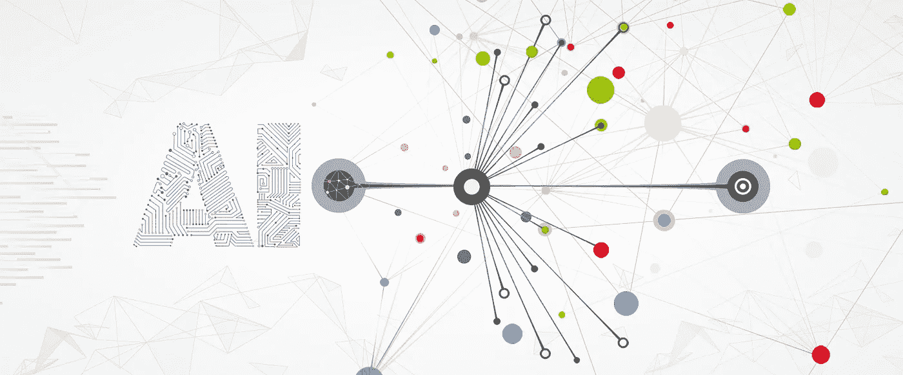
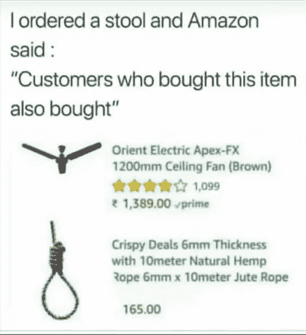
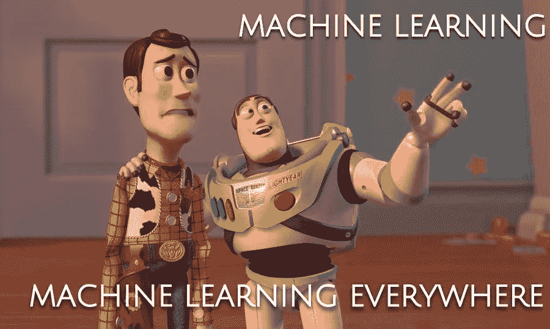

# 软件吃了世界，现在 AI 在吃世界…

> 原文：<https://medium.datadriveninvestor.com/software-ate-the-world-now-ai-is-eating-the-world-6371d6645f4d?source=collection_archive---------5----------------------->

当你在亚马逊挑选了一双漂亮的鞋子后，你的 feed 会持续显示一些来自不同网站的购物信息，你对此感到惊讶吗？购买智能手机后，你会看到智能手机后盖的广告。是的，我也遇到过这种情况。

jokes apart !!

# 什么是机器学习和人工智能？

简单地说，人工智能是让系统变得智能的方法。是思考和学习的能力。机器学习是人工智能的一个子集，软件在没有使用数据进行显式编程的情况下进行学习。

作为人工智能，机器学习和深度学习大多数时候是互换使用的，但它们不是。

人工智能正在垄断我们生活的方方面面，从医学领域的癌症检测到农业领域的天气预报。

人工智能正在重塑从医学到废物管理等各个行业。其中一些如下

# 硬件部门:

硬件行业大部分都集中在 AI 上。回到 2017 年，英伟达 CEO 说软件在吃世界，但 AI 要吃世界。科技公司和投资者开始向人工智能投入资金，大量资金已经流入芯片制造商英伟达，因为它正在制造为运行机器学习算法定制的硬件。越来越多的公司开始关注自动驾驶汽车和系统的更高自动化。

# 医疗领域:

**医学中的人工智能**是指在需要护理的患者的诊断和治疗中使用**人工智能**技术/自动化流程。…通过患者访谈和测试收集数据。处理和分析结果。使用多种来源的数据得出准确的诊断。它被用于从癌症预测到获得关于你的医疗数据的任何问题的答案的每一个方面。

# 食品加工:

人工智能正在彻底改变食品加工业务，因为它正在影响食品加工行业。它还帮助农民预测天气，它可以利用人工智能来改善产品，优化运营，提供更好的客户体验。