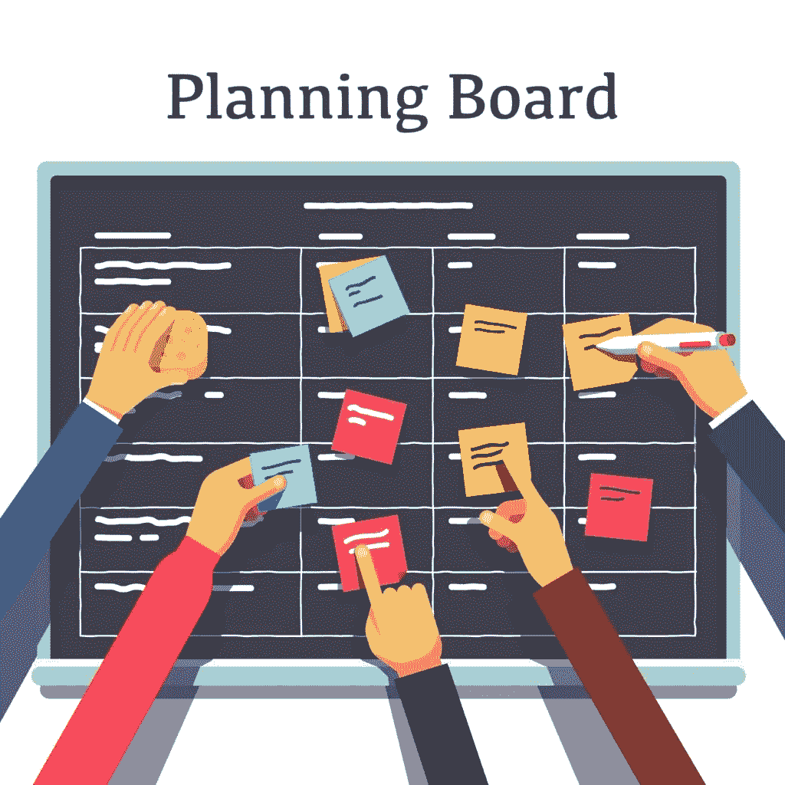
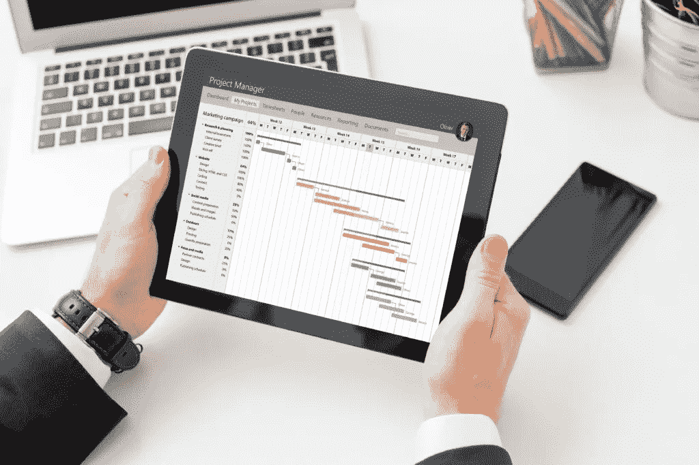

# 软件开发项目规划——阶段和特征

> 原文：<https://medium.datadriveninvestor.com/software-development-project-planning-stages-and-features-2bca5531417e?source=collection_archive---------24----------------------->

对新产品有一个好的想法是非常好的，但是你需要有能把它变成现实的人。对于你在内部实现的项目和你外包的项目都是如此。这就是为什么 Skywell Software 愿意与您分享如何正确规划一个[企业软件开发](https://skywell.software/)项目，以便您可以决定哪一个最适合您。

# 如何计划一个软件项目

选择一个项目模型是很重要的，因为它将决定未来一切将如何展开。最流行的模式是敏捷模式，因为它提供了更高质量的产品，提高了客户满意度和参与度。在敏捷模型中，测试被集成到整个 SDLC 中，SDLC 允许定期检查，以确保在开发过程中一切正常。有不同的方法可以规划你的敏捷模型:Scrum 和看板

让我们更详细地看一下这些方法。

# 混乱

在 Scrum 项目计划中，开发周期被组织成冲刺阶段，通常持续 1-4 周。每个 sprint 都将致力于创建一个特定的功能，这个功能将能够向用户交付附加值。Scrum 是最流行的方法之一，包括几个负责计划项目的参与者。这些人包括项目所有者、经理、业务分析师、测试人员以及所有参与产品创建的团队。

 [## 数据科学和软件工程哪个更有前途？数据驱动的投资者

### 大约一个月前，当我坐在咖啡馆里为一个客户开发网站时，我发现了这个女人…

www.datadriveninvestor.com](https://www.datadriveninvestor.com/2019/01/23/which-is-more-promising-data-science-or-software-engineering/) 

# 让我们来看看 Scrum 软件开发项目计划的例子:

*   在计划所有的冲刺之前，项目负责人将梳理积压的任务。他们可能会选择加入一些新功能来满足某些业务需求，并删除一些不相关的内容。
*   然后，项目负责人必须对待办事项中的所有任务进行优先级排序。如果某些任务不可能在一次冲刺中完成，他们将不得不把它们分成更小的块，在几次冲刺中完成。
*   在 sprint 开始的时候，所有的计划会议都是一致的，每个人都将决定每个 sprint 的目标。这包括考虑需要完成的总体工作量，并确定完成的时间表。

如果你的公司正在向敏捷过渡，你可能会遇到一些阻力。结果，团队成员可能试图将敏捷元素融入非敏捷框架，这可能会导致灾难。渐进地做出如此大的改变总是一个好主意，因为否则，它会引起彻底的怨恨。

# 看板法

看板非常有趣，因为它的起源可以追溯到日本的丰田制造工厂。早在 20 世纪 40 年代，他们就使用了一种叫做看板的精益生产系统。护理制造中涉及的相同原则也适用于软件开发。这种方法的核心是看板。今天，你可能走进许多公司的办公室，看到一个有十个或更多部分的看板，但实际上，它可以简单到“做，进行中，完成”该板的目的是展示项目流程并识别瓶颈。这个方法中的新参与者将是团队，其他的和 Scrum 中的一样。

# 看板项目计划流程如下所示:

*   基于项目所有者的要求，项目经理计划将所有有助于实现目标的任务放在手边。
*   然后，任务被交付给团队领导，由他们设定优先级和时间表。
*   团队领导将任务分配给特定的开发人员，并将这些任务张贴在看板上。
*   随着每项任务的推进，它会沿着棋盘移动，直到完成。

团队在看板方面遇到的一个问题是，他们不能保持看板板是最新的，这是有问题的，因为它不能反映当前的工作流程。你必须小心监控这个过程，因为只有更新的看板才能给你所需要的洞察力。

# 瀑布

如果你的项目不适合敏捷，或者你只是觉得它不会很适合你的公司，有一个替代方案叫做瀑布。这更像是一种渐进的方法，将整个项目分成几个阶段，每个阶段都需要完成，然后才能进入下一个阶段。它还将包括敏捷方法中所有相同的参与者。

# 规划将分为以下几部分:

*   项目负责人将与业务分析师讨论业务目标。
*   所有这些都将传达给项目经理
*   他或她将根据提供给他们的信息创建阶段和序列。

瀑布是一个非常严格的系统，正如你所想象的，它有很多问题。最主要的一点是灵活性很小。如果某件事在前一阶段没有做对，你将不得不回到起点，重新开始。即使你已经到了晚期，这也是事实。这就是为什么很多人倾向于不选择这种模式。

# 选择适合你的软件开发项目计划

在开始开发之前，重要的是你要和管理你项目的人坐下来，告诉他们你的需求、目标和期望。他们将能够建议软件项目计划，这将有助于在必要的时间范围内交付您正在寻找的结果。因此，选择一个有经验的软件开发提供商是很重要的，因为他们将能够帮助你在所有的过程中导航。

*最初发布于*[*https://sky well . software*](https://skywell.software/blog/software-development-project-planning/)*。*