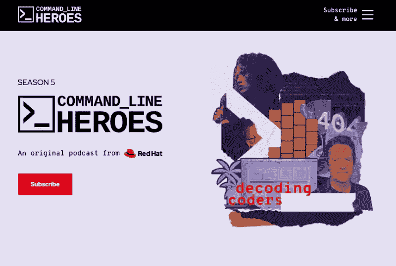
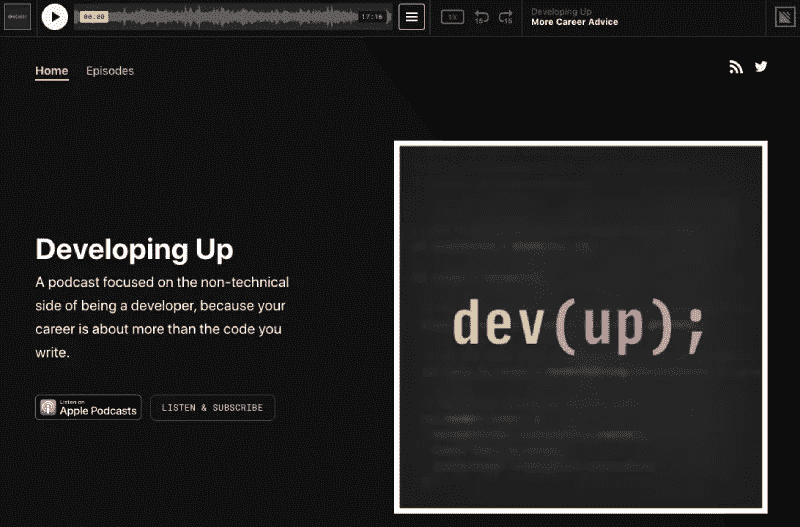
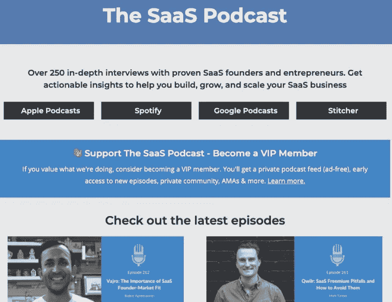

# 你现在必须订阅的 3 个软件工程播客—第 5 部分

> 原文：<https://medium.datadriveninvestor.com/software-engineering-podcasts-eab1c69445a4?source=collection_archive---------28----------------------->

Image from [Pixabay](https://pixabay.com/photos/podcasting-microphone-podcast-audio-5176301/)

长期以来，软件工程播客一直是我的伴侣。我听软件工程师播客已经超过十年了。软件工程播客以一种很好的格式给你提供最新的新闻和观点，这种格式也同样易于使用。也可以看前面的部分 [1](https://geshan.com.np/blog/2015/10/3-podcasts-every-software-engineer-slash-developer-should-subscribe-to/) 、 [2](https://geshan.com.np/blog/2016/05/3-podcasts-every-software-engineer-slash-developer-should-subscribe-to-part-2/) 、 [3](https://geshan.com.np/blog/2017/01/3-podcasts-every-software-engineer-slash-developer-should-subscribe-to-part-3/) 、 [4](https://geshan.com.np/blog/2019/07/podcasts-every-software-engineer-slash-developer-should-subscribe-to-part-4/) 。以下是所有软件工程师现在都应该订阅的 3 个播客:

# [命令行英雄(来自 Redhat)作者 Saron Yitbarek](https://www.redhat.com/en/command-line-heroes)

命令行英雄是播客中的瑰宝。题目研究得很好，也很深入。它涵盖了与所有软件工程师密切相关的广泛主题。记得听第二季关于[无服务器](https://www.redhat.com/en/command-line-heroes/season-2/at-your-serverless)的那一集。这是一股新鲜空气，来自萨隆的评论，来自档案库的字节，以及包括安德里亚·帕斯沃特在内的多位客人的精彩附加内容。

Command Line Heros podcast website screenshot

这个获奖的播客将自己定义为:

> *Command Line Heroes 讲述了开发人员、程序员、黑客、极客和开源反叛者如何革新技术领域的史诗般的真实故事。*

在其他几季中，我最喜欢的是第三季。他们关于 Python 的第一集简直太棒了，太有启发性了。我很高兴知道 Python 编程语言的终身仁慈独裁者:[吉多·范·罗苏姆](https://en.wikipedia.org/wiki/Guido_van_Rossum)，他创造了这种多用途语言。

Saron 还有其他播客，像编码新手 T1 也很棒。命令行英雄的剧集并不长，但是音乐、评论和其他东西混合在一起的方式显示了一个伟大播客的标志。开头通常会吸引你听完整集。

# [由迈克·迈尔斯开发](https://www.developingup.com/)

《向上发展》是一个了不起的软件工程播客。这个播客好的一面是它关注了我们职业生涯中非技术的一面。我认为拥有优秀的软技能对于做好软件工程工作至关重要，对于爬上职业阶梯也是不可或缺的。我清楚地记得迈克和卡尔谈论[公众演讲](https://www.developingup.com/episodes/43)的那一集。这绝对是其中最棒的一个。

Developing up podcast website screenshot

向上发展将自己描述为:

> *这是一个关注开发人员非技术层面的播客，因为你的职业不仅仅是你写的代码。*

2016 年以来的 50 集，听这个软件工程播客，你一定会学到一些必要的非技术技能。从[结对编程](https://www.developingup.com/episodes/48)和[代码审查](https://www.developingup.com/episodes/46)到[远程工作](https://www.developingup.com/episodes/40)和[冒名顶替综合症](https://www.developingup.com/episodes/30)。

这几集相对较短，迈克在提出令人惊讶的问题方面做得很好。这带来了深刻的和相关的信息。我真的建议你订阅这个软件工程播客。

# [乌默尔·汗的 SAAS 播客](https://saasclub.io/saas-podcast/)

像往常一样，对于第三个软件工程播客，我有一些与业务方面更相关的东西。作为软件工程师，如果我们理解这个领域以及我们为什么这样做，这将使我们的工作更有意义。

我记得很清楚的一集是[戴夫和乌默尔](https://saasclub.io/podcast/clickfunnels-self-funded-saas-startup/)关于点击漏斗的聊天。戴夫描述了点击漏斗的旅程以及它是如何赚取数百万美元的。

The SAAS podcast website screenshot

SAAS 播客将自己定义为:

> *超过 250 次对 SaaS 创始人和企业家的深度采访。获得切实可行的见解，帮助您建立、发展和扩大 SaaS 业务*

我还喜欢 SAAS 软件工程播客中的许多其他片段，比如 Krish 谈论[扩展](https://saasclub.io/podcast/saas-subscriptions-and-billing-chargebee/)SAAS 业务的那一集。欧默在研究和采访主持人方面做得很好。这几集有点长，但值得花时间。

# 结论

尽管由于过去 6 个月没有通勤上班，我已经很少听播客了。我希望你喜欢听上面的软件工程播客。快乐聆听。

**访问专家视图—** [**订阅 DDI 英特尔**](https://datadriveninvestor.com/ddi-intel)

*原载于*[*https://geshan.com.np*](https://geshan.com.np/blog/2020/09/software-engineering-podcasts-you-must-subscribe-to/)*。*