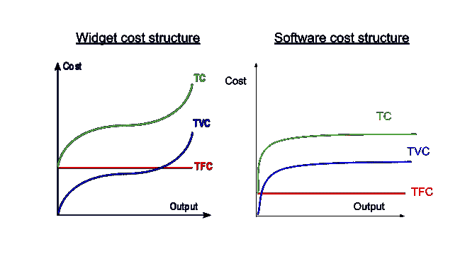
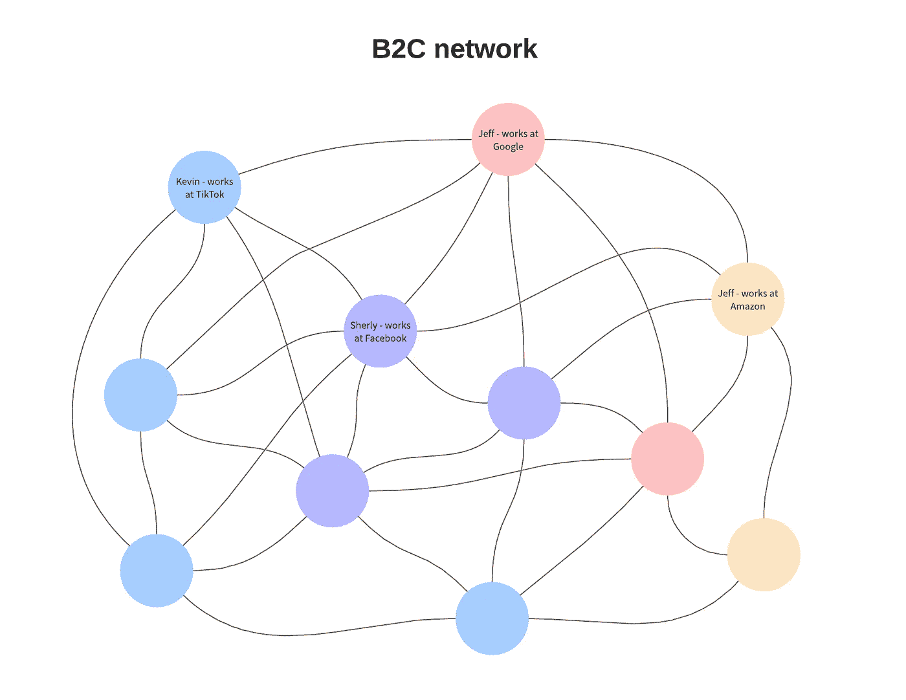
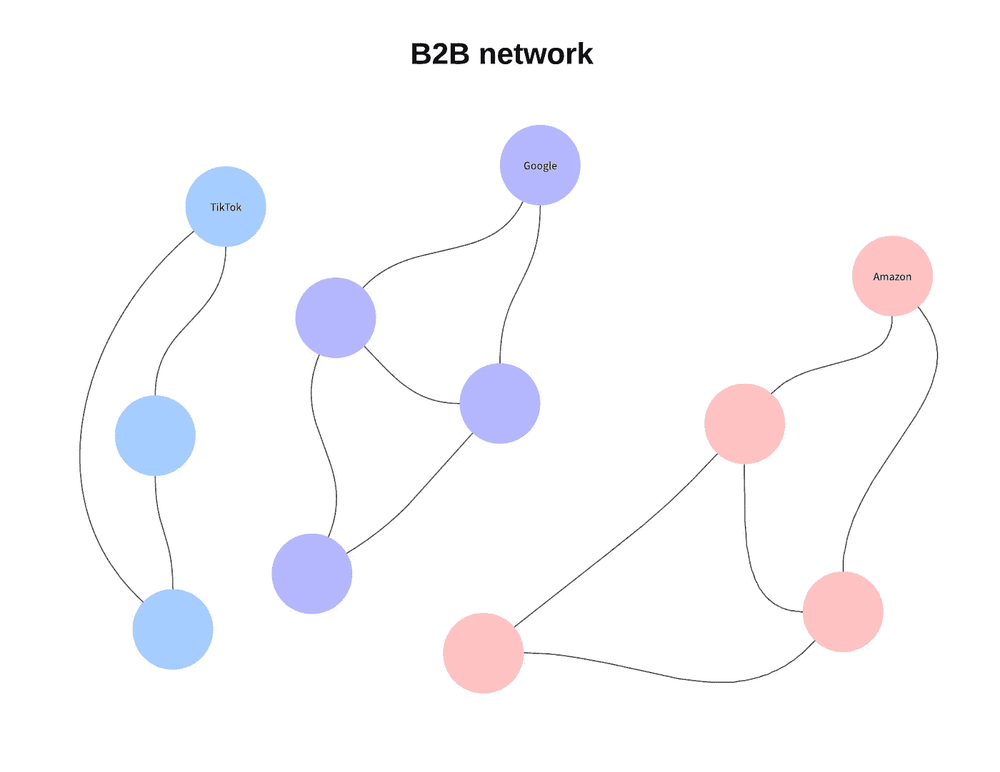
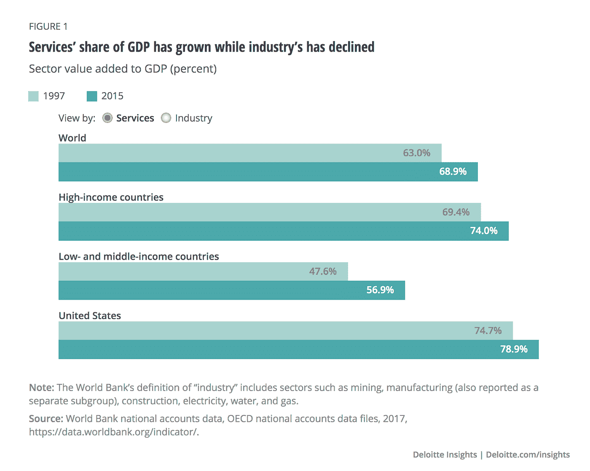

# 软件销售——一首迷人的歌？

> 原文：<https://medium.datadriveninvestor.com/software-selling-a-siren-song-cca92aa82c72?source=collection_archive---------11----------------------->

企业软件似乎很大程度上是一首迷人的歌。提供高利润率和高增长率——这两种趋势随着软件开发工具和 SAAS 部署模式的进步而加速——它以其高估值的甜蜜承诺吸引着创始人和风投。但是不久之后，B2B 软件的警报声让你搁浅了。

## 这些生存威胁为什么会存在？

软件开发的相对容易(与资本和/或劳动密集型产业相比)是其迷人本质的核心因素。如果你开发了一些成功的应用程序，你可以用较低的固定成本甚至更低的可变成本卖出更高的单价，生活是美好的。

Enterprise software costs start low, and stay there. (TC = total cost, TVC = total variable cost, TFC = total fixed cost)

但是，您所体验到的开发简易性对于世界范围内的所有其他软件开发者来说都是存在的。可以想象，任何拥有电脑和互联网连接的人都可以算作你的竞争对手。

因此，如果你设法赢得了一次软件彩票，你只有宝贵的几个生存选择。其中最懒惰的是对知识产权法的依赖——“如果某个管理机构只是承认我的应用程序是最好的，并保护它免受竞争，”你会希望这样。然而，它(在很大程度上)并不是这样工作的。

越来越多的闭源专有应用程序是由模块化的[开源库](https://github.com/)构建的。因此，虽然您可能添加了一些特殊的调料，但在许多方面，它只是一点胶水，相当脆弱地将核心开源组件粘在一起。鉴于任何人都可以接触到砖块，建造一个和你一样好或者比你更好的房子并不是一个挑战。

That girl on the left is the software dev next door coming for your lunch. You’re the anxious looking kid in the stripedpolo.

如果没有强有力的知识产权保护，企业软件开发者的唯一希望就是通过网络效应来解决问题。尽管比我聪明得多的人重现脸书的大部分技术功能对我来说并不困难，但正如本·汤普森经常指出的那样，他们的网络现在是他们的核心优势。

唉，在企业技术领域，网络效应远不如 B2C 世界重要。当你向企业销售解决方案时，唯一真正重要的网络是你所销售的公司内部的网络。因此，即使你已经开发了一个由数千个投资组合客户组成的网络，如果一个新贵提供了更好的技术，下一个边际客户会选择他们而不是你，而很少考虑你已经开发的用户“网络”。

Network effects matter in B2C

In B2B, not so much.

## 那么有哪些潜在的解决方案呢？

简而言之，没有简单的解决办法。明确地说，我认为这在很大程度上是一件好事，因为它表明我们日益以知识为基础、以服务为基础的经济是一个更具竞争力的生态系统，而不是以前主导全球经济的资本密集型行业(例如，后工业革命时期信托的兴起)。

Go [here](https://www2.deloitte.com/us/en/insights/economy/issues-by-the-numbers/trade-in-services-economy-growth.html#:~:text=In%202015%2C%20services'%20value%20added,from%2069%20percent%20in%201997.&text=The%20increase%20in%20services'%20share,in%201997%20(figure%201)) to give our Deloitte friends some love, and watch the bars dance.

也就是说，如果你想保持你作为 B2B 软件销售商的市场领导地位，这里有一些建议。没有一个是微不足道的，即使完美地执行，这些策略仍然只能提供部分解决方案。

1.  跑在队伍的前面

如果你开发了一个市场领先的应用程序，谁说闪电不会击中两次呢？不过，严肃地说:你的市场领先地位肯定是许多因素的综合，但商业头脑和技术熟练程度肯定是两个核心因素。)投稿人。此外，通过一次登顶，你已经从最初的成功中获得了可观的现金储备，这将有助于加速另一个市场领先产品的开发。不管是运气还是技能让你到达顶峰，通过走一条可行的路线到达顶峰，你已经获得了无价的经验，这将有助于你下一次的跋涉。

这些都是积极的一面。负面影响应该很明显。尽管你非常敏锐，但打造一款主导产品从来都不容易。更糟糕的是，你的世界观现在被首次公开募股的成功所影响，你倾向于把所有新问题视为钉子，而你最初的锤子可以在很大程度上把它们敲掉。此外，世界一直在不断变化，这进一步增加了下一个成功的解决方案来自另一方的可能性，这一方更适应今天的世界，而不是你最初的成功成长的昨天的世界。

Not every new problem is a nail.

2.转向资本密集型产品

软件的开发成本很低，如果它是你唯一的产品，你很容易受到竞争的伤害。相反，向资本密集型产品的转变会为你的潜在敌人建立一个进入壁垒。

Dropbox 就是一个例子，它在云存储市场占据领先地位后投资了物理存储服务器。通过这种方式，虽然我可能很容易开发出更令人愉快的 UI/UX，可以击败 Dropbox，但我现在还需要解决他们(大概)通过大量固定成本投资实现的规模经济。当然，现实更复杂(例如，建立和维护大规模数据中心并不容易，三大云提供商的快速崛起意味着他们仍然可以以更低的价格向第三方提供这项服务，即使在提取利润之后)。然而，如果做得好，毫无疑问，采购持久的基础设施，有效地部署，会在你和隔壁的家庭软件创业公司之间创造一个区别。

3.acqui-雇用所有潜在的威胁恭维

如果你不能打败他们，就加入他们。令蒂姆吴和其他人懊恼的是，我们生活在一个反垄断监管宽松的时代；其结果是，面对潜在的反竞争(如 Instagram 和脸书)，新员工有了一个友好的环境。只要现状保持不变(我认为会的，尽管国会对 FAANG 的审查越来越严格(网飞是如何混进这个组织的？？))，这是你避开存在威胁的另一种方式。

早期 SAAS 公司的 Salesforce.com 就是这种策略的一个开创性的当代例子。以下是 Salesforce 的收购清单(继续滚动):

*   sendia(2006 年 4 月)—现在是 sales force Classic[【100】](https://en.wikipedia.org/wiki/Salesforce#cite_note-100)
*   基登(2006 年 8 月)——现在是[谷歌广告](https://en.wikipedia.org/wiki/Google_Ads)的销售人员
*   kenlet(2007 年 1 月)—最初的产品 CrispyNews 用于 Salesforce IdeaExchange 和[戴尔 IdeaStorm](https://en.wikipedia.org/wiki/Dell_IdeaStorm) —现在作为 Salesforce Ideas 重新推出
*   koral(2007 年 3 月)—现在销售力量内容
*   instranet(2008 年 8 月),价值 3150 万美元，现已更名为 Salesforce Knowledge
*   group swim(2009 年 12 月)—现在是 Salesforce Chatter 的一部分[【101】](https://en.wikipedia.org/wiki/Salesforce#cite_note-101)
*   信息(2009 年 12 月)[【102】](https://en.wikipedia.org/wiki/Salesforce#cite_note-102)—现已更名为可视化工作流程
*   竖锯数据公司(2010 年 4 月)，[【103】](https://en.wikipedia.org/wiki/Salesforce#cite_note-103)——现称 Data.com
*   site masher(2010 年 6 月)——现称 Site.com
*   纳瓦霍安全(2011 年 8 月)[【104】](https://en.wikipedia.org/wiki/Salesforce#cite_note-navajo-104)
*   activa Live Chat(2010 年 9 月)—现在称为 sales force Live Agent[【105】](https://en.wikipedia.org/wiki/Salesforce#cite_note-105)
*   [Heroku](https://en.wikipedia.org/wiki/Heroku)(2010 年 12 月)——2.12 亿美元[【106】](https://en.wikipedia.org/wiki/Salesforce#cite_note-foobar-106)
*   etacts(2010 年 12 月)[【107】](https://en.wikipedia.org/wiki/Salesforce#cite_note-etacts-107)
*   [dim dim](https://en.wikipedia.org/wiki/Dimdim)(2011 年 1 月)[【108】](https://en.wikipedia.org/wiki/Salesforce#cite_note-108)
*   许多月亮(2011 年 2 月)——现在被称为 Do.com[【109】](https://en.wikipedia.org/wiki/Salesforce#cite_note-manymoon-109)
*   radian 6(2011 年 3 月)售价 3.4 亿美元[【110】](https://en.wikipedia.org/wiki/Salesforce#cite_note-110)
*   模型指标(2011 年 11 月)[【111】](https://en.wikipedia.org/wiki/Salesforce#cite_note-111)
*   里普尔(2011 年 12 月)[【112】](https://en.wikipedia.org/wiki/Salesforce#cite_note-112)——现称 Work.com
*   May 2012 年 5 月)[【113】](https://en.wikipedia.org/wiki/Salesforce#cite_note-113)
*   巴迪传媒(2012 年 5 月)6.89 亿美元[【114】](https://en.wikipedia.org/wiki/Salesforce#cite_note-114)[【115】](https://en.wikipedia.org/wiki/Salesforce#cite_note-115)
*   choice pass(2012 年 6 月)[【116】](https://en.wikipedia.org/wiki/Salesforce#cite_note-116)
*   think fuse(2012 年 6 月)[【117】](https://en.wikipedia.org/wiki/Salesforce#cite_note-117)
*   蓝尾鲨(2012 年 7 月)——现在是 Data.com 的一部分[【118】](https://en.wikipedia.org/wiki/Salesforce#cite_note-118)
*   goin stant(2012 年 7 月)7000 万美元[【119】](https://en.wikipedia.org/wiki/Salesforce#cite_note-119)
*   先前知识(2012 年 12 月)[【120】](https://en.wikipedia.org/wiki/Salesforce#cite_note-120)
*   EntropySoft(2013 年 2 月),金额未披露，现名为 Salesforce Files Connect
*   clipboard.com(2013 年 5 月)1200 万美元[【121】](https://en.wikipedia.org/wiki/Salesforce#cite_note-121)
*   exact target(2013 年 6 月 4 日发布)—现在的[营销云](https://en.wikipedia.org/wiki/Salesforce_Marketing_Cloud)价值 25 亿美元[【122】](https://en.wikipedia.org/wiki/Salesforce#cite_note-122)
*   edge spring(2013 年 6 月 7 日)—现在是分析云的一部分 [[123]](https://en.wikipedia.org/wiki/Salesforce#cite_note-123)
*   RelateIQ(2014 年 7 月 10 日)，金额为 3.9 亿美元——现称为[sales force IQ](https://en.wikipedia.org/wiki/SalesforceIQ)[【124】](https://en.wikipedia.org/wiki/Salesforce#cite_note-124)
*   too pher(2015 年 4 月 1 日)[【125】](https://en.wikipedia.org/wiki/Salesforce#cite_note-125)
*   [Tempo](https://en.wikipedia.org/wiki/Tempo_(app))(2015 年 5 月 29 日)——现为 SalesforceIQ [[126]](https://en.wikipedia.org/wiki/Salesforce#cite_note-126) 的一部分
*   KTA(2015 年 9 月)—金额不详。[【127】](https://en.wikipedia.org/wiki/Salesforce#cite_note-127)
*   [闵灰](https://en.wikipedia.org/wiki/MinHash)(2015 年 12 月)[【128】](https://en.wikipedia.org/wiki/Salesforce#cite_note-128)
*   steel brick(2015 年 12 月)，价值 3.6 亿美元，现已更名为 Salesforce CPQ [[129]](https://en.wikipedia.org/wiki/Salesforce#cite_note-129)
*   预测(2016 年 2 月) [[130]](https://en.wikipedia.org/wiki/Salesforce#cite_note-130)
*   隐含(2016 年 5 月) [[131]](https://en.wikipedia.org/wiki/Salesforce#cite_note-131)
*   [demand ware](https://en.wikipedia.org/wiki/Demandware)(2016 年 7 月)[【132】](https://en.wikipedia.org/wiki/Salesforce#cite_note-132)
*   coolan(2016 年 7 月) [[133]](https://en.wikipedia.org/wiki/Salesforce#cite_note-133)
*   [妙语](https://en.wikipedia.org/wiki/Quip_(software))(2016 年 8 月)7.5 亿美元 [[134]](https://en.wikipedia.org/wiki/Salesforce#cite_note-134)
*   beyond core(2016 年 8 月)[【135】](https://en.wikipedia.org/wiki/Salesforce#cite_note-135)
*   hey wire(2016 年 9 月 8 日)[【136】](https://en.wikipedia.org/wiki/Salesforce#cite_note-136)
*   重力舱(2016 年 9 月)[【137】](https://en.wikipedia.org/wiki/Salesforce#cite_note-137)
*   克鲁克斯(2016 年 10 月)[【138】](https://en.wikipedia.org/wiki/Salesforce#cite_note-138)
*   孪生素数(2016 年 12 月)[【139】](https://en.wikipedia.org/wiki/Salesforce#cite_note-139)
*   序列(2017 年 2 月)[【140】](https://en.wikipedia.org/wiki/Salesforce#cite_note-140)
*   阁楼实验室(2018 年 1 月)[【141】](https://en.wikipedia.org/wiki/Salesforce#cite_note-141)
*   cloud craze(2018 年 3 月)[【142】](https://en.wikipedia.org/wiki/Salesforce#cite_note-142)
*   [MuleSoft](https://en.wikipedia.org/wiki/MuleSoft)(2018 年 3 月宣布)——65 亿美元[【143】](https://en.wikipedia.org/wiki/Salesforce#cite_note-143)[【144】](https://en.wikipedia.org/wiki/Salesforce#cite_note-144)
*   达托拉马(2018 年 7 月)[【145】](https://en.wikipedia.org/wiki/Salesforce#cite_note-145)
*   反叛邮件(2018 年 10 月)
*   griddable . io(2019 年 1 月)[【146】](https://en.wikipedia.org/wiki/Salesforce#cite_note-146)
*   mapany(2019 年 4 月)[【147】](https://en.wikipedia.org/wiki/Salesforce#cite_note-147)
*   [倭艾](https://en.wikipedia.org/w/index.php?title=Bonobo_AI&action=edit&redlink=1)(2019 年 5 月)[【148】](https://en.wikipedia.org/wiki/Salesforce#cite_note-148)
*   [Tableau](https://en.wikipedia.org/wiki/Tableau_Software)(2019 年 8 月)[【149】](https://en.wikipedia.org/wiki/Salesforce#cite_note-149)——153 亿美元
*   点击软件(2019 年 8 月)[【150】](https://en.wikipedia.org/wiki/Salesforce#cite_note-150)——13.5 亿美元
*   evergage(2020 年 2 月)[【151】](https://en.wikipedia.org/wiki/Salesforce#cite_note-151)
*   vlocity(2020 年 2 月)[【152】](https://en.wikipedia.org/wiki/Salesforce#cite_note-152)
*   CMO 俱乐部(2020 年 3 月)[【153】](https://en.wikipedia.org/wiki/Salesforce#cite_note-153)

唷。如果你用过 Salesforce，我觉得这个列表很有意义。Salesforce 的关键创新是 SAAS，除此之外，他们在一个容易商品化的领域拥有平庸的软件。因此，他们持续生存的核心策略可能是收购。

与资本密集型路线类似，要想顺利完成收购并非易事。将新工具与他们的堆栈无缝集成(或者至少集成到他们的商业产品和销售流程中)是一项艰巨的工作，我不得不想象每一项新的收购都会带来略微更高的集成成本(每个人都知道解开三组圣诞树灯比解开两组灯要困难两倍以上)。因此，从长远来看，我相当怀疑这种策略，尤其是如果这是你的首要策略。

4.发展网络效应

再次，Salesforce 进入画面。尽管用户普遍不喜欢这个软件(至少那些我与之交谈过的人)，但它是**通用的。**如前所述，虽然网络效应在 B2B 领域不如 B2C 重要，但它们仍然很重要。对于常见的商业任务(文字处理、电子表格操作、客户关系管理)，一个强有力的现任者可以提出网络效应很重要的论点。如果每个员工都需要使用电子表格，而所有其他公司都使用 Excel，那么 Excel 对您的组织来说也是不错的选择，因为 a)从这些其他 Excel 商店招聘新员工会更容易，b)没有人会因为购买行业标准而被解雇；).

在这一点上，Salesforce 已经深入人心，由于这些原因，他们将长期存在。也就是说，这个论点中有一个微妙的矛盾。如果 Salesforce 依靠其网络效应，这意味着加入 Salesforce 的一个很好的理由是:你将很容易找到知道如何使用 Salesforce 的员工。然而，如果 Salesforce 真的完全凭直觉，这个论点就没什么分量，因为让一个不熟悉设计良好的产品的新员工入职并不是一个大问题。为了保持其网络效应，Salesforce 被激励去开发一个半蹩脚的产品。如果很难学习和使用，那么拥有过去的 Salesforce 经验就变得更有价值。

— -

你有它…一个简单的 4 步计划，以长期生存作为一个 B2B 企业软件播放器。祝你好运。