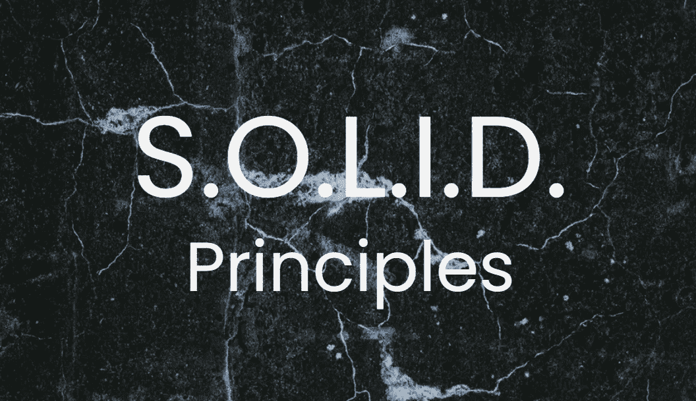
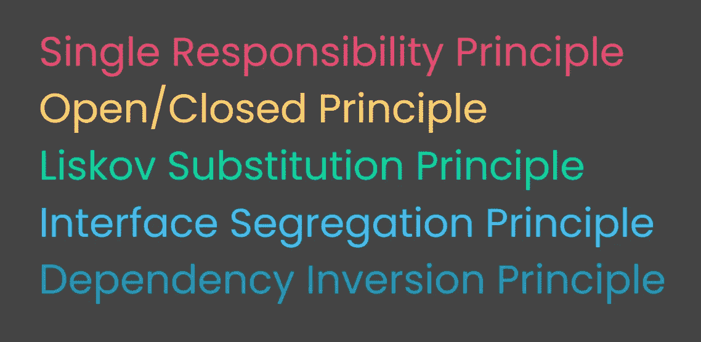

# 简单解释的坚实原则

> 原文：<https://medium.datadriveninvestor.com/solid-principles-explained-simply-eb9f94c5ea19?source=collection_archive---------15----------------------->

坚实的原则是编程的基本原则，有助于保持代码有组织和高效。SOLID 是一个缩写词，代表面向对象编程的五个原则。缩写如下。

The principles behind the SOLID acronym

# 单一责任原则

单一责任原则规定一个类必须有且只有一个改变的理由，因此是单一责任。这个原则涉及到内聚性，在软件工程中内聚性意味着模块或类中源代码的各部分功能的相关程度。

例如，假设我们正在构建一个生产力应用程序，包括待办事项列表、时间表和计时器。我们可以在一个类中制作整个应用程序，但这不会很好地组织或有效，并且会将许多彼此非常不同的功能组合在一起。相反，为我们的待办事项列表、计时器和日程表创建单独的类会更好。我们将使用每个类来控制与程序功能相关的信息。我们不会将名为 setTimer 的函数或方法放在 to-do list 类中，因为这不是与该类功能最相关的领域。这个函数将属于 timer 类，并且与 timer 类中的功能有更大的内聚性。

# 开/关原则

开放/封闭原则声明一个类的行为应该能够被扩展而不被修改。换句话说，一个类应该是*打开*进行扩展，而*关闭*进行修改。

例如，如果我们想创建一个程序来计算一个形状的面积，我们可以先创建一个函数来检查一个形状是矩形还是圆形，然后相应地确定面积。这样做的问题是，如果我们想找到不同形状的面积，那么我们需要修改这个类。根据开/闭原则，最好为每种形状创建一个单独的类，用自己的方法或函数来确定形状的面积。这将使程序以附加类的形式对扩展开放，以扩展程序的功能，但是程序将因修改而关闭，因为现有的代码不需要改变。

 [## 我作为软件工程师学会的 4 个关键习惯|数据驱动的投资者

### 我从事软件工程已经快 3 年了。老实说，我不认为我擅长这个(我不知道我会不会…

www.datadriveninvestor.com](https://www.datadriveninvestor.com/2020/10/12/4-key-habits-i-learned-as-a-software-engineer/) 

# 利斯科夫替代原理

Liskov 替换原则指出子类型应该可以被它们的基类型替换。这一原则背后的动机是确保当继承不适合代码时不会被使用。尽管将一个类扩展为子类可能更容易，但是如果类的功能不会被使用或者会被子类覆盖，那么就不应该使用继承。

# 界面分离原理

接口分离原则指出多个特定接口比一个通用接口更好。这个原则包括接口的内聚性和行为少的好处。根据接口分离原则，一个类对另一个类的依赖应该是尽可能最小的接口。

接口分离原则背后的思想是，如果代码实现了一个接口，那么它应该使用接口中的所有内容，并且代码也不应该依赖于它不使用或不应该访问的方法。解决这个问题的方法是保持接口较小，以最小化相互依赖性。

# 从属倒置原则

依赖倒置原则有两个部分。第一，高级模块不应该依赖于低级模块；它们都应该依赖于抽象。第二是抽象不应该依赖于细节，细节应该依赖于抽象。

这意味着高级模块不应该做低级的工作。对此的一个类比是，一家公司的首席执行官不会送货或接听客户服务电话，他们有自己更高层次的工作要做。模块和类也是如此。回到我们的生产力应用程序示例，呈现整个应用程序及其待办事项列表、日程和计时器的高级组件的类不应该负责设置日程中新事件的名称。这是调度类中较低层组件的工作。

依赖性反转原则的第二部分，在具体细节上使用抽象，有助于保持代码的灵活性。程序中硬编码的信息越多，代码中使用的具体细节越多，代码就变得越严格，其功能和用途就变得越有限。这种灵活性和代码的缺乏会使它容易出错，并且用户体验有限或很差。

## 访问专家视图— [订阅 DDI 英特尔](https://datadriveninvestor.com/ddi-intel)