# 解决方案 Janata hack-独立日-2020-ml-黑客马拉松

> 原文：<https://medium.datadriveninvestor.com/solution-janatahack-independence-day-2020-ml-hackathon-8673931d2be3?source=collection_archive---------4----------------------->

大家好，这是我为 Analytics Vidya 主办的黑客马拉松提供的解决方案。该解决方案在提交时得分为 0.83。


Photo by [Alex Kotliarskyi](https://unsplash.com/@frantic?utm_source=medium&utm_medium=referral) on [Unsplash](https://unsplash.com?utm_source=medium&utm_medium=referral)

大家好，我是塔潘，我将解释我对这次[黑客马拉松](https://datahack.analyticsvidhya.com/contest/janatahack-independence-day-2020-ml-hackathon/#About)的解决方案。当我写这篇文章时，这个分数大约在第 45 位🚩。

现在，我分享给那些刚刚入门的人。如果我哪里做错了，请在评论中告诉我。在开始之前，让我们先理解问题陈述。👍🏻

因此，问题就像研究人员可以访问大量科学文章的在线档案。因此，查找相关文章变得更加困难。标签或主题建模提供了一种方法，为研究文章提供一个标识，从而促进推荐和搜索过程。🙇🏻所以这是一个针对研究文章问题的**主题建模。**

因为它有多个标签，我们也可以说这是多类-多标签问题。如果你没有得到它，谁可能已经做了 Stackoverflow 标签预测/命名实体识别，他们可以很大程度上涉及到这个问题的陈述。

所以让我们开始吧。正如我们都知道的基础知识，有 4 个基本步骤工作在一个 ML 项目，即如下✍🏼

1.  收集数据
2.  清理预处理数据(在 NLP 情况下非常重要)
3.  建立模型
4.  测试模型>— < Tune Model
5.  Submit 😇

## **收集数据:-**

不需要担心这一步，因为我们可以从下面的官方网站获得数据。只需向下滚动，您将获得 3 个文件来下载训练、测试和样本提交。

[](https://datahack.analyticsvidhya.com/contest/janatahack-independence-day-2020-ml-hackathon/#ProblemStatement) [## Janatahack:独立日 2020 ML 黑客马拉松

### 自从三月份在该国宣布封锁以来，我们开始了为期一天的名为 Janatahack 的黑客马拉松…

datahack.analyticsvidhya.com](https://datahack.analyticsvidhya.com/contest/janatahack-independence-day-2020-ml-hackathon/#ProblemStatement) 

或者，如果你了解 Kaggle，你可以直接在这个页面上创建一个笔记本，并开始使用这些数据。

[](https://www.kaggle.com/vin1234/janatahack-independence-day-2020-ml-hackathon) [## #Janatahack:独立日 2020 ML 黑客马拉松

### 研究论文的主题建模

www.kaggle.com](https://www.kaggle.com/vin1234/janatahack-independence-day-2020-ml-hackathon) 

既然你得到了数据，让我们进行下一步。

## 清理预处理数据:-

在我们清理和处理数据之前，我们需要将数据加载到 panda 的数据框中，以便我们可以在这里执行数据操作技术。对于装货，我们只需要熊猫

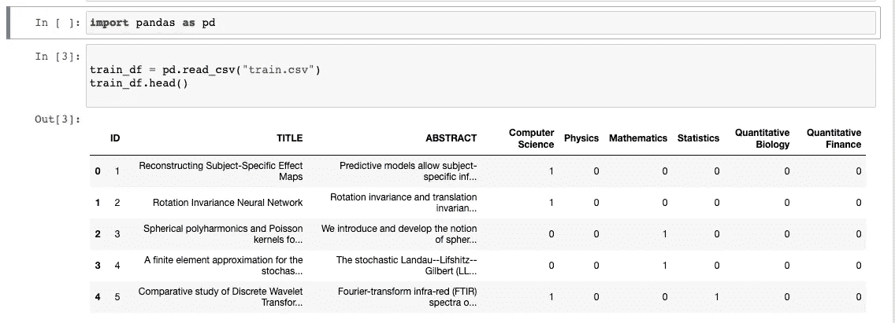

加载后，您可以看到数据框只有 9 列。最好的部分是所有的标签都已经标记化，这意味着所有的输出标签都是 0/1 格式。我们也可以在“关于问题陈述”页面中了解这些信息。这里

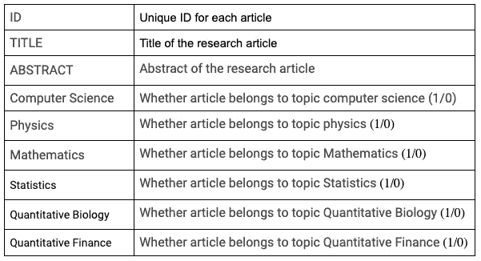

让我们清理数据。但是等等，你注意到这里很酷的事情了吗，标题和摘要都是简单的文本。为什么我们要对不同的列做同样的操作，所以让我们把它们附加在🖇下面

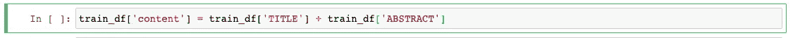

我将行称为内容，因为它包含行内容 init。现在让我们看看数据现在是什么样子，因为我们在内容中既有标题又有摘要数据，所以我们可以在这里删除标题和摘要，让我们删除这些列并将其可视化。

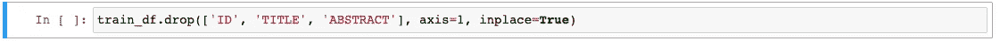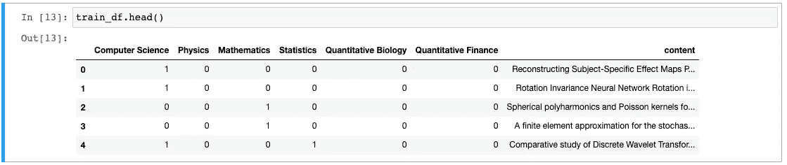

在去清洁部分之前，让我们看看第一排看起来像 nad，稍后，我们可以比较两者。

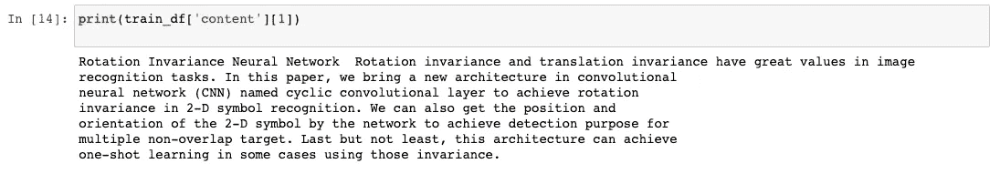

现在对于实际的清洁部分，我这里有两个函数，可能会有帮助。所以我在清理数字，是的，我在清理数字，它给了我更好的结果，然后清理特殊字符等等。

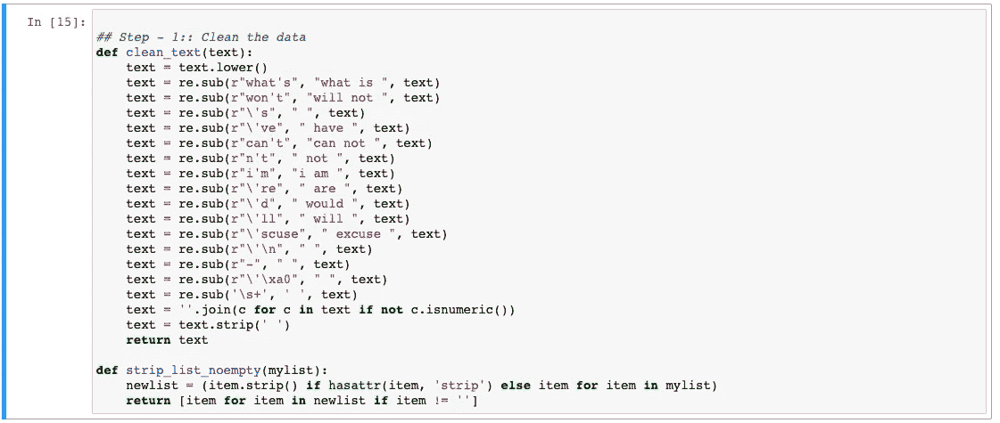

现在清理标点符号和应用这些功能。

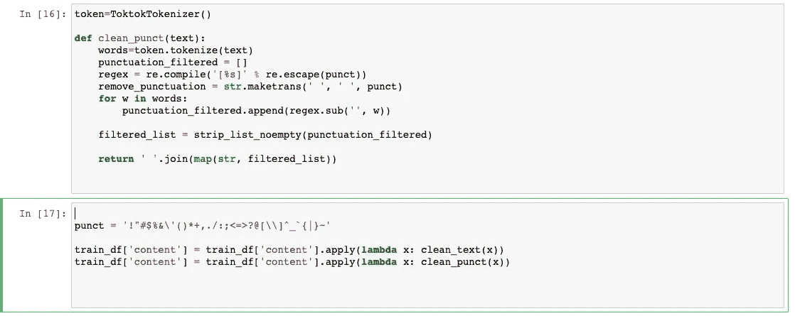

现在，在清理部分完成后，我们的数据看起来是什么样的

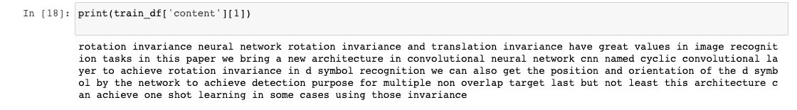

现在，用词汇化、词干化和删除停用词进行一些清理。

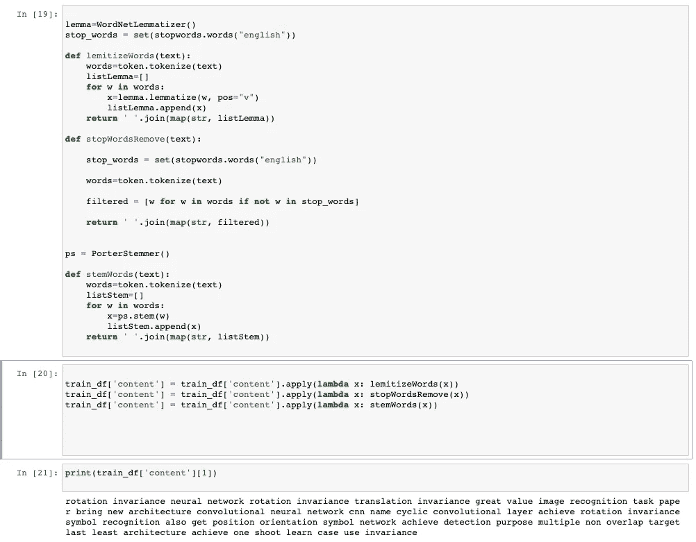

所以，伙计们，我们的数据是干净的，现在进行下一步，即建立模型

## 建筑模型:-

对于建筑模型，我们还需要做几个步骤。即🗾

1.  拆分数据
2.  为模型做好准备(矢量化)

**拆分数据**

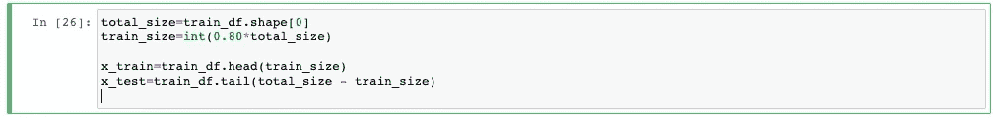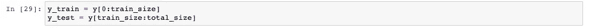

这里，我对训练和测试数据做了一个 80-20 的比率。如果你想知道 y 是什么，这里是..这是我们所有的输出列。我们可以像下面提到的那样做。

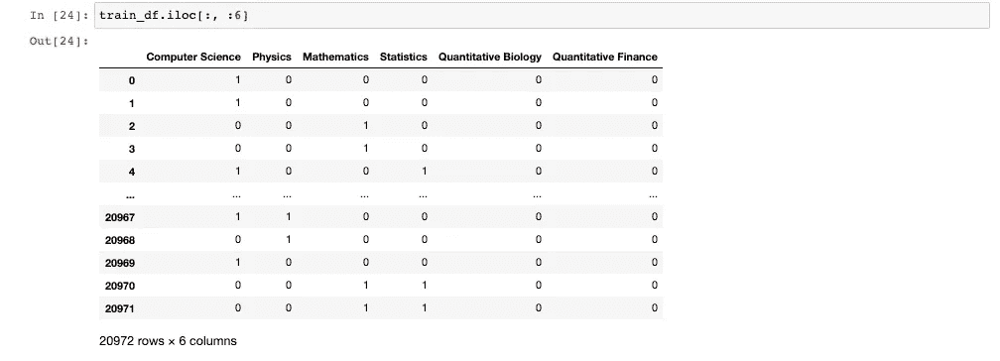

```
y = train_df.iloc[:, :6]
```

所以火车，测试样本是。

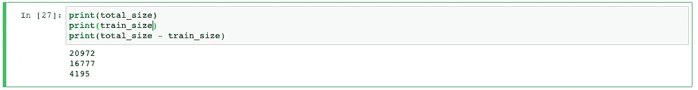

对于矢量化，我使用了 TF-IDF 矢量器，它最适合主题建模。是的，我确实试过了，Countvectorizer 对这个问题陈述不太适用。

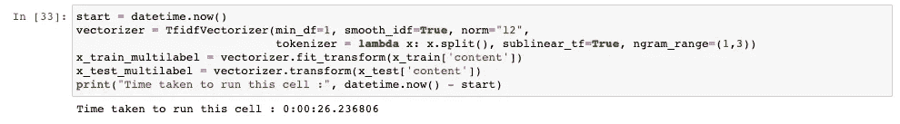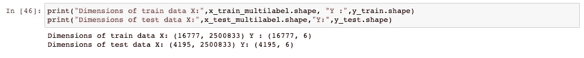

对于选择模型，由于当前的方法完全基于 ML 方法，Scikit-learn 也为此提供了一些不同的选项。如果你想了解更多关于多类多标签分类的信息，请点击下面的链接。

[](https://scikit-learn.org/stable/modules/multiclass.html) [## 1.12.多类和多标签算法-scikit-学习 0.23.2 文档

### 警告 scikit-learn 中的所有分类器立即进行多类分类。您不需要使用该模块…

scikit-learn.org](https://scikit-learn.org/stable/modules/multiclass.html) 

对于这个问题陈述，我选择 LinearSVC，即线性支持向量分类。使用 OnevsRestClassifier。

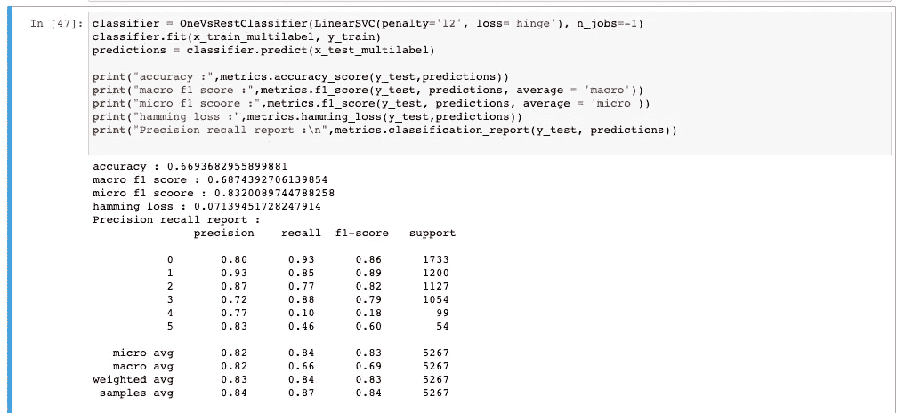

平均微观 f1 分数约为 0.83。哪一个是好的，因为这次黑客马拉松的性能指标也是 f1 分数？

## 现在让我们测试并提交:-

因为我们已经有了分类器，所以首先要确保我们也将为测试数据做所有的预处理步骤。

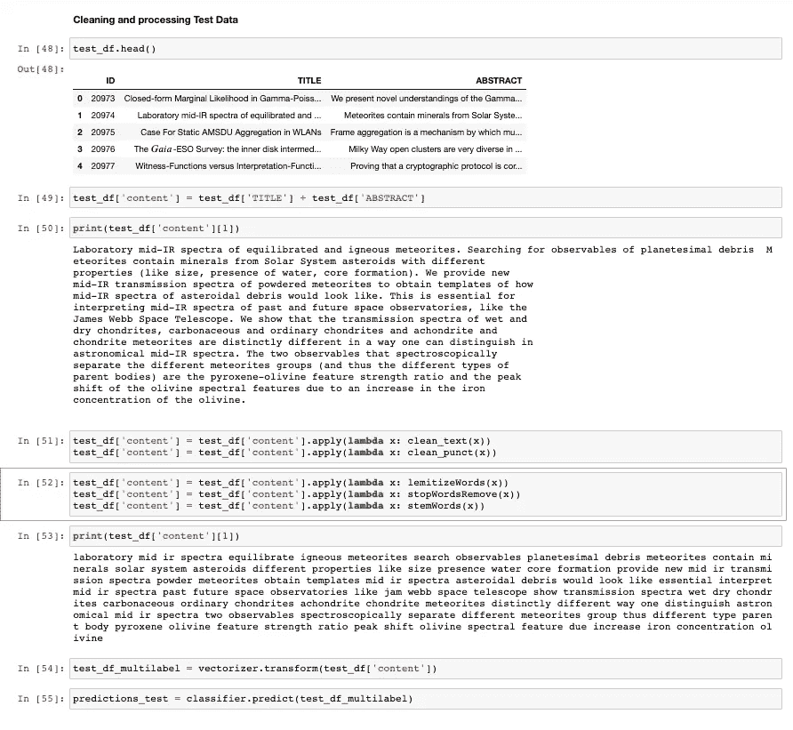

现在，在获取提交值之前，让我们看看预测问题。📌

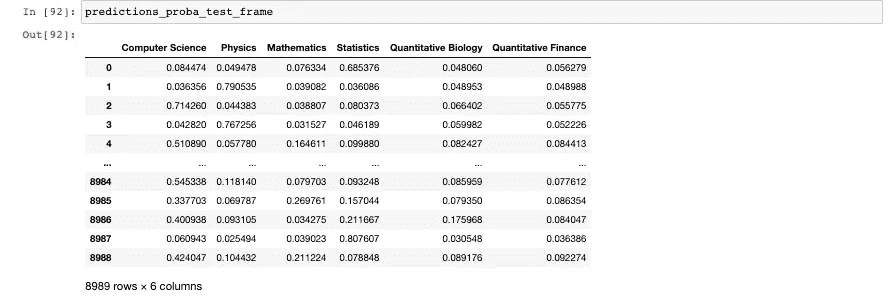

我会提供代码。所以坐下来放松一下。

现在看看我们的预测测试，它是由我们的分类器预测的。

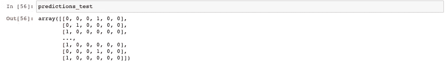

所以，这些是我创建最终提交的步骤。我知道这些步骤很长，下次我会缩短它。

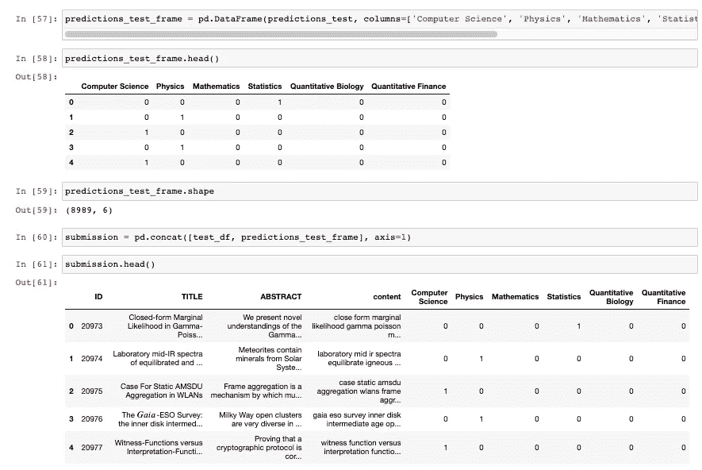

因此，由于黑客马拉松需要干净整洁的提交文件，只需要削减所有的文本数据。

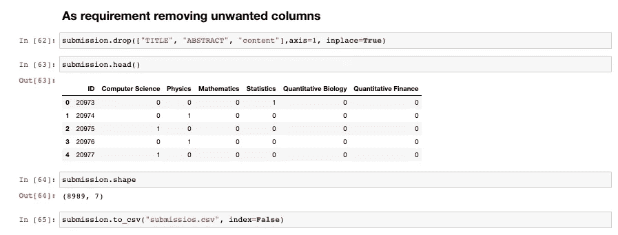

完成了。你有自己的提交文件。正如我已经描述过的，我将很快上传代码文件。

感谢您阅读这方面的内容。

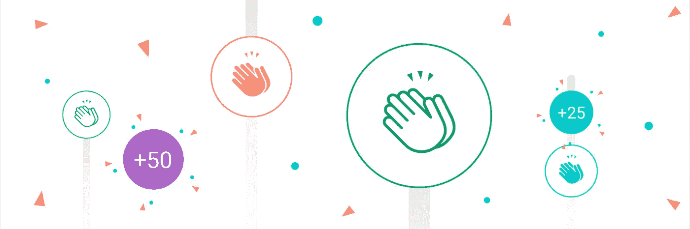

如果你喜欢这篇文章，请一定要鼓掌。请关注我的 Github 和我的 medium 个人资料上的更多项目和文章。

[](https://github.com/tapanKumarPatro) [## tapanKumarPatro -概述

### 北极代码库贡献者解散在 GitHub 上注册你自己的个人资料，托管代码，管理…

github.com](https://github.com/tapanKumarPatro) [](https://medium.com/@tapankumarpatro05) [## Tapan Kumar Patro -中等

### 阅读塔潘·库马尔·帕特罗在媒介上的作品。机器学习工程师、软件工程师@ Atmecs Technologies…

medium.com](https://medium.com/@tapankumarpatro05) 

不要忘记查看 Android 应用程序开发深度学习项目的端到端部署。

[](https://medium.com/analytics-vidhya/end-to-end-deep-learning-based-app-af67d4008550) [## 基于深度学习的端到端 app。

### 聪明烹饪

medium.com](https://medium.com/analytics-vidhya/end-to-end-deep-learning-based-app-af67d4008550) 

谢了。如有任何疑问，请留言。