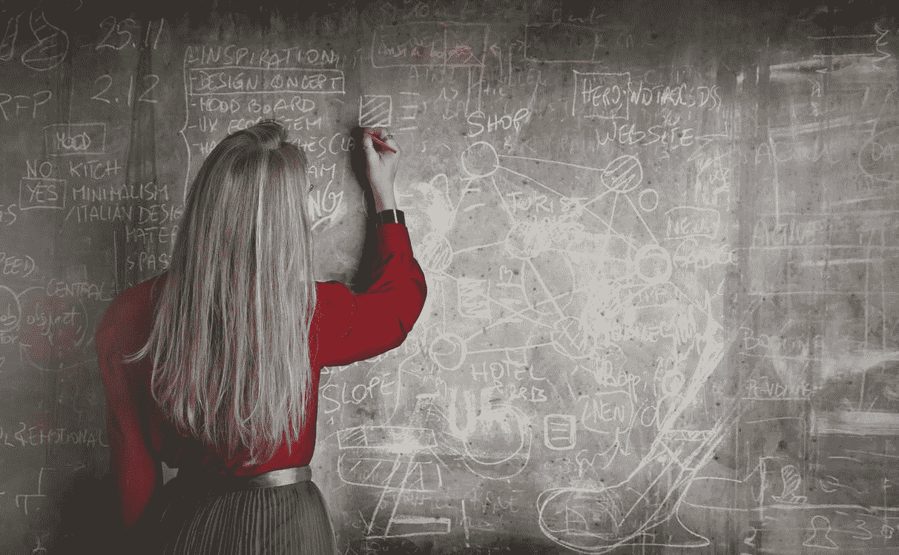
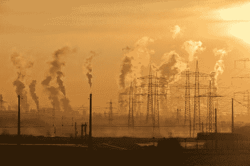
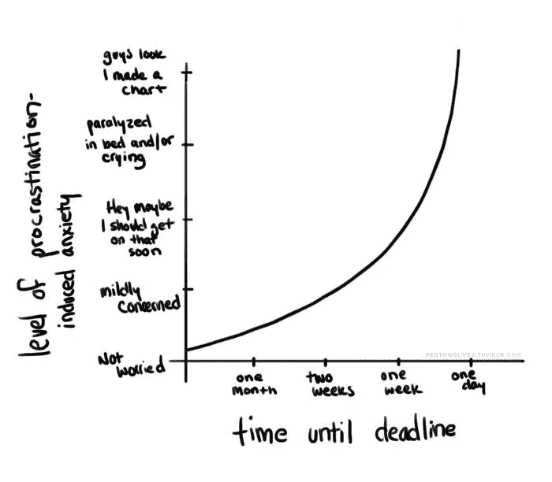
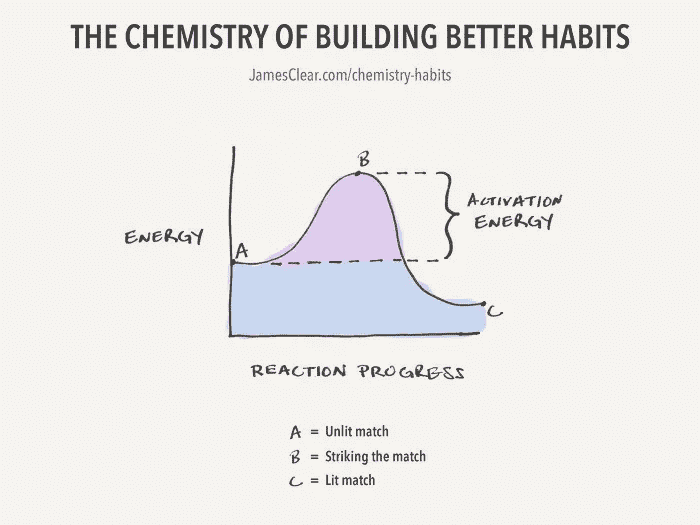
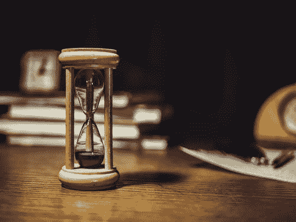
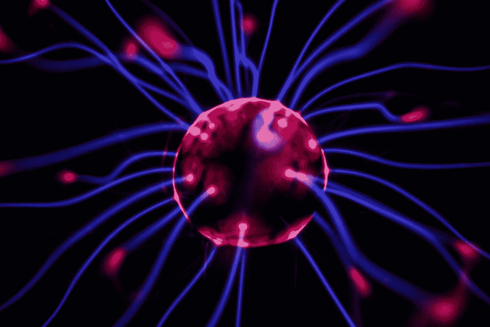

# 尽快解决大问题:一些值得思考的问题

> 原文：<https://medium.datadriveninvestor.com/solving-big-problems-soon-some-food-for-thought-ecb517691fdc?source=collection_archive---------10----------------------->

Credit goes to Andrea Piacquadio on [Pexels](https://www.pexels.com/photo/woman-in-red-long-sleeve-writing-on-chalk-board-3769714/).

在参加了麻省理工学院的艰难技术峰会后，我有了写这篇文章的灵感。我同时参加了我的虚拟课堂，所以，不幸的是，我不能一直呆在这里——然而，我呆在这里的那一点是 ***难以置信的有价值。*** *我感谢《引擎》的凯蒂·瑞伊，还有玛丽安娜·马祖卡托、汤姆·卡莉尔、伊兰·古尔和其他许多人，让我们有了这次经历——我还要感谢我的导演们，尤其是 TKS 的迈克尔，让我们有机会参加这次峰会。这确实是我今年一直感激的事情。*

*这篇文章尤其受到了凯蒂·蕾的开场白的启发。我目前正在做更多的研究，以扩展我从她与 Mariana Mazzucato 和 Tom Kalil 的政府+公共政策炉边谈话中获得的信息！*

话虽如此，享受这篇文章吧！

我们都在等待太久来解决一切。随着气候变化，我们总是期待着一个立即的解决方案来找我们，这将神奇地抹去我们生病的星球的每一个症状。在我们当前的全球疫情期间，我们都只是在等待一种疫苗，看着公司在这方面的下一步行动——我们被留在一种不作为的未知状态中——这根本不是一种好的感觉。

我们必须尽快开始。诸如当前的疫情和持续的气候变化威胁等问题都是我们忽视行动呼吁的结果。我们太害怕接近它，最后，它变得更糟。

Credit goes to Pixabay on [Pexels](https://www.pexels.com/photo/air-air-pollution-climate-change-dawn-221012/). **Our planet is literally burning up.**

考虑拖延一个大项目——一个需要三周时间的项目。在开始的时候，你感觉到你有很多时间，结果，你没有花时间。然而，随着截止日期的临近，你开始想“哦，妈的，这真的很难。”然而，你忽略了它，因为它看起来越难，你就越倾向于不去做。在最后一天，你意识到你必须开始工作，截止日期是明天*。*你可能最终完成了，但它并没有真正解决任何问题——你最终得到了一个糟糕的结果。

A quite accurate representation of how projects end up going whenever I procrastinate to the absolute last minute. ***Well, at least I finish?*** *Source:* [*The Poke*](https://www.thepoke.co.uk/wp-content/uploads/2012/04/procrastination.jpg)*.*

就目前人们对大问题的态度而言，我担心这可能是结果——除了后果远远大于分数低——它会影响我们自己和我们后代的未来。

我们目前有联合国制定的 16 个可持续发展目标，一个全球性的疫情，手头上有太多的问题。我们如何开始解决它们？如果你认为你那 15 页的物理 frq 让人不知所措，那就等着看这些吧。这足以让任何人崩溃。

如果你准备好了，那就不一样了。**为了产生影响，人们首先必须开始行动。首先，我们必须有勇气。**

根据韦氏词典的字典，勇气被定义为“敢于冒险、坚持不懈、经受危险、恐惧或困难的精神或道德力量”。这不是什么大不了的事，**我是被选中的征服者**——任何人都可以做到。这种精神和道德力量的积累是这一旅程的关键部分。

Building a good habit — or in this case, getting into the flow of solving a problem — is often the hardest to start. Think about the activation energy required to catalyze a chemical reaction — it becomes natural once we surpass a certain threshold. Source: [James Clear](https://www.google.com/url?sa=i&url=https%3A%2F%2Fjamesclear.com%2Fchemistry-habits&psig=AOvVaw2QX8IumyBv9ypjnP-kD38U&ust=1606624201955000&source=images&cd=vfe&ved=0CAIQjRxqFwoTCOCdstmzpO0CFQAAAAAdAAAAABAN) (I love his blog!).

在鼓起勇气开始之后，我们试图理解这个问题的范围。

要做到这一点，你必须首先对手头的问题有更广泛的理解。**这就是我们所说的“深度领域专业知识”**他们对手头的大问题有一个基本的了解——这通常包括对表征问题的每一个可能的事物进行大量的研究。

然而，让其他领域的人参与到这种解决问题的方法中来也很重要。你通过它建立了更多的视角。想想所有的跨学科研究——你有人工智能和在生物学中的大量应用，你有生物物理学，你有量子化学和物理学的整合，以便从根本上了解整个自然，等等。没有协作，你不可能有这些项目——要开放。

走出你的空间也提供了一个很好的视角。芭芭拉·奥克利(Barbara Oakley)在她的书《数字思维》(A Mind for Numbers)中描述了一种扩散模式的考试策略——当你的大脑开始从大局而不是封闭的角度看待问题时——你在测试手册上看一个问题大约两分钟，如果你不能立即解决它，你就继续前进。当你在测试中解决其他你觉得更舒服的问题时，你会注意到你自然而然地有了解决这个问题的直觉。困在同一个区域是低效的，这就是为什么这么多问题解决者走出了他们的空间。四处走走，做些运动，*进入一个不同的环境*——你会发现你会从不同的角度看待你的方法。

基于所有这些方法的积累，并通过实验和实际应用采取行动，您可以最终实现一个解决方案框架，它将有效地解决您关注的问题。

Credits to [**Mike**](https://www.pexels.com/photo/brown-hourglass-on-brown-wooden-table-1178684/)on Pexels.

然而，这一过程非常耗时——有些人花了几十年时间试图解决一个难题。在这种情况下，提出逻辑和非欧几何的理论可能是允许的。

但是就目前的世界形势来看，我们正处于紧要关头。 *我们需要把这个框架放大 100 倍，以我们的方法和速度去做。*

在现代情况下，没有早期的慈善事业、年复一年的实验室、风险资本和政府资助，真的很难产生影响。后者尤其辛苦。

那么，我们如何实现这一目标呢？我们争取更多的支持，我们需要政府的支持，以应对我们将面临的不可避免的灾难，因为我们已经等待了太久，而且还需要一定的时间。我们必须做到这一点，这样**我们才能创造机会，让每个人都能参与解决问题。**记住，这是*的集体努力。*我们投入的🧠-power 越多，解决方案就越有效。

Credits to [Josh Riemer](https://unsplash.com/photos/OH5BRdggi2w) on Unsplash.

随着美国新一代的崛起，出现了显著的趋势。这些人受教育程度最高，最多样化，也最愿意解决这些难题。结合老一辈的努力，我们将能够在如何建立我们的世界方面建立一个巨大的转变——我们将为我们的未来创造一个更美好的世界。

想想看:如果这是美国人的新转变，想象一下世界其他地方🌐？如果我们把每一个能够提供一些观点的个人的集体努力放在一起，并把它提高到最佳效率，我们可能不会在*很快*完成——但我们肯定会更快。

这样做，我们最终可以“为我们自己和我们的后代建立普遍的福利”

# 来源

 [## 解决一个真正棘手的问题需要的三样东西

### 创新由格雷格 Satell，作者，测绘创新@数字通至 20 世纪初，世界上伟大的…

www.inc.com](https://www.inc.com/greg-satell/how-to-solve-a-really-tough-problem-in-3-not-so-easy-steps.html)  [## 活化能和建立更好习惯的化学过程

### 化学中有一个概念叫做活化能。它是这样工作的:活化能最小…

jamesclear.com](https://jamesclear.com/chemistry-habits)  [## 拖延图

### 时间浪费了

www.thepoke.co.uk](https://www.thepoke.co.uk/2012/04/24/procrastination-graph/)