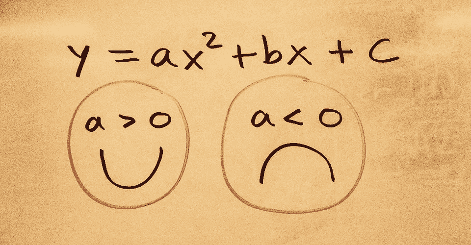

# 用微分学解决数学优化问题

> 原文：<https://medium.datadriveninvestor.com/solving-mathematical-optimization-problems-with-differential-calculus-data-driven-investor-f04b71d7d896?source=collection_archive---------3----------------------->

## 看看微积分的基本用途，以及它所能提供的令人难以置信的洞察力

微积分可以说是历史上最有影响力的数学发现，在物理学、经济学、工程学、生物学等等领域都有应用。微积分有两个分支:微分学；积分学。前者与瞬间的变化率作斗争；后者具有函数和 x 轴之间的区域。

在这篇文章中，我们将着眼于差异风味，更重要的是，着眼于它的众多应用之一:优化。优化包括找到一个函数的最小值或最大值的*。每当你需要最大化或最小化某个数量时，你都可以使用这个技巧:求一个盒子的 *max* 体积；计算一个球体的*最小*成本；估计*最少*的行程时间。*

微分学的强大之处在于，我们可以求出一个瞬间的变化率(形象地说，这是函数上一点的切线)。这反过来允许我们揭示函数的特征——极值、拐点、凹度和单个点的行为。

在优化问题中分析函数的关键概念是找到**极值**(最小值和最大值)。既有**全局**又有**局部**极值。

视觉上，每当我们有**谷**或**山**的时候，都是局部最小值或最大值；如果这是我们函数的整个定义域中最低的谷或最高的山，它就是全局最小值或最大值。**极值定理**指出，在一个封闭的区间上，总会有一个最小值和最大值。最高和最低值也可能在端点处。

当数值分析一个函数时，确定极值点有一个两步过程。首先，取函数的一阶导数，并将其设为 0。然后你解这个方程，它会给你所有可能是极值的值。然后计算函数的二阶导数。这只是你之前找到的一阶导数的导数。您插入之前找到的每个值，并执行**候选人测试**。

考生测试允许你确定函数上的一个点是最小值、最大值还是拐点(图形凹度变化的点)。

如果 *f'(x) = 0 且 f''(x) > 0，则 x 为最小点*

如果 *f'(x) = 0 且 f''(x) < 0，则 x 为最大值点*

如果 *f'(x) = 0 且 f''(x) =0，则 x 为拐点*

通过使用一阶导数测试和候选测试，我们可以精确地确定函数的最小值和最大值在哪里，以及图形在这些点的行为。这是非常有用的，并且是允许我们容易地评估和解决最优化问题的技术。

优化问题是你的任务是发现一个函数的最优值(即最小值或最大值)。你想**优化**给定场景的函数:什么是*最大*利润率；我们需要雇佣的最少*人数是多少；我们最多可以种植多少株植物？通过确定一个代表特定场景或条件的函数，您可以优化它。现在，您可以使用之前演示的微积分来找到最佳值。*

这里有一个例子，展示了最优化在经济学中的应用。

对某种商品的需求可以建模为*Q(x)= 10–0.001 x。Q*是以美元表示的价格，而 *x* 是售出的单位数量*。*

生产 *x* 件物品的总成本可以表示为函数 *C(x) = 50 + 5x。*

利润最大化的生产水平是多少？

设 *P(x)* 代表商品的利润函数。

*P(x) = xQ(x) — C(x)* 。现在，代入这些函数的值，我们得到*P(x)= x(10 0.001 x)(( 50+5x)= 5x 0.001 x 50。*

我们现在对 *P(x)* 求导:*P '(x)= 5 0.002 x .*设这个等于 0，我们可以看到 *x = 5/0.002 = 2500* 。所以，x = 2500 是一个兴趣点。使用候选人的测试，我们可以评估这是一个最小值还是一个最大值(或者两者都不是，正如你将在某些情况下看到的)。

*P ' '(x)=-0.002。P''(x) < 0* ∴ x 处于最大值。我们可以得出结论，为了利润最大化而生产的单位数量是 2500。这是微积分的威力和现实世界中最优化问题使用的一个小例子。

有无数的问题需要使用优化和微积分提供了一种方法来分析这些问题并找到解决方案。精确描述函数行为的能力提供了令人惊讶的洞察力和能力。微积分改变了我们看待世界的方式，并为理解一些最复杂的现象提供了基础。但有时，我们真正需要的是用它来乐观一点。

*原载于 2020 年 6 月 15 日 https://www.datadriveninvestor.com***。**