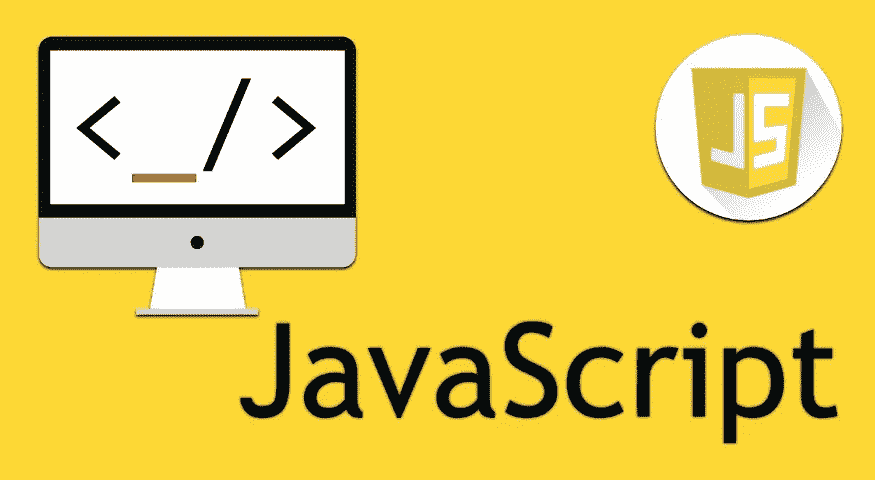

# 一些 Javascript 技巧解决了问题

> 原文：<https://medium.datadriveninvestor.com/some-javascript-tricks-solved-problems-692e39cad228?source=collection_archive---------19----------------------->



## JavaScript 是一种解释型、轻量级或实时(JIT)编译的编程语言，具有一流的功能。任何类型的问题都可以通过这种语言解决。

1.  **空 vs 未定义:**

**空:**

空值用于表示故意缺少值。它代表一个值未定义的变量。它只接受一个值，即 null。null 关键字用于在 TypeScript 中定义 Null 类型，但它并没有什么用处，因为我们只能给它赋一个 Null 值。

```
var myVar = null;console.log(myVar);// null
```

**未定义:**

了解 JavaScript 中未定义的编码非常重要。下面描述了许多获得未定义的方法。

*   *如果没有设置任何变量的值，就会发现 Undefined。*

```
let banana;console.log(banana)// undefined
```

*   *如果我们不在函数中声明 return，那么就会发现 undefined。*

```
function sum(price1, price2){console.log(price1 + price2)}const result = sum(34, 12);console.log(result);// undefined
```

*   *当我们写返回值但没有给出返回值时，那么它就是未定义的。*

```
function sum(price1, price2){console.log(price1 + price2)return}const result = sum(34, 12);console.log(result);// undefined
```

*   *当你不传递任何函数参数时，你会得到 undefined。*

```
function sum(price1, price2){console.log(price1 + price2)return sum}const result = sum(34,);console.log(result);// 34, undefined
```

*   *声明变量时，如果读取对象的属性，则是未定义的。*

```
const firstProduct = {name:”computer”, price:1200};console.log(firstProduct.quantity)// undefined
```

*   *声明变量时，如果读取对象的属性，则是未定义的。*

```
let funCode = undefinedconsole.log(funCode)// undefined
```

2.**双倍相等(==) vs 三倍相等(===):**

这两种类型运算符是…

*   双等号运算符(==):称为等式或*抽象比较*运算符
*   三元等于运算符(===):称为恒等式或*严格比较*运算符

== '在执行比较之前将变量值转换为相同的类型。这称为类型强制。同时，===不做任何类型转换(强制),仅当被比较的两个变量的值和类型都相同时，返回 *true* 。

例子，

```
var number= 2;
var number1 = 2;
var string = "2"; console.log(number ==  number1);  // true
console.log(number === number1);  // true
console.log(number ==  string); // true
console.log(number === string); // false
```

## 解决问题:

*   **反转一串**

```
// Using for loop with variable decreament from last to first
function reverseStr(*str*) {
   let newStr = "";
   for (let i = *str*.length - 1; i >= 0; i--) {
      newStr += *str*[i];
   }
   return newStr;
}console.log(reverseStr('Bangladesh'));
// hsedalgnaB
```

*   **使用 for 循环计算一个数的阶乘**

```
function factorial(*num*) {
    // 0 or 1 factorial is always 1 if (*num* === 0 || *num* === 1)
       return 1;
    for (let i = *num* - 1; i >= 1; i--) {
 *num* *= i;
    }
    return *num*;}
console.log(factorial(5));
// 120
```

*   **从数组中移除重复项**

```
// Using Set method
let names = ['Asit', 'Kumar', 'Sam', 'Asit', 'Kumar', 'Nusrat'];let uniqueNames= [...new Set(names)];console.log(uniqueNames);
// ['Asit', 'Kumar', 'Sam', 'Nusrat']
```

*   **寻找数组中最大的元素**

```
const arr = [1, 5, 7, 3, 11, 9, 99, 57];let largest= 0;for (i = 0; i <= largest; i++){
    if (arr[i]>largest) {
        largest=arr[i];
    }
}console.log(largest); // 99
```

*   **使用 while 循环计算一个数的阶乘**

```
function factorial(num) {
  let result = num;
  if (num === 0 || num === 1)
      return 1;
   // When num is less than 1, looping is stopped
  while (num > 1) {
      num--;
     result *= num;

}
  return result;
}
factorial(5);
 // 120
```

*   **在递归函数中计算阶乘**

```
// factorial function runs itself until finished
function factorial(x)  {

    if (x === 0)  {     
        return 1;  
    }   
    return x * factorial(x-1);
}
 console.log(factorial(5));
 // 120
```

*   **检查一个数是否是质数**

```
// Using ES6 syntax
const isPrime = *num* => {
   for(let i = 2; i < *num*; i++) {
     if(*num* % i === 0)
         return false;
   }
   return *num* > 1;
}
console.log(isPrime(10));
 // falseconsole.log(isPrime(5));
 // true
```

## 访问专家视图— [订阅 DDI 英特尔](https://datadriveninvestor.com/ddi-intel)