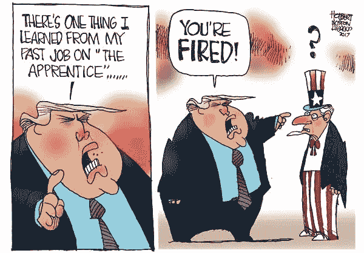
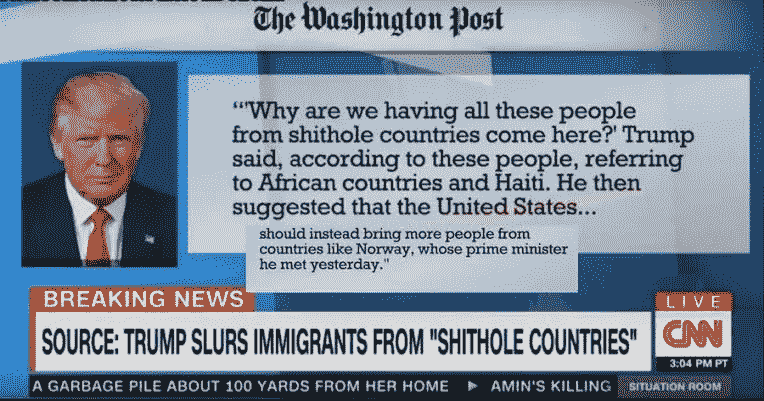
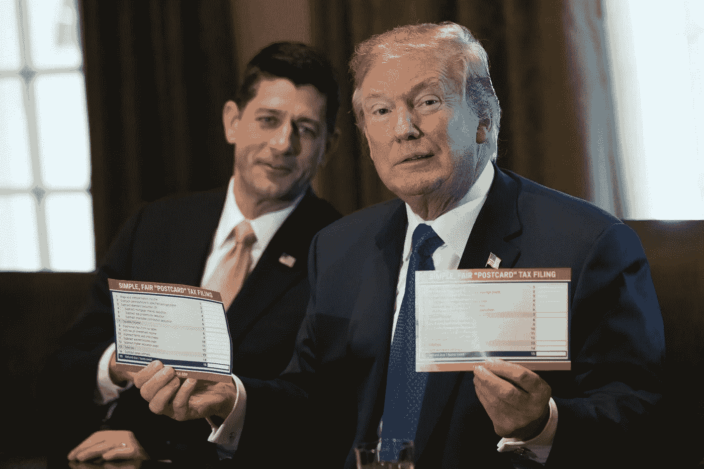
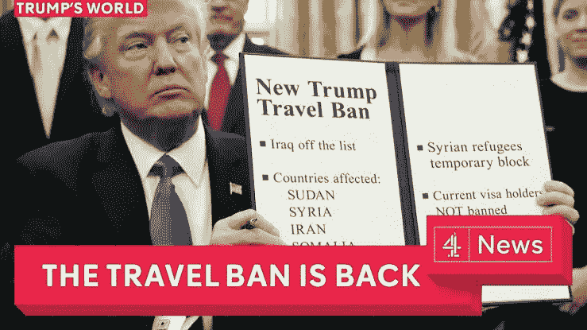
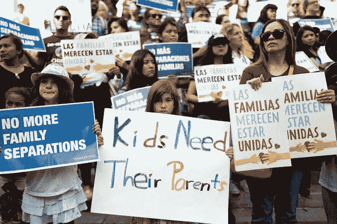
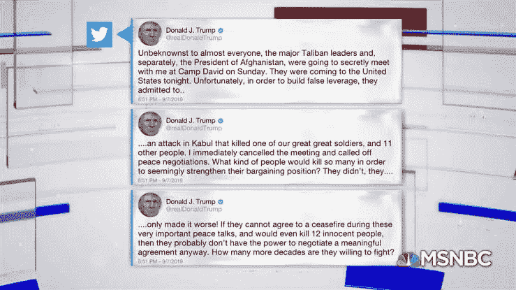
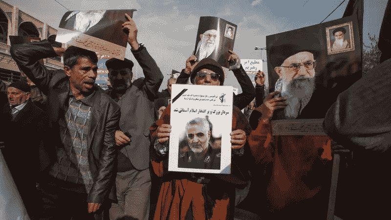
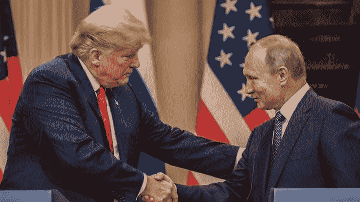

# 特朗普的一些最糟糕的举动，从他在推特上的惨败到对新冠肺炎·疫情的处理。

> 原文：<https://medium.datadriveninvestor.com/some-of-trumps-worst-moves-from-his-twitter-fiasco-to-the-handling-of-covid-19-pandemic-c38122070a01?source=collection_archive---------4----------------------->

2017 年 1 月 20 日中午，唐纳德·约翰·川普与希拉里势均力敌，就任美国第 45 任总统。在成为总统之前，他是一名商人和电视名人。作为电视名人和商人，他知道如何基于谎言进行营销。因此，当他试图进入政界时，他带来了这种长处。

特朗普也是一个很好的演说家。部分原因是他的修辞技巧帮助他战胜了成为共和党候选人的可能性。他的运动获得了大多数中产阶级家庭的支持。它遭到了民主党人、一些共和党人、商人、一些世界领导人和教皇的反对。

以下是他做过的一些最糟糕的事情

The Washington post

特朗普在白宫与两党参议员会面时，将海地和非洲国家称为“狗屎国家”。联合国人权办公室表示，这些言论如果得到证实，将是“令人震惊和可耻的”以及“种族主义的”，而海地外交部长召见了美国代办罗宾·迪亚洛(Robin Diallo)进行澄清。

Paul Ryan tax postcard

无论是在竞选期间还是当选后，他都拒绝向公众公布自己的纳税申报表。他是 40 多年来第一位向美国公众隐瞒其财务信息的总统

Trump and the travel ban

他签署了后来被称为“旅行禁令”的行政命令，禁止七个穆斯林占多数的国家的公民在 90 天内进入美国，同时无限期阻止叙利亚难民入境。特朗普的旅行禁令仍然允许来自其他穆斯林占多数的国家的游客，他在这些国家拥有广泛的商业利益，如沙特阿拉伯和土耳其。

Family separation immigration news

他在南部边境将移民儿童与其家庭分离的政策是一场可以避免的悲剧。对非法越境采取零容忍政策没有错。但他的政府未能预测和准备如何处理移民家庭是一个重大疏忽。

Trump lies about coronavirus

他不断向美国人灌输关于新冠肺炎·疫情的谎言。他声称这是一种暂时的流感，会在温暖的月份消失。他说，如果经济继续关闭，自杀死亡人数将远远超过病毒致死人数。他指责墨西哥造成了西南部的新冠肺炎巨浪。他还声称，美国是“世界上死亡率最低的主要国家之一”，而且疫苗将在即将到来的选举前准备好，等等。

Trump tweet illegal voting

他声称在没有证据的情况下，2016 年大选中有 300 万张非法选票流向了希拉里。Politifact 和 Snopes 都驳斥了这一说法——Snopes 表示“‘300 万非公民’也可能是凭空捏造的。”这一数字似乎源自 InfoWars 的一篇文章，该文章试图解释唐纳德·特朗普(Donald Trump)以 290 万张选票输掉普选的原因。

Trump tweets after cancellation of Taliban talks

他在一系列推文中宣布，他计划在戴维营会见塔利班领导人，进行和平谈判。但特朗普不得不取消与原教旨主义团体的会晤，因为他们在喀布尔的袭击造成一名美国士兵和几名平民死亡。

Assassination of Soleimani

在没有提前通知国会的情况下，特朗普下令空袭，杀死了伊朗将军卡西姆·苏莱曼尼，引发了对伊朗战争的担忧。特朗普表示，他认为苏莱曼尼计划“对美国外交官和美国人员进行迫在眉睫的邪恶袭击”，但国防部长马克·埃斯珀表示，特朗普“没有举出具体的证据”

Trump Putin BBC

他和弗拉基米尔·普京在赫尔辛基举行的新闻发布会令人尴尬。在他与俄罗斯总统会晤之前，俄罗斯试图在英国领土上使用违禁化学武器暗杀一名持不同政见者，并起诉 12 名俄罗斯人干预 2016 年选举。特朗普没有谴责这些行为，而是在自己的情报界问题上公开站在普京一边。

多年来，特朗普总统犯了很多错误。他也实施了许多有用的行动，但这些错误远远超过了良好的工作。特朗普上任第一年结束时，民意调查显示他是美国历史上最不受欢迎的总统。他在竞选和总统任期中说了许多虚假和误导的话。这些事情都被事实审查员记录了下来。截至 2019 年，特朗普重复次数最多的虚假陈述在他担任总统期间都重复了 100 次以上。目前，美国人对他的不信任正在增加，这是很自然的。我觉得危机是构建政治家叙事的决定性因素。在危机情况下，由于情感因素，政治家的所作所为或所说的话会增加他们政治生涯的价值。

## 访问专家视图— [订阅 DDI 英特尔](https://datadriveninvestor.com/ddi-intel)