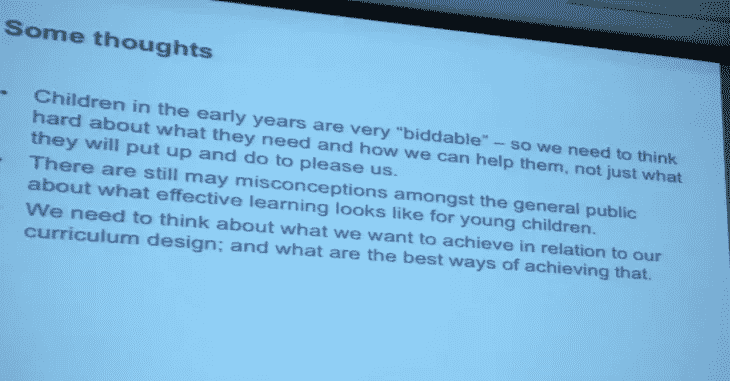

# 有些人说他们没有从大学学到任何东西

> 原文：<https://medium.datadriveninvestor.com/some-people-say-they-didnt-learn-anything-from-university-84158730871e?source=collection_archive---------16----------------------->

## 我是不会撒谎的。因为我的大学，我已经成为一名释义大师。

我目前的工作在 1 月 30 日结束，**我的下一份工作要到 9 月 1 日才开始。但不知何故，在没有任何帮助的情况下，我应该有能力支付两个月的医疗保健、房租和账单？这是学术界不是为穷人设立的又一个例子。**

Picture By The Business

让我告诉你我从计算机工程专业毕业后，以及大约 7-8 年后的不同想法；第一:我在大学里没有学任何东西来做我的工作。

1.  在我上大学的日子里，我几乎读了所有我想读的书，有时甚至会影响到我在 T21 的主课工作。我终于毕业了。**我** **没有**’****从** **我的**历程中学到了**但是我从**广泛阅读**中学到的****的一些东西至今仍然留在我的身边。****
2.  **然而，上**大学**不仅仅是为了最终的资格吧？没有什么能取代坐在一个群体中倾听他人意见的**所学到的东西。这应该包括房间里真正了解这个主题的人！这让我想起了我仍然记得的在大学期间的一个研讨会上展示的图像。****

****

## **考虑收集更多的信息我做了什么？**

****我**曾经记更多的笔记(在**大学**)，后来**我**逐渐记少了，结果没有更差。对于**我的**博客，**我**从来没有这样做笔记。我所说的笔记是指阅读一些东西，在空白处涂鸦，写下与其他作品可能的联系，等等。最接近的是总结。**

** [## 大学教育节省 6 位数以上的 5 步法|数据驱动型投资者

### 快讯(讽刺警告):大学教育是昂贵的！即使考虑到通货膨胀，高等教育也有…

www.datadriveninvestor.com](https://www.datadriveninvestor.com/2020/09/09/a-5-step-method-for-saving-6-figures-plus-on-a-college-education/) 

## 然后我开始和我的同龄人比较——我没有 excel 那么好的工作知识，也没有任何赚钱的实用知识或真正的技能。

> 有一天，我确实联系了我的学校，询问我应该如何从这里开始学习 I GO，我得到的建议是:**部门的角色不是教授获得工作的东西，而是教授核心概念——**我同意这一点，他们做得很好。

# 这是我的反驳——核心概念，所有其他的东西都可以通过**从**互联网、书籍、课程、实践中学到..

## 找到工作后我意识到了什么？

a.只要雇主尊重某人简历中的“我读过的书**&YouTube 视频**我看过的”部分，当然可以。****

****b.我的大部分市场技能都是自学的。虽然写出来有点令人沮丧，但我在**大学** …除了**和**批判性思维之外**没有********学到** **任何有用的东西(如果只是个人而非专业的话，这可能使一切都值得)。**********

******访问专家视图—** [**订阅 DDI 英特尔**](https://datadriveninvestor.com/ddi-intel)******