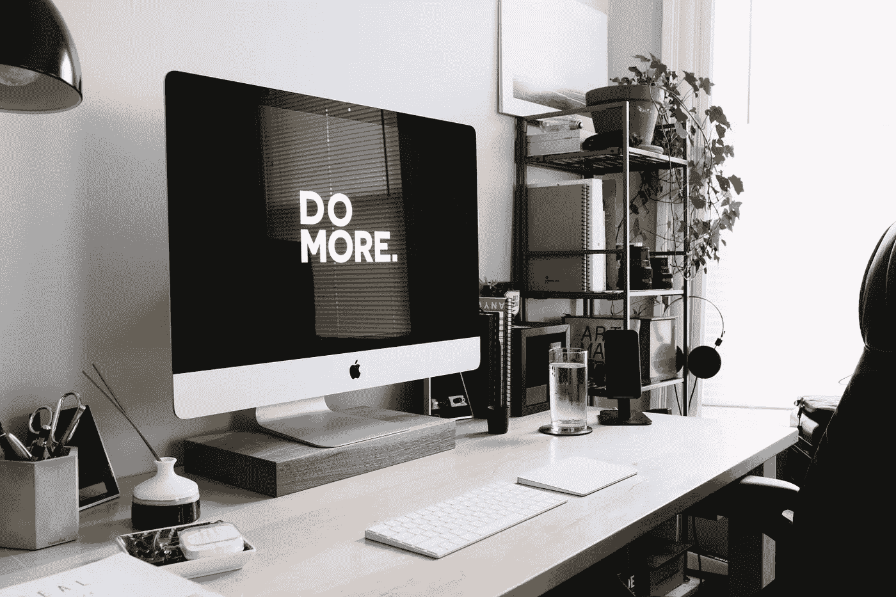

# 有些事情不值得

> 原文：<https://medium.datadriveninvestor.com/some-things-just-arent-worth-it-3a3014ea442?source=collection_archive---------12----------------------->

把废话留给凯瑟琳·脉冲器(二手灵感项目)

Photo by [JESHOOTS.COM](https://unsplash.com/@jeshoots?utm_source=unsplash&utm_medium=referral&utm_content=creditCopyText) on [Unsplash](https://unsplash.com/s/photos/frustration?utm_source=unsplash&utm_medium=referral&utm_content=creditCopyText)

二手灵感项目从一句激励性的引语开始，在创造性道路蜿蜒的任何地方冒险。

> “T 这里有两种习惯:一种让我们感到舒适，另一种如果我们停下来也会感到舒适。”——剀瑟林·帕尔斯弗

当你在寻找一个新的“生活帮”时，你希望有一个作弊代码来推动你进入这个叫做生活的游戏的下一个阶段。你想要一条新的捷径，这条捷径将引领你走向金钱、六块腹肌、充裕的空闲时间、职业发展、有意义的关系等等。

但是这里有一个秘密——有效的方法通常不是你生活中缺失的秘密途径。

最好的方法不是对你当前的实践进行彻底的改变，而是一些小的调整，这些调整会激发出渐进的改进。或者它们是微小的、有意的改变，以根除与你更大的目标和整体使命不同步的行为。

 [## 面向 Noobs |数据驱动型投资者的数字身份

### 聪明人如何在增强现实中创造身份价值？我最近刚满 40 岁。作为一个生物…

www.datadriveninvestor.com](https://www.datadriveninvestor.com/2019/02/28/digital-identity-for-noobs/) 

认识到什么不起作用是具有挑战性的。你需要真诚地看待每一件事，承认你的习惯、态度和习惯。但是这能在你的个人发展中产生关键的收获。

坏习惯就像违禁药物。他们会上瘾的。即使它们完全不合逻辑，你也会找到合理化的方法。而且一旦你开始了坏习惯，它会变得更容易重复。

有无数的书籍和方法可以改掉坏习惯。但首先，你必须清点它们，并承认它们的存在。

有些事情不值得，但有时你还是会落入他们的圈套。以下是一些常见的负面做法，它们会渗透到你的日常生活中，污染你的判断力:

# 脸皮薄。

我的同事有着惊人的职业道德，但是他的数学能力很差。为了缩小差距，他报名参加了辅导班，而不是让这件事影响他的事业。

一个好朋友最近意识到她超重了。她现在在我经常去的健身房锻炼，采取措施改善，比如在跑步机上走 20 分钟和轻度哑铃锻炼。

两者都在有意识地尝试进化。我赞赏他们的努力。但我对其他人对他们倡议的反应感到失望。

办公室的人取笑我的同事，暗示他在高中没有学习那些数学概念是愚蠢的。同样，我的朋友在健身中心听到窃笑，并注意到超级厌食症健身房老鼠评判的目光。

现代世界是肮脏的。我们这个浅薄的社会与其支持和鼓励，还不如取笑那些试图改善自己的人。我们嘲笑人们没有在一起拉屎，却在他们改正错误的时候取笑他们。社交媒体进一步放大了这个古怪的悖论。

如果我的同事和朋友脸皮薄，他们就会辞职。幸运的是，两人都积累了足够多的情感盔甲，讽刺和讽刺的言论都被他们弹开了。

允许巨魔和仇恨者阻止你完成伟大的事情会破坏你的心态。敏感是可以的，但你不能让侮辱阻碍你的个人成长。唱反调的人有害且不快乐——不要让他们把你拖进他们的痛苦中。

# 检查和回复收到的电子邮件。

电子邮件是帮助你工作的有用工具。但是不要曲解它——除非你从事某个特定的职业，处理收到的电子邮件是*而不是*你的实际工作。

如果你立即接受电子邮件请求，你最终会失去对工作和生活的控制。它会分散你的注意力，降低你的工作效率，影响你的工作表现和幸福感。

# 午休时间工作。

这个习惯不仅仅会让你显得不合群。这也是不健康的，会吸走你一天中的创造力和正能量。

离开办公桌休息一下，而不是在午餐时间埋头苦干，可以恢复精神，让你更有效率。此外，你会因为午休而错过社交和社交的大好机会。

# 整天盯着屏幕。

无论是在笔记本电脑、台式机、电视、平板电脑还是智能手机上，人类都不应该每天盯着屏幕超过 16 个小时。

除了扰乱你的视力和缩短你的注意力时间，沉迷于屏幕还会影响你的睡眠质量。定期拔掉插头是值得的。这也是避免午餐时间工作的另一个原因！

Photo by [Carl Heyerdahl](https://unsplash.com/@carlheyerdahl?utm_source=unsplash&utm_medium=referral&utm_content=creditCopyText) on [Unsplash](https://unsplash.com/s/photos/work?utm_source=unsplash&utm_medium=referral&utm_content=creditCopyText)

# 成为一个工作狂。

工作狂策略可能会带来一些成功，但也有隐性成本。当你向雇主付出太多，而一旦你崩溃，雇主会代替你时，生活会悄悄地从你身边溜走。

记住，工作狂是无法康复的——这个世界只会提供越来越多的工作，直到你过量。

# 经常把别人放在自己前面。

偶尔你必须为你的朋友、事业和所爱的人牺牲一些东西。这就是生活。

但你不能一直做社会的火种。不要为了让你的部落温暖而点燃自己——否则你将是唯一一个被烧伤的人。从长远来看，除了成为一个永久的殉道者，你还能为他人提供更多。

# 努力成为每个人的朋友。

你不必假装喜欢每个人。这尤其适用于邻居和同事。没有理由假装你和你不能忍受的人很亲密。它浪费了宝贵的时间和精力。

体面地对待住在附近的人是应该做的事情，但是如果你没有感觉到真正的联系，你不应该觉得被迫进行世俗的闲聊或者认为你需要成为他们生活的一部分。

同样，在工作中表现得专业也是意料之中的，但是如果你不想的话，你不必为午餐或快乐时光制定计划。如果你只是为了薪水而来，那就没有理由在个人层面上和任何人交往。

然而，即使你不喜欢某人，保持礼貌也很重要。拿出点风度来——不要像个傻瓜一样。

# 不听。

每个人都认为自己是很好的听众，但是大多数人都无法越过自己的声音去听别人在说什么。

这种消极的行为是一场赌博。有时你不听也不会受到惩罚，也不会面对后果。但是其他时候，你会因为看起来粗鲁而付出高昂的代价。否则，你可能会因为错过一些关键的建议或指导而付出代价。提高你积极倾听的技巧，以显示你是感同身受、积极响应和专注的。

你对完美生活帮的不懈追求可能不如发现和消除你的可疑行为重要。

有些事情不值得。除了上面列出的，你可能还有其他需要更多关注的负面习惯。只有你能决定这个。但是不管你的问题行为是什么，采取措施摆脱它们，你会发现你的生活有所改善。

阿德里安·s·波特是一名作家、工程师、顾问和演说家。他写诗歌、短篇小说和各种主题的文章，包括创造力和个人成长。他是诗集[和散文集](https://www.amazon.com/Everything-Wrong-Feels-Adrian-Potter/dp/109519061X/ref=sr_1_4?qid=1560264651&refinements=p_27%3AAdrian+S.+Potter&s=books&sr=1-4&text=Adrian+S.+Potter)[的作者。在](https://e2857002-6118-41be-9746-64261e36cacb.filesusr.com/ugd/21d2c2_03522f10c7c84340a05a8d03a97e1642.pdf)[http://adrianspotter.com/](http://adrianspotter.com/)在线拜访他。

*原载于 2020 年 1 月 30 日 https://www.datadriveninvestor.com**的* [*。*](https://www.datadriveninvestor.com/2020/01/30/some-things-just-arent-worth-it/)