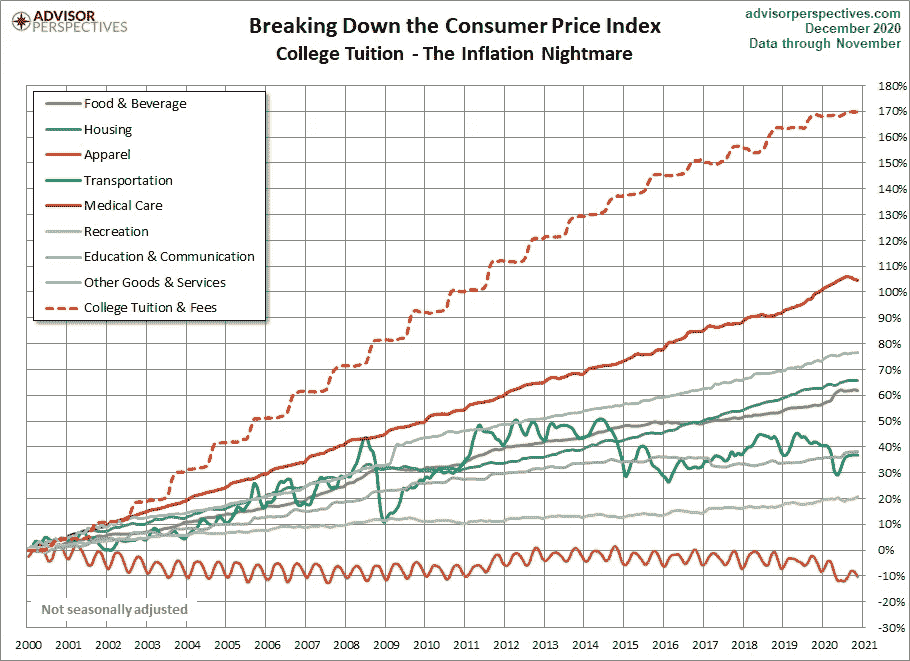
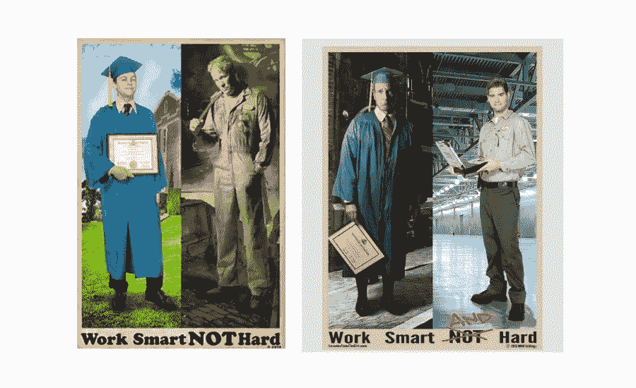

# 必须有人说:太多人要上大学了

> 原文：<https://medium.datadriveninvestor.com/somebody-has-to-say-it-too-many-people-are-going-to-college-b24f226ac1a6?source=collection_archive---------0----------------------->

## 不上大学就是失败者吗？

Photo by [Robert Bye](https://unsplash.com/@robertbye?utm_source=medium&utm_medium=referral) on [Unsplash](https://unsplash.com?utm_source=medium&utm_medium=referral)

如果你不去上大学，你就是个失败者。

我想让你再读一遍上面那句话，想一想。让你有什么感觉？对某些人来说，这可能会让你生气。对其他人来说，这可能会产生一种阴沉的理解——毕竟，这是真的。*或者是？*

不管你对它有什么感觉，你已经让这个声明为你所知。一般来说，没有人会站出来明确表示“如果你不上大学，你就是一个失败者”，但他们会以自己的方式让你知道。

有多少父母告诉他们年幼的孩子，他们有一天会上大学并变得富有？或者他们打算去上大学，然后“出人头地”。在年轻的时候，你就明白了。你也明白反过来；如果我不上大学，我就不会出人头地，也不会富有。这是一种不用大声说出来就宣布你未来失败的方式。

这是大学成功的显性和隐性营销活动的一部分。没有它，你就无法获得成功，而这对于找到一份好工作是绝对必要的。这一信息的推动使更多的人进入了四年制大学。事实上，这让美国劳动力失去了一致性。

建筑业现在存在“技能缺口”，越来越难找到愿意建造东西的人。这一点在 2019 年由美国联合总承包商进行的一项调查中得到证实，该调查显示[近 80%](https://www.agc.org/sites/default/files/Files/Communications/2019_Outlook_Survey_National.pdf) 的公司很难填补工匠职位。

虽然你可能不喜欢建筑业，但其他一些有吸引力的名字也表明，大学并不是就业的必要条件。例如，苹果、谷歌和 IBM 的某些职位不需要大学学位。谈到苹果公司，其首席执行官蒂姆·库克表示，该公司一半的员工没有受过大学教育。

大量的人上大学也使它的成本呈螺旋式上升。如果你认为医疗费用高得离谱，那么高等教育可以轻松击败它们。对于高等教育泛滥的问题，只有一个长期的解决办法:是时候让更少的人上大学了。

# 大学:高成本，低收入的工作，高需求

> “……每一届毕业生都比上一届更差。显然，这些数据讲述了一个残酷的故事。教育成本的上升和工资的持平之间存在巨大的脱节，这只会让毕业生在偿还巨额学生贷款的同时更难做到收支平衡。”
> 
> ——卡米洛·马尔多纳多，《财富》杂志

在他的文章中，卡米洛·马尔多纳多给出了无数关于当前大学毕业生前景的令人心碎的统计数据。根据 2016 年的数据，他表示，四年制大学学位的平均成本约为 10.4 万美元。相比之下，1989 年该学位的通胀调整成本约为 53，000 美元。因此，即使考虑到通货膨胀，成本也翻了一番。

然而，马尔多纳多说，工资没有跟上。虽然大学费用每年上涨约 2.6%，但工资仅上涨 0.3%。因此，高等教育的价格比工资上涨快 8 倍多。马尔多纳多说，价格上涨开始繁荣于 80 年代。

[Chart](https://www.advisorperspectives.com/images/content_image/data/6f/6fa8f295c55bcecd28b5d3242cf9c635.png) From [Advisor Perspectives](https://www.advisorperspectives.com/dshort/updates/2020/12/10/inside-the-consumer-price-index-november-2020) On Consumer Price Index

为了给你一个视角，让我们比较一下大学学费和医疗费用。大多数人会说医疗费用高得离谱，但与不断上涨的教育价格相比，这些费用就显得微不足道了。正如你在上面的图表中看到的，学费的上涨几乎使医疗费用翻倍。不过，Advisor Perspectives 确实指出，学费反映了标价，并非所有学生都需要支付这些费用。然而，毫无疑问，学费是一笔昂贵的费用。

现在，图表从 2000 年开始，但是如果你再往前追溯一点，故事会变得更有趣。道格·肖特在《商业内幕》的[文章](https://www.businessinsider.com/college-and-health-cost-versus-income-2011-3)中展示了从 1980 年到 2000 年的成本。在此期间，医疗费用上涨了约 250%，而大学学费上涨了近 600%。正如马尔多纳多提到的，价格似乎在 80 年代左右开始飙升。

你可能会问，为什么价格会飙升。需求。大学已经从一小部分人做的事情变成了现在普通人做的事情。另外，你可以获得永无止境的贷款。

> “……在整个 1950 年至 1991 年期间，大学适龄人口的比率增加了一倍或两倍，其中大部分增加发生在 20 世纪 80 年代。1950 年，只有 30%的 18 岁和 19 岁的学生入学，而 1991 年这一比例为 60%。20 至 24 岁的学生的入学率从 1950 年的 9%上升到 1990 年的 30%……——[美国教育 120 年:统计画像](https://nces.ed.gov/pubs93/93442.pdf)，国家教育统计中心

现在，快进到 2019 年，根据美国劳工统计局的数据，66.2%的高中毕业生进入了学院或大学。突然间，你就能明白为什么建筑公司很难招到人，而大学可以想收多少就收多少。

# 成为高薪垃圾的机会

Mike Rowe’s New Take On A Poster In His High School — [Food Engineering Magazine](https://www.foodengineeringmag.com/articles/96810-mike-rowe-thinks-more-kids-should-skip-college)

> “大学学费的上涨速度超过了食品、能源、房地产和医疗保健的价格。学生贷款债务是美国第二高的消费者债务类别，有超过 4400 万借款人，他们总共欠下超过 1.5 万亿美元。根据美国劳工统计局(Bureau of Labor Statistics)的数据，美国有 700 多万个工作岗位，其中大多数不需要四年制学位。尽管如此，我们仍在谈论一个不鼓励人们拿起铲子的社会的数百万个“准备好铲”的工作。我们继续把我们没有的钱借给那些无法偿还不存在的工作的人。一点一点地，我们的文化重申了一个被误导的信念，那就是技术行业的职业不应该被渴望。缺乏热情改变了我们对‘好工作’的期望，使之不再像工作。”— [迈克·罗伊](https://www.mikeroweworks.org/about/)

电视节目[肮脏工作](https://www.imdb.com/title/tt0458259/)的主持人迈克·罗伊，花了无数年追踪那些以肮脏为生的人。在他的一生中，他发现了一些非凡的东西；没有受过大学教育的人在那些能给他们提供高质量的工作与生活平衡的职业中收入颇丰。他还发现，无数的企业家在做别人不想做的事情，从而发了财。

他指出了我们当今时代的一个谬误:不上大学，就不可能成功。他保留着一张海报，他的高中辅导员在与学生交谈时会指着这张海报。海报有意无意地贬低任何靠双手劳动为生的人——基本上，如果你不上大学，你就不聪明。

他开始看到这些“肮脏”的企业家遇到的主要问题是招聘人才；没有人申请，现在仍然如此。他[提到](https://www.youtube.com/watch?v=Ja5ZwyQpeUo)维修卡特彼勒设备的人可以挣六位数的薪水，但他们很难找到机械师。目前，他为那些想进入技术行业的人启动了一个奖学金项目，已经发放了 1000 多份。

因此，申请人的缺乏创造了难以置信的机会。财经在线指出，各行各业的职业学校毕业生都能挣到很多钱。另外，他们指出，贸易学校的费用比大学低得多，因此投资更容易收回。

*   电梯技术人员:近 80，000 美元/年
*   网络开发人员:近 6 万美元/年
*   水管工:超过 50，000 美元/年——我认为这比我认识的许多水管工要低。
*   应用开发者:10 万美元/年
*   施工经理:超过 90，000 美元/年

艾玛·罗斯·加利莫尔在为宾夕法尼亚福斯特技术学校撰写的一篇[文章](https://partners.pennfoster.edu/blog/2019/october/opportunity-the-construction-skills-gap)中也表示，这种技能差距是一个难以置信的机会——尤其是在建筑行业。她解释说，美国拥有世界上最大的建筑业之一，价值[12，930 亿美元](https://www.statista.com/statistics/184341/total-value-of-new-construction-put-in-place-in-the-us-from-1999/)。

她还说，将近一半的重型铺路和挖掘承包商担心填充位置。建筑和相关行业的失业率处于历史最低水平，他们仍然难以招到人。工人的缺乏导致了一些问题。

加利莫尔认为，这最终会伤害到其他行业。她说，“速度更慢、成本更高的建筑项目阻碍了经济增长和商业发展。从教育，到酒店，再到技术，每个行业都因为没有扩张所需的建筑或基础设施而遭受损失。建筑技能的差距导致所有人的短缺。”

# 营销的力量

营销可能是这个星球上最强大的社会力量之一。例如，想想早餐。你经常被告知这是一天中最重要的一餐。很可能，在你的一生中，你已经重复这个想法一两次了。

不过这有一个问题，这是一个营销活动。这个想法最早出现在 1944 年的一个关于葡萄坚果的广播广告中。它不是由一个提倡健康生活的政府机构创造的。此外，如果你把培根和鸡蛋与早餐联系起来，这也是由于营销。爱德华·伯奈斯发起了这场运动。在市场营销这个标准名称出现之前，他曾自豪地将自己的工作称为“宣传”。

尽管在大学之外可以获得明显的机会和金钱，大多数高中毕业生还是被推荐到大学。想想挂在迈克·罗伊高中的海报——这是营销。事实上，它的营销规模让早餐看起来像儿戏。大学拥有成功的秘诀；如果你不去，你就不会成功。

# 新埃及神职人员

Book of the Dead papyrus of High Priest Pinedjem II — British Museum / [Wikimedia Commons](https://commons.wikimedia.org/wiki/File:Pinudjem-II.jpg)

历史学家威尔·杜兰特在他的书《历史英雄》中指出，古埃及真正的权力不是法老，而是祭司。他们可以教你一些技巧，让你去到来世的乐土，避开现世的邪恶。当时有超过 2000 个神，所以是一个巨大的祭司产业综合体。

事实上，杜兰特说牧师们通过出售魔法咒语变得非常富有。为了在生活中获得成功或在来世找到安宁，你*需要*这个团体和他们的产品。他们的财富和地位使他们成为权力掮客，有时甚至是王位背后的真正力量。

古埃及现在已经不存在了，但是祭司制度仍然存在。他们出售昂贵的魔法护身符来保护你免受当今邪恶的侵害。购买他们的产品，你就能成功；没有他们，你就是个失败者。这是伯奈斯和其他营销人员或宣传人员只能梦想的权力。大学都有。

在你说我反大学之前，我没有。我认为这是一些人的地方，而不是其他人的地方。那些没有去的人不是注定要失败的失败者。他们可以用自己的双手创造美好的生活，建造我们周围的世界。当然，我们不应该鼓励人们按照现在的数量去做。

作为一个社会和现在或未来的父母，我相信我们必须注意我们的语言。我们不能把*只有*大学等同于成功。这让高中毕业生对其他机会视而不见。此外，我们还必须检查那些挥舞大学旗帜来获得选票的政客。

提供“免费大学”和增加毕业生数量不会修复我们的经济。如果有什么不同的话，这将进一步打破平衡，扩大技能差距。随着政府资金的大量流入，大学将变得更加昂贵，随着更多的办公室人员过剩，工资将进一步下降。此外，为这些员工建造办公室的人会更少

我们必须达成共识:太多的人正在上大学。新的神职人员永远不会承认这一点，因为他们随着每一个新学生而变得更加富有。我们也应该理解营销的力量。用你的双手工作并变脏可以带来财富和独立，而不是让你成为一个失败者——尤其是在今天。