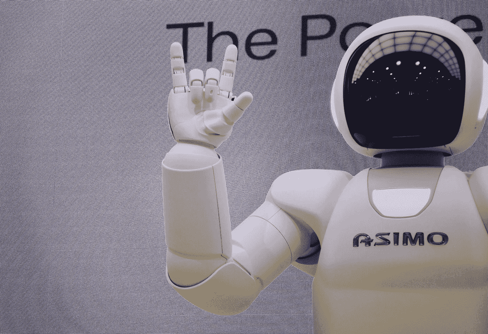
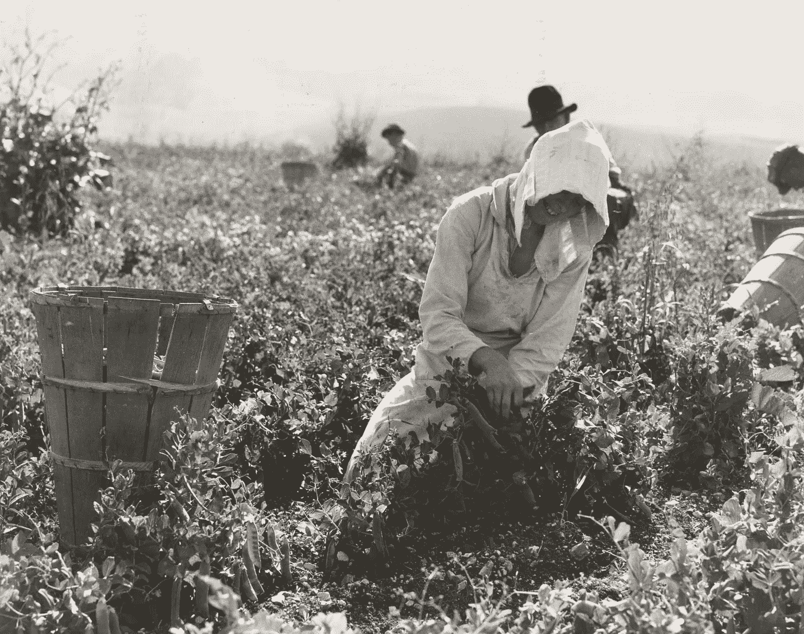
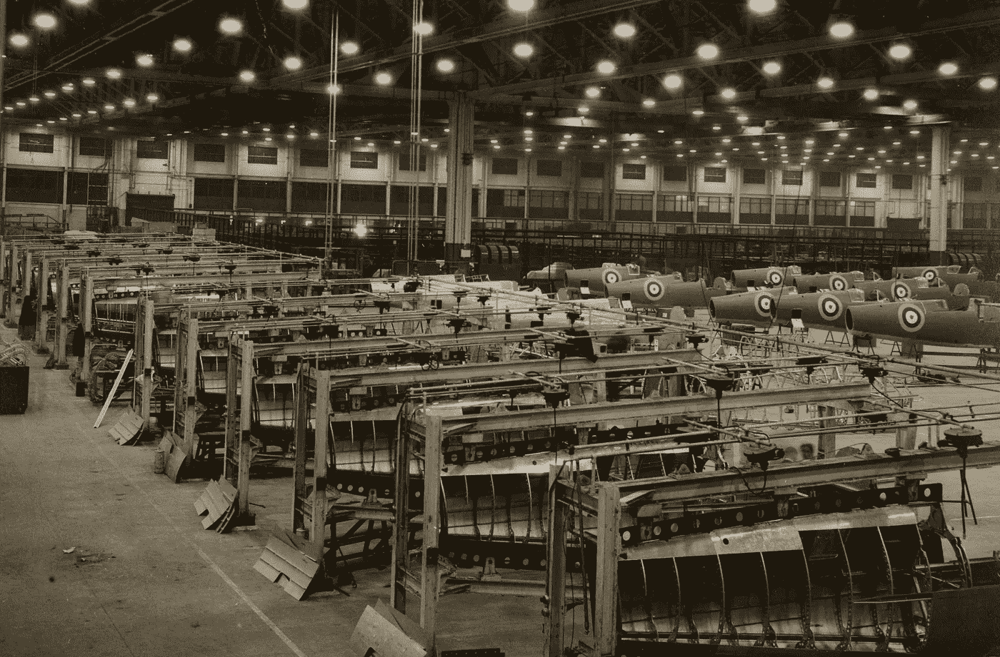

# 除了冠状病毒之外，还有某种东西正悄悄地把我们推向下一次大萧条。

> 原文：<https://medium.datadriveninvestor.com/something-besides-a-coronavirus-is-quietly-pushing-us-into-the-next-great-depression-983ee276cfe0?source=collection_archive---------0----------------------->

Photo by [Franck V.](https://unsplash.com/@franckinjapan?utm_source=unsplash&utm_medium=referral&utm_content=creditCopyText) on [Unsplash](https://unsplash.com/s/photos/robotics?utm_source=unsplash&utm_medium=referral&utm_content=creditCopyText)

大萧条击垮了我的曾祖父。然后它杀了他。当我们可能接近美国的第二次大萧条时，我们是否正确地评估了导致当前经济自由落体的原因？当然，新型冠状病毒(nCoV)全球疫情是促发因素，但我认为我们可能忽略了一个重要因素，即使在我们找到有效治疗新冠肺炎的方法后，这个因素仍会悄悄继续恶化。把我们的视线从正在向我们的全球经济滚动的球上移开，这个球就像一个 14 磅重的球体被释放在整个三角销上，我们将会对我认为将会成为下一个大萧条感到震惊和敬畏。当经济学家争相提出缓解建议时，美联储正在制定我们的货币政策，美国国会正在通过财政刺激计划，特朗普总统自己也承认，他正试图成为站在场外的“啦啦队长”，严重不足，极其无能。也许他应该试试短裙和绒球？

> "那些不记得过去的人注定要重蹈覆辙。"*~乔治·桑塔亚纳*

## ***大萧条，1929 年至 1939 年***

*我珍视一些祖先留下的珍宝。我的外祖母留给我一个漂亮的绿色凹陷(哦，讽刺的是)玻璃碗，边缘有磨损的金线，现在放在厨房的桌子上。我戴着我父亲的高叔祖父的金戒指。他的名字是查理·威利，戒指上刻着他名字的首字母。碰巧的是，我是唯一一个姓名首字母相同的亲戚。我的梳妆台上醒目地放着那顶礼帽，它还在原来的盒子里，是我祖父参加我姑妈婚礼时戴的。我最近才把我已故父亲的银色飞行员翅膀给了我的儿子。我的曾祖父名叫彼得·施特劳布。他的朋友和亲戚都称他为“老皮特”。他拥有一家名为施特劳布沙龙的餐馆(我妈妈解释说，那时候餐馆通常被称为“沙龙”)。老皮特也是当地五金店的老板。他的餐馆被认为是“高级场所”，正如我妈妈描述的那样。那时，所有的商店都为他们的老顾客记账。月底，他们会付清账单，开始新的一个月。*

*当大萧条袭来时，大多数人再也付不起账单了。很少有人去得起昂贵的餐馆，所以它关门了。老皮特给他忠诚的五金店顾客额外的时间来支付他们每月的账单，但是很快，即使额外的时间也无济于事。他不得不关闭他的五金店。此后不久，他于 1931 年去世。老皮特在 62 岁时去世了。我母亲从未见过她的祖父。他的两个公司里只有几样东西被抢救出来。一个这样的项目是一个橄榄绿，方形陶瓷茶壶，奶油色的内部。它既不花哨，也不值钱。我现在有那个茶壶了。*

* [## 危机？风投适应的 3 种方式|数据驱动的投资者

### 当我写这篇文章的时候，一场全球性的危机正在发生。这不是第一次，也不会是最后一次。很多事情已经…

www.datadriveninvestor.com](https://www.datadriveninvestor.com/2020/03/22/crisis-3-ways-vcs-adapt/) 

大萧条的原因归因于几个经济压力。1929 年 10 月 29 日，美国股市崩盘，被称为黑色星期二。股票价格没有充分反映公司的价值；收入不平等——超过 60%的美国人生活在贫困线以下，这还是在股票市场崩溃之前；繁荣的农业年份导致商品价格崩溃(农业是唯一一个高产年份意味着所有价格下降的行业，因为它对供应非常敏感)；沙尘暴摧毁了农业。因为我们的政府不希望人们从海外购买产品，所以颁布了贸易关税法，斯穆特霍利关税法。银行发生了挤兑。请记住，欧洲仍在从第一次世界大战中恢复，甚至比美国的经济状况还要糟糕。

我们已经制定了法律来帮助保护我们免受这些灾难的影响，例如，如果市场跌破某一点，股票交易会自动关闭，以及联邦存款保险公司对银行账户的保险。

> *然而，我认为另一个经常被忽视的因素是，这个国家正在向一个新时代过渡。我们没有采取任何措施来保护自己，我相信这种情况会再次发生。*

**年龄如何影响经济**

在过去的十年里，我在大大小小的聚会上对朋友和熟人进行了一次不经意的调查(那时我们还能去参加聚会),询问他们对下一个“时代”的看法。你知道，我们从石器时代到青铜时代再到铁器时代。启蒙时代。黑暗时代。先是农业时代，然后是工业时代，最后是信息时代。由于科技的发展，时代越来越近了。石器时代包括旧石器时代、中石器时代、新石器时代和铜器时代，从三百万年前到五千年前不等。后现代时代包括工业时代和信息时代，开始于 20 世纪初的某个时候，并持续到今天——只有大约一百年。

回到我的调查:关于我们接下来将经历什么时代，已经有了各种答案:人工智能、医疗、可持续发展、意识、物联网、启蒙新时代。除非你亲身经历，否则你不会真正知道自己身处哪个时代，对吗？从来没有清晰的分界线。在问了这个问题并思考了十年之后，我想我终于找到了答案。我们正在进入自动化时代。诚然，这与人工智能和信息等其他时代有所重叠，但我认为，在我们经济的更广泛背景下，它正成为值得审视的独立时段。

Photo by [The New York Public Library](https://unsplash.com/@nypl?utm_source=unsplash&utm_medium=referral&utm_content=creditCopyText) on [Unsplash](https://unsplash.com/s/photos/migrant-workers?utm_source=unsplash&utm_medium=referral&utm_content=creditCopyText)

# **往事**

**从农业时代过渡到工业时代**

根据之前的研究，我发现大萧条的一个被忽视的原因是由像汽油发动机这样的技术推动的从农业时代到工业时代的转变。根据 T4 纽约时报档案馆的一篇文章，1850 年，农场工人占全国劳动力的 64%。到 1920 年，这一数字已经下降到 30.2%，今天还不到 11%。合乎逻辑，因为在 19 世纪，我们需要人们做一切与种植和收获食物相关的事情。人们必须引导拉犁的马或牛来挖坑。劳动者必须播种。人们用一种叫做镰刀的手工工具收割庄稼，用牛踩着小麦脱粒。然后用手将谷物种子筛出来，用大石头磨成面粉。

然后，在 1886 年和 1892 年之间，引进了两项革命性的发明。约翰·弗罗里奇在爱荷华州克莱顿县发明并制造了第一台汽油动力拖拉机。通过犁、割草机、耙子和撒布器(播种机)等附件，它取代了以前由几十个农场工人完成的所有工作，只需要一个人驾驶拖拉机。另一项奇迹般的技术是联合收割机。这是一种适用于多种谷物的收割机。“联合收割机”这个名字恰如其分地描述了它的用途。它将三个独立的收割操作结合在一起:收割、脱粒和扬场。想想所有被这些机器取代的农业工人。

数以百万计的工人从农业岗位转移到城市，在工厂找到工作。根据 Ali Waqas 的一篇文章，大萧条的五大原因——经济多米诺效应(T1)，在“咆哮的 20 年代”，美国过度依赖其生产行业，包括汽车和造船码头，无法容纳所有找工作的人。随着时间的推移，由于工业用破坏性技术的快速进步，工厂工作岗位增加到容纳 30%的劳动力。然而，这种虚假的繁荣感导致了大众负担不起的产品泛滥，引发了连锁反应，开始于工厂关闭和投资突然撤出。中产阶级试图通过进一步减少支出来省钱。当支出减少时，市场上甚至有更多的商品卖不出去。随着利润下降，工厂关闭，员工被解雇，加剧了贫困，助长了负面的经济循环。

> ***从农业时代向工业时代的转变造成了劳动力需求缺口和时机错误，从而导致大量失业。这被证明是导致大萧条的主要经济压力。***

Photo Credit: [Birmingham Museums Trust](https://unsplash.com/@birminghammuseumstrust?utm_source=unsplash&utm_medium=referral&utm_content=creditCopyText) on [Unsplash](https://unsplash.com/s/photos/car-factory-1920s?utm_source=unsplash&utm_medium=referral&utm_content=creditCopyText)

# **当下**

**从工业时代到自动化时代**

已经到了。

除了体育和晚间新闻，我不怎么看电视。我更喜欢阅读和写作。自从隔离以来，我买了一台跑步机，把我的有氧运动从室外转移到室内，所以我有机会探索一些电视节目。我一直在观察的一部电影似乎融合了过去、现在和未来。这是 HBO 的一部名为《西部世界》的系列片，改编自 1973 年的同名电影。如果你还没有看过，这部剧是关于一个由机器人(称为主机)居住的伪旧西方世界(想想迪士尼乐园)，真人(大多数是虐待狂)可以访问并解决他们的问题(通常使用他们最糟糕的本能)。毫无疑问，这是未来主义，但并不是真正的信仰飞跃。我想我知道有人会马上报名参加西部世界。

西部世界最吸引我的是它的主机。它们被精心设计，3d 打印，充满血液(这对于频繁的枪战和杀戮来说是必要的)，并被编程为看起来和行为都像真实的人。他们能比人类更快更准确地组装汽车吗？我很确定。事实上，机器人已经在组装汽车，没有衣服、皮肤和血液。

几个月前，我在杂货店购物时，差点撞上一个显然在清点库存的机器人。这个机器人比普通美国公民站得还高，为了避免我落入它的怀抱，它向后滑行。我马上想到，这可能会取代两个或更多的工人。没有病假。没有工资税。没有好处。没有错误。几乎可以全天候轻松工作。可能需要一些时间来充电，可能需要一点油和基本的维护，就像经典电影《绿野仙踪》中的铁皮人一样。

加拿大领先的科技创业加速器 [DMZ](https://dmz.ryerson.ca/the-review/robot-vs-humans-workers-of-the-future/) 最近的一项研究发现:

“…随着技术的进步，更多的企业可能会采用快节奏的机器人，这些机器人可以最大限度地提高产量，并有可能完全取代人类工人。事实上，它已经以惊人的速度悄然发生了。富士康，一家将苹果和三星视为其客户的中国供应商，[用机器人](http://www.bbc.com/news/technology-36376966)取代了其 6 万名工厂工人。虽然令人震惊，但这只是未来的开始。

“T4 麦肯锡公司的一份报告发现，到 2030 年，多达 8 亿工人可能会因为自动化而失业。”

他们还指出，机器人工人可能会导致大规模失业、人类灾难和移民潮，美国总就业人数的 47%以上处于危险之中，比大萧条时期的 24.9%的失业率更高。

我们将如何对待我们的工厂工人？我们将如何对待我们的员工，无论他们是开车、提供食物、理发还是耕作？而且，如果你认为你是经理就可以免于被机器人取代，那就再想想吧。《The Verge》2020 年 2 月的一篇文章，“[机器人会让我们工作得多辛苦？](https://www.theverge.com/2020/2/27/21155254/automation-robots-unemployment-jobs-vs-human-google-amazon)"表示如下:

“机器人监视着酒店的管家，告诉他们该打扫哪个房间，并跟踪他们打扫的速度。他们管理软件开发人员，监控他们的点击和滚动，如果他们工作太慢，就扣他们的工资。他们倾听呼叫中心工作人员的声音，告诉他们说什么，怎么说，让他们不停地、最大限度地忙碌。当我们一直在关注自动驾驶卡车的前景时，永远在五年后，机器人以主管、工头和中层经理的形式出现了。”

Photo by [Franck V.](https://unsplash.com/@franckinjapan?utm_source=unsplash&utm_medium=referral&utm_content=creditCopyText) on [Unsplash](https://unsplash.com/s/photos/robot?utm_source=unsplash&utm_medium=referral&utm_content=creditCopyText)

# **未来**

**我们怎样才能为自己设想一个更好的未来？**

也不全是坏消息。自动化将承担单调乏味的任务，这些任务可能是人类永远也不会去做的。我曾经拥有一家制造公司，最具挑战性的任务之一是保持低流动率。他们为什么想离开？因为，不可否认，人类不应该一遍又一遍地做同样的工作，一天 8 小时，一个月 20 个工作日，一年 12 个月，一年又一年。在我看来，这是长期以来窒息现代社会的反乌托邦扭曲的一部分。

让我们来看一下过去的大萧条和今天的大萧条之间的对比分析，并提出一些解决问题的建议。我们需要开始想象一个新的世界，一个与我们现在完全不同的模式。我们需要一个真正的领袖来帮助我们实现目标。我们需要像汤姆·布拉迪那样赢得超级碗的四分卫，而不是像唐纳德·川普那样的啦啦队长。

1.  收入不平等——虽然收入不平等远不及繁荣的 20 年代，但自 20 世纪 70 年代以来，收入不平等在大萧条后有所改善，现在又在上升。前 10%的人拥有全国超过 70%的财富。故事是这样的，亨利·福特付给他的非熟练工人最低生活工资，这样他们就能买得起他们制造的汽车。许多人认为他创造了中产阶级。
2.  大约 12%的美国人生活在贫困线以下。2018 年，美国有 552，830 人被统计为无家可归者。其中，194，467，35%没有遮蔽，358，363，65%有遮蔽。甚至没有银行账户的美国人的总比例是 7%。在美国，许多公司不支付生活工资，因此许多工人需要一份以上的工作。这也是无家可归人口在 2017 年至 2018 年间上升 9%的原因之一，因为人们无法找到能够支付足够支付房租的工作。
3.  **股市泡沫**——我们是在股市泡沫中吗？利率接近于零的部分问题是，人们投资的地方变少了。这自然会导致股市和房地产泡沫。由于 2009 年颁布了更多的银行贷款规定，房地产市场在一定程度上得到了控制。但是股票市场就没那么好了。我们投资的公司真的值他们股价所反映的价值吗？
4.  **消费者购买的自由落体**——由于新型冠状病毒疫情，消费者购买一直处于类似大萧条的自由落体状态。现在，人们不能像以前那样出去购物了。当这种情况能够恢复时，很有可能，随着如此多的零售商店大规模关闭，购物在一段时间内不会复苏。
5.  气候变化是我们的沙尘暴吗？在一些干旱地区，肯定是的。但是几乎更糟糕的是与西部干旱相关的火灾。由于气候变化，洪水、海平面上升和频繁的强飓风和龙卷风变得更加糟糕。
6.  **关税——**特朗普总统对来自中国的商品征收关税，这可以说是他担任总统期间做过的最愚蠢的事情之一，那就是从许多愚蠢的决定中选择一个。最糟糕的是，他试图通过说中国支付关税来推销它，这是他最大的谎言之一。与任何关税一样，进口商品或零部件的企业最终将为此买单。如果可能的话，他们会将价格上涨转嫁给顾客。或者他们倒闭了。这还不包括中国对美国征收的报复性关税。这当然促使许多美国农民宣布破产，因为当中国政府征收关税时，美国进口产品的价格上涨，中国进口商只能从其他地方购买大豆，主要是巴西。这些正是《斯穆特·霍利关税法》在大萧条时期产生的效果。
7.  教育改革——美国人一直根据我们所处的时代和我们在那个时代需要的劳动力类型来教育学生。在上个世纪之交，人们在农场工作，许多小学生在学完基础知识后就辍学了。这就是他们耕作所需的一切。我们目前的公立学校教育体系是为了培养大多数学生成为工厂工人或中层管理人员而开发的。随着我们进入信息时代，就业选择转移到低级服务雇员，如收银员、仓库工人或中层管理人员。在冠状病毒疫情的时代，几乎所有的教育都转移到了网上。我们必须在教育中找到一个最佳点，用不同的方法教孩子们不同的东西。
8.  **交通方式** —当汽车被发明后，一切都改变了。全国运输是可行的。高速公路系统的建立就是为了促进这一点。加油站出现在每个角落。汽车工厂雇佣了数千名工人。现在，网上购物在我们购买的商品中占了很大一部分，所有这些商品都需要送货上门。我们需要考虑无人机送货，由美国员工设计和制造这些无人机。我们需要考虑电动汽车，并在全国范围内实施充电站。我们需要发展和重建我们的交通基础设施。我们应该使用轻轨来连接主要城市，而不是开车或坐飞机。交通将变得越来越重要。它正在转变，就像它从马车时代转变为汽车时代一样。
9.  **我们正在过渡到一个新时代**——我们不再需要工厂工人了。这些职位中的大部分将被自动化所取代。我们应该大规模制造我们自己的机器人。我们需要改善我们的教育。我们应该允许我们这些受过教育、有大学学位的移民能够轻松合法地留在这个国家。我们需要更加关注设计。让我们创造自己的机器人和生产它们的自动化装配线。让我们把那些机器人卖给其他国家。首先，让我们教所有的孩子如何编码。

我们必须为自动化时代做好充分准备。我们必须跳出框框，为我们的公民创造就业机会，将机器人、人工智能、计算机科学、替代能源、工业、UX 和产品设计结合起来，包括通向独特的新交通方式的所有途径。我们需要支付生活工资，这样人们才能负担得起生活和支付账单。我们需要扩大补贴住房和医疗保健。或许我们需要考虑自由红利，就像科技企业家和总统候选人杨安泽最近所说的那样。我们必须想象、规划和建设一个新的社会。一个为了未来。如果我们不这样做，我们向自动化时代的过渡极有可能将我们推向另一场大萧条，这场大萧条比它最初的同名危机要严重得多。

这个旅程肯定会超出我们的舒适区，但这就是奇迹发生的地方，“超出我们的舒适区”，对吗？

让我知道你的想法和你珍惜的来自你祖先的一件物品？你打算给你的孩子或孙子留下什么？我想知道。

Cynthia Wylie 是企鹅兰登书屋出版的儿童书籍作者，她拥有乔治敦大学的经济学硕士学位。她为数据驱动投资者撰写商业和经济方面的文章。当她不写作时，她从事商业咨询和为[*【TheProjectConsultant.com】*](http://www.theprojectconsultant.com/)*制定扭转战略。*

*由 Dennis P. Kamoen 主编，创始人&主编，项目顾问。**