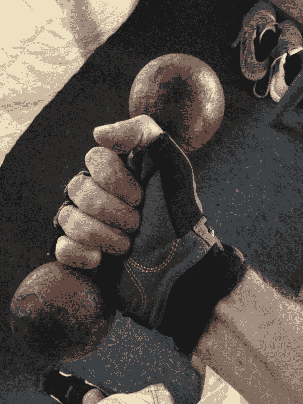
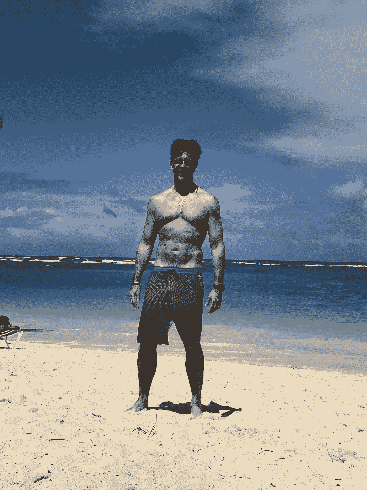

# 有时候嫉妒是件好事

> 原文：<https://medium.datadriveninvestor.com/sometimes-it-is-good-to-be-jealous-a2a4baab8dc1?source=collection_archive---------14----------------------->

## 一些不好的感觉可以让我们做出正确的决定

我是一个可爱的孩子，有一双绿色的大眼睛；我总是能赢得女孩们的好感。以至于我五岁就已经有女朋友了(关系一直持续到十一，是认真的！).我最终习惯了这样一个事实，在我的楼里，一半的女孩喜欢我，另一半是我的一个朋友。

那让我被宠坏了。我感觉棒极了；我以为无论我去哪里，女孩们都会为我疯狂。在学校，不是这样的……我在那里非常非常害羞——在我的楼里不太可能，我在那里不受约束，专横跋扈——女孩们只是没看见我。我有点“透明”，你能理解吗？但幸运的是([或者不是](https://medium.com/an-idea/my-lifes-worst-girlfriend-b98b085f157e))，当我满十六岁时，学校里最有魅力的女孩之一扑向我，我最终在所有朋友面前失去了童贞。

这让我更加被宠坏了。毕竟，我的“王国”终于扩展到了高中。由于我的女朋友很漂亮，当我开始带她回家时，我们楼里的女孩都很嫉妒。我喜欢那样！

在这持续了几年的时期里，我的楼里有三个漂亮的女生。我和他们三个有过暧昧关系，我从来没有认真对待过，因为，正如我所说的，我认为我是世界上最受欢迎的男人。

直到另一个男孩出现在街区。

这个时候我应该已经十九二十岁左右了。这些女孩都是十七八岁。出现的男孩并不是美的象征。他甚至很矮，勉强够女孩子们穿。我从六英尺高的地方看，并不认为他是一个潜在的对手。

但是三个女孩中的一个做到了。然后又是一个。

他们告诉我他们相爱了。我不明白…毕竟，直到昨天他们还爱着我！我意识到新来的男孩有他的品质，我们成为了好朋友，我们今天仍然是…但是女孩们在他身上看到了什么吸引人的地方？

直到有一天，他赤膊上阵来到我的楼前。

然后我明白了他有我没有的东西。

肌肉。

那发生在 90 年代初。圣保罗没有多少健身房；健身并不“时髦”。所以，肌肉发达的人很少。即使在电视上，我们的偶像也是“正常”的人。

但是我的朋友经常锻炼。他的身体和我的身体有着天壤之别。

我花了一段时间来消化这个信息。但是几个星期后，我决定鼓起勇气，问他是做什么的。

没什么大不了的…俯卧撑和仰卧起坐，如果我没弄错的话。

我决定我也要开始这样做，但是我很懒…最后我把我的“板球底盘”看了几年。

直到 1994 年 5 月 1 日。

巴西最杰出的一级方程式赛车手艾尔顿·塞纳去世时，我悲痛欲绝。我心目中的英雄很少，他是其中之一。我记得，在他死后不久，几家杂志都在谈论他的一生。其中一人与埃尔顿的体能教练努诺·眼镜蛇进行了一次冗长的面谈。

我记得看着塞纳在沙滩上跑步的照片，心想:“这就是我想要的身材。”然后我决定复制他的训练，除了跑步——我甚至试过跑步，但是太累了。我买了一对
3 公斤(6.61 磅)的哑铃，确切地说，就是照片中的这些:

Photo by the Author

我按照努诺的锻炼程序。成功了！我开始变得更强壮，渐渐地，我得到了我想要的样子！直到有一天，我和一个女孩出去，她对我说我的身材“很有趣”:“看起来你只锻炼手臂和胸部，”她说。她是对的；我做的大部分练习都是针对这些身体部位的。

此时，我已经在电视上工作了。虽然我很便宜，但我避免去健身房只是为了逃避额外的费用。就在那时，当我和我正在拍摄的迷你剧《七个女人》中的另一位演员交谈时，我发现了一件令人兴奋的事情……健身房不对环球电视台的演员收费！这就足够向工作室出示通行卡了，就这样！免费健身房！

去了家附近最好的健身房，拿了门禁卡。他们接受了！从 2002 年到 2017 年，我健身，一分钱没花。不幸的是，我参加的健身房开始出现经济困难，老板找我谈了谈。我决定帮忙，当然…15 年的健身房不付钱？当然是他应得的！我继续在那里工作，直到今年三月疫情开始。

Me, at fifty, at the beginning of 2020\. Photo by the Author.

然后有趣的部分来了…我在家用我的六磅重的哑铃做了这么多的锻炼，以至于我不用去健身房也能保持身材！这样，我就可以在疫情结束后把练习留在这里…还可以省下更多的零钱！

一次便宜，永远便宜！

## 结束的

羡慕朋友的身体形态让我努力提高自己的。今天，我比我的大多数朋友健康得多，最重要的是，我有锻炼的习惯。如果我有一天停止锻炼，我会想念它。

我用一种可怕的感觉——嫉妒——创造了一个好习惯——保持健康。

学会将你的坏情绪转化为你的优势！