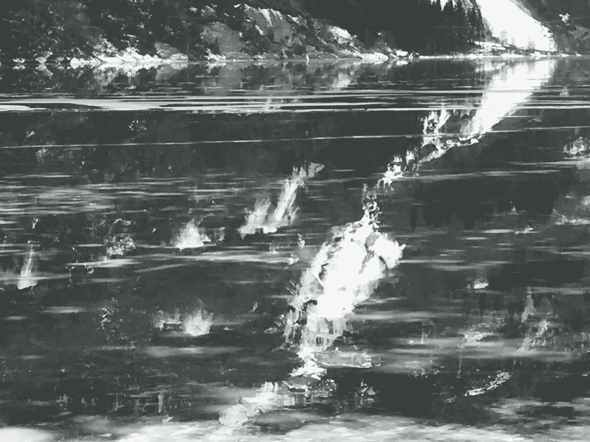

# 你可以改变你的生活，尽管去做吧！

> 原文：<https://medium.datadriveninvestor.com/sometimes-we-are-governed-by-fear-what-does-fear-do-to-us-and-how-can-we-face-fear-912244d2eff5?source=collection_archive---------8----------------------->

## 将来的

## 有时我们被恐惧所控制。恐惧对我们有什么影响，我们该如何面对恐惧？怎么才能把这种消极的东西变成积极的东西？

Photo: Øivind H. Solheim

## 没有什么是不可能的！—你可以改变你的生活，即使它看起来遥不可及。以下是方法。

恐惧无处不在，在我们身后，在我们面前，在我们内心。恐惧无处不在，隐藏的恐惧和可见的恐惧。恐惧无处不在。

而这个地方就是这个世界，所以可以说恐惧主宰了我们的客厅。

> 在当前形势下，在这个可怕的疫情，我们如何面对恐惧？
> 
> 怎样才能战胜恐惧，把负能量变成正能量？

我将通过回顾过去，回顾我的生活经历，从我几十年来的经历中发现一些真知灼见。

理论上，我们可以建立一些规则，列出一些我们可以尝试开始的简单步骤:

## 1.慢下来，坐下，感受，思考。与你身边的人交谈。永远说真话
4。运动！走路、跑步、举重、爬山、骑自行车、游泳……用你的身体！
5。说:我可以！
6。创造点什么！写作，盖房子(或者玩偶之家)，画画，拍照，做木工，园艺…

你可能会说，当你情绪低落，身体和精神状态都不好，甚至有点沮丧的时候，做上面列表中的事情是不现实的。但是我要说，根据我的经验和我在生活中每天所见所闻:

# 没有什么是不可能的！

如果你回顾你的一生，你会很容易发现在某个特定的时刻看起来不可能的事情，在今天都是可能的。这里有一个例子:

许多年前，我是一名年轻教师，已婚，有一个女儿。我在一所高中教学生语言。我喜欢我的工作，我爱我的女儿，我也想爱我的妻子。但是我们的关系并不好。我不会在这里深究，但发生的事情是我感到不开心，原因很复杂。

 [## 良好的生活是习惯的形成|数据驱动的投资者

### 过度思考是过度紧张。仅仅几个简单的习惯就会在一天中产生巨大的影响。那是…

www.datadriveninvestor.com](https://www.datadriveninvestor.com/2020/01/17/a-good-life-is-habit-forming/) 

这是在冷战时期(20 世纪 70 年代)，我感到一种越来越强烈的存在焦虑，一种强烈的世界不安全和事情不好的感觉。未来是一只黑色的大鸟，它站在我面前，展开翅膀，想要挖出我的眼睛。

自六十年代初以来，我一直在与爆发核战争的恐惧作斗争。当我意识到这一点时，这是一个可怕的发现，世界上的形势:成千上万的核火箭从苏联指向西方，反对欧洲和美国，同样在另一个方向。

整个 70 年代，我的恐惧和焦虑越来越严重。它甚至以一种物理的方式来表达自己。我感到胸部疼痛，我开始想到癌症。我害怕那种可怕的疾病，害怕在最终死于它之前我将不得不忍受的残酷的痛苦。

我开始认真地认为疾病是真实的，我害怕我会死。从这个角度来看，快乐的生活对我来说似乎是不可能的。

> (很矛盾的是，我并没有戒烟。—十年后我戒烟了，但那是另一回事。)

*然后发生了这样的事情:*

我开始写故事。我相信我这样做是对死亡威胁的一种抗议。我开始用第三人称写一个故事，关于一个生病的年轻人。他的胸部莫名其妙地疼痛，他试图尽可能地控制局面。

我可以看到构思和写这本书的行为是我反抗死亡威胁的方式。我战胜不可能的方法。

我被我的写作项目吸引住了。我全身心地投入其中，一有时间就写剧本。也许我在写作上花了过多的时间和精力，而在工作和家庭上花的时间和精力太少了。但是我坚持下来了。

我继续写我的书，这本书将成为一部小说。我联系了出版社。他们喜欢这份草稿，并把它连同建议和忠告一起寄给了我。我日以继夜地写这本书。我甚至试图不睡觉，这一点都不明智，当然也没有成功。

这部小说出版后，在一些报纸上获得了相当好的评价，但在另一些报纸上则没那么好。

国家电视频道邀请我参加一个关于那年秋天出版的新书的文学节目，我和其他几位作家一起参加，他们也出版过相同主题的书，疾病，死亡恐惧，死亡。

那年秋天，我可以对自己说，我显然已经成功地完成了我的写作计划，这在一两年前是我做梦也想不到的。

**所以；没有什么是不可能的！**

现在:

# 你如何改变你的生活，即使看起来不可能？

首先，你需要知道:改变你的生活是可能的、可取的、需要的，还是不可能的？也许，毕竟，你不想要任何改变——这没关系。**你的决定！**

如果答案是肯定的——允许自己浏览下面的列表。

# 1.慢点。坐下，感受，思考。

我们社会的生活节奏加快了，现在依然如此。你需要放慢脚步，稍微停下来，坐下来感受一下内心的感受。你必须思考！你在生活中处于什么位置，你感觉如何，你认为你自己和你的生活在做什么？

每个人都在思考。但不应该是源源不断的(无)意识。有目的的思考！你是谁？你想成为谁？把昨天的自己和明天你想成为的人做比较。

# 2.与你身边的人交谈

没有人天生就是沉默的。我能说出来是因为我是一个很沉默内向的人。我在自己的公司茁壮成长。我喜欢听音乐、阅读、写作。但是我意识到我也需要社交，我需要和其他人交谈，听他们说什么，听话语背后的内容。

不仅仅是因为情感原因，我需要我最亲爱的人。我不是浩瀚海洋中一个独立的岩石岛。我是这个世界的一部分，我与我附近的人和许多许多其他更遥远的人相互联系，我感到与他们联系在一起，分享想法、知识和幽默。

# 3.永远说实话

这个比我想象的要简单。总是说真话，或者至少不说谎的好处是显而易见的。当我们说真话，不撒谎时，知道我们可以依靠什么和记住什么要容易得多。

# 4.运动！走路、跑步、举重、爬山、骑自行车、游泳……用你的身体！

我去健身房的一个很好的原因是，当我完成一个小时的训练，例如骑自行车时，我身体的感觉和精神上的振奋。当我坐在自行车上，脉搏接近 80+%时，我对生活有很多新的想法，关于我可以写些什么，或者我可以在周末或下一个假期与家人一起做些什么。即使在瑜伽心流课程期间和之后，我也感到振奋和快乐。太神奇了！

# 5.说:我可以！

我相信，当人们想到他们可以做的事情时，他们往往会退缩和犹豫，例如，为了过上更丰富、更充实的生活。

每个人都应该记住这一点:没有限制，存在提供了大量的机会。如果你想减肥，如果你想爬山，或者如果你想自学并获得一份工作或职业的资格，你总是要做同样的事情来开始:

> 定义你的目标，和自己讨论你为什么要达到这个目标。并且说:是的，我可以！

# 6.创造点什么！写作、绘画、拍照、盖房子(或玩偶之家)、做木工、园艺等

在创造过程中有特别的满足感和能量。所有人都有潜力*，因为*他们是人类！

不是每个作家都需要写畅销书。大多数作家写作首先是为了自己的乐趣，然后才是为了潜在的读者。

不是每个画家都需要为国家美术馆的年度博览会绘画。快乐存在于绘画的过程中，创造出全新的、看不见的东西。

# 感谢您的阅读！

随意分享。

多读书？欢迎您到[T5 订阅我的邮件列表。](https://kompetansevest-insight.simplero.com/page/105148)免费！