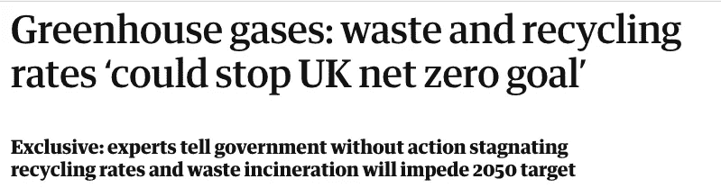

# 垃圾分类问题

> 原文：<https://medium.datadriveninvestor.com/sorting-the-waste-problem-9e3155d24e80?source=collection_archive---------2----------------------->

Source: World Bank, *by Mohamed Abdulraheem*

在我看来，废物管理行业是一个特殊而艰难的行业。它在全球范围内是相当集中和异质的。

这些年来，当我把垃圾分类并放进垃圾箱时，我从来没有想象过垃圾的旅程。我一点也不知道，这个所谓的冷门行业正在经历自身的转变，这得益于重大的政策变化，以及# [零浪费](https://twitter.com/search?q=%23zerowaste&src=typeahead_click)和# [气候变化](https://twitter.com/search?q=%23ClimateChange&src=typeahead_click)运动的推动。

 [## 气候变化、ESG 和对更好数据的追求|数据驱动的投资者

### 在地球上许多地方经历了另一个令人难以置信的炎热夏季后，来自 S&P 的最新发现…

www.datadriveninvestor.com](https://www.datadriveninvestor.com/2018/08/24/climate-change-esg-and-the-quest-for-better-data/) 

因此，我们产生的废物最终会被填埋、焚烧或送至材料回收设施(MRFs for recycling ),这取决于材料的类型、分类的准确性以及产生的地点。例如，美国和欧洲生产的大部分塑料曾经在中国回收，直到 2018 年中国禁止进口废物。

> O 产生的废物中只有 13.5%被回收(来源:世界银行)。缺乏经济效益、回收率低、收集基础设施差以及对废物处理的认识不足是一些促成因素。

Source: Guardian, 2020

我们生活在气候变化的时代，这些数字与时代的需求大相径庭。废物管理公司没有什么可指责的，因为回收本来就是一个没有吸引力的行业。这仍然是较大的废物管理者的强烈追求，从 MRFs 所需的规模中获利。另一方面，较小的经济体经历着周期性的 MRF 关闭(尤其是在油价暴跌期间)，这使得 MRF 不可持续和不稳定。要让这些行业腾飞，需要强有力的政策法规和框架。但是新兴技术的应用似乎很有前途；人工智能在改变多个行业方面发挥了重要作用，废物管理也不例外。

价值链的不同部分以不同的方式适应了这种变化。

## **废物收集&转移:**

对于垃圾收集，发达国家至少有必要的基础设施，在垃圾箱级别进行分类，这种事情在许多国家甚至不存在。尽管如此，人们对可回收垃圾和不可回收垃圾的认识水平并不突出，导致垃圾箱的污染非常严重。垃圾管理人员最终会使用大量资源(劳动力、时间和金钱)进行人工重新分类。湿垃圾和干垃圾的混合使得可回收垃圾由于污染而不可回收。所有这些因素使得收集成本最高，约占 45%(在填埋、堆肥、焚烧等中最高。)到处理吨垃圾的总成本。

**主要挑战:**

*   废物源头分类不正确；
*   未优化的卡车路线；
*   缺乏对仓位水平的监控

**目前进展:**

有许多像 [Compology](https://compology.com/) (美国)、[resource ify](https://www.resourcify.de/)(德国)、BigBelly(美国)这样的初创企业正在通过基于机器的传感器监控和压缩箱子的填充水平来优化提货路线，帮助他们降低每次提货的成本。还有一个重点是通过触发卡车警报，至少在社区垃圾箱一级监测污染。然而，这还没有看到大规模采用，因为每箱投资成本高，缺乏坚实的概念证明。

还有更多工作要做……

地方议会、废物管理机构和消费品公司在这方面都可以发挥作用，至少可以提高意识、强制执行罚款，并制定严格的回收利用目标。明确界定投入材料的再利用目标，精心制作清晰的回收或不回收标签是一些正确方向的措施。

在源头(家庭或办公室)解决不正确分类的解决方案尚未问世。这个问题的难度使得垃圾收集成为社区委员会、企业家和投资者感兴趣的领域。

*   在垃圾箱或卡车级别使用人工智能进行数据收集将有助于训练模型，并最大限度地降低供应链的成本；
*   CPG 公司可以从研究公司的客户面板/SKU 数据中获得洞察力，以跟踪再加工材料。我绝对想象不出区块链的戴比尔斯平台会跟踪钻石，但这肯定会为他们增加坚实的底线和 SDG 目标(再加工塑料比原始塑料少用 50%的电；来源:[英国塑料和橡胶杂志](https://www.britishplastics.co.uk/News/viridor-and-unilever-agree-five-year-contract-for-recycled-p/)

> 鲜为人知的事实:油腻的披萨盒、脏兮兮的食物纸板盘/容器是不可回收的

## **废物处理(MRFs):**

一旦废物到达 MRFs，它将沿着传送带被人工分离(塑料、纸张、金属),打包并作为投入物被送去再加工。

**主要挑战:**

*   传送带上的人为错误和安全:
*   工厂运营的高成本/资源；
*   缺乏关于废物构成的数据

**目前进展:**

这个用例已经看到了迄今为止基于人工智能的计算机视觉的最高牵引力。随着[贞子](http://sadako.es/)、 [AMP Robotics](https://www.amprobotics.com/) 、 [Zen Robotics](https://zenrobotics.com/) 和 [Greyparrot.ai](https://greyparrot.ai/) 等玩家的出现，基于机器人的分拣正在成为 MRF 中的主流。硬件是一个配备了基于人工智能的计算机视觉的机器人。设置机器人是资本密集型的，并且在范围方面也是有限的；然而，初创企业正在想出独特的商业模式来克服这一点。从长期来看，机器人节省了成本，提高了准确性，人工智能在分拣过程中捕捉数据并从每次 API 下降中学习。尽管还没有披露多少好处，但采用它似乎是有希望的！

展望未来…

*   优化后的操作有望提高效率，废物管理者可能会考虑利用再加工的投入来建立玻璃、纸张或塑料的生产；
*   CPG 公司将寻求与废物管理公司的长期合作伙伴关系来处理再加工材料，正如我们所说的，这已经发生了(来源:[英国塑料和橡胶杂志](https://www.britishplastics.co.uk/News/viridor-and-unilever-agree-five-year-contract-for-recycled-p/))；
*   随着我们规模的扩大，将需要旨在实现高效废物处理和能源回收的技术

回收利用的广泛采用及其经济性提出了一个经典的先有鸡还是先有蛋的问题，我很好奇什么会先出现！