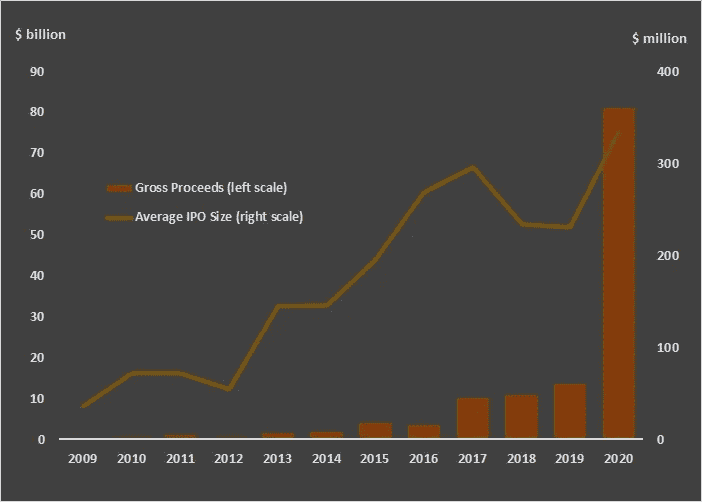

# 特殊目的收购公司是新的黑人

> 原文：<https://medium.datadriveninvestor.com/spac-is-the-new-black-296947838e2e?source=collection_archive---------2----------------------->

## 金融市场

## IPO 替代方案已经大规模回归，投资者的兴趣将使派对持续到 2021 年

Photo by [Héctor J. Rivas](https://unsplash.com/@hjrc33?utm_source=medium&utm_medium=referral) on [Unsplash](https://unsplash.com?utm_source=medium&utm_medium=referral)

过去几年见证了 21 世纪最受欢迎的华尔街公司——特殊目的收购公司(特殊目的收购公司)——重现昔日辉煌。

在 2008 年金融危机后的十年里，利用 SPACs 让公司上市是一种不常见的做法。但是最近几年活动激增。2020 年，特殊目的收购公司的首次公开募股约占所有通过首次公开募股筹集的资本的一半。

今年，体育博彩公司 *DraftKings* ($DKNG)、电动汽车项目 *Fisker* ($FSR)、理查德·布兰森的航空航天赌注*维珍银河* ($SPCE)、电子竞技货币化平台 *Skillz* ($SKLZ)以及其他令人兴奋的名字通过特殊目的收购公司合并上市。

几家 SPACs 已经宣布了收购目标。那些期待在 2021 年合并的公司包括 *DMY 科技集团 II*(＄DMYD)。他们瞄准了体育数据和统计提供商 *Genius Sports* 。价格估计为 15 亿美元。

AMCI 收购公司(＄AMCI)将试图以价值 5 亿美元的交易与氢燃料电池技术公司进行合并。

> SPACs 已经成为 IPO 的可行替代方案。

Churchill Capital II Corp .($ CCX)将收购数字学习提供商 Skillsoft ，价值约 13 亿美元。合并后，他们将以额外的 2.3 亿美元收购*全球知识培训*。

其中最引人注目的是 CC neu Berger Principal Holdings I(PCPL)，该公司希望以 22 亿美元的巨额交易收购 SaaS 供应链软件开发商 E2Open。E2Open 一直公开上市，直到 2015 年，一家私人股本基金将其收购并摘牌。

越来越多的 spac——以及越来越多的知名公司参与特殊目的收购公司并购——引发了几个问题。

为什么通往证券交易所的另一条路的流量如此之高？特殊目的收购公司公司的投资机会比那些走 IPO 路线的公司差吗？

如下文所述，SPACs 已成为 IPO 的可行替代方案。目前还看不到趋势很快逆转的迹象，但尽管它们很受欢迎，却给散户投资者带来了巨大风险。

## 公司通过不同的机制上市

公司上市的经典方式是通过首次公开募股(IPO)。公司管理层可以通过发行新股，稀释现有股东的股权来筹集现金。

此外，最初的所有者——从创始人到风险资本和私募股权基金——可以将他们的部分所有权货币化。

不成熟的公司通常需要现金来加速增长。公开上市允许公司通过股票发行不断筹集现金。额外发行将进一步稀释现有股份。

IPO 过程既及时又昂贵。首先，聘请承销商对公司进行估值。承销商通常是投资银行。然后，在管理首次发售之前，承销商会撰写一份招股说明书，这是一份披露公司财务和其他信息的文件。

当承销商的主要客户和机构投资者在首次发售中购买股票后，公司将开始在证券交易所交易。因此，散户投资者可以从参与首次公开募股的人手中购买股票。

IPO 有几种替代方案。其中之一是直接上市，它绕过了承销商程序，直接在证券交易所上市，不发行新股。

另一个例子是特殊目的收购公司的合并。特殊目的收购公司是一个空壳公司，由一群投资者创建，被称为发起人。该公司通过首次公开募股在证券交易所上市。

SPAC process simplified. Picture by author.

当发起人寻找收购目标时，筹集的现金被公司持有。当发现一个目标时，特殊目的收购公司的股东可以投票赞成或反对合并。

特殊目的收购公司有两年时间完成合并。否则，资金将返还给股东，特殊目的收购公司将被解散。

## SPACs 正在崛起

20 世纪 90 年代见证了第一代特殊目的收购公司合并。通常，小公司的失败率 SPACs 在有限的时间内(通常为两年)没有达到目标的比例——超过 50%。

此外，这个过程和赞助商赚取的费用并不透明。其中一些垃圾邮件地址甚至被认为是欺诈性的空壳公司。

> 过去几年，特殊目的收购公司 IPO 的数量和规模都有了大幅增长。

21 世纪初，特殊目的收购公司成为公司上市的一种流行方式。在金融不确定的环境下，对于不太出名的公司来说，IPO 是一个冒险的选择。

在金融危机后失去投资者的青睐后，特殊目的收购公司 IPO 的数量和规模在过去几年中大幅增长。

2020 年，特殊目的收购公司 IPO 的数量已超过 240 家，高于 2019 年的 59 家和 2009 年的 1 家。

这些 IPO 的总收益涨幅更大。它反映了平均 IPO 规模的增长。如今，特殊目的收购公司合并似乎是 IPO 的一个可行替代方案，甚至对更大的公司来说也是如此。

Total proceeds and average IPO proceeds from SPACs 2009–2020\. Picture by author. Source: SPAC Insider.

大多数 spac[瞄准](https://www.benzinga.com/analyst-ratings/analyst-color/20/12/18806070/2020-is-the-year-of-the-spac-but-goldman-sachs-says-2021-could-be-even-bigger)技术、非必需消费品和生物技术部门，将它们与投资者目前最需要的成长股联系起来。

据*高盛*称，2021 年特殊目的收购公司的并购数量将会增加，这也表明目前有超过 200 家 SPAC 正在寻找收购目标。

## 特殊目的收购公司·布尔一案

SPACs 变得流行有几个原因。快速增长但当前盈利能力较低的公司需要现金来维持增长。公开上市是有效注入流动性的关键，特殊目的收购公司的上市过程比 IPO 更快。

今天的 SPACs 与 20 世纪 90 年代的 SPACs 完全不同。它们更加透明，失败率低于 15 %,出于几个原因，投资者的下行风险有限。

首先，当目标宣布后，不高兴的投资者可以立即抛售股票。

其次，在公告发布后，目标公司开始进行前瞻性指引。这为投资者提供了至关重要的信息，使他们能够评估并购的潜力。

第三，如果保荐人未能与目标达成交易，对特殊目的收购公司的初始投资将得到偿还。在合并完成之前，赞助商是不会得到报酬的。他们的主要报酬是公司的所有权份额，在某种程度上使他们的利益与投资者的利益一致。

在上面提到的 [E2Open 合并](https://www.sec.gov/Archives/edgar/data/1800347/000110465920114727/tm2033179d1_ex99-2.htm)中，发起人将净得 7%的股份作为合并的补偿。

投资银行 *Cowen Inc.* 的 Chris Weeks 称，有几项结构性改进影响了特殊目的收购公司的质量。

投票结构的改变确保了大多数合并的通过。赞助商的质量和 SPACs 的企业价值有所提高，该部门已普遍成熟。

> 高盛(Goldman Sachs)表示，低利率和更多有风险偏好的散户投资者推动了对 SPACs 的需求。

卖方的不确定性也减少了。通过 IPO 上市的公司直到 IPO 之日才知道承销商筹集了多少现金。

特殊目的收购公司并购提供了传统并购中价格和交易结构的确定性。此外，公司可以从高调的赞助商和他们带来的投资者中受益。

投资者似乎对新上市公司有着无法满足的胃口，不管是首次公开募股还是特殊目的收购公司合并。当前的利率环境意味着低机会成本。2020 年，寻找被视为潜在超级种植者的高波动性股票的散户投资者数量也有所增加。高盛认为，这些因素推动了需求。

在柯维德-疫情驱动供应之后，公司对流动性的需求增加。

 [## 如何在不牺牲孩子或财务的情况下安全理智地离婚|数据驱动…

### 在美国，七月是以孩子为中心的离婚月。作为 cdfaⓡ的专业人士，我可以向你保证，从长远来看…

www.datadriveninvestor.com](https://www.datadriveninvestor.com/2020/07/28/how-to-divorce-safely-and-sanely-without-sacrificing-your-children-or-your-finances/) 

## 特殊目的收购公司熊案

SPACs 的急剧增长——许多 SPACs 在宣布目标之前已经看到股价飙升——也吸引了越来越多的做空兴趣。

卖空者的论点是，一些目标公司的质量值得怀疑，这一点没有反映在特殊目的收购公司的股价中。许多散户投资者在没有进一步尽职调查的情况下就相信了这种炒作。

今年卖空者利用对可疑公司的需求的两个突出例子包括电动汽车制造商 *Nikola Motors* 和音乐流媒体服务 *Akazoo* 。

> 卖空者普遍认为，与首次公开募股相比，在特殊目的收购公司并购交易中，审查不太可能被披露。

前者最初被*兴登堡研究*做空。在开始的时候，他们启动了一个[报告](https://www.institutionalinvestor.com/article/b1phckfy4fqfbt/Nikola-Short-Sellers-Are-Now-Making-Money-as-GM-Scuttles-Deal)指控前 Nikola CEO *Trevor Milton* 欺诈行为。该报告进一步声称，该公司没有一个功能的电动卡车，正如公司新闻材料所暗示的那样。

就在两周前，典型资本管理公司的加布里埃尔·格雷高发起了一场简短的公开质疑，并解雇了其首席执行官。

目前，美国司法部和证券交易委员会都在调查尼古拉。美国证券交易委员会已对现已退市的 Akazoo 提起欺诈指控。

对最近合并的包装食品生产商*纹身厨师* ($TTCF)和汽车传感器开发商 *Luminar 科技*的短期兴趣也在增加。

卖空者普遍认为，与首次公开募股相比，在特殊目的收购公司并购交易中，审查不太可能被披露。这意味着表现不佳甚至欺诈的公司可能会被忽视，直到创始人、早期投资者和保荐人兑现，只剩下散户投资者买单。

此外，激励不一致还源于特殊目的收购公司的赞助商受到薪酬结构的激励而继续进行合并，即使这不符合股东的利益。这导致特殊目的收购公司合并公司的质量差异很大。

> 似乎投资者，尤其是晚加入的散户投资者，承担了所有的风险，却获得了一小部分回报。

据著名对冲基金经理、多家 SPACs 的保荐人*比尔阿克曼*称，保荐人薪酬是[的一大担忧](https://www.institutionalinvestor.com/article/b1ngx7vttq33kh/Egregious-Founder-Shares-Free-Money-for-Hedge-Funds-A-Cluster-k-of-Competing-Interests-Welcome-to-the-Great-2020-SPAC-Boom)。

首先，在推出特殊目的收购公司时，大约 5%的首次公开募股收益归承销商所有。承销商通常是保荐人拥有或附属的投资银行。

因此，参与 IPO 的投资者会把钱放进保荐人的口袋。甚至在寻找收购目标开始之前。

其次，创始人股份的使用——并购完成后支付给发起人的股份——稀释了外部投资者的股份。

在 4 亿美元的并购中，发起人从并购中获利 1 亿美元或 20%的情况并不少见。即使该公司的价值低于交易价格，导致股价下跌，保荐人也可以从出售其股票中获得大量收益。

似乎投资者，尤其是晚加入的散户投资者，承担了所有的风险，却获得了一小部分回报。投资者应该承认，在当前和已经合并的 SPACs 中隐藏着巨大的价值。但是花中有大量的杂草。

根据投资银行*复兴资本*的数据，自 2015 年以来，只有三分之一通过特殊目的收购公司合并上市的公司现在的价格高于 IPO 价格。

## 在 SPACs 中寻找价值

目前，超过 200 家 SPACs 正在寻找收购目标或在宣布之前调查此类收购的可行性。

一些特殊目的收购公司的合并将不可避免地将无趣的公司和糟糕的投资带入市场。

但是投资者拥有前所未有的资金和巨大的风险偏好。利率和债券收益率处于历史低点。许多创新的私营公司需要现金注入来推动增长。特殊目的收购公司的繁荣是有支撑的。

2021 年应该是一个*空间*年。

 [## 创纪录的兼职现金可以刺激当前的牛市

### 几个因素表明牛市正处于初期阶段

medium.com](https://medium.com/datadriveninvestor/record-amounts-of-cash-on-the-sideline-can-fuel-the-current-bull-market-7a5c76374709) 

以下是一些可能在 2021 年收购公司的著名 SPACs:

潘兴广场通廷控股公司(PSTH)
比尔·阿克曼的特殊目的收购公司筹集了创纪录的 40 亿美元，花旗集团、瑞银集团和杰富瑞集团担任联合承销商。

阿克曼的特殊津贴很特别，因为他们不补偿赞助商。阿克曼赚了钱，因为他的对冲基金是一个投资者。因此，他有动机最大化投资者的回报。

目前还没有披露目标，但 S1 提交给 SEC 的文件列出了四个主题:

*   市值超过 10 亿美元的成熟独角兽
*   私募股权投资公司
*   家族控股公司
*   《柯维德-疫情法案》阻碍了近期 IPO 的公司

传闻中的潜在目标包括加密货币平台提供商比特币基地、金融数据和新闻媒体彭博、社交媒体平台 Reddit，甚至金融 SaaS-moonshot Stripe。

**红球收购公司(＄RBAC)**
定于 2021 年 IPO，由红鸟资本管理。赞助商是格里·卡迪纳尔。他在 NFL、达拉斯牛仔队和纽约扬基队都有经验。

RedBall 的目标是体育特许经营、体育媒体或体育数据分析公司。传言称拥有 MLB 红袜队和英国利物浦足球俱乐部的芬威集团是最大的潜在买家。

乌龟收购公司 II(＄SNPR)
发起人是文斯·库比奇和斯蒂芬·庞。他们在能源领域有专长。Tortoise 希望在 ESG 内部进行收购，将赞助商的行业经验与长期趋势结合起来。

乌龟公司首次公开募股时在 S1 提交的文件非常清晰地陈述了特殊目的收购公司的目标:“我们打算专注于在广泛的能源转型或可持续发展领域寻找目标企业，瞄准那些需要创新的脱碳解决方案来实现关键减排目标的行业。”

 [## 为什么散户投资者能持续击败专业人士

### 机构投资者受到委托的束缚。个人投资者可以自由选择什么是最好的。

medium.com](https://medium.com/datadriveninvestor/why-retail-investors-can-consistently-beat-professionals-96e603161c39) 

## 访问专家视图— [订阅 DDI 英特尔](https://datadriveninvestor.com/ddi-intel)