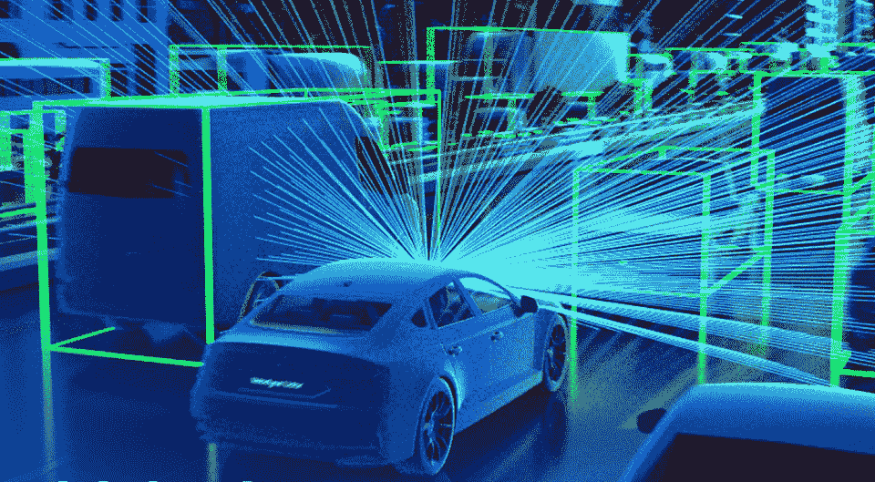
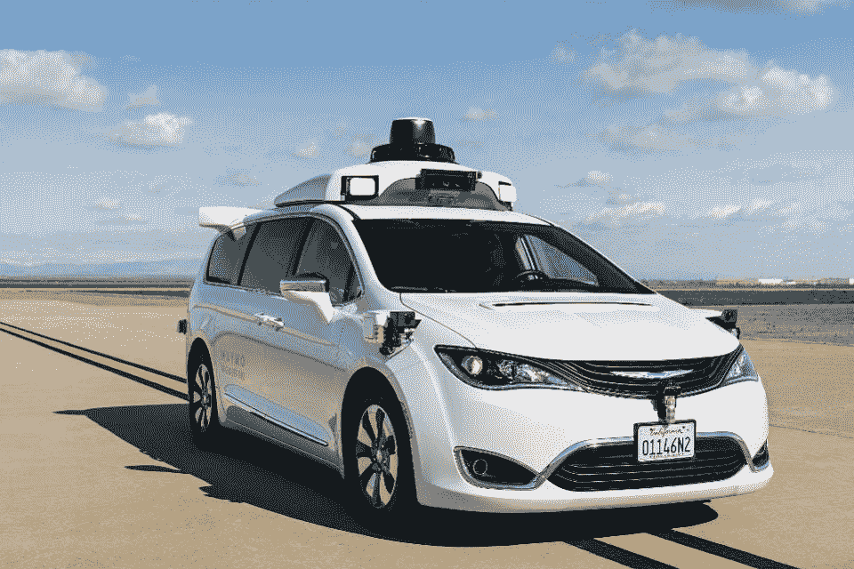
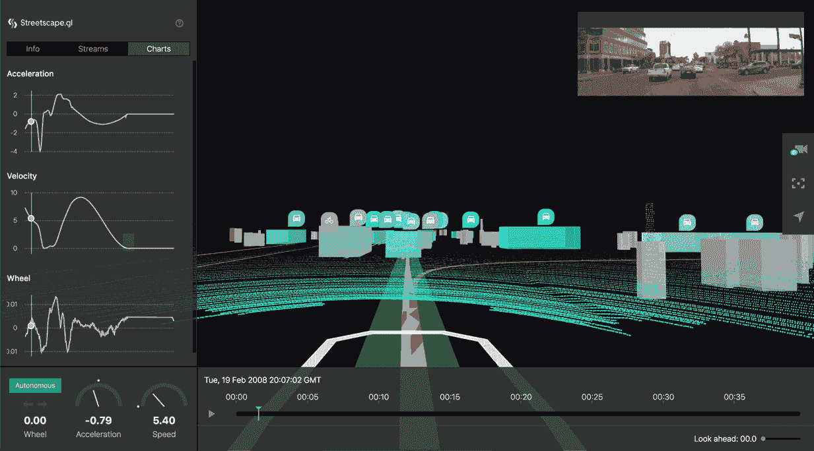
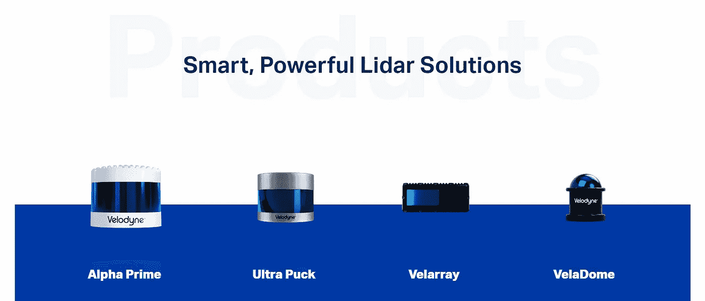

# SPACs 是 AV 初创公司的未来

> 原文：<https://medium.datadriveninvestor.com/spac-secures-self-driving-car-accessory-startup-800d2bfd659d?source=collection_archive---------6----------------------->

## 字节/大小

## 威力登上市:解释激光雷达和特殊目的收购公司

[](https://www.google.com/url?sa=i&url=https%3A%2F%2Fwww.forbes.com%2Fsites%2Falanohnsman%2F2020%2F01%2F07%2Flidar-pioneer-velodyne-debuts-100-auto-safety-sensor-as-self-driving-cars-pace-to-market-slows%2F&psig=AOvVaw16F_NR4C-R7pwAAi2oysS9&ust=1595122353254000&source=images&cd=vfe&ved=0CAIQjRxqFwoTCPCBkYDU1eoCFQAAAAAdAAAAABAJ)

V elodyne 是一家专门从事的的初创公司，李莱特 **D** 检测 **a** 和 **R** 变更技术，简称 LIDAR 这是一个很好的定位，尤其是因为他们将是未来我们自主汽车霸主的供应商。

他们将通过一家名为 Graf Industrial Corp .的**特殊用途收购公司**(可归纳为非常性感的首字母缩略词**特殊目的收购公司**)上市。我们可以预计，未来会有许多硬件/自动车辆初创公司走上这条路。

好吧，我刚刚扔了一个爱尔兰炖菜的信息在你的大脑。我道歉。我将通过解释 LIDAR 和 SPACs 以及您为什么应该关心它们来补偿您。

# 激光雷达是驱动自动驾驶汽车的核心技术。

这也是我给我的新封面乐队命名的地方，我们做 90 年代莱昂纳尔·里奇歌曲的主题混音。

LIDAR 系统通常(并不总是)安装在自动驾驶汽车/其他自主车辆(AVs)的顶部:



[Forbes](https://www.forbes.com/sites/alanohnsman/2019/04/23/teslas-elon-musk-trashes-lidar-for-self-driving-cars-but-waymo-is-rolling-out-a-new-one/#3a6ccfae5a9d)

除了作为一个非常时尚的礼帽，激光雷达系统是帮助影音“看”的核心。

激光雷达系统就像一群绑在你车顶上的 TIE 战斗机——它们不停地发射激光。大多数以前都是旋转的，但是现代的更小，仍然可以 360 度观看。


“Pew pew pew”

每秒钟发出数千个激光脉冲。*每秒*当它们撞击物体并反弹回激光雷达时，会记录反射点，以构建三维点云。这是可以做到的，因为我们知道光有多快以及它能传播多远。

然后，该云可以被转换成汽车周围环境的三维表示。下面我们来看看优步是如何解决这个问题的:

[](https://eng.uber.com/avs-autonomous-vehicle-visualization/)

**威力登**是 LIDAR 市场的一大玩家。他们是这个领域的 og 之一，他们通过性感的小型激光雷达跟上了行业创新。

[](https://velodynelidar.com/)

如您所见，LIDAR 非常擅长于告诉汽车事物有多远，但并不擅长于告诉汽车它们是什么。因此，大多数当前的反车辆方法将 LIDAR 数据与相机+视觉识别数据相结合。

# SPACs


Photo by [M. B. M.](https://unsplash.com/@m_b_m?utm_source=medium&utm_medium=referral) on [Unsplash](https://unsplash.com?utm_source=medium&utm_medium=referral)

特殊目的收购公司。这些是华尔街用来迷惑你的新奇玩意儿吗？也许…

SPACs 是没有任何真正商业运作的公司。他们唯一的目的是在通过首次公开发行(IPO)筹集资金后收购一家私营公司。

我又来了，把那个爱尔兰炖菜扔进你的脑子里——让我们把它分解一下。

[](https://www.datadriveninvestor.com/2020/07/19/we-need-a-lot-more-than-data-how-startups-can-harness-ai/) [## 我们需要的不仅仅是数据:初创公司如何利用人工智能|数据驱动的投资者

### 你打开手机，进行眼科检查，发现自己 3-5 年后患老年痴呆症的风险，即使你没有…

www.datadriveninvestor.com](https://www.datadriveninvestor.com/2020/07/19/we-need-a-lot-more-than-data-how-startups-can-harness-ai/) 

归根结底，一个公司只是纸上的几个字。有了这些信息，投资者和行业专家有时会组成一个特殊目的收购公司，目标是**收购该行业的一家私人公司**。

这就像一个真正的富家子弟在学校没有真正的学习计划，只是想知道你应该付钱给谁来做你的作业。


Photo by [NeONBRAND](https://unsplash.com/@neonbrand?utm_source=medium&utm_medium=referral) on [Unsplash](https://unsplash.com?utm_source=medium&utm_medium=referral)

SPACs 筹集资金(即资本)来帮助为这些收购/合并融资。他们通过**提供首次公开募股(T5)或上市来实现这一点。这是指公众投资者(你和我)可以购买私有公司的股票。)**

然后**特殊目的收购公司有大约两年的时间购买/合并它想要的公司**。交易完成后，私人公司/创业公司基本上取代了股票市场上的特殊目的收购公司。这就像一个装满现金的空集装箱，或者“空白支票公司”。

**Graf Industrial corp .**(Graf:NYSE)是威力登进行反向并购的特殊目的收购公司——他们在 2018 年上市后筹集了超过 2 亿美元。

在这次即将到来的合并后，格拉夫将在技术资本主义的水域中接受洗礼，并更名为“VLDR”。

# 为什么这很重要？

首先，研究人员预测，自动驾驶汽车的进步最终将迫使我们将意识与它们融合，从而产生有机金属和智能 AVs。皮克斯的热门电影《汽车总动员》(2006)对这一未来进行了早期预测。

好吧，也许不完全是这样。


但是无人驾驶汽车市场的价值接近 250 亿美元，并且在 2025 年之前将保持 18%的增长率。它们有巨大的潜力来减少车祸和死亡，甚至可能有助于应对气候变化。

然而，激光雷达可能不是未来。有些人(比如一个叫埃隆·马斯克的家伙——也许你听说过他？)称激光雷达为拐杖，我们应该开发视觉识别技术使其过时。

值得称赞的是，一些研究已经指向这个方向。

在商业方面，初创公司的创始人都希望最终“退出”，这意味着:

1.  将你的公司出售给一家更大的公司，以清算你的股权(即把它变成现金)…
2.  …或者进行 IPO。这意味着如果你愿意，你可以卖掉你的股份，买一辆兰博基尼。

SPACs 已经成为创业公司越来越受欢迎的选择。

与高盛这样的大型投资银行进行 IPO 是复杂的，谈判和利益相关者比感恩节晚餐还要多。

特殊目的收购公司谈判更简单，他们为资本提供了一些确定性，这对于像威力登或 Nikola 这样的资本密集型运营公司来说是至关重要的，Nikola 是一家电动汽车公司，也与特殊目的收购公司一起上市。

预计会有更多公司(尤其是汽车初创公司)倾向于这条道路，而不是传统的 IPO。拿我来说，我仍在为我的莱昂纳尔·里奇翻唱乐队寻找投资。


```
Helping you digest concepts in **business** + **tech** news.
```

(我想我应该说完全披露，我在我在这里谈到的任何公司都没有职位)。

**访问专家视图—** [**订阅 DDI 英特尔**](https://datadriveninvestor.com/ddi-intel)