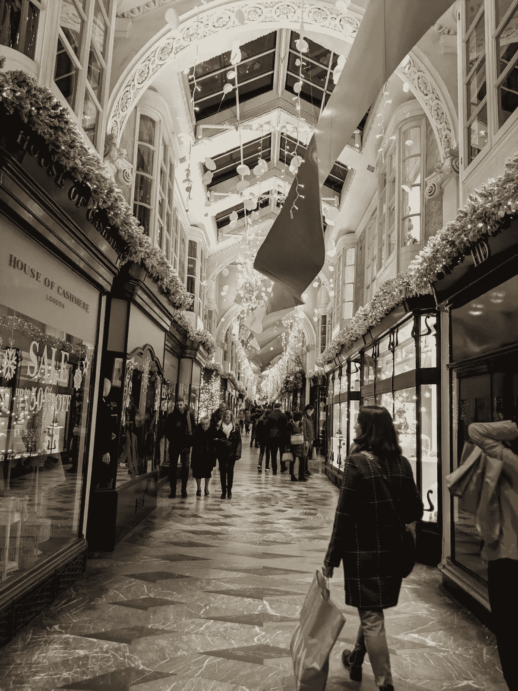

# 时空和后日冕经济

> 原文：<https://medium.datadriveninvestor.com/space-time-and-the-post-corona-economy-365909fd9e75?source=collection_archive---------18----------------------->

一百年来，人类求助于阿尔伯特·爱因斯坦来寻找物理世界提出的难题的答案。通过结合空间和时间，爱因斯坦创造了对物理宇宙的后牛顿理解。相对论发表一百多年后，西班牙流感爆发一百年后，疫情提出了另一个难题，困扰着我们这个时代的科学和政治机构。

通过社会距离，我们试图控制这种新冠肺炎疫情的传播。一种我们知道的病毒肯定是致命的，即使就其传播和死亡率而言它是一个谜。目前，将人们隔离在物理空间中以降低传播率(繁殖率或 R0)几乎是全世界普遍采用的策略。虽然这是各国政府的短期应对措施，但这种方法的挑战将在未来几周内变得越来越明显。

当我们在等待疫苗的成功开发或可靠治疗方法的出现时，经济学家和政策制定者陷入了困境，他们不知道如何在减轻医疗灾难的同时，防止人们就地避难可能导致的经济灾难。这个难题的核心是重新思考经济如何在保持社会距离的情况下运行。

 [## 现金为王，比我们想象的更强大|数据驱动的投资者

### 2020 年 3 月 12 日，在川普总统宣布新冠肺炎进入国家紧急状态的前夕，纽约时报报道…

www.datadriveninvestor.com](https://www.datadriveninvestor.com/2020/03/26/cash-is-king-more-potent-than-we-think/) 

与以前的流行病不同，迄今为止，互联网是抗击这种疾病的一个巨大工具，它能够传播关于疾病的信息以教育人们，允许收集信息以追踪和限制传播，并提供了在此期间保持联系、娱乐和理智的途径。现在的难题是如何利用技术提供的各种新工具，并借鉴历史经验来减少这种蔓延的负面影响。我们各国政府面临的挑战是，一方面要平衡经济，另一方面要满足紧迫的卫生保健需要。

此时，人们的思维转向了近一个世纪前(大约 90 年)的另一个现象，那就是大萧条。接着，英国经济学家约翰·梅纳德·凯恩斯驳斥了市场力量在萧条后自行稳定经济的观点。凯恩斯鼓励政府支出，保持就业率上升，从而保持对商品和服务的高需求，这反过来会导致经济引擎启动，导致增长乘数。保持高就业率，让人们有足够的收入来消费商品和服务，是从这次经济衰退中反弹的关键一环。

那么，一百年前的所有这些事件向我们暗示了什么是走出这一由 Covid 19 引发的困境的可行策略呢？再一次回到那位科学神谕，人们或许可以看到一条利用爱因斯坦的时空维度的前进道路。

在城市和工作场所，一般来说，在允许工作继续进行的同时通过空间将人们分开是非常困难的，然而我们确实有第四维时间，在这个时间中，人们可以被分开，同时占据相同的物理空间。因此，现在可能是时候考虑将我们的城市转变为真正的 24 小时活跃经济区，工人轮班，智能设备控制客户流。这种转型可以提高就业率，增加基本和非基本服务和商品的可获得性，创造一个更具活力、令人期待的新经济。鉴于封锁的第一批受害者是商业街，让人们出来消费对于扭转这一趋势至关重要。合理的工资和更高的就业率将有助于重建商业街。在中短期内，必须使用接触者追踪和一定程度的人群监测。这也不一定会过分侵犯隐私。在某些情况下，人们可以使用元数据来识别人群，然后部署地面人员来驱散人群。然而，在某些情况下，似乎至少在近期需要进行个人追踪和跟踪。

缓慢开放经济似乎是一个不体面的，甚至是危险的想法。当病毒传播到伦敦时，市长减少了伦敦地铁的列车数量，以鼓励人们呆在家里，不要使用公共交通工具。这反而导致人们更多地挤在缩减的服务中，而不是呆在家里。公众反应、公众心理和政策并不同步。公众对政策的反应至少是滞后的。以有限的特别方式缓慢开放经济也可能导致类似的错误。更多的火车和更少的人会导致更少的人群。建议企业和个人关闭，同时让公共基础设施保持满负荷开放，甚至扩大容量，这将降低人们的集中度。在开放经济的同时，情况也可能如此。延长商店营业时间，控制顾客和公众的进出，增加商店和办公室的班次，很可能会提高就业率，恢复正常的消费支出，保持社会距离。

即使延长营业时间几个小时，也会导致人流和购物时间不成比例地增加。例如，考虑到伦敦牛津街的人流大多集中在午餐时间或晚上 6 点到 7 点办公室关门的时候，改变工作和办公时间表会让人群错开，并可能在很大程度上通过消费让资金流回流，同时保持一定程度的社交距离。除了测试和自我隔离，这些措施应该有助于重启经济。

借助我们的智能设备和互联网支持的经济和社会系统，爱因斯坦的第四维时间开辟了许多可能性。解决办法可能在于扩大容量，而不是倾向于逐渐开放而减少容量的方法。在更长的时间内打开更多的空间，让人群交错流动，以管理距离，即使表面上看起来与直觉相反。