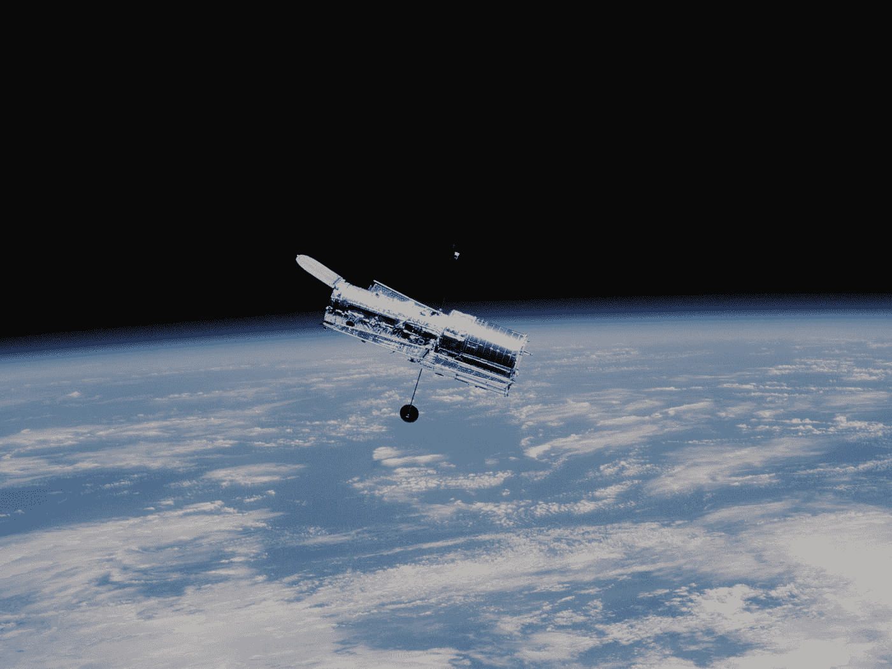

# 时空|创意灵感散文

> 原文：<https://medium.datadriveninvestor.com/spacetime-creative-inspirational-essay-f4a483cc9875?source=collection_archive---------21----------------------->

Photo by [NASA](https://unsplash.com/@nasa?utm_source=medium&utm_medium=referral) on [Unsplash](https://unsplash.com?utm_source=medium&utm_medium=referral)

许多小孩子梦想乘坐宇宙飞船升空，我有幸看到了一个陆地。后来，我看着宇宙，想知道离开家是什么样子。我问，在眼睛看不到的地方有什么。会不会是我排斥这种可能性，被这种氛围猛烈地摧残，就好像它试图让我变得如此古怪一样？从统计学上来说，没有，但我发现好奇心可以点燃激情的火焰。我见证了作为人类意味着什么的象征，我感受到了对太空探索的热爱。

我一直对技术特别是飞行有浓厚的兴趣。我的父母第一次带我乘飞机去佛罗里达，在 36，000 英尺的高空，我不知道那次经历会在地面上发生。在佛罗里达大西洋海岸的那个凉爽的早晨，我们以为我们错过了。我们前往肯尼迪航天中心，这是美国国家航空航天局的所在地。它从云层中出现，战斗机在后面紧急起飞。我简直不敢相信我刚刚目睹的一切，亚特兰蒂斯号航天飞机经过漫长的降落后从国际空间站返回家园。那一刻，我的眼睛看到了一些最好的应用科学，它们都被一个铝制框架所包围，包括人类心理学、化学、物理学，甚至生物学。那时我还年轻，但这段经历历久弥新。它让我的眼睛永远仰望天空。

几年后，我发现自己仰望夜空，思考着必须马上逃离的一切。在某种程度上，有运气，但更重要的是，有人类的毅力。“追星”这句老话非常贴切。追求最大的科学成就只会在前进的道路上创造新的兴趣。这就是我如何找到我对天文学的热爱。天文学旨在观察天体，应用化学和物理学得出关于天体起源和演化的结论。对我来说，它给了化学，尤其是物理一个新的目标。我意识到我们有机会观察宇宙的年龄、浩瀚和真实。所以，很难不好奇外面还有什么。观察宇宙辐射背景，它显示了一个 138 亿年的系统的诞生，这个系统大部分是空的空间，数万亿个星系和数十亿万亿颗恒星。我只看到了宇宙难以置信的一小部分，但这足以探索一千光年。

我通常呆在家里，看着气体巨星在夏末的黄昏升起，同时火星挑战我们的竞赛。我画出了夜空，通过望远镜凝视着月亮，这是我们唯一踏上的另一个天体。这让我想到了尼尔·阿姆斯壮和巴兹·奥德林那天在全世界的注视下会看到什么。这个生命之球高贵地保存着进化和灭绝的每一个瞬间，历史和重建中的每一次骚动，每一次善与恶的行为，以及每一个孩子的诞生。这是我最喜欢的星球。我们现在尽情享受地球的美丽，它以来自地核的力量和韧性旋转，但它上面的光环正变得越来越伤痕累累。我意识到每个天体都有自己的视角，等待被探索，等待被讲述。行星、彗星和小行星。恒星、黑洞和超新星。它们是宇宙的地图和时间胶囊。计算光年，向后反射视角，想象物体尚未吸收的所有光线和记忆。我们的光将走向永恒。

那天在肯尼迪，空间和时间对我有利。因为它，我找到了观看太空奇观的爱好。天文学很有趣，因为我们永远无法观察到一些东西，有时我们只是运气好，发现了一些东西，但重要的是我们看了。我们是孤独的吗，宇宙的命运是什么，这一切为什么开始？这些问题的模糊性有朝一日有望因科技成就而变得越来越小。我只能希望我会观察新的发现并与之互动。我对天文学的热爱将永远改变我看待世界的方式。我把望远镜对准的地方将是光污染之外，超出我目前的视野，我每次都会遇到对人类意味着什么。