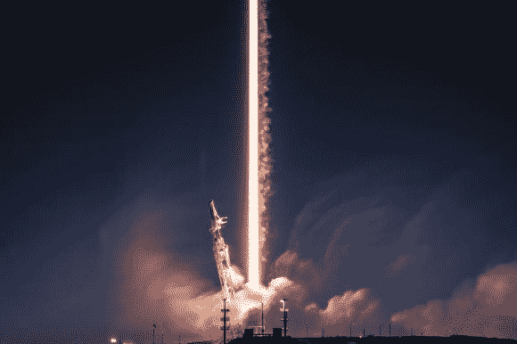
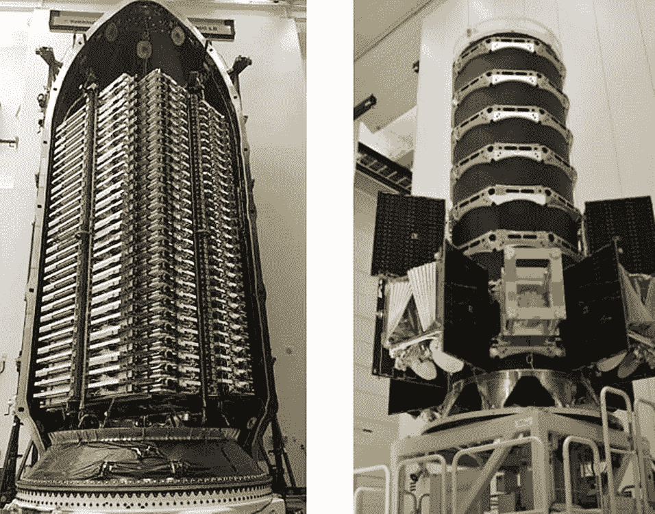
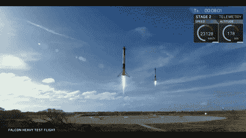
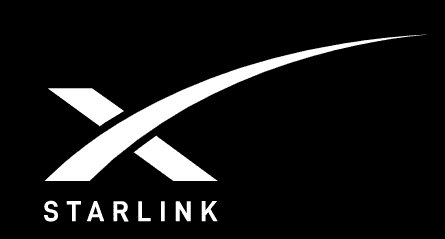
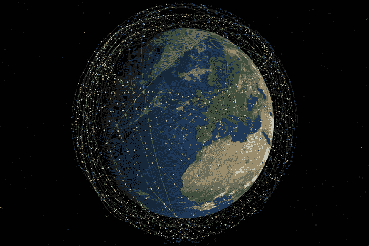
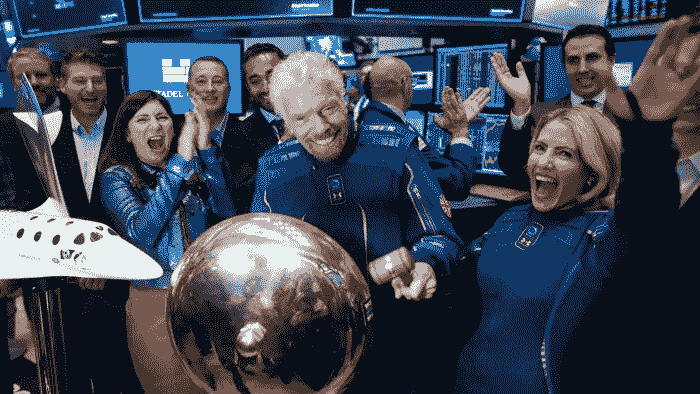
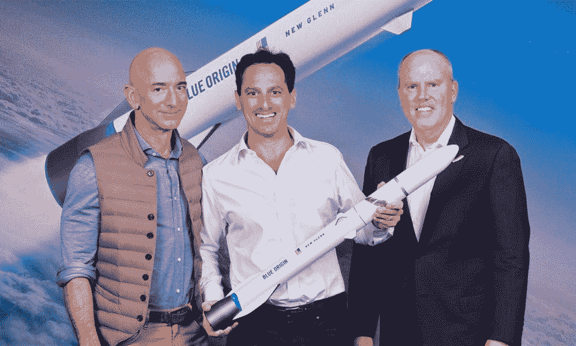

# SpaceX:通过廉价卫星改变世界

> 原文：<https://medium.datadriveninvestor.com/spacex-changing-the-world-via-cheap-satellites-f90b66724e36?source=collection_archive---------11----------------------->

**开始**

SpaceX 成立于 2002 年，旨在提供负担得起的太空运输服务，将人类带出地球，进入太空。2019 年底，SpaceX 在累计发射次数方面领先行业，是历史上任何公司中最多的。除了猎鹰 9 号火箭，该公司还有两个龙太空舱目前正在为国际空间站服务，并计划与美国宇航局签订五个合同，六个正在开发中，还有更多要跟进。SpaceX 还开发了一系列其他航天器，包括:猎鹰重型火箭、通信卫星和载人龙 2 太空舱。2019 年 12 月，SpaceX 完成了连续第 77 次猎鹰 9 号发射。

Flacon 9 Launch — TimelaplsePhoto: SpaceX

SpaceX 公司最近成功地[发射了](https://www.space.com/spacex-starlink-2-satellites-night-sky-visibility.html)他们的猎鹰 9 号火箭的升级版，携带 60 颗卫星。多年来，俄罗斯的质子-M 火箭比猎鹰 9 号更可靠，但仍然昂贵得多。SpaceX 公司也在准备美国宇航局的[任务](https://spacenews.com/spacex-wins-contract-to-launch-nasa-small-astrophysics-mission/)，该任务将发射数十颗卫星。

60 Starlink satellite stack Photo: SpaceX

**SpaceX 的前提**

spaceX 的前提是证明私营公司不仅可以开发支持人类火星任务所需的设施，还可以在一定程度上以一定的价格证明私营太空任务的可靠性。SpaceX 使用的猎鹰重型(Falcon Heavy)还必须能够进行几次空间站补给运行，并且还必须能够在飞行后回收其猎鹰 9 级，以检查其系统。如果这些要求能够得到满足，发展的一次性运载火箭(EELV)和国际空间站(ISS)赞助的计划不仅可以执行许多 NASA 赞助的货运任务，而且还可以执行私人赞助的载人火星任务。

SpaceX Falcon 9 boosters landing Photo: SpaceX

**进入低成本互联网时代**卫星网络

许多公众认为 SpaceX 只是另一家依赖政府合同和研究来维持运营和盈利的公司。这种思维模式将在不久的将来受到挑战，因为 SpaceX 正在推出一个低成本的互联网卫星网络，该网络将为消费者提供高速互联网，并为企业提供互联网接入。这个网络叫做 *Starlink* 。这一新举措是该公司迄今为止最大的商业任务，正在帮助 SpaceX 为能够在地球轨道以外提供服务的商业卫星铺平道路，并将帮助 SpaceX 为世界各地的公众和企业提供更可靠的服务。

为了建立这个网络；SpaceX 计划发射**1584 颗卫星**。该公司已经在 2019 年 5 月开始发射卫星，预计将在 2020 年完成多达 38 次发射。这个低成本的互联网卫星网络将帮助世界各地的企业和政府为他们的公民提供*“可靠、高速”*的互联网接入。这也将提高互联网服务提供商目前未覆盖的低收入地区的网速。

Starlink Constellation visualization — Photo: Universe Today

**估值**

SpaceX 是私有的。2015 年[该公司估值为 120 亿美元](https://web.archive.org/web/20150121094554/http://newsdaily.com/2015/01/spacex-raises-1-billion-in-funding-from-google-fidelity/)。然而，到了 2020 年，该公司的估值达到了 520 亿美元，这主要归功于 starlink 的推出。这是一个惊人的跳跃，但对于一家不受公开市场动荡和压力影响的私人公司来说并不罕见。尤其是在与地球上每一个互联网服务提供商(ISP)竞争的前提下。

 [## 一个企业在肚子上移动:如何照顾直觉|数据驱动的投资者

### 事实证明，直觉不仅仅是一种感觉。科学很清楚:你的直觉比你知道的更多…

www.datadriveninvestor.com](https://www.datadriveninvestor.com/2018/11/09/a-business-moves-on-its-stomach-how-to-make-allowances-for-gut-feelings/) 

另一方面，维珍银河( [SPCE](https://www.marketwatch.com/investing/stock/spce) )是你可以与 SpaceX 相比的最接近的上市公司，因为它是非政府的，并提供专属于太空的服务(与 ULA 形成对比的是:[波音](https://www.google.com/search?rlz=1C1GCEV_enCA869CA869&sxsrf=ACYBGNRyuxQJUXuEW7L_hBkTXdzaHENC3w:1579008318044&q=Boeing&stick=H4sIAAAAAAAAAOPgE-LUz9U3SMrNKSlX4gAxDc0t0rUMMsqt9JPzc3JSk0sy8_P084vSE_MyqxJBnGKrgsSi1LwSBWTBRaxsTvmpmXnpABrv31NSAAAA&sa=X&ved=2ahUKEwiByJOvmIPnAhUmAZ0JHWfiBdEQmxMoATAregQIDRAV)，[洛克希德马丁](https://www.google.com/search?rlz=1C1GCEV_enCA869CA869&sxsrf=ACYBGNRyuxQJUXuEW7L_hBkTXdzaHENC3w:1579008318044&q=Lockheed+Martin&stick=H4sIAAAAAAAAAOPgE-LUz9U3SMrNKSlX4gAxM7IL87QMMsqt9JPzc3JSk0sy8_P084vSE_MyqxJBnGKrgsSi1LwSBWTBRaz8PvnJ2RmpqSkKvolFJZl5AIsXridbAAAA&sa=X&ved=2ahUKEwiByJOvmIPnAhUmAZ0JHWfiBdEQmxMoAjAregQIDRAW))。维珍银河的估值为 25.1 亿美元。

Sir Richard Branson rings the bell at the New York Stock Exchange on Monday to mark Virgin Galactic’s trading debut Photo: AFP/Getty

Blue Origin 是这里值得一提的另一家公司，因为它是一家非政府公司，专注于可重复使用的火箭，并提供全球卫星互联网服务。然而，这不是一家上市公司(它由亚马逊的杰夫·贝索斯所有)。

Blue Origin founder Jeff Bezos (left) hopes to start launching the New Glenn rocket in 2021 Photo: BLUE ORIGIN

**隐藏的机会**

对“太空”重要的一切对 SpaceX 也很重要，而对埃隆·马斯克重要的大多数事情对他的许多批评者来说都无关紧要。

SpaceX 的计划中有几个隐藏的机会，公众可能无法获得，那就是使用 Starlink 互联网服务进行远距离高频交易(HFT)。电磁波在太空中的传播速度比空气或电缆快，所以如果 Starlink 能够超过目前 HFT 交易所需的速度，他们将会发现一座金矿。SpaceX 的另一个机会是垄断向火星的运输。SpaceX 高级太空运输系统(如果得到证实)可能是各国发射火星任务的唯一廉价、可靠和有效的方式。这将最终超越纯粹基于科学的太空任务，走向太空采矿。

> 电磁波在空间中的传播速度比空气或电缆快
> 
> 迈克·哈萨巴拉

总之，SpaceX 的盈利和可持续发展之路并不明朗，但机遇和公司的成功超过了对相关风险的任何担忧。

如果你对这篇文章有任何问题，或者想讨论更多，了解更多，或者获得更多的分析，请通过[https://mhassaballa.com/contact-me/](https://mhassaballa.com/contact-me/)联系我