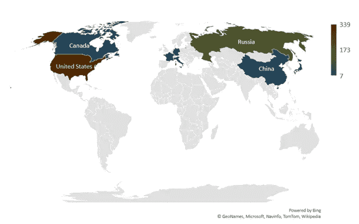

# 太空探索技术公司 vs 维珍银河——太空旅游业务主导地位的竞赛

> 原文：<https://medium.datadriveninvestor.com/spacex-vs-virgin-galactic-the-race-to-a-space-tourism-business-dominance-396c310f4de5?source=collection_archive---------13----------------------->

只有 566 个人去过太空。这些人 85%以上来自三个民族。他们中一半以上来自美国。那些去过太空的人的经历塑造了人类在艺术、文学和科学方面对宇宙的看法。如果更多的人可以去太空旅行，肯定会有大量的需求。

*Number of people who have been to Space by country*

# "只有 566 个人去过太空。"

也许真的有其他体验可以提供相当程度的刺激，比如跳伞、潜水，甚至是 6700 美元的零重力 7 分钟失重体验。许多人都梦想着去太空，甚至是去近地轨道。然而，一般公众获得这种体验的机会传统上是有限的或不可获得的。这主要是因为去太空的概念在很大程度上与科学发现或证明世界超级大国的技术优势联系在一起。然而，随着几十年来技术的进步，将 1 千克质量送入轨道的成本逐年下降。在美国宇航局航天飞机项目期间，成本为每公斤 54，500 美元，今天这一成本为每公斤 22，500 美元。这一成本预计在未来会下降更多。NASA 的目标是到 2040 年将成本降低到三位数，到 2060 年降低到一位数。

值得讨论这两种空间体验之间的区别；第一个是在近地轨道，类似于宇航员在国际空间站的经历。第二个是超越较低的空间轨道，类似于阿波罗登月任务。理解这种区别很重要，因为实现这种体验所需的技术以及资助和开发这种体验所需的资源存在显著差异。传统上，低地球轨道和超低地球轨道类型的经验都是由像美国和俄罗斯这样的民族国家公开协调和资助的。迄今为止，没有任何私人或商业公司能够将个人送上国际空间站或月球。因此，经历过太空旅行的个人总是受到负责太空旅行的民族国家的批准和审查。直到 SpaceX 和维珍银河诞生。

# 商业航天公司

Space X 由埃隆·马斯克于 2002 年创建，其使命是让人类在星际间旅行，而维珍银河由理查德·布兰森于 2004 年创建，其使命是成为地球的太空线。虽然这两家公司开发的技术和解决方案可以让普通公民体验太空旅行，但他们的理由却截然不同。对于 Space X 来说，中期目标是创建一个运输系统，帮助人类到达火星，而维珍银河的目标是创建一个解决方案，帮助更多的人获得太空体验。当我们从宇航员训练、飞船二号中舒适的座位和时尚的宇航服等方面调查维珍银河的太空经历时，这一点对我们来说非常清楚，而 SpaceX 则没有明确的首次绕月私人太空旅行计划和他们名为 Starship 的飞船内部空间的设计。

*Virgin Galactic (Right) vs. Space X (Left) Space Suits*

从商业角度来看，这里的主要想法是，维珍银河的货币化和可持续盈利时间比 Space X 短得多。这就是为什么维珍银河选择上市(SPCE)，而埃隆·马斯克将 Space X 保留为私营公司，唯一的例外是其全球卫星互联网网络“Starlink”可能会剥离，这可能会提前盈利。对于维珍银河和 Space X 来说，获得可行的太空旅游业务将取决于客户的成本，以及安全和能够提供难忘的体验。

 [## SpaceX Starship 是一项好投资的 3 个理由|数据驱动型投资者

### 七年前，埃隆·马斯克发布了星际飞船，作为世界上第一个完全可重复使用的重型运载火箭，能够…

www.datadriveninvestor.com](https://www.datadriveninvestor.com/2019/12/28/3-reasons-the-spacex-starship-is-a-good-investment/) 

# 到达终点线的挑战

通往终点线的道路总是充满挑战，正如 SpaceX 经历的那样，前九枚火箭在该公司能够将其火箭送入轨道之前爆炸。SpaceX 公司还丢失了用于测试其新飞船 SN4 的设备。至于维珍银河，该公司在 2014 年的一次试飞中失败，一名飞行员丧生。

Space X 的“亲爱的月亮”为期 6 天的太空旅游任务无疑比维珍银河设立了更高的标准。私人绕月旅行于 2018 年宣布，计划于 2023 年进行，载着一名日本亿万富翁和 6~8 名艺术家绕月旅行，以激发艺术家创作新艺术。值得注意的是，每位乘客的成本尚不清楚，然而，2019 年透露，如果 Space X 载着太空游客前往较低的太空轨道登上国际空间站，成本将在 5200 万美元左右。虽然很不确定 Space X 是否真的能够兑现对他们第一个[客户](https://www.datadriveninvestor.com/glossary/client/)的承诺，但维珍银河能够设定一个更现实的目标，在 2020 年进行飞行测试，并准备在 2021 年以每位乘客 25 万美元的价格将私人客户送上近地轨道。几年来，维珍银河一直在建立一个客户管道，目前已经有 700 个预订。

要到达终点线，两家公司的最后一个障碍是能够确定和完善备受追捧的太空旅行体验。他们都将面临一些监管审查，以便能够经营太空旅游业务，这种对太空旅游的需求必须继续增长，以使他们长期获得成功。

# 参考

[【1】](https://www.datadriveninvestor.com/2020/11/25/spacex-vs-virgin-galactic-the-race-to-a-space-tourism-business-dominance/#_ftnref1)“太空旅行者姓名列表——维基百科。”[https://en . Wikipedia . org/wiki/List _ of _ space _ travelers _ by _ name](https://en.wikipedia.org/wiki/List_of_space_travelers_by_name)2020 年 11 月 3 日访问。

[【2】](https://www.datadriveninvestor.com/2020/11/25/spacex-vs-virgin-galactic-the-race-to-a-space-tourism-business-dominance/#_ftnref2)【首页——零重力】[https://www.gozerog.com/home/](https://www.gozerog.com/home/)。2020 年 11 月 3 日访问。

[【3】](https://www.datadriveninvestor.com/2020/11/25/spacex-vs-virgin-galactic-the-race-to-a-space-tourism-business-dominance/#_ftnref3)“近期航天发射成本大幅降低——TTU……”2018 年 7 月 8 日，[https://ttu-ir.tdl.org/handle/2346/74082](https://ttu-ir.tdl.org/handle/2346/74082)。2020 年 11 月 3 日访问。

[【4】](https://www.datadriveninvestor.com/2020/11/25/spacex-vs-virgin-galactic-the-race-to-a-space-tourism-business-dominance/#_ftnref4)“先进的太空运输计划说明书——美国国家航空航天局。”2008 年 4 月 12 日，[https://www . NASA . gov/centers/Marshall/news/background/facts/astp . html](https://www.nasa.gov/centers/marshall/news/background/facts/astp.html)2020 年 11 月 3 日访问。

[【5】](https://www.datadriveninvestor.com/2020/11/25/spacex-vs-virgin-galactic-the-race-to-a-space-tourism-business-dominance/#_ftnref5)“近地轨道——欧空局。”2020 年 3 月 2 日[https://www . ESA . int/ESA _ Multimedia/Images/2020/03/Low _ Earth _ orbit](https://www.esa.int/ESA_Multimedia/Images/2020/03/Low_Earth_orbit)。于 2020 年 11 月 10 日访问。

[【6】](https://www.datadriveninvestor.com/2020/11/25/spacex-vs-virgin-galactic-the-race-to-a-space-tourism-business-dominance/#_ftnref6)“阿波罗计划是什么？| NASA。”2019 年 7 月 18 日，[https://www . NASA . gov/audience/for students/5-8/features/NASA-knows/what-was-Apollo-program-58 . html](https://www.nasa.gov/audience/forstudents/5-8/features/nasa-knows/what-was-apollo-program-58.html)。于 2020 年 11 月 10 日访问。

[【7】](https://www.datadriveninvestor.com/2020/11/25/spacex-vs-virgin-galactic-the-race-to-a-space-tourism-business-dominance/#_ftnref7)“维珍银河控股有限公司(SPCE)股票价格，新闻……”https://finance.yahoo.com/quote/SPCE/。于 2020 年 11 月 10 日访问。

[【8】](https://www.datadriveninvestor.com/2020/11/25/spacex-vs-virgin-galactic-the-race-to-a-space-tourism-business-dominance/#_ftnref8)“官方:试飞失败，1 名飞行员死亡，1 人受伤——CNN。”[https://www . CNN . com/2014/10/31/us/spaceship two-incident/index . html](https://www.cnn.com/2014/10/31/us/spaceshiptwo-incident/index.html)。于 2020 年 11 月 10 日访问。

[【9】](https://www.datadriveninvestor.com/2020/11/25/spacex-vs-virgin-galactic-the-race-to-a-space-tourism-business-dominance/#_ftnref9)“#亲爱的月亮。”[https://dearmoon.earth/](https://dearmoon.earth/)。于 2020 年 11 月 16 日访问。

[【10】](https://www.datadriveninvestor.com/2020/11/25/spacex-vs-virgin-galactic-the-race-to-a-space-tourism-business-dominance/#_ftnref10)“这就是一张 5200 万美元的国际空间站门票能让你兴奋的地方。”2019 年 6 月 11 日，[https://www . wired . com/story/heres-a-what-a-a-5200 万美元-iss-will-get-you/](https://www.wired.com/story/heres-what-a-52-million-dollar-ticket-to-the-iss-will-get-you/) 。于 2020 年 11 月 16 日访问。

[【11】](https://www.datadriveninvestor.com/2020/11/25/spacex-vs-virgin-galactic-the-race-to-a-space-tourism-business-dominance/#_ftnref11)“跟随我们——维珍银河。”[https://www.virgingalactic.com/fly/](https://www.virgingalactic.com/fly/)。于 2020 年 11 月 16 日访问。

[【12】](https://www.datadriveninvestor.com/2020/11/25/spacex-vs-virgin-galactic-the-race-to-a-space-tourism-business-dominance/#_ftnref12)“维珍银河—维珍银河宣布第二季度……”2020 年 8 月 3 日，[https://investors . Virgin Galactic . com/news/news-details/2020/Virgin-Galactic-Announces-Second-Quarter-2020-Financial-Results/default . aspx](https://investors.virgingalactic.com/news/news-details/2020/Virgin-Galactic-Announces-Second-Quarter-2020-Financial-Results/default.aspx)。于 2020 年 11 月 16 日访问。

## 访问专家视图— [订阅 DDI 英特尔](https://datadriveninvestor.com/ddi-intel)