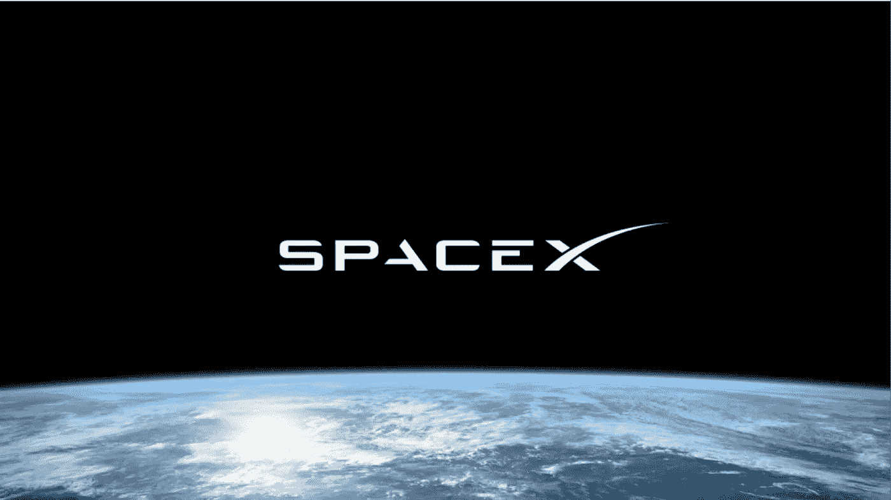
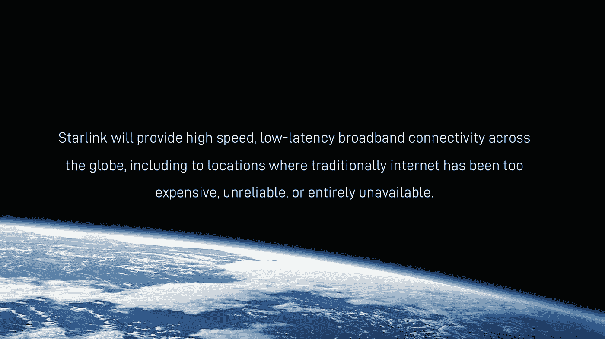
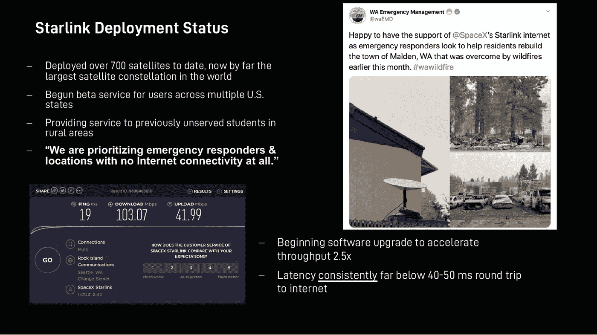
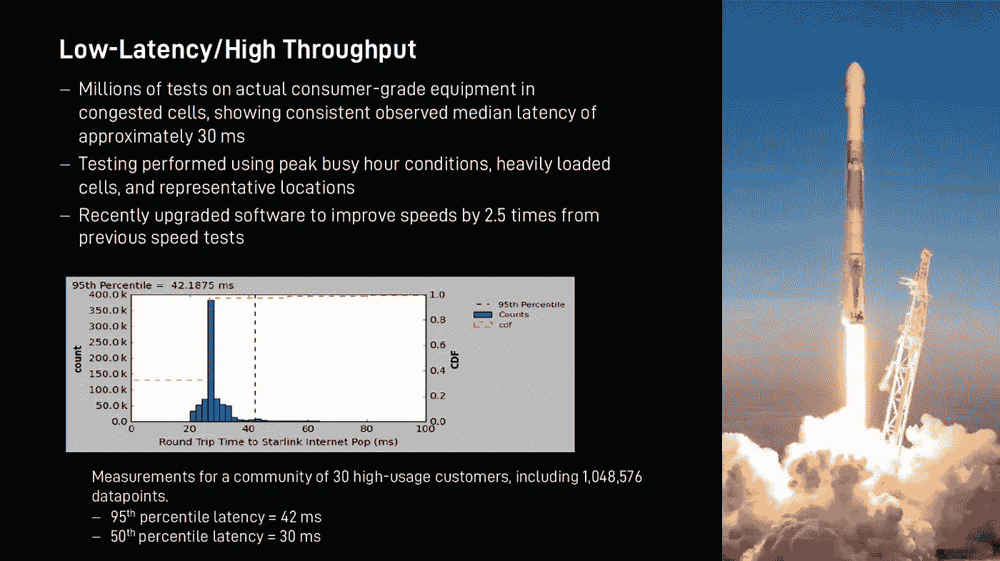
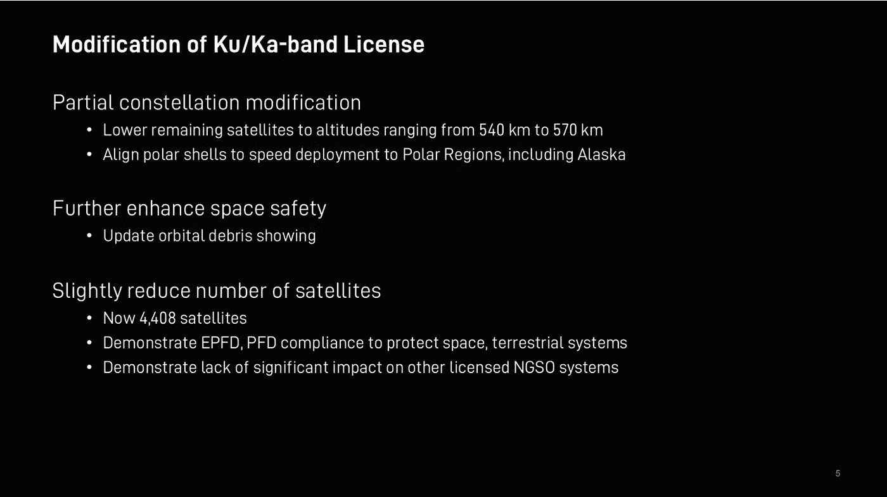
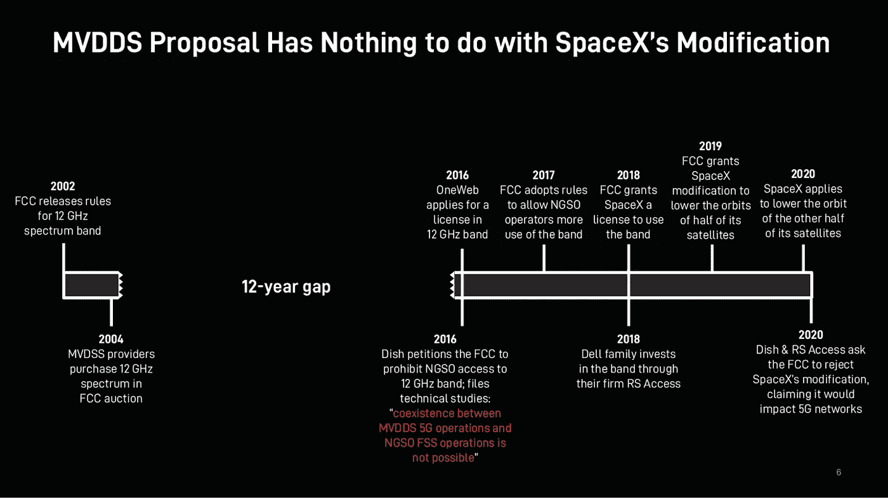

# SpaceX 的 Starlink 将测试扩展到民用

> 原文：<https://medium.datadriveninvestor.com/spacexs-starlink-expanding-beta-testing-to-civilians-866eea307bea?source=collection_archive---------4----------------------->

## **SpaceX 正在加速和扩大其全球高速宽带卫星互联网服务的 beta 测试**

(Credit: SpaceX/FCC)

# **1。** **什么是星联…**

几周前[我报道了 SpaceX](https://medium.com/predict/starlink-used-by-wa-states-military-bb2cd8aca83a) 对他们的 Starlink 互联网系统进行严格测试的努力(测试是由独立于产品开发公司的有限真实用户群对产品进行的后期测试)。根据最近提交给联邦通信委员会(FCC)的一份文件[显示，SpaceX 继续加速并向更多用户扩展 beta 测试。](https://ecfsapi.fcc.gov/file/101548191460/SpaceX%20IB%20Ex%20Parte%20(10-15-20).pdf)

具有分裂性、破坏性和巨大成功的企业家埃隆·马斯克已经开始建设他的全球宽带卫星互联网 [Starlink](https://en.wikipedia.org/wiki/Starlink) ，将互联网带给目前缺乏互联网的人们和地方。马斯克正处于建立庞大的甚低地球轨道(VLEO)卫星星座的早期阶段。根据最近联邦通信委员会的文件，该星座可能由多达 42，000 颗小型卫星组成，轨道高度从 328(低于国际空间站)到 1，200 公里。

(Credit: SpaceX/FCC)

六周前，我写了 Starlink 的简史，所以想了解更多关于该公司的信息，请点击下面的链接。

 [## SpaceX 的 Starlink

### 或许很快就能让高速卫星互联网进入您的家中！

medium.com](https://medium.com/predict/spacexs-starlink-high-speed-satellite-internet-to-your-home-soon-maybe-38d02eb0d072) 

尽管马斯克和 Starlink 距离构建整个 Starlink 星座还有数年时间，但在轨道上有足够的卫星为某些地区提供服务，并用于紧急情况。

这正是他们正在进行的测试。

# **2。** **最近在华盛顿州的 beta 测试…**

今年早些时候，Starlink 向华盛顿州提供了免费的卫星终端和互联网服务，作为私人测试的一部分。

华盛顿州的应急响应人员在 8 月份的野火中使用 Starlink 将互联网服务带到了受灾严重的地区。

华盛顿州马尔登市在劳动节前后遭遇火灾，摧毁了该镇大约 80%的建筑。他们收到了华盛顿应急管理部门(WA EMD)设立的 SpaceX 终端。

Starlink 的具体[用途包括使用终端协调水滴到火上，请求 WA EM 提供额外的支持、资源和补给。](https://www.theverge.com/2020/9/29/21493158/spacex-starlink-internet-washington-emergency-wildfires-first-responders)

[WA EMD](https://techcrunch.com/2020/09/29/starlink-puts-towns-devastated-by-wildfires-online-for-disaster-relief-workers/) 已经计划了几个更大的灾难，包括来自附近卡斯卡迪亚俯冲带的大地震，他们预计这可能会使该地区停电数周。

WA EMD 的一位发言人在谈到 Starlink 时说，“如果我们遇到更多的野火或甚至更大的灾难，这是一种我们肯定可以利用的设备”。

# **3。** **星联的 FCC 备案…**

SpaceX 几天前向 FCC 提交了一份文件，其中包括一份幻灯片演示，如下所示。

(Credit: SpaceX/FCC)

上面显示的状态幻灯片表明部署了 700 多颗卫星(他们批准了多达 42，000 颗卫星，尽管不清楚他们是否会实际部署这么多)。

我几周前的文章提到了华盛顿州的测试，以及美国军方不同部门的测试。SpaceX 的幻灯片提到了多个州的 beta 测试，尽管我不知道这是否包括我之前讨论的不同军事测试，或者民用 beta 测试现在是否正在进行。

重要的是，SpaceX 注意到软件的变化将吞吐量提高了 2.5 倍，往返延迟低于 40-50 毫秒(ms)。

对于地面网络，[一项研究](https://www.hindawi.com/journals/ijcgt/2009/530367/)表明，随着系统延迟超过 100 毫秒，在线游戏玩家的游戏乐趣会下降。通过网络控制遥控汽车的用户没有注意到 50 毫秒的延迟。最近的游戏宽带[文章](https://broadbandnow.com/guides/best-internet-service-setup-serious-gamers)建议游戏玩家应该寻找小于 75 毫秒的延迟。SpaceX 很容易就远远低于这些可以说是艰巨的要求。

(Credit: SpaceX/FCC)

SpaceX 随后展示的数据表明，在消费级设备上“拥挤的单元…高峰繁忙时间条件…代表性位置”的艰难消费者条件下，他们的中值延迟为 30 毫秒，第 95 百分位延迟约为 42 毫秒。所有这些都在必要的消费级甚至在线游戏玩家要求之内。

 [## 未来科技:Neuralink 更新|数据驱动的投资者

### 8 月 28 日，埃隆·马斯克提供了他的公司 Neuralink 的最新进展，该公司旨在创造植入式…

www.datadriveninvestor.com](https://www.datadriveninvestor.com/2020/09/03/futuristic-tech-neuralink-update/) 

然而，有报道称，beta 测试人员已经对 Starlink 的性能不满意了。这是 2020 年 8 月《独立报》的一篇文章，声称 Ookla 公司测试了 Starlink 的下载/上传速度，发现延迟在 31 到 94 毫秒之间。这是《独立报》在整理速度数据时称赞的 [Reddit 网站](https://www.reddit.com/r/Starlink/comments/i9w09n/list_of_confirmed_starlink_speed_tests/)。

绝大多数数据来自西雅图，但也包括洛杉矶、芝加哥和檀香山。

接下来的幻灯片开始变得很不稳定。SpaceX 讨论了对其卫星星座的一些修改，将“剩余”卫星降低到 540 至 570 公里。国际空间站大约在 409 公里处。以前的海拔高度高达 1200 公里，但也有低至 328 公里的。

(Credit: SpaceX/FCC)

SpaceX 还讨论了在包括阿拉斯加在内的极地地区对准一些卫星，通过控制空间碎片来加强空间安全，以及减少卫星总数。

然后 SpaceX 抛出了一些缩写词，EPFD 和 PFD。PFD 是“功率通量密度”，EPFD 是“等效功率通量密度”。

这些首字母缩略词指的是[法规](https://www.law.cornell.edu/cfr/text/47/25.208)和[计算](https://www.itu.int/en/ITU-R/space/WRS16space/WRS-16_EPFD.pdf)，它们是为了限制卫星广播信号干扰其他卫星和地面站而建立的。SpaceX 指出，他们的系统符合这些要求。

最后一张幻灯片讨论了似乎影响 SpaceX 的竞争问题。他们指的是所有首字母缩写词之母， [MVDDS](https://en.wikipedia.org/wiki/MVDDS') 。多频道视频和数据分发服务。维基百科说 MVDDS 是一个

*“…*[*地面*](https://en.wikipedia.org/wiki/Terrestrial_television) *基于* [*无线*](https://en.wikipedia.org/wiki/Wireless) *传输方法【其中】重用* [*直播卫星*](https://en.wikipedia.org/wiki/Direct_Broadcast_Satellite)*【DBS】频率，用于远距离分发多路视频和数据。*

*频谱在 12.2–12.7 GHz 范围内，提供快速下载，但需要其他频率进行上传。它被视为有线电视的潜在竞争对手，提供*)**或三重威胁服务(语音、数据、视频)……”**

**

*(Credit: SpaceX/FCC)*

*SpaceX 给 FCC 的[附信](https://ecfsapi.fcc.gov/file/101548191460/SpaceX%20IB%20Ex%20Parte%20(10-15-20).pdf)提到 MVDDS 被许可方试图对 FCC 目前关于 12 GHz 频段使用的规定进行修改。这些持牌人是谁？[公司](https://www.allnetinsights.com/blogs/news/five-important-ways-to-look-at-spectrum-featuring-the-mvdds-12-2ghz-spectrum)像 Dish，Cass 有线电视，Go Long 无线，RS Access，Vision Broadband 等。*

*据我所知，这些不是卫星运营商，而是运营地面网络的运营商，他们希望依靠卫星或其他网络来提供远程互联网主干。我不知道与 SpaceX 的纠纷到底是什么，但我可以想象这些公司更希望能够根据需要控制 Starlink。此外，人们可以想象这些公司将 Starlink 视为未来的潜在竞争对手，因为 Starlink 将能够直接接收和传输给安装了廉价卫星天线(马斯克现在著名的棍子上的 UFO)的消费者。我预见到这些其他持牌人试图推动修改 FCC 或其他法规，禁止卫星互联网运营商直接向消费者提供服务。*

*如果这真的发生了，你们每个人都需要努力取消对 SpaceX 的任何此类限制。无论是在地方、州、联邦还是国际层面，都要确保像 Dish 和上面提到的其他公司这样的 MVDDS 公司不会规避限制竞争的法规。确保 SpaceX 和 Starlink 继续免费向所有消费者的家庭和企业直接提供卫星互联网。*

# ***4。** **这对我们意味着什么……***

*Starlink 的基本目标是向全球各地提供低成本、高速宽带互联网，尤其是向目前缺乏此类接入的地区和人群。这就是这些私人测试如此重要的原因——验证 Starlink 在紧急情况等最关键的时刻在互联网薄弱地区提供服务的能力。*

*如果我们生活在这样的地区，我们将直接受益。*

*如果我们不这样做，我们还是会受益，因为世界各地的人们都在联系并寻找他们目前无法获得的产品、服务和内容。*

*我的第一篇 Starlink 文章提到了一个老生常谈的[涨潮](https://medium.com/predict/spacexs-starlink-high-speed-satellite-internet-to-your-home-soon-maybe-38d02eb0d072)举起所有的船，指的是马斯克扩大互联网接入的动机。当我们都能使用互联网等基础设施时，我们都会受益。*

*最后，马斯克提到，当 Starlink 的收入变得稳定和可预测时，他计划举行一次[首次公开募股](https://www.businessinsider.com/musk-plans-ipo-for-spacexs-starlink-business-2020-9) (IPO)，其中散户投资者(如果你正在阅读这篇文章，你可能有资格成为散户投资者，普通人，按照专业投资者的说法，应该是“傻钱”)。*

# ***5。** **披露……***

*我很高兴拥有几乎最古老的二手特斯拉 Model S，也很高兴投资了特斯拉公司。*

*你可能也会喜欢我最近对网飞及其文化的评论:*

* [## 网飞文化战争

### 好好看看一场有影响力但被误解的文化大革命

medium.com](https://medium.com/illumination-curated/reed-hastings-and-the-netflix-culture-wars-cfe8777e1a6a) 

Starlink beta 测试的最新回顾如下:

 [## 佤邦军方使用的 Starlink

### SpaceX 加快了 Starlink 互联网服务的 beta 测试，满足了军事紧急情况的严格要求…

medium.com](https://medium.com/predict/starlink-used-by-wa-states-military-bb2cd8aca83a) 

同样，Starlink 历史回顾在这里:

 [## SpaceX 的 Starlink

### 或许很快就能让高速卫星互联网进入您的家中！

medium.com](https://medium.com/predict/spacexs-starlink-high-speed-satellite-internet-to-your-home-soon-maybe-38d02eb0d072) 

这里有一个完全古怪的短篇故事，免费引用 SpaceX，我知道你会喜欢:

 [## 卡车停靠站

### 另一个早晨，在环绕土卫二的星际卡车停靠站

medium.com](https://medium.com/predict/the-truck-stop-c50feeeb0d0) 

## 访问专家视图— [订阅 DDI 英特尔](https://datadriveninvestor.com/ddi-intel)*