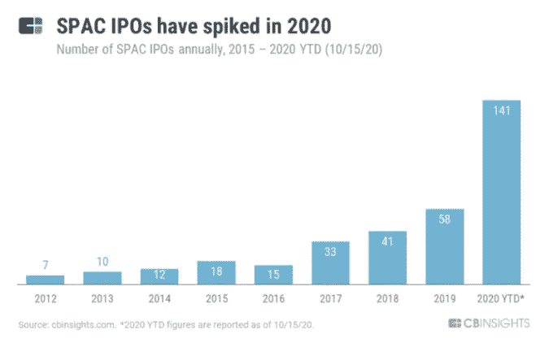
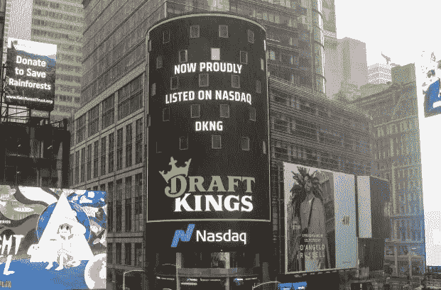

# SPACs:机遇还是泡沫？

> 原文：<https://medium.datadriveninvestor.com/spacs-opportunity-or-bubble-b5b937ba81c4?source=collection_archive---------3----------------------->

SPACs 已经存在了几十年，但由于新投资者的大量涌入、刺激措施和有利的货币政策，它在过去几个月里获得了牵引力。虽然 2020 年可以被视为许多非传统主题的回归年，但 SPACs 也大规模回归。

简单来说，特殊目的收购公司(特殊目的收购公司)是一家没有商业运作的空白支票公司，成立的目的是通过首次公开募股(IPO)筹集资金。

2020 年 1 月至 10 月，共有 165 家全球特殊目的收购公司 IPO 上市，是 2015 年的 5 倍。2019 年，只有“59 起”特殊目的收购公司 IPO 融资 136 亿美元。

A record number of SPACs in 2020\. Credit: [CBinsights](https://www.cbinsights.com/research/report/what-is-a-spac/)

让公司上市可能是一个漫长而乏味的过程。把特殊目的收购公司想象成首次公开募股的懒惰路线。一家公司可以简单地与一家已经上市的特殊目的收购公司公司合并，成为上市公司，而不是通过承销商。

# 分解它

不过，有个问题。投资者不知道特殊目的收购公司最终会与哪家公司合并。相反，他们必须相信领导层/顾问会找到一家有巨大潜力的公司。

由于特殊目的收购公司没有商业运作，它主要通过出售股票来筹集资金，领导团队通常在特殊目的收购公司未来将参与的特定行业拥有丰富的经验。通过出售股票筹集的资金存在一个**信托账户**中，如果特殊目的收购公司在 24 个月内没有收购一家公司，这些资金将连同利息返还给股东。

私营公司在同意与特殊目的收购公司合并后收到资金。在满足某些法律义务的一段时间后，特殊目的收购公司从交易所退市，该私营公司以全新的股票代码上市。

作为股东，是继续投资新合并的公司还是卖掉股份继续前进，这是**你的选择**。

> “在这非同寻常的一年，传统融资遭受了损失。SPACs 已经找到了向资金匮乏的公司注入所需资金的方法”——亚洲数字金融研究所金融科技培训负责人 Emir Hrnjic 博士

# IPO 与特殊目的收购公司

1.  时间框架:首次公开募股 8-12 个多月，特殊目的收购公司 3-4 个月
2.  尽职调查:IPO 需要承销商的尽职调查(例如:高盛)。潜在 PIPE 投资者进行的特殊目的收购公司尽职调查。私募股权投资(PIPE)是指私人投资者以低于当前市场价值的价格对上市公司进行大量投资。
3.  预测:IPO 招股说明书没有使用预测，而特殊目的收购公司在委托书中显示了预测。
4.  研究:IPO 将有股票分析师研究和承销商研究，而 SPACs 的研究有限

# **spac 的优势**

买家以 IPO 前的价格购买一只可能以高得多的价格开始交易的股票。散户投资者通常无法参与传统的 IPO。

这方面的一个很好的例子是沃伦·巴菲特以每股 120 美元的 IPO 价格对云数据平台雪花的 7.35 亿美元投资。当雪花(NASDAQ: SNOW)在交易所首次亮相时，其开盘价为 234 美元，这使得散户投资者从第一天起就处于劣势。有了 SPACs，散户投资者就有机会在价格上涨之前进行投资。

这使得个人投资者可以充当他们自己的私募股权基金。只需在你的交易所键入特殊目的收购公司的股票代码，你就能以 IPO 价格收购一家令人惊喜的公司。

**底价:10 美元。**

SPACs 的浮动价格为 10 美元，对公告、合并消息和领导层的推文反应强烈。如果你在 10-12 美元的范围内，在一个好的领导下，在一个趋势领域找到了一个特殊目的收购公司，你将会有一个不封顶的上涨空间和最大 16.6%的下跌空间(如果特殊目的收购公司从 12 跌到 10，就损失了)

由于 10 美元的基础价格，SPACs 可以用作现金储备，而不是持有流动现金，我们都知道在我写作时正在贬值。定价在 10-12 美元之间的特殊目的收购公司即使在市场下跌 8-12%时也能保持其价值。

2020 年特殊目的收购公司 IPO 击中了所有正确的点，因为它们主要集中在金融科技、电动汽车、医疗科技、游戏等热点和趋势领域。

这可能是散户投资者一直在等待的不对称风险回报赌注。

Photo by [Austin Distel](https://unsplash.com/@austindistel?utm_source=unsplash&utm_medium=referral&utm_content=creditCopyText) on [Unsplash](https://unsplash.com/s/photos/venture-capital?utm_source=unsplash&utm_medium=referral&utm_content=creditCopyText)

# SPACs 的风险

尽管有 2020 年的大肆宣传，但特殊目的收购公司 IPO 的历史回报率低于传统 IPO。谁知道呢，也许‘这一次，不一样了？’

除此之外，不知道哪家私营公司将被特殊目的收购公司收购的不确定性也被认为是一个不利因素。如果领导团队不执行，投资者的资本可能会被搁置长达两年而没有回报。投资者本可以在其他地方获得更好回报的资本**机会成本**应该被考虑。

另一个风险是，无法通过需要大量文件的传统 IPO 流程的可疑公司可能会选择通过通常要求较低的 SPACs。

一个相当可怕的例子是尼古拉汽车公司(NKLA ),纯粹由于炒作和乐观情绪，股价一路飙升至 94 美元，然后暴跌至 13 美元。尼古拉没有可行的产品，只有聪明的营销。

如果回报持平/最低，你愿意等多长时间？

你愿意对管理团队寄予多大的信任？

> 投资本来就有风险。然而，不投资风险更大。

[**点击这里**](https://ashainperera.medium.com/under-the-radar-spacs-for-2021-bc67367ce67) 来发现一些雷达下的**特殊目的收购公司 2021 年有上升潜力的精选。**

# **著名 SPACs**

**在线游戏巨头 Draftkings(纳斯达克代码:DKNG)与 Spinning Eagle acquisition corp 合并，股票在 13 个月内从 10 美元上涨到 53.70 美元，净收益 440%。**

****

**April 24th, 202- Draftkings listed on the NASDAQ. Credit: [NASDAQ](https://www.nasdaq.com/articles/latest-spac%3A-insight-into-draftkings-listing-2020-04-27)**

**在线房地产公司 Opendoor(纳斯达克代码:OPEN)与风险投资家 Chamath Palihapitiya 领导的社会资本 Hedosophia II 合并，净收益 160%，价格在 6 个月内从 10 美元上涨到 26.03 美元。**

**电动汽车充电公司 ChargePoint 与 Switchback energy(纽约证券交易所:SBE)合并，自 2019 年 9 月开始交易以来，涨幅为 310%。**

**Mountain Pass(NYSE: MP)，唯一一家在北美拥有稀土开采和加工场地的公司，目前交易价格为 31.87 美元，自 2020 年 6 月以来的业绩为 217%。**

# **跟踪垃圾邮件**

**与特殊目的收购公司保持联系的有用工具。**

1.  **筛选所有你需要知道的关于垃圾邮件的重要信息**
2.  **[特殊目的收购公司内幕](https://spacinsider.com/):特殊目的收购公司市场最新信息的可靠来源**
3.  **推特上的芬特威特:[安东尼·欧哈扬](https://twitter.com/AnthonyOhayon)，[乔伊·索立托](https://twitter.com/JoeySolitro)，[戴森斯德](https://twitter.com/deadnsyde)，[查马斯·帕里哈皮蒂亚](https://twitter.com/chamath)(特殊目的收购公司神)**

## **参考**

**什么是 spac & 2020 年的趋势| CB Insights Research (2021)。可在:[https://www.cbinsights.com/research/report/what-is-a-spac/](https://www.cbinsights.com/research/report/what-is-a-spac/)**

**空壳公司或 SPACs 名单(2021)。可在:[https://stockmarketmba.com/listofshellcompanies.php](https://stockmarketmba.com/listofshellcompanies.php)**

**家——捶桌子播客(2021)。可在:[https://poundingthetablepodcast.com/](https://poundingthetablepodcast.com/)**

**访问专家视图— [**订阅 DDI 英特尔**](https://datadriveninvestor.com/ddi-intel)**