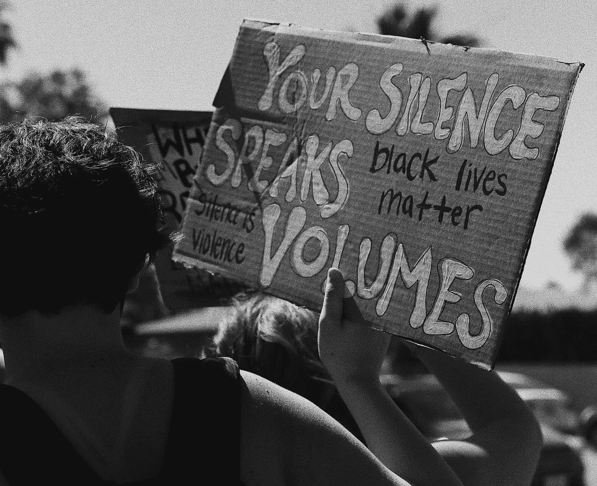

# 大声说出来，让别人听到！

> 原文：<https://medium.datadriveninvestor.com/speak-up-and-be-heard-91d23bd5c263?source=collection_archive---------20----------------------->

## 沉默的大多数不能保持沉默。现在是大声说出来并被倾听的时候了。

Photo by [Taylor Simpson](https://unsplash.com/@taylorgsimpson?utm_source=unsplash&utm_medium=referral&utm_content=creditCopyText) on [Unsplash](https://unsplash.com/s/photos/speak-up?utm_source=unsplash&utm_medium=referral&utm_content=creditCopyText)

我最近读了一篇文章，哀叹美国的大规模社会崩溃。说它令人沮丧和沮丧还不够。

对我来说这确实说明了一个非常重要的问题。沉默的大多数不能再沉默了。

我们不能一直对这个国家发生的事情做出反应。现在是积极主动的时候了。趁还不算太晚。

觉得自己什么都不会？不是真的。这个国家是建立在人们抛弃暴政的基础上的。

 [## 不是数据驱动的政治辩论投资者

### 《纽约时报》在 2020 年 6 月 3 日在线发表了阿肯色州参议员汤姆…

www.datadriveninvestor.com](https://www.datadriveninvestor.com/2020/06/08/the-political-debate-that-has-not-been/) 

是的，我知道有一种对革命战争的浪漫化，国父们是不完美的奴隶主，诸如此类。然而，这个想法的原则是我认为值得关注的。

沉默的大多数需要站起来，大声疾呼，不要让目前席卷这个国家的疯狂继续下去。

# 你怎么说出来的？

让我们一个一个地解决问题，好吗？

移民的集中营和笼子里的孩子？大声疾呼，要求媒体给予关注，并要求地方政府和国会对此采取行动。

DHS 针对美国人民部署的无标志警察部队？大声疾呼，要求国会和地方政府停止这种行为。这就是终极暴政，其影响太大，不容忽视。

如果允许继续下去，有什么能阻止他们变得和纳粹党卫军一样呢？

杀害无辜黑人后仍逍遥法外的警察？要求正义。警察不能凌驾于法律之上，不能因为他们是黑人就允许他们继续杀人。黑人的生命很重要。

如果你不认为警察部队的军事化是一个问题——有大量来自波特兰和其他警察社区的视频证据表明，他们兴高采烈地攻击他们应该保护的人。

当新冠肺炎仍在屠杀成千上万的人时，孩子们被送回学校？不，大声说出来，让人们知道经济不比教师、孩子和家庭的生命更重要。你是否意识到这可能会使经济崩溃，比已经遭受的还要严重？这种想法不合理。

检测不足，公共场合口罩无国家政策？不要让特朗普和他的政府无视现实。令人憎恶的是，死亡人数如此之多——而且还在上升！停止让专家被否定，而不是猜测和意见。

# 趁没有明天，现在就做吧

你能看出我生气了吗？嗯，我是。我认为这个国家更好——因为我仍然相信大多数人代表更好——我要求人们表明立场，畅所欲言。

我不想消极——但事实是，如果沉默的大多数不打破沉默，疯狂的、不讲道理的、不合逻辑的、可笑的少数人将摧毁这个国家和其中人民的生活。

新冠肺炎不应该杀死 140，000+人，而且还在上升。移民不应该在集中营。没有标志的联邦武装警察根本不应该存在。个人需要财政援助和医疗保健——大企业和亿万富翁不需要减税。生命是宝贵的——比金钱和财产更宝贵，而金钱和财产似乎是政府领导层关心的全部。

你能做什么？说点什么。大声点。除了保持沉默什么都可以做。沉默就是自满——这就是纳粹如何崛起的，也是这个国家如何濒临崩溃的。

世界上所有的变化都是从家里开始的。有你和我。如果我们不接受或致力于改变——它当然也不会来自其他地方。所以要靠我们自己去改变自己，用正念来掌控自己的生活。

通过保持沉默，大多数人并不积极主动。这种情况必须改变，否则就太晚了。

什么太晚了？一个处于戒严令下的国家，更明目张胆地被少数失去权力的人控制，而越来越多的人和他们的生活在企业贪婪、股市、金钱和狗屁权力的名义下被摧毁。

我们离这种可能的现实太近了，令人不安——这就是为什么沉默不再是一种选择。

# 大声说出来，被计算在内

林·曼努尔·米兰达的*汉密尔顿*中有一句很棒的台词与此时此地非常相关:

> "伯尔，如果你什么都不支持，你会爱上什么？"

如果在事情变得复杂和混乱的时候，你不表明立场并大声说出来，你会上当吗？你将允许人为的“现状”持续多久——以及恶化多久？

沉默的大多数不能继续保持沉默——否则情况只会对每个人都更糟。也许你没有因为新冠肺炎而失去某人；也许你从未成为社会不公的牺牲品；也许你并没有因为你的性别或者肤色而被骚扰；这并不意味着你不会像那些现在站出来说话的人一样受到影响。

无论你来自哪个阶层，你都不是无能为力的。如果你正在读这篇文章，你有一定程度的特权，你不应该认为这是理所当然的——但这可以用来帮助那些缺乏同样特权的人。你可以尽自己的一份力量，为一些重要的事情挺身而出。

没有比现在更好的时机了。如果美国要度过当前的疯狂，就需要沉默的大多数不再保持沉默。不要只是坐以待毙——大声说出来，让别人听到。不要仅仅认为比你影响更大的人会解决不公平的问题——没有你他们做不到。

认识到你拥有力量。不要浪费时间，什么都不做，等待你别无选择只能做出反应的事情。积极主动。立即行动。大声点。求你了。

Photo by [Thiago Barletta](https://unsplash.com/@tbarlettaf?utm_source=unsplash&utm_medium=referral&utm_content=creditCopyText) on [Unsplash](https://unsplash.com/s/photos/speak-up?utm_source=unsplash&utm_medium=referral&utm_content=creditCopyText)

# 这是一个积极性的问题

这怎么能算是积极的事情呢？因为你有说话的权力。你是自由的，也有能力这样做。

这不仅仅是一个关于你作为一个美国人所享有的自由的问题——这也是一个事实，你，只有你，可以选择你的生活将会是什么样子。你做什么，什么时候，怎么做，在哪里做，完全取决于你自己。

当你决定大声说出来，站起来，不再沉默，那就是积极的行动。为什么？因为你不再静止不动，不再自满。你敞开心扉去影响和控制变化对你的影响。这是非常积极的。

当沉默的大多数成员大声疾呼并成为支持者时，就会产生巨大的积极性。但不是来自你持续的沉默。利用你所拥有的力量，让自己成为解决和解决问题的一份子——在事情变得更加失控之前。

沉默的大多数不能保持沉默。现在是大声说出来并被倾听的时候了。

# 大声说出来并不难，但它确实需要思考、感受和行动

知道沉默的大多数只会从他们的沉默中增加自满，你可以选择影响和改变这种情况——通过大声说出来和被听到。当你大声疾呼并积极参与而不是被动回应时，你就获得了对变化的影响力和控制力，这最终会赋予你力量。

当你感到有力量时，你的正念会增加，你会变得更加清醒，这可以传播给你周围的人。它可以创造一个意识和积极性的反馈回路。

因此，你可以建立更多积极的感觉，发现更多的理由去感受积极和感激。这可以成为改善你生活方方面面的动力，有助于克服当前形势下压倒一切的消极因素，并产生更多的积极性和感激之情。

这打破了大多数人的沉默，然后可以传播开来，让世界变得更好。

感恩的态度是一种巨大积极的态度，可以产生更多的好能量——就像 *you* 一样，总是值得的。

要知道你是有价值的，值得用正念去发现和/或创造你渴望生活的现实。当该说的都说了，该做的都做了，我们的想法、感觉和行动才是重要的，因为我们要站出来反对令人不安的事情。

## [在这里获取我的五个简单步骤，让世界变得更美好](http://www.mjblehart.com/mailinglist/)

*原载于 2020 年 7 月 27 日*[*【http://titaniumdon.com】*](http://titaniumdon.com/speak-up-and-be-heard/)*。*

**访问专家视图—** [**订阅 DDI 英特尔**](https://datadriveninvestor.com/ddi-intel)