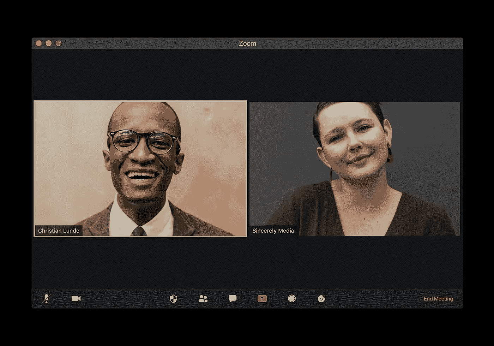

# 演讲者聚焦新领域

> 原文：<https://medium.datadriveninvestor.com/speakers-zoom-to-new-realms-208bc047f377?source=collection_archive---------23----------------------->

## 在网上和现场演讲时充满自信

Photo by Visuals on Unsplash

公开演讲比以往任何时候都更重要，尽管乍一看网上演讲可能并不那么公开。尽管地点更加个人化，但传达的信息大多是一样的。

这对[切尔西·克罗斯特](https://twitter.com/ChelseaKrost)来说是个好消息。她以千禧一代专家、营销和品牌战略家、全球演讲者和 LinkedIn 讲师为生。

“公开演讲是我业务中很大一部分*，”她说。*

Krost 没有出现在大型聚会上，而是调整自己，充分利用 Zoom 和其他虚拟联系。

 [## 强大的网络不仅仅是一个梦想

### 对话会带来更多的联系

medium.com](https://medium.com/datadriveninvestor/powerful-networks-are-more-than-a-dream-61c666b9a1fe) 

她并不孤单。[杰出演讲者名人堂理事会奖](https://www.nsaspeaker.org/cpae-speaker-hall-of-fame/)主题演讲人、战略家和六次作家 [Jay Baer](https://twitter.com/jaybaer) 也在网上发表了更多演讲。幸运的是，他的客户体验和营销创新建议在小屏幕上翻译得很好。

在 Krost 的#MillennialTalk Twitter 聊天中，她和 Baer 讨论了如何定位、准备和在网上和现场活动中发表演讲。

为了成功地获得更多的演讲机会，演讲者应该主动出击。有一份很好的专业简历可以利用，所以很明显你是一个可以谈论特定话题的人。

“获得演讲机会的关键是准确理解你如何帮助观众提高，”贝尔说。“那就找到那些人。正如我的朋友作者罗里·瓦登所说，“这个演讲只是一个广告，宣传什么是可能的。”

“通常，演讲是个人品牌和思想领导力的最后要素之一，”贝尔说。“你想说话吗？写一本书。拥有一个很棒的 Youtube 频道。有一个杀手播客或推特聊天。”

谈到公开演讲，Krost 想到的是优势。

“利用你的专业知识为现场和虚拟活动的演示创造主题，”她说。“和你的顾客说话。向他们展示价值，并分享解决方案。”

# **提升口碑**

演讲者应该创建战略材料和资产来营销演讲和演示。

例如，制作一盘演示磁带。主题并不重要，重要的是表现出自信和沉着来可信地传递信息。

“最重要的是要有一个能在会议策划者中产生口碑的演讲或展示，”贝尔说。“你还需要一个优秀的网站，展示你如何提供帮助。一部好的预告片或 sizzle reel 非常有帮助。”

 [## 谈话引发了口碑传播

### 推荐书是你最有力的推荐

blog.markgrowth.com](https://blog.markgrowth.com/talk-triggers-spark-word-of-mouth-2d83a7c5813b) 

他做了一个研究项目[,可以通过他的 dropbox](https://www.dropbox.com/sh/dwa735ajdw5wbce/AABsnkEQuoPlRZJeV41Bm-D5a?dl=0) 获得，关于会议策划人想要什么。除了调整[的网站](https://www.jaybaer.com/)，贝尔还展示了他在[的 YouTube 视频](https://www.youtube.com/watch?v=MG1xQRJY3CE)。

“我也会关注有机的搜索引擎优化，”他说。“在我的网站上，我有一个完整的计划，可以对‘营销主题演讲人’、‘客户体验主题演讲人’等进行排名。”

Krost 汇编了演讲和演示所需的资产:

*   网站(全球资讯网的主机站)
*   博客
*   YouTube 频道
*   电子书
*   视频课程
*   现场直播
*   播客

克罗斯特说:“如果你有公开演讲的视频，就用最好的片段制作一个媒体短片，展示你的专业知识和经验。”

“电影胶片应该让人感觉及时，与行业和观众相关，”她说。“原声片段应该有力度，大小适中。一盘电影应该像一部更大的电影的预告片一样对待。给他们一些东西咀嚼，让他们想要更多。”

Krost 有[一个用于媒体和演讲的编译卷轴](https://www.youtube.com/watch?v=qHBrT570XjI)。

“在过去的几年里，我一直用这个卷轴作为电梯推销我的品牌、我的社区和我的使命，”她说。

# **通过重复培养技能**

缺乏演讲经验不应该成为节目的绊脚石。演讲会分会[遍布各地，为了学习和鼓励，一路上建立信心。](https://medium.com/datadriveninvestor/your-story-starts-with-the-spoken-word-5b86ce1dcf2f?source=friends_link&sk=acc2b149ce2ac35af7133943230377e2)

“记住这一点:世界上每个演讲者都是从零经验开始的，”贝尔说。“一个不言自明的道理是，‘你说得越多，你就说得越多。’

“无论何时何地，无论为了什么说，”他说。“几乎每一位听众都有可能在某一天雇佣你去演讲。演讲就像音乐行业:很少有一夜成名的感觉。”

 [## 你的故事从口语开始

### 演讲会帮助人们在交流中获得自信

medium.com](https://medium.com/datadriveninvestor/your-story-starts-with-the-spoken-word-5b86ce1dcf2f) 

贝尔鼓励参加国家演讲者协会或类似的团体来学习商务交流的重要一面。

Periscope 的出现是一个很好的训练，表明直播和演讲之间的差异正在模糊。

贝尔说:“要成为一名更好的演说家，T2 永远做不完。“我是世界上职业演说家名人堂的 192 人中的一员。然而，我仍然每年花数万美元做教练。这是一个*竞争非常激烈的行业。*

“许多会议策划人现在正在寻找数字专家，以及更短的会议时间，”他说。

有抱负的演讲者的其他渠道包括 Instagram Live 和脸书 Live，以开始完善公共演讲技巧、演讲风格和观众参与。正如 Krost 强调的，接触是有帮助的，熟能生巧。

“看你的直播和录像，”她说。“评估你可以改进的地方。观察自己是提高演讲质量和与观众沟通的关键。定义你的钩子和演讲点。

“发挥你的优势，”克罗斯特说。“很多时候，我们往往是自己最大的敌人。每个人都要从某个地方开始。尝试、学习、提炼、重复。”

# **炸弹防护**

演讲的准备始于练习。从镜子前开始。继续用手机摄像头这样简单的东西记录你自己。请朋友批评你。获得诚实的反馈，最好是非演讲者。

“如果你在舞台上真的很出色，会议策划者就不会得到好评，”贝尔说。“如果你轰炸，策划者可能会被解雇。所以，你必须*消除他们的风险*。给出视频证据、证明和高度相关证据，证明你了解观众的具体需求。

他说:“写一篇 2500 字的文章，总结你的演讲，并说明它如何准确地满足潜在听众的需求。”“这种事情会产生巨大的影响。”

 [## 这到底是谁的即兴表演？

### 即兴创作有助于工作和家庭交流

medium.com](https://medium.com/datadriveninvestor/whose-improv-is-it-anyway-49ff42afe113) 

贝尔的会议策划研究发现，演讲者超级棒远不如演讲者超级相关重要。

这和知道谁在房间里一样重要。

“我们在接到任务之前，会在销售过程中做很多笔记，”贝尔说。“然后，我会与活动组织者进行 60 分钟的通话，通常会事先与两三名与会者进行电话调研。”

在他的播客 [*起立鼓掌*](https://www.jaybaer.com/podcast-category/standing-ovation-podcast/) 中，贝尔通过采访世界级的演讲专家来培训演讲者，讲述他们的故事和风格。

Krost 在推销自己的演讲时遵循以下基本原则:

*   了解你的受众。
*   如果需要的话，使用与行业相关的流行语。
*   发挥你的专长和优势。
*   具体说明你的学习课程是什么。
*   分享解决方案。
*   润色交付。练习。

“我们应该总是半定制我们的内容和交付，以迎合确切的受众，”Krost 说。

# **最初的牺牲**

言论自由并不一定是免费发言，但当建立声誉时，新手演讲者可能不得不做出牺牲。

“如果你是新手，我绝对推荐免费演讲，”贝尔说。“我仍然每年做五次免费演讲。我有一个经纪人——了不起的[米歇尔·乔伊丝](https://twitter.com/Michelle_Joyce/)——但这不是必须的，首先不是。除非演讲是你的主要收入来源，否则你不需要代理。

“演讲业务基本上就是音乐业务:你开始在一个地下室免费演奏；然后你得到免费的啤酒；然后你得到 500 美元。然后更多，”他说。“每个阶段的目标都是让自己为人所知，让人们想再次见到你。”

 [## 你的身体比语言更响亮

### 面部表情、手势和姿势传达了清晰的信息

medium.com](https://medium.com/datadriveninvestor/your-body-speaks-louder-than-words-ea9ea043d601) 

贝尔在比较中写道: [*“演讲业务和音乐业务是同一种业务的 7 种方式。”*](https://www.convinceandconvert.com/convince-convert/7-ways-the-speaking-business-and-music-business-are-the-same-business/)

Krost 遵循以下几点:

*   每个阶段都变得更好。
*   留下印象。
*   建立你的联系，并跟进新的联系。
*   从你的演讲中获得更多的满足感。
*   获得更多推荐和推荐。
*   更多的经验意味着更多赚钱的机会。

“你不需要有一个代理人或与一个局工作土地演讲约定，”克罗斯特说。“内容营销、标签和关键词可以帮助你获得曝光率。许多在线或线下的行业活动都公开征集意见。”

她说，在提交演讲者的建议之前，这些是研究的必要条件:

*   了解活动主题。
*   了解观众的需求和兴趣。
*   当构思要推介的主题时，研究之前的发言人，与行业相关，提供解决方案，挑战规范，转换视角并给出价值。

虚拟活动的标题、描述和演示应该更吸引人。与现场活动不同，当观众离开时，每个人都可以看到，虚拟观众可以通过看不见的点击离开。

“人们必须做出更慎重的选择来参加虚拟活动，”贝尔说。“对于虚拟活动，让演讲标题更短，收益更清晰明了。

“正如我的朋友，传奇演说家斯科特·麦克凯恩曾经教导我的那样:平庸的演说家有九个可以谈论的话题；伟大的演说家有三个，”贝尔说。“不要害怕具体一点。另一个伟大的演讲格言:利基市场有财富。”

# **一口大小的戏弄者**

Krost 有专门的演讲者推广技巧。

“如果你有任何长格式的——20 到 60 分钟——你在网上研讨会、现场活动、虚拟活动或直播中发言的视频，请剪辑 20 到 30 秒的一些最佳原声片段，”她说。"然后用关键词标签在社交媒体上推销你的演讲."

 [## 对于好的内容，一次是远远不够的

### 像常青树一样，你最好的作品总是当季的

medium.com](https://medium.com/datadriveninvestor/once-is-never-enough-for-good-content-4168dcc827d6) 

对于贝尔的版本，他与内容再利用者[艾米·伍兹](https://twitter.com/content10x/)合作，他的团队将主题演讲剪辑到社交媒体片段中。贝尔说:“他们的球队是一支神奇的球队。”

在线演示需要更加人性化。扬声器不是对着一个房间播放，而是与每个人进行近距离的个人对话。他们应该有更多的对话方式。

“使用虚拟世界特有的互动元素:虚拟背景、聊天、投票、问答，”贝尔说。“在你的内容中加入两个不同的故事，让观众投票决定你会讲哪一个。

他说，“你不能把离线的幻灯片拿出来，对着电脑说。”“你需要比这更有活力。”

与其他演讲者合作也是一个优势。

Baer 说:“我正在和 Brian Fanzo 进行一个名为‘创造一个成功的虚拟活动你需要回答的八个问题’的会议。"我们正在深入研究这个话题。"

一个经常被忽视的说话要素是主持人的素质。

“在许多情况下，有一个好的主持人或司仪在线上比离线更重要，”贝尔说。“我还想说，你应该缩短你的在线时间。我专门研究一种叫做 [webinine](https://www.convinceandconvert.com/social-media-tools/webinine-all-about-reddit/) 的形式，即九分钟的网络研讨会。

# **通过监听获得权力**

Krost 更喜欢使用投票和 twitter 聊天来收集反馈，并将其融入到演示文稿中。

“这也展示了实时参与和众包的力量，”她说。[社交倾听](https://medium.com/datadriveninvestor/strategic-social-listening-is-real-life-90c8a07b7c3f?source=friends_link&sk=d2e8aa4948fc21652656dda320f89ac5)是一个强有力的工具。

“我总是喜欢用与学习课程相关的故事来开始一个 PowerPoint，”Krost 说。“我们通过故事学习，而不是通过吐槽数据和事实。想想看，[你如何利用讲故事](https://medium.com/datadriveninvestor/we-tell-our-own-best-stories-8a07ec5ab760?source=friends_link&sk=c492973312b9513860c95bbd7a21669d)、[幽默](https://www.datadriveninvestor.com/2019/02/25/no-fooling-marketing-goes-for-laughs/)、之前的经验和你创造的解决方案作为一种沟通和挂钩的方式。”

 [## 给没有被提及的企业家的建议

### 良好的沟通能增进工作内外的关系

medium.com](https://medium.com/datadriveninvestor/tips-for-entrepreneurs-not-spoken-for-9de87df8653) 

演讲者的内容在现场和虚拟事件之间变化。虚拟不是被俘虏的观众。说话平实，清晰，直奔主题，结束。

“你必须让你的网上谈话更具体、更具互动性、更简短、更个性化，”贝尔说。“与线下相比，在网上发表演讲时接受提问*要常见得多。你必须在时机上计划好。”*

这两种演讲的气氛明显不同。

“大多数虚拟约会都有一个更宽松的环境，”Krost 说。“越是对话式的，简单直接的，越好。提供相关的例子或结果，让听众看得见摸得着。”

在许多情况下，虚拟事件是唯一的游戏。在潜在的虚拟活动组织者所在的论坛或聊天上活跃起来。这将是一个熟悉 Zoom 的好时机。

“虽然我们都在家里，比以往任何时候都更倾向于数字化，但现在是时候寻求虚拟参与，如网络研讨会，直播，播客和视频，”Krost 说。“分享价值，[建立品牌意识](https://www.datadriveninvestor.com/2019/11/18/consistent-branding/)，[建立你的电子邮件列表](https://www.datadriveninvestor.com/2020/04/20/emails-power-surges-from-data/)，[培养新的销售线索](https://www.datadriveninvestor.com/2019/03/18/lead-generation-starts-from-day-1/)和联系。”

有准备的演讲者不会坐等机会到来。

贝尔说:“即使你不是在为付费客户做虚拟活动，也要把你自己的活动放在一起，告诉他们你知道些什么，以及你能帮上什么忙。”。“在我与布莱恩·范佐的会谈中，我们没有得到报酬。我们只是想帮忙。”

**关于作者**

吉姆·卡扎曼是拉戈金融服务公司的经理，曾在空军和联邦政府的公共事务部门工作。你可以在[推特](https://twitter.com/JKatzaman)、[脸书](https://www.facebook.com/jim.katzaman)和[领英](https://www.linkedin.com/in/jim-katzaman-33641b21/)上和他联系。