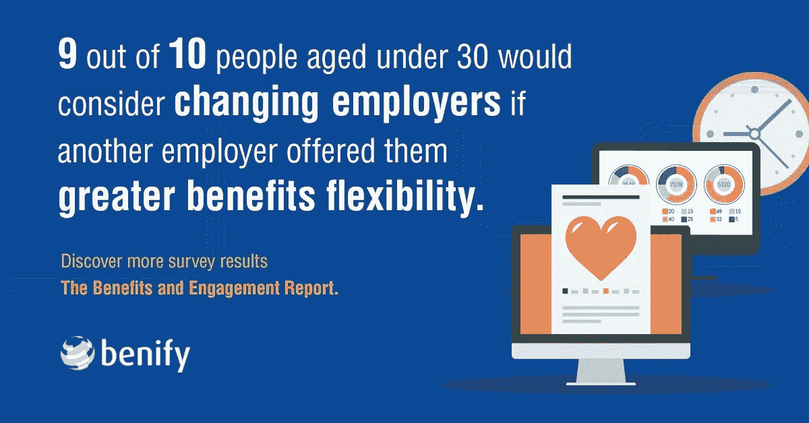

# 特殊福利是工人幸福的决定因素

> 原文：<https://medium.datadriveninvestor.com/special-benefits-are-the-decider-for-workers-happiness-bdc4b2207410?source=collection_archive---------13----------------------->

## 正确的程序会阻止你的人离开

Photo by Fauxels

组织努力为员工提供合适的福利。许多领导和经理不理解普通员工的基本需求，这可能与高层不同。

来自不同专业和个人背景的公司，无论规模大小，都不能依靠经理或高管来了解组织中每个人的需求。

“你的组织可能会投入大量的时间、精力和金钱来留住顶级员工，”[分析师、品牌策略师、播客和](https://twitter.com/MeghanMBiro) [TalentCulture](https://twitter.com/TalentCulture) 首席执行官梅根·m·比罗说。"然而，至少偶尔，你还是会输给竞争对手."

她想知道如何结束这种无结果的循环。

"你能为你的员工提供什么，足以让他们留下来？"比罗说。“作为雇主，你真正的价值主张是什么？漂亮的办公室？不，我们远程工作的时候不行。免费的健身房会员或大撤退？希望很快，但不是现在。”

 [## 员工寻求最佳福利计划|数据驱动的投资者

### 在过去的几十年里，医疗保健发生了很大的变化。这使得正确地…

www.datadriveninvestor.com](https://www.datadriveninvestor.com/2020/09/22/workers-reach-out-for-the-best-benefits-plan/) 

她认为，要在当今的工作环境中留住顶尖人才，不是靠额外津贴。

“留住人才是员工真正需要的，”比罗转向克里斯·韦克利(Chris Wakely)说道，他是 Benify 的全球销售执行副总裁，该公司专注于全球员工福利。

他的公司编写了《福利和参与报告:2020 年代欧洲雇主员工体验指南》。该调查于 2020 年初进行，临近全球疫情的开始。

“尽管很疯狂，还是有大约 5000 人参加了调查，”韦克利说。“我们问了他们对雇主的看法。除了薪水，他们还想要什么福利？

“当人们挖掘他们的新现实时，问这些问题真的很有趣，”他说。“我们真正了解了员工在变革中的思维和行为方式。”

# 福利规则

据 Wakely 称，有一点很重要:30 岁以下的员工中，十分之九的人表示他们会考虑更换雇主，以获得更好的员工福利。

工人流动的旋转门是真实的。

 [## 人工智能帮助你聪明理财|数据驱动的投资者

### 自动化和人工智能为创新平台提供动力，简化双方的财务流程…

www.datadriveninvestor.com](https://www.datadriveninvestor.com/2020/09/02/artificial-intelligence-helps-you-be-smart-with-money/) 

“组织难以提供正确的福利的一个重要原因是存在误解，”Biro 说。“让员工受益的远不止是提供健康和牙科保险。这里面有太多的东西。”

韦克利将这个问题归结为两个主要原因。

“福利不是一个放之四海而皆准的模式，”他说。“每一代人都有自己的需求和偏好。公司的员工福利需要个性化。一种方法是提供灵活的福利计划。

韦克利说:“人力资源专业人士可能无法洞察员工的需求和愿望。通过全球仪表板，管理员可以了解使用中的优势以及支出和供应商成本，从而消除猜测。"

雇主必须适应环境的变化。

韦克利说:“当谈到建立福利战略时，也许最重要的是灵活性——允许员工根据自己的需求定制和个性化他们的福利。”“有几种方法可以提供灵活性。

“你可以去掉假设，找出员工真正想要的，”他说，引用了他的[公司的一个相关帖子](https://blog.benify.com/4-must-read-tips-for-building-an-effective-global-benefits-strategy)。

员工需要了解在福利方面他们能得到什么。这意味着根据他们的理解水平进行教育。普通人不是精通晦涩法律语言的有执照的保险代理人。工人需要关心他们的翻译。

# 精心选择的词语很重要

“评估你的好处，”韦克利说。“了解你的员工对你的提议的看法，以及哪些福利正在发挥作用。将你的福利与其他组织目标挂钩。例如，如果你的目标包括促进更多的远程工作，提供更多的数字福利。

“如果沟通不当，世界上最大的利益一文不值，”他说。"跳出框框思考很重要，给员工选择的灵活性也很重要."

传统的方法会阻碍创造力。

“福利可以包括薪酬以外的一切，”比罗说。“有很多方法可以满足员工的实际生活和工作需求。

“中小型组织应该考虑与外部服务提供商合作，改善福利体验，”她说。“不仅仅是什么，还有如何、在哪里、何时。”

比罗质疑雇主如何看待他们员工的福利体验。

“我经常这么说:在你着手改变之前，先弄清楚，”她说。"为你的员工把脉。"

 [## 技术拯救雇佣关系第一天|数据驱动的投资者

### 面对困难的经济，有才华的人很难找到工作。在招聘过程中迷失…

www.datadriveninvestor.com](https://www.datadriveninvestor.com/2020/06/29/technology-rescues-relationships-from-hiring-day-1/) 

全面薪酬体验是一个有价值的招聘和保留工具。

管理层不应该让员工挑选快乐。满足特定需求的一项福利将无法满足那些在其他领域仍有需求的人。糟糕的整体体验会把人们送出门去更好的地方。

“这很大程度上影响了员工分享经验的决定——这影响了雇主对潜在雇员的品牌，”比罗说。“他们受到的待遇显然是一个主要因素。

“想想在家工作的孤立、干扰、噪音和压力——即使对那些喜欢在家工作的人来说也是如此，”她说。“现在平衡一下快乐的时刻，一种认可的姿态。这是一件大事。”

# 全景带来清晰

员工的满意度取决于对他们的福利有全面的了解。

韦克利说:“当员工只看到他们薪酬的一部分时，其他重要的福利，如保险、养老金和附加福利都被忽略了。”“从雇主的角度来看，这低估了员工的整体薪酬，并在未使用的福利上浪费了资金。

他说:“在当今竞争激烈的就业市场上，各公司竞相吸引和留住人才，这可能会影响候选人选择哪家公司。”。“了解员工的需求至关重要。给他们选择薪酬方案的灵活性。”

他引用了 Benify 对 5000 名员工的调查报告来支持他的建议。

**关于作者**

吉姆·卡扎曼是[拉戈金融服务公司](http://largofinancialservices.com/)的经理，曾在空军和联邦政府的公共事务部门工作。你可以在[推特](https://twitter.com/JKatzaman)、[脸书](https://www.facebook.com/jim.katzaman)和 [LinkedIn](https://www.linkedin.com/in/jim-katzaman-33641b21/) 上和他联系。

*原载于 2020 年 10 月 26 日 https://www.datadriveninvestor.com***。**

*点击下面的链接，安排与 [**吉姆·卡扎曼**](https://app.ddichat.com/experts/jim-katzaman) 的 DDIChat 会话。*

* [## 吉姆·卡扎曼-迪查特

### 马里兰州美国吉姆一直在金融行业自 2001 年以来，一直是代理与美国经典机构和…

app.ddichat.com](https://app.ddichat.com/experts/jim-katzaman) 

在这里申请成为 DDIChat 专家[。
DDI 的工作方式:](https://app.ddichat.com/expertsignup)[https://datadriveninvestor.com/collaborate](https://datadriveninvestor.com/collaborate)
访问我们的网站[https://www.datadriveninvestor.com/](https://www.datadriveninvestor.com/)
获取专家观点—订阅 DDI 英特尔:[https://ddintel.datadriveninvestor.com/](https://ddintel.datadriveninvestor.com/)*