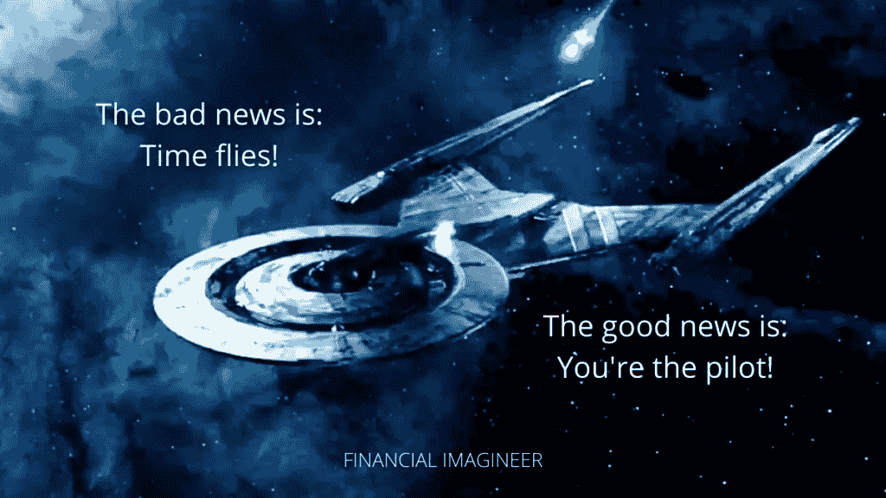

# 时间的速度——金融幻想家

> 原文：<https://medium.datadriveninvestor.com/speed-of-time-financial-imagineer-a616af12a727?source=collection_archive---------24----------------------->

今天我庆祝我的生日。我快 41 岁了。翻译过来就是:这意味着我现在更接近 50 岁而不是 30 岁，更接近 60 岁而不是 20 岁。至少我现在是这么想的。此外，41 年意味着我比以前花了更多的时间生活在 2000 年以后。见鬼，想想看，1990 年比 2050 年还遥远。

是的，生日让我每次都想到“时间”。

我喜欢这样。

因为时光飞逝。

时间的速度正好是每年 365.242189 天！

这快吗？慢吗？嗯，这就是有趣的地方，你看:

看情况！

可以肯定的是:时间只会向前推进。

在过去的五年里，我一直在思考如何让我的生活“慢下来”。我们已经在生活中做了很多实验，“这一次”我很高兴写一篇博客来与你分享我的发现和想法。

希望你也能放慢你生活中的时间！

> 今天是你有生以来最老的一天。 **你将再次成为最年轻的你。**

五年前，在我 36 岁生日那天，我爸爸打电话给我。他 72 岁了。

他说:

> ***首先:“恭喜你，你已经有我一半的年龄了！”***
> 
> ***第二:“你赶上了！”***
> 
> ***最后一句:“当心，后半程走得更快……”***

就像我能从父亲身上学到的许多其他教训一样:

这一点我明白了。

深深地。

虽然我很感激给予我的每一天，但时间过得太快了。

时间都去哪了？明天不是承诺。

公平的部分是:对每个人都一样。

没人知道如何让时间停止，甚至逆转时间。

无论你做什么，时间都在飞逝。

除了消灭你生命中的时间强盗，你还可以做更多的事情！

*在*[*NAS daily*](https://shop.nasdaily.com/)*创建你自己的人生进度条 t 恤，它显示你的寿命已经过了多少%。*【无关联链接】

# 时间是相对的

未来学家彼得·迪亚曼蒂斯曾经说过:“你走得越快，时间过得越慢，你就活得越久。”乍一看，这段引文只是简单地解释了爱因斯坦的相对论。

但是事情并不像看上去那样简单。

让我们把相对论拆开，应用发现来丰富我们的生活吧！

“时间是相对的”是什么意思？这仅仅意味着，根据观察者的视角，对相同时间的流逝会有不同的感知。当我们开始在新加坡生活时，我完全理解了这种意义。

新加坡几乎位于赤道。每天你都有相同数量的阳光和黑暗。此外，一年到头，每天的天气几乎都是一样的。在新加坡没有更多的季节性，就像你注意到春天、夏天、秋天或冬天的地方一样。

由于缺少季节性，每天看起来和感觉都一样。缺少天气刺激我们的大脑会让感知时间加快。根据季节来“存档”你的记忆会变得很难。对我来说，一开始感觉像是生活在“时间之外”。

虽然这个概念可以用季节性或无季节性来很好地解释，但它也适用于你的个人生活经验。

你可以这样想:年龄越大，经历的生活越多，对你的大脑来说，“有趣”或“新”的正常经历或习惯就越少。因此，如果没有新的刺激，你的大脑会在日常生活中切换到自动驾驶和巡航控制。你的大脑放大了！

还记得小时候，等待圣诞节是什么感觉吗？等待那 25 天直到 12 月？花了很长时间！一方面，我们的大脑有一个相对功能，所以让我们说，当你是一个五岁的孩子时，你积累的总生活经验只有(5x 365)1825 天，因此，与你积累的总经验相比，等待 25 天意味着相对较长的时间。一旦你像我一样过了 41 岁，大脑有 14965 天的时间来处理 30 天的事情。

年龄越大，见识和经历越多，你的大脑就越容易让你的生活快速前进——如果你坚持现在的习惯！

你看过亚当·桑德勒演的电影《滴答声》吗？

在这部电影中，亚当·桑德勒得到了一个神奇的遥控器，帮助他跳过生活中不愉快的部分。它学习和适应他的喜好，并自动跳过他不喜欢的部分，它帮助他缩小，最终他错过了他生命中的大部分时间！

你和我，我们是自己生活的驾驶员。

作为飞行员，我们可以做一些事情来减缓感知时间！

# 弯曲时空

研究表明，你对逝去时间的感知主要受你所遇到的新经历的类型和数量的影响！

既然我们不能影响天气，为什么不专注于自己创造新的刺激:你的大脑处理的“新”输入越多，你的生活就越“有趣”，时间对你来说就过得越慢！

在过去的五年里，我自己也测试过这一点。

在 2017 年离开我朝九晚五的工作后，我有意让自己学习新东西，比如写博客、创业、旅行、学习其他东西和习惯，比如烹饪、烘焙或理发。

我可以肯定爱因斯坦是对的:时间的确是相对的！

在过去的 5 年里，作为一个家庭，我们留下了许多美好的回忆。

如果你打算让自己的时间慢下来:有目的地生活。

让你的生活保持有趣，让自己接触新的经历，学习新的技能，结识有趣的新朋友，去旅行。

是时候改变了:弯曲你自己的时空！

# 前方几光年

爱因斯坦也说过:时间是相对的。你移动得越快，你的时间过得越慢！

然而，如果你反过来，你朝着你想要的目标走得越慢，你的时间就过得越慢，因为你只是在等待事情发生。

这对你的生活有何影响？

假设你觉得自己被困在了职业生活中。也许你被告知要再等五年才能获得下一次晋升。如果你在这五年里所做的一切就是袖手旁观，让生活顺其自然，直到你升职，你会有什么感觉？

不要那样做！这是被动的，不会给你的生活增加快乐。这感觉就像永远在等待，最终，回想起来，不会有很多回忆或经历可以回顾！

相反，试着把你的梦想放在驱动力上，向前“跳跃”。

最近，我用这个挑战我的孩子:

我给了他们这张纸，让他们告诉我从 A 到 b 的最短路线。

果然他们指出最快的方法是两点之间的直线。怀着愉快的期待，我不断将他们最初的发现往后推，要求他们“跳出框框思考”。

就像这个例子，在生活中，如果你走正常的道路，你将需要 36，000 年才能到达半人马座阿尔法星[地球的下一个恒星系统]。依靠你的梦想，走普通的、被证实的道路，你将永远无法在一生中达到你的目标。

永远不会。

如果你想加快速度:你必须找到曲速驱动器的开关——或者更好——找到一个虫洞！

从 A 到 B 的实际最短路径是“弯曲时空”。把纸折起来，把 B 放在 A 旁边，找到那个该死的虫洞！

> 快速行动就是拥有世界上所有的时间。

如果我在这里失去了你，请让我试着解释一下:这对你的生活有什么影响？

在你加速之前，先减速。停下来。

弄清楚你现在在哪里，你想去哪里。如果你观察你的周围，试着用不同的眼光看待事物，试着去发现虫洞或捷径。如果没有，也许是时候改变你的环境了。

> ***在一个充满机会的房间里，让那些会*** ***提到你名字的人包围你。***

照顾好你的关系网，你可能知道有人已经实现了你的想法，或者可以在接下来的步骤中帮助你。探索你的人际网络，向他人学习，找出最好的课程，增加你的选择！

然后:设定你的新航向！

把你的梦想付诸行动！！！

一旦你踩下油门，全速前进，你就会意识到你的心态是如何被一套新的优先事项所装备的。当你高速行驶时，你需要高度集中注意力。请注意，通过完全专注于更快地达到你的目标，你将放弃某些事情，并取消生活中的选择。生活中的每个选择都有机会成本。

当你加速到曲速时，你可以把它比作在高速公路上行驶。你会更快地达到目标，朝着正确的方向前进。然而，你放弃了随意停在任何地方的能力。不再观光。你仍然可以选择停车或改变方向，但它们将被限制在十字路口或出口处。

你走得越快越远，你会遇到越多的新机会，因为你走得更远，看到的更多。生活在高速发展的生活方式中，你将会拥抱大局的重要性，而不是你快速忽略的某些小细节。

通过开始改造你的生活，你将有能力控制和提高你的时间和生活质量，同时，你也会吸引一系列完全不同的新机会！

注意，不要忘记每隔一段时间就放慢脚步或者停下来反思一下！

一个虫洞或捷径可能在过去起作用并帮助你前进。但它可能不会帮助你进一步实现你的梦想。

> 让你来到这里的，不会让你到达那里。

帮助你真正理解真实列表概念的一个技巧是:

我们不应该看过去的**时间**，而应该看并关注已经走过的**距离**！

# 结论

成为一名时间御术师。活得永恒。[想办法储存时间](https://www.financial-imagineer.com/2020/09/26/store-time/)。

有目的地生活，寻找捷径，活得快，放慢时间。你没有时间浪费了。现在做你喜欢做的事。让你现在过的生活有意义！

> **没有通往幸福的路。**
> 
> **快乐是一种方式。**

时间会证明一切。

过得好的人生足够长，但后半段过得更快。[冬天来了](https://www.financial-imagineer.com/2020/09/02/winter-is-coming/)。

“活得越快”，时间过得越慢。所以把踏板放在金属上！

只有当你停止发现的时候，你才会觉得自己老了。

探索，梦想，发现！

都是时间的问题。

该走了！

马特(男子名ˌ等于 Matthew)

如果你还没有加入我的收件箱团队，可以考虑通过电子邮件、[订阅我的博客](https://www.facebook.com/financialimagineer)[，比如我的脸书主页](https://www.financial-imagineer.com/)或[在 Twitter 上关注财经幻想家](https://twitter.com/FI_imagineer)。

*原载于 2020 年 10 月 23 日 http://www.financial-imagineer.com**[*。*](https://www.financial-imagineer.com/2020/10/23/speed-of-time/)*