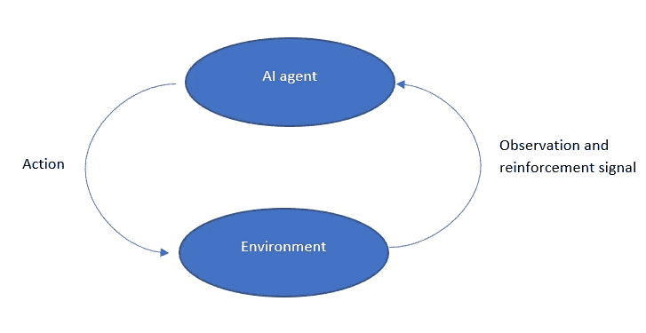

# 使用人工智能的速度赛跑游戏

> 原文：<https://medium.datadriveninvestor.com/speed-running-games-using-ai-eaf07fd9dde3?source=collection_archive---------5----------------------->

我们中的许多人都遇到过我们最喜欢的街机游戏的 AI 飞车。我总是想知道那些系统是如何工作的。因此，我开始调查一些现有的开源人工智能速度赛跑者，这是我的发现:

当创造人工智能来玩游戏时，你必须面对两个挑战。第一个是创建你的人工智能代理和游戏之间的接口。换句话说，你必须创建一种方法来捕捉屏幕(或内存状态)并将动作发送回游戏。对于这一点，你通常可以使用一个仿真器，比如由 OpenAI 维护的 Gym 项目。您可以在以下位置找到它:

[http://gym.openai.com/](http://gym.openai.com/)

在“环境”标签下，你可以找到许多游戏环境，比如“雅达利”(【http://gym.openai.com/envs/#atari】T2)，里面有一个我们最喜欢的童年街机游戏列表，比如吃豆人、弹球、突围、拳击、网球、双灌篮、走鹃等等…

你可以使用这些环境和你的人工智能代理来建立你的速度跑。

 [## AI 和机器学习有什么区别？数据驱动的投资者

### 这两个主题背后有很多令人兴奋的东西，所以这是一个快速指南，介绍了它们是什么以及它们有什么…

www.datadriveninvestor.com](https://www.datadriveninvestor.com/2020/01/22/whats-the-difference-between-ai-and-machine-learning/) 

现在，第二个挑战是哪种学习模式可以用来帮助你的模型学习如何玩这个游戏？最常用的学习范式是强化学习。

**什么是强化学习？**

强化学习是一种人工智能范式，其中智能代理通过反复试验学习执行任务，并与环境进行交互。在强化学习中，代理获取关于环境的信息，基于该信息执行动作，然后接收指示动作是否正确的强化信号，而不是像在监督学习中那样从标记的数据集学习。

例如，在这个[视频](https://www.youtube.com/watch?v=qv6UVOQ0F44)中，Sethbling 解释了 MarI/O 神经网络如何使用强化学习来玩游戏“马里奥”。他解释说，在开始时，神经网络甚至不会按任何按钮或做任何事情，每当马里奥不移动时，算法就会切换到执行不同动作的不同节点，直到它执行正确的动作并接收到强化信号/奖励，让它知道相应的动作是正确的。