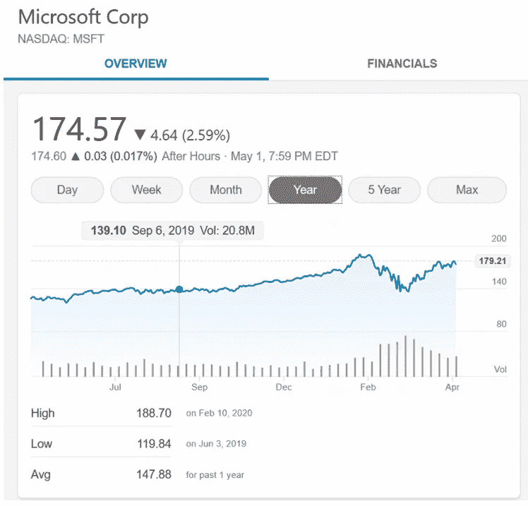
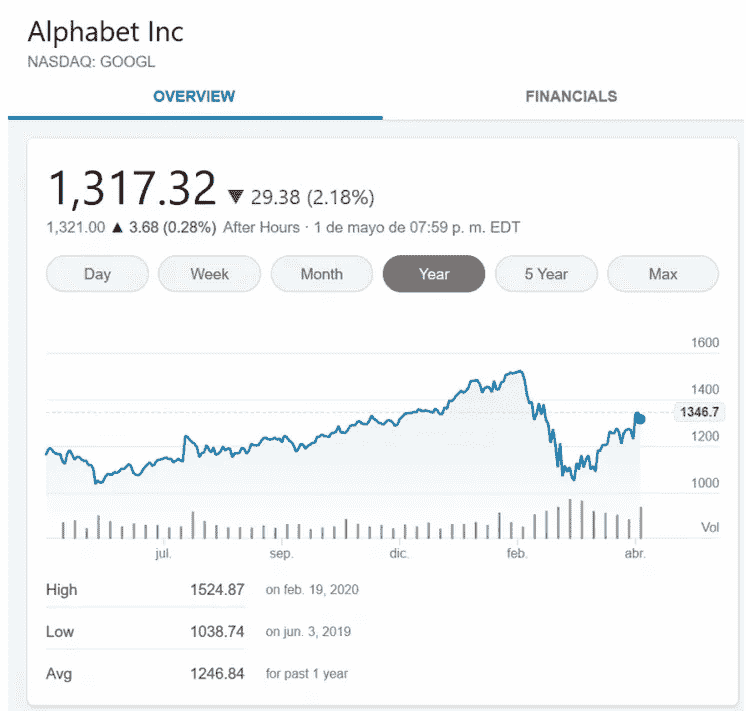

# 加速科技银行的数字化:云和人工智能成为疫情的赢家

> 原文：<https://medium.datadriveninvestor.com/speeding-up-the-digitalization-of-the-tech-banking-cloud-and-ai-as-the-pandemic-winners-ee0e62fcb7c6?source=collection_archive---------18----------------------->

疫情新型冠状病毒的经济效应正在把斗争推向每个国家的主要行业，把某些国家的经济危机转化为全球性的危机。如果没有产品和服务的消费者，最终将没有钱来生产，产品和服务的短缺将给我们带来明显的后果，大规模裁员和供应链的中断。避免经济危机的负面影响(犯罪率上升、税收减少、人民贫困等)。)让我们只关注技术可以作为一个关键和必要的行业在银行服务中提供的缓解工具和资源。

banana-forex

我们正面临着前所未有的全球性威胁，这种疫情已经蔓延到五大洲的几乎每一个国家，导致全球成千上万的企业暂时或在最坏的情况下无限期关闭。在“新常态”(许多专家称之为疫情)中，人们无法像往常一样生活:传染的风险让我们呆在家里，以意想不到的方式改变我们的生活方式。这些合理的限制以这样或那样的方式加速了某些行业的彻底转型，比如银行和金融服务业。在未来的几个月里，检疫政策和限制可能会比今天更宽松，但有一点是明确的:随着服务自动化和数字化的加快，新常态将会到来。

从银行业到电子商务和快递服务，对安全、透明和效率的需求正在推动新技术以创纪录的速度大规模实施。我们这些消费者(主要是年轻一代)普遍更喜欢日常交易中的自动化:尖端技术的使用总是给我们留下清洁和信任的感觉，科技公司知道这一点。

 [## 金融科技初创公司正在颠覆全球银行业|数据驱动的投资者

### 传统的实体银行从未真正从金融危机后遭受的重大挫折中恢复过来…

www.datadriveninvestor.com](https://www.datadriveninvestor.com/2018/10/20/fintech-startups-are-disrupting-the-banking-industry-around-the-world/) 

毫无疑问，在新常态下，几乎所有最近升级的服务的交易都基于与银行的联系:在一些地方，没有借记卡就不能使用优步，大多数快递服务也是如此。更重要的是，没有个人银行账户支持的账户档案，电子商务根本无法运作。因此，其中一个关键行业无疑是银行，其次是金融服务业。

正如我在过去的文章中所提到的，大型技术公司加快云采用的努力非常明显，因为他们是最近的赢家，主要帮助中小型银行实现服务的完全数字化。正如沃纳·威格尔在《银行家》杂志发表的观点中提到的:“对许多金融机构来说，这种选择就是云。你可能会问，为什么世界上监管最严格的行业之一在云计算上下了大赌注。答案很简单。他们可以快速竞争，保护他们的客户，并获得最先进的分析服务，而无需倾家荡产”。短期内，我们将看到它们在银行提供的服务组合中成长，并改善现有服务，这是新常态的要求。

[最大的科技公司的另一大武器 AI](https://www.datadriveninvestor.com/glossary/artificial-intelligence/) ，历史上在银行业内使用过且前景光明。用[克里斯·斯金纳](https://www.thebanker.com/Transactions-Technology/Technology/Build-buy-or-transform-the-bank)的话说:“技术创新将会加速。我们在封锁期间在家工作所依赖的基础设施是由人工智能优先的公司提供的:谷歌、微软、苹果。同样，在我们的行业中，赢家将是那些投资建立垂直整合的人工智能优先公司的人。他们不仅将建立一个有利可图的业务，而且还将主导这个行业。”

因此，业内三大公司的股价水平并非偶然:

在这一点上，我不知道这些大型科技公司是否会成为这场竞赛中无可争议的赢家，但至少我们知道，银行家、他们的股东甚至他们的消费者相信他们的专业知识，可以通过增加更多的计算能力和启用智能系统来扩展服务。不幸的是，提升银行服务能力所需的“推动”是由疫情完成的，但只要满足安全、透明和效率的需求，增加采用将是市场的决定。