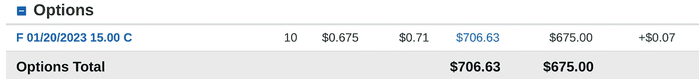
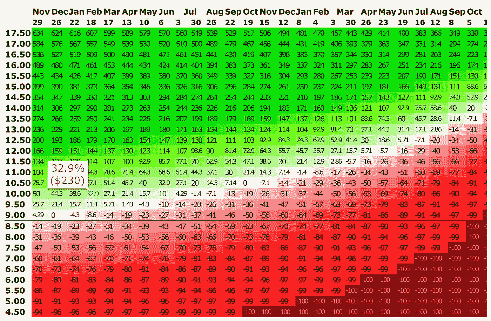

# 在你喜欢的股票上花更少的钱，赚更多的钱

> 原文：<https://medium.datadriveninvestor.com/spend-less-profit-more-on-stocks-you-love-12c0640ebaa6?source=collection_archive---------3----------------------->

## 一种比购买股票成本更低的策略

Photo by [Aljoscha Laschgari](https://unsplash.com/@alaschgari?utm_source=medium&utm_medium=referral) on [Unsplash](https://unsplash.com?utm_source=medium&utm_medium=referral)

这是交易或投资工具有史以来最好的名字。这也是最有潜在利润的行业之一。

在这篇文章中，我讨论了被称为 LEAPS 的股票期权，提供了一些指导方针，让你可以在不受伤害的情况下最大化它们，或者至少最小化你的风险敞口。我从我的作品集里用一个真实的例子来说明 LEAPS 是如何工作的，以及我为什么使用它们。

## LEAPS——长期股权预期证券

关于期权基础知识的概述，请参见马克·古伯蒂的优秀文章。

简而言之，跳跃期权是一种到期日在遥远未来的期权合约。与有近期到期日的期权相比，LEAPS 更倾向于跟踪标的股票的价格。

跳跃比近期期权更昂贵。用最基本的方式来看，用我在福特的真实例子。我直接拥有 100 股福特股票。短短两周，我就涨了 13.5%。虽然福特没有参与疫情股市的上涨，但它现在正大步向前。我预计 2021 年两位数。

**Source: Author’s Charles Schwab Account**

我希望更多地接触福特，因为我确实认为它将是明年的顶级突破股之一。如果我买这只股票，1000 股额外股票的价格大约是 8750 美元。利用期权，我可以以大约 700 美元的价格购买 10 份 2023 年 1 月 15 美元的 LEAP 看涨期权。我选择了后者。最坏的情况，我失去了我所有的投资。理论上，有无限的上升空间。

**Source: Author’s Charles Schwab Account**

我不打算让这些合同到期。可能只有一种情况下我会。如果福特在接下来的 3 到 6 个月里飞速上涨，突破 15 美元的话。在这幅图中，我可以以每股 15 美元的价格购买福特股票(每份合同 100 股)。如果福特当时的交易价格是 17.50 美元，我显然会坐拥丰厚的利润(2.50 美元减去期权费 0.70 美元)。

如果福特恢复派息，我更有可能这么做，而且我想长期持有这个水平的福特股票。当你持有看涨期权时，你不能收取标的股票的股息。如果福特真的恢复派息，股价应该会飙升。我预计这将在明年年初发生。在某种程度上，这促使我决定购买看涨期权。

我总是可以行使我的选择权，在少数合同上以 15 美元的价格买入福特，平仓或让其余的继续。但那不是我考虑的首要问题。

过去，我对自己玩过一个潜在危险的心理把戏。你像这样建立了一个跳空头寸，并把目光放在股票上，让它疯狂地运行，很快越过你的执行价。要实现这一目标，福特需要在 2021 年春季前增长不到一倍。不太可能。但是很容易理想化地想象这种情况的发生。

 [## 开始投资股票的 12 条简单规则|数据驱动型投资者

### 如何投资而不亏本呢？问题是从未投资过的人害怕投资。它可能…

www.datadriveninvestor.com](https://www.datadriveninvestor.com/2019/10/17/12-simple-rules-to-start-investing-in-stocks/) 

你越是陷入这个陷阱，你就越有可能在这个位置上坚持太久。到了这样一个地步，你在卖出获利和长期持有之间走钢丝(出于渴望和让自己相信你的理想化故事会成功)，随后看到利润消退，最终变成不可逆转的亏损。

对于期权，甚至是跳跃，这种情况会发生得很快。因此，我宁愿选择极度谨慎，也不愿选择不切实际的繁荣。

更有可能的是，我会简单地卖出看涨期权并结清合约，因为，据推测，福特股票的价格会上涨，期权费的价值也会相应增加，我的交易会盈利。

虽然你永远无法确定前瞻性的数学，这张图表显示了如果福特继续涨价，我的期权头寸的利润潜力。

**Source:** [**Options Profit Calculator**](http://opcalc.com/h4E)

因此，如果福特在 2 月中旬的交易价格为 10.00 美元，我预计期权交易本身将获利 33%。我不需要福特触及或通过执行价格来赚钱。如果我以 8.75 美元的价格购买了 1，000 股股票，我将在 10.00 美元的价格上获得 14.3%的利润。

这就是说，正如图表显示的那样，我持有的头寸越长，我需要的福特股票上涨空间就越大，才能在期权交易中获利。虽然远期 LEAP 期权提供了一些喘息空间，但你不能仅仅设定它就忘记它。

如前所述，当我使用跳跃的时候，我非常小心(可能太小心了)。如果我在 2021 年的 Q1/Q2 不占优势，我可能会退出。希望有利润。如果福特要飞了，我可能会卖掉一半的头寸，然后在剩下的合同上再呆一到六个月。

使用 LEAPS 的一个很大的内在危险——我以前也遇到过——就是让遥遥无期的截止日期迷惑你，让你产生一种虚假的安全感。很明显，无论发生什么我都可以撑到 2022 年。听起来很合理。可以的。但是，再说一次，我以前来过这里，我发现使用 LEAPS 和极端保守的策略更成功。我喜欢呼吸室，但我不想滥用它，让它把我置于不利的境地。

关于喘息空间的快速说明——如果我的福特看涨期权在 2021 年 1 月到期，我需要立即行动，妥善处理头寸。我也不会花那么多钱。但关键是，截止日期是 2023 年 1 月，我有时间采取行动，做出反应和决定。简单地说，这是一个更容易管理的职位，只要你有时间。

我强烈建议阅读并保留期权行业委员会关于 LEAPS 期权和时间衰减的讨论作为参考。在使用 LEAPS 时，就风险以及如何管理风险和您的头寸而言，我说得再好不过了。

**Source:** [**The Options Industry Council**](https://www.optionseducation.org/OCC/media/OIC/Advisor%20Content/leaps-long-view.pdf)

除非你真的知道自己在做什么，否则我不建议购买(或出售)有近期到期日的期权。你必须在太短的时间内考虑太多的变量，才能足够敏捷地有效管理你的头寸。

如果你不理解变量，他们会烧了你。即使你理解他们，他们也很难管理。他们有办法控制你。通常，您不能操纵它们。决定期权如何发挥作用的数学模型并不能在你的时间线上运行，也没有那么灵活。

有了 LEAPS——只要你计划在到期前对事情进行评估——你就可以在必须做出决定之前停下来，思考，制定策略。

## 访问专家视图— [订阅 DDI 英特尔](https://datadriveninvestor.com/ddi-intel)