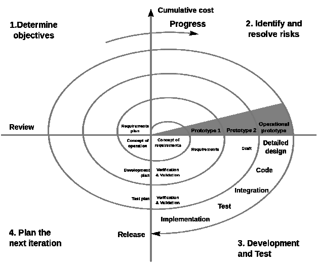
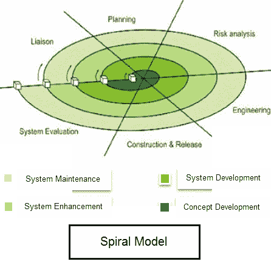
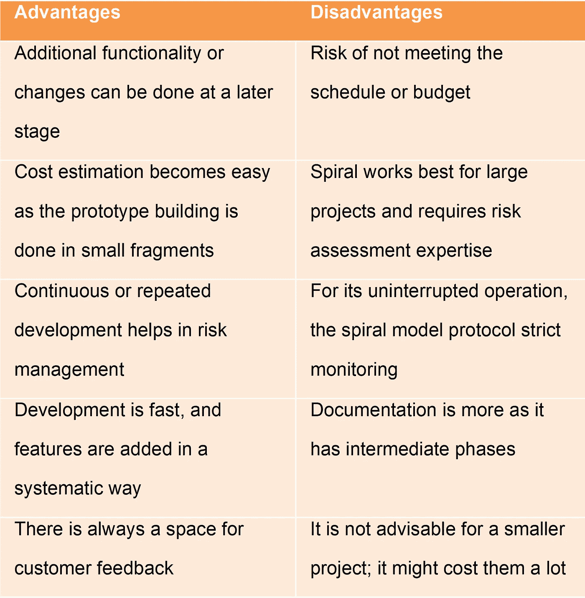

# 医疗保健中的螺旋项目管理方法

> 原文：<https://medium.datadriveninvestor.com/spiral-project-management-methodology-in-healthcare-4d1d1aae8398?source=collection_archive---------0----------------------->

这是独立医疗实践的正确选择吗？

Photo by [Fabrizio Chiagano](https://unsplash.com/@fabriziochiagano?utm_source=medium&utm_medium=referral) on [Unsplash](https://unsplash.com?utm_source=medium&utm_medium=referral)

项目管理就是将知识、技能、工具和技术应用到活动中，以满足临时努力或“项目”的需求由于医疗保健领域的每一项业务都可以在给定的时间和地点被标记为单个项目，因此可以毫无困难地假设医疗实践实际上是一项包含多个子项目的工作。

大多数临床医生可能不熟悉各种项目管理工具，因为通常不在医学院课程的范围内。然而，每一个独立的医生，不管是否雇佣了一个训练有素的“医疗实践经理”，在他们的日常实践中都不自觉地遵循某种形式的项目管理方案。

如今，使用标准项目管理工具的诊所发现自己很好地适应了当代医疗实践的挑战。还有那些不仅仅是把自己从舒适区拉出来，拥抱处理日常项目的新方法的人。

在过去的几年里，我一直在研究各种项目管理方法。由于几乎所有的项目都起源于医疗保健以外的行业，我更热衷于寻找完美的项目管理工具，以满足当今独立医疗实践的需求。我找到的答案如下:总是有一个优秀的工具，但是完美的项目管理方法并不是对每个实践和场景都完美的。

在我早期的出版物中，我总结了各种在医生实践中会派上用场的项目管理工具，比如敏捷、精益和瀑布方法。我也指出了一些混合模式以及。在这篇文章中，我想详细阐述另一个项目管理工具，螺旋方法。

Spiral Methodology

## 螺旋式项目管理及其起源

螺旋概念可以追溯到 Barry Boehm 在 1986 年发表的一篇名为**“软件开发和增强的螺旋模型”的论文在他的出版物中，他自由地使用了术语“流程模型”，指的是我们今天所知道的螺旋模型。尽管如此，螺旋也被称为****【瀑布】****原型**以及其他方法。****

**Boehm 在他后来的论文中将螺旋模型描述为“过程模型生成器”，其中选择基于项目的风险，作为为项目生成合适的过程模型的驱动力。因此，增量模型、瀑布模型、原型模型和其他过程模型是螺旋模型的特例，适合特定方案的风险范例。**

**尽管他那个时代的普遍看法认为第一个螺旋模式确实过于简单，但博姆发现情况恰恰相反。相反，为了支持他的信念，他根据几个误解对螺旋进行了分类。他说，在许多错误中，最危险的错误是，首先，螺旋是一系列瀑布式的增量。所有项目活动都遵循单一的螺旋序列。他也拒绝接受螺旋图中的每一个操作都必须在布局中完成的事实。因此，为了更好地从“危险螺旋外观”中识别真正的螺旋，Boehm 准备了真实螺旋应用的六个标准特征。**

****第一个**——他认为我们必须在实施螺旋之前掌握需求。**

****第二**——需求应该没有未完成的、高风险的结果，例如由于成本、进度、安全、性能、用户界面、组织力量等引起的风险。**

****第三**——需求的本质不应该在开发或演进过程中变化。**

**第四个——需求应该符合所有主要系统涉众的期望，包括用户、客户、开发人员、维护人员和投资者。**

****第五**——我们必须很好地解释执行需求的示例性架构。**

****第六个也是最后一个**——需要有足够的日历时序进度。**

**当这些假设确实适用时，避免指定需求并盲目地按顺序进行是一个方案风险。瀑布模型因此成为螺旋模型的风险驱动特例。**

****

**Spiral Model**

**顺序定义项目的实际重要产品通常会减少开发满足涉众目标和约束的系统的可能性，也称为“成功条件”**

**这个不变量排除了“危险的螺旋相似”过程，这些过程在瀑布模型的基本假设不适用的设置中使用一系列增量瀑布省略。**

## **螺旋是一种风险驱动的项目管理方法**

****螺旋模型**仅仅基于给定项目的独特风险模式；螺旋模型指导团队采用一个或多个过程模型的元素，例如[增量](https://en.wikipedia.org/wiki/Iterative_and_incremental_development)、[瀑布](https://en.wikipedia.org/wiki/Waterfall_model)或[进化原型](https://en.wikipedia.org/wiki/Software_prototyping#Evolutionary_prototyping)。**

**螺旋模型的特征“风险驱动的混合体”与其他过程模型的特征已经存在。今天，螺旋模型步骤的风险驱动模型提供了一个基础来容纳面向规范、面向原型、面向模拟、面向自动转换或其他方法的各种混合。**

****

**Photo by [Alvaro Reyes](https://unsplash.com/@alvarordesign?utm_source=medium&utm_medium=referral) on [Unsplash](https://unsplash.com?utm_source=medium&utm_medium=referral)**

## **螺旋模型阶段**

## **规划阶段**

**规划阶段包括确定冗余的成本、进度和资源，还包括了解系统分析员和客户之间永久通信的系统要求。**

## **风险分析阶段**

**在计划和最终确定风险缓解策略的同时，对潜在风险进行识别。**

## **工程/开发阶段**

**它包括在客户端测试、设计和部署项目。**

## **评估阶段**

**客户对软件的评估包括识别和监控风险，如进度延误和成本超支。**

## **何时使用螺旋方法论？**

**一般来说，螺旋方法在八种情况下会有帮助。这些包括:**

**1.螺旋方法对于高风险和不可预测性的大规模项目是有益的**

**2.当预计频繁发布时，螺旋方法可以派上用场**

**3.创建原型的需要也建立了这种方法的逻辑用法**

**4.风险和成本评估是为什么应该使用螺旋的重要原因**

**5.对于中高风险项目**

**6.当需求不明确且复杂时**

**7.当变化可能需要在任何时候**

**8.由于经济重点的变化，长期项目承诺不可行**

## **螺旋方法论的利与弊**

**尽管每个项目管理工具如果被选择用于正确的项目都会有所帮助，但是理解与螺旋方法相关的重大障碍和优势。**

**一般来说，螺旋方法可以通过为未来的变化提供额外的功能和可能性来增加项目的灵活性。通过将成本估算分解成更小的部分，它使得成本估算更易于管理，尤其是在大型项目中。因此，这种分散的方法将作为减轻风险的缓冲。螺旋还提供了一个客户反馈的机会。**

**虽然螺旋方法对许多工程应用是有帮助的，但是，它也有其特有的缺点。例如，使用螺旋式方法可能达不到设定的期限或预算门槛。它最适合大型项目，这就是为什么它可能还需要风险评估专业知识。像敏捷这样的其他项目管理工具一样，螺旋方法是不灵活的，并被严格遵循。因此，它需要全面的文档，这也可能会增加费用。**

****

**Advantage and Disadvantages**

## **每个螺旋循环中的四个必要动作**

**螺旋方法需要在每个周期中必须发生的四个具体行动，包括:**

**1.考虑双赢条件或利益相关者的目标和限制。**

**2.识别和评估满足特定成功条件的替代方法。**

**3.识别和解决源自所选方法的风险。**

**4.并获得所有成功关键利益相关方的批准，以及继续下一个周期的承诺。**

## **风险定义了所付出的努力程度**

**对于任何项目活动，从需求分析、设计、原型到测试，项目团队必须确定付出的努力有多充分。在一个值得信赖的螺旋过程循环中，个人决策是通过降低整体风险来做出的。例如，在测试产品或服务计划上花费额外的时间经常会降低市场拒绝不完美产品的风险。尽管如此，由于竞争对手提前进入市场，额外的测量时间可能会增加风险。因为，从螺旋模型的前景来看，我们应该进行测试，直到整个风险贬值。这就是为什么干预不变量的“危险的螺旋相似物”包括忽视可伸缩性问题风险的进化过程和大量致力于必须重新设计或交换以适应未来产品增量的技术架构的增量策略。**

## **风险决定细节的程度**

**对于所呈现的成果，项目团队必须决定对于任何项目工件，如需求规格、设计文档或测试计划，有多少细节是可接受的。在真正的螺旋过程循环中，这些决策是通过最小化总体风险来做出的。**

**项目应该准确地指定那些通过精确的规范来降低风险的特征，将需求规范作为一个实例来考虑。相反，项目不应该合理地指定那些精确的规格说明会增加风险的特性。**

** [## 敏捷项目管理及其在医疗实践中的应用

### 管理当今医疗实践的当代见解

medium.com](https://medium.com/datadriveninvestor/agile-project-management-and-its-application-in-medical-practice-3e68c6853c60) 

## 螺旋法中锚点里程碑的使用

Boehm 最初对螺旋模型的描述没有包含任何过程里程碑。但是，后来，经过许多改进，他插入了三个定位点里程碑，作为进度指标和参与点。关键问题区分锚点里程碑**；生命周期目标**、**生命周期架构**、**初始运营能力**。

生命周期目标- 是否有满足每个人双赢条件的技术和管理策略的充分定义？

如果涉众批准，那么项目已经实现了生命周期目标里程碑。否则，我们可以拒绝该计划，或者利益相关者可以承诺另一个周期来获得“是”

生命周期架构(Life Cycle Architecture)-是否有一个令人满意的定义来定义所采用的方法以满足每个人的双赢条件，是否所有的重大风险都被消除或减轻了？

如果涉众同意，那么这个项目也已经获得了这个生命周期架构里程碑。否则，项目可能会被放弃，或者涉众可以承诺另一个符合他们目标的周期。

**初始运营能力**——软件、站点、用户、操作人员和维护人员是否有足够的准备，通过创建系统来满足每个人的双赢条件？

同样，如果涉众同意说“是”，那么项目已经通过了最初的操作能力里程碑，因此可以启动了。或者，项目可以被放弃，或者涉众可以分配到另一个周期来尝试达到“是”

 [## 瀑布项目管理方法

### 它在医疗实践中的应用

medium.com](https://medium.com/datadriveninvestor/the-waterfall-project-management-methodology-4d45c2025010) 

## 系统焦点及其生命周期

这种螺旋不变量突出了系统的重要性和贯穿其整个生命周期的长期关注。它拒绝强调初始开发的“危险的螺旋外观”,这种类型的规则可能来自于遵循面向对象或结构化结果分析和设计的公开方法，而忽略项目过程需求的其他方面。

## 螺旋及其在医疗保健系统中的应用

螺旋管理方法已经在医疗领域取得了一定的成功。[根据 2015 年发表在《国际科学与研究杂志》(IJSR)上的一篇文章](https://pdfs.semanticscholar.org/dd3c/a49194de2c78edc26fa7ae4bfcf87b75d335.pdf)，利用螺旋方法论实现了一个在线多专科医院管理系统。在线多专科医院管理系统提供了简化操作、增强行政管理&控制、卓越的患者护理、严格的成本控制和提高盈利能力的优势。作者在一家医院实现了一个完全计算机化的系统，软件处理所有的需求。同时，工作人员和患者都可以使用手动流程，因为他们不能突然应付新系统。

缺乏 IT 友好型医务人员，以及大量涌入医院的患者，使得迁移到自动化手段变得非常棘手。因此，螺旋项目管理工具得到了有效简化，同时考虑到了医院系统所需变革所涉及的风险和限制。

另一个例子是，基于医疗保健系统的特定环境，例如机密性、真实性、与外部系统的适应性以及系统的复杂性，因此需要一个正式的解决方案。在处理[复杂的医疗场景](https://zechen1.weebly.com/blog/software-process-improvement-initiative)时，可以使用流程模型。

由于医疗保健系统中的高波动性和高风险，Spiral 对于医生实践的软件开发特别有用。人们可以合理地想象利用敏捷和螺旋方法的混合模型。例如，当医疗软件的最终用户在实践中使用产品时，输入验证可能会非常随意，这取决于环境。

在患者注册期间，需要填写一些字段；然而，当涉及到紧急情况时，基于患者的疾病，患者可能无法满足请求。因此，必须提供解决方案，例如最小化所需的输入字段，仅提交关键信息，提供快速参考，或者为用户提供跳过该区域的选项。

## 带回家的信息

总之，螺旋项目管理工具，就其纯粹的形式而言，更适合广泛的医疗保健系统来实现多方面的自动化过程。然而，每一种情况，如医疗实践的范围及其目标，最终都会推动选择最合适的方案。在高风险的医疗实践中，患者流量大，多学科环境中的工作人员并不精通技术进步，考虑到成本限制，螺旋可能是一个合理的选择。即使在这种情况下，将它与敏捷方案混合可能会使它更有效。

[本文原载于《数据驱动投资者》](https://www.datadriveninvestor.com/2020/08/04/spiral-project-management-methodology-in-healthcare/)

 [## 医疗保健中的精益项目管理

### 现代医疗实践中以病人-医生为中心的方法

medium.com](https://medium.com/datadriveninvestor/lean-project-management-in-healthcare-27cef017a8eb)  [## 人工智能(AI)黑匣子

### 临床决策工具与医生临床判断的对比

medium.com](https://medium.com/illumination/artificial-intelligence-ai-black-box-59cb682b610e)**