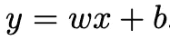
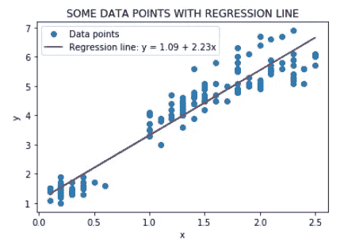
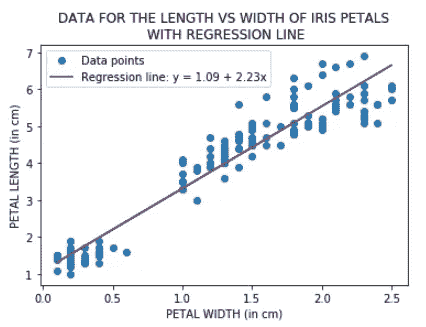
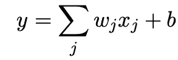
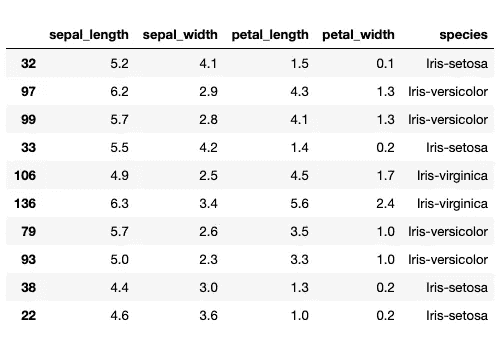
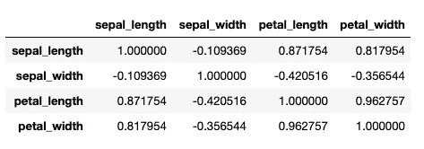
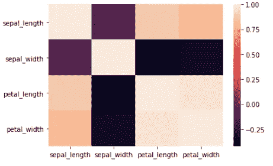
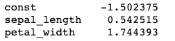
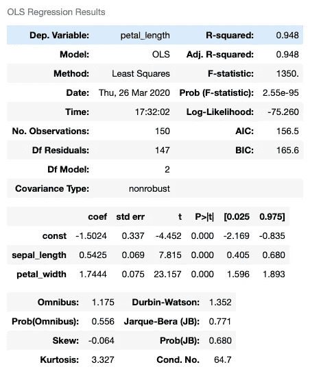

# 突然进入线性回归

> 原文：<https://medium.datadriveninvestor.com/spring-into-linear-regression-17cf2c0813f8?source=collection_archive---------13----------------------->

## 一种常见算法的数学和代码

大家好！在上周的博客中([尽管如此，她解决了数学问题](https://medium.com/datadriveninvestor/nevertheless-she-solved-math-problems-cebd680d77bd))，我宣布我将开始写数据科学主题背后的数学。今天的话题是**线性回归**。*我们开始吧。*


我假设我们大多数人都见过一个非常简单的 1D 线性回归方程



其中 *x* 为自变量， *y* 为因变量， *w* 为回归线的斜率， *b* 为直线的 *y* 截距。下图显示了一些数据点及其回归线的示例。数据点的坐标形式为( *x* ， *y* )。回归线也称为最佳拟合线，在本例中为 *y* = 1.09 + 2.23 *x* (其中 *w* = 2.23，b = 1.09)。



对于数据科学的应用，可以将 *x* 视为特征值， *y* 为预测值， *w* 为特征的权重 *x* 和 *b* 为偏差项。



在上面的例子中，想想鸢尾花的花瓣宽度和花瓣长度之间的关系。从图中，这些特征似乎具有线性关系，我们可以使用回归线从宽度预测花瓣的长度。

让我们更进一步。与其在数据空间中是线性的(只有一个特征对应于一个预测值)，不如让我们将思维转移到一个方程，它是参数(回归系数， *w* )和预测变量， *x* 的[线性组合。](https://en.wikipedia.org/wiki/Linear_combination)



请注意，这看起来不像线的典型几何解释。在上面的例子中，我们只需要图表上的一个轴(水平轴)来对应每个数据点的预测分量。在这里，你可以有几个，这就是为什么这是(有时)被称为多元线性回归。顺便说一下，我们只能看到两个特征(上式中的 *x1* 和 *x2* )，因为我们需要一个第三轴作为函数的输出( *y* )。

[](https://www.datadriveninvestor.com/2020/02/19/five-data-science-and-machine-learning-trends-that-will-define-job-prospects-in-2020/) [## 将定义 2020 年就业前景的五大数据科学和机器学习趋势|数据驱动…

### 数据科学和 ML 是 2019 年最受关注的趋势之一，毫无疑问，它们将继续发展…

www.datadriveninvestor.com](https://www.datadriveninvestor.com/2020/02/19/five-data-science-and-machine-learning-trends-that-will-define-job-prospects-in-2020/) 

让我们看一个用 Python 编写的多元线性回归的简单例子。因为是春天，所以我用的是经典教科书数据集，虹膜数据集。

# 关于数据

如果你没听说过教材 Iris dataset，可以从 Kaggle【链接[此处](https://www.kaggle.com/uciml/iris)下载。该数据集自 1936 年以来一直存在，并被用作分类的标准教科书示例。它包括三种鸢尾，每种有 50 个样本，以及每种花的一些特性。我想看看我们能否用一个线性模型来拟合这个数据集。

# 过程

1.  导入必要的模块，读取数据，并查看示例:

```
import pandas as pd
import seaborn as sns
import statsmodels.api as sm
from sklearn.linear_model import LinearRegressiondf = pd.read_csv(“data/IRIS.csv”)
df.sample(10)
```



2.在数据中寻找相关性

```
df.corr()
```



从相关矩阵可以看出，花瓣 _ 宽度和花瓣 _ 长度，以及萼片 _ 长度和花瓣 _ 长度都是高度相关的。顺便说一下，我们可以在关联热图中看到这一点。

```
# Use the .heatmap method to depict the relationships visually!sns.heatmap(df.corr());
```



3.使用统计模型创建线性回归模型

```
# Multiple Regression in StatsModelsx = df[['sepal_length','petal_width']]# Our model needs an intercept so we add a column of 1s
predictors = sm.add_constant(x) model = sm.OLS(y, predictors).fit()# print the parameters of our model
model.params
```



对于这个等式:

```
line = f'Regression line: y = {model.params[0]:.2f} + {model.params[1]:.2f}x1 + {model.params[2]:.2f}x2'
line
```

回归线为: *y = -1.50 + 0.54x1 + 1.74x2* 其中 *x1* 和 *x2* 分别为萼片 _ 长度和花瓣 _ 宽度的独立值，权重和偏差四舍五入到小数点后两位。

4.我们可以使用 scikit-learn 创建相同的线性回归模型(没有数据的训练测试分割)。

```
lr = LinearRegression()
lr.fit(x, y);
sepal_length, petal_width = lr.coef_
const = lr.intercept_line = f'Regression line: y = {const:.2f} + {sepal_length:.2f}x1 + {petal_width:.2f}x2'
line
```

线还是 *y = -1.50 + 0.54x1 + 1.74x2\.*

那么，如果这两个模块给出相同的线性回归线，为什么有多个包而不是一个？答案在于每个人的意图。

*   根据 API(链接[这里是](https://www.statsmodels.org/stable/index.html))，statsmodels *“是一个 Python 模块，它提供了用于许多不同统计模型的估计的类和函数，以及用于进行统计测试和统计数据探索的类和函数。”*它遵循传统的统计模型，重点是分析数据。事实上，您可以使用 statsmodels 来打印汇总统计数据，这些统计数据可用于确定哪个特性具有统计显著性。

```
model.summary()
```



*   作为比较，scikit-learn(文档[此处为](https://scikit-learn.org/stable/modules/generated/sklearn.linear_model.LinearRegression.html))遵循机器学习传统，强调训练测试分割预测的模型选择。一旦您分析了数据，这对于构建最终模型非常有用。

各位，这就是我今天的全部内容！以下是这篇文章的一些要点:

*   尽管多元线性回归方程在几何上看起来不是一条直线，但它是数学家所说的预测因子和权重的线性组合。
*   有两个计算线性回归模型的 python 包:statsmodels 和 scikit-learn。statsmodels 适用于探索和分析数据，而 scikit-learn 则用于使用机器学习进行预测。两者都使用普通线性回归的原理。

一如既往，在评论里聊！