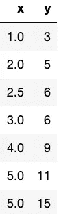
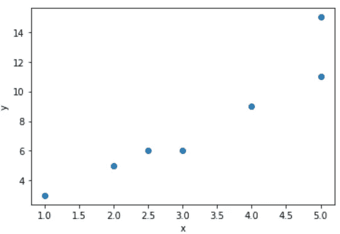
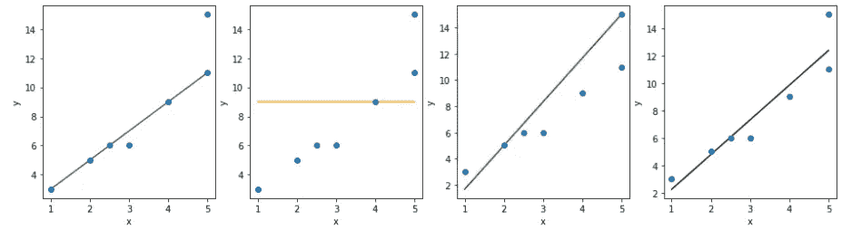
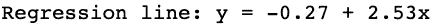
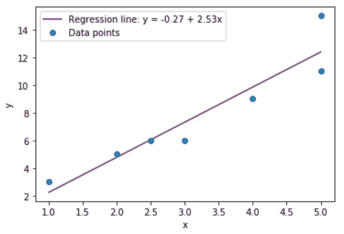
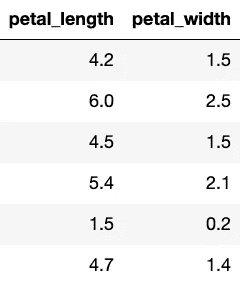
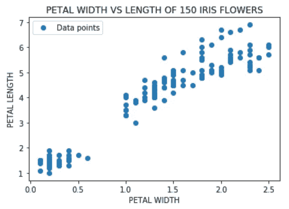
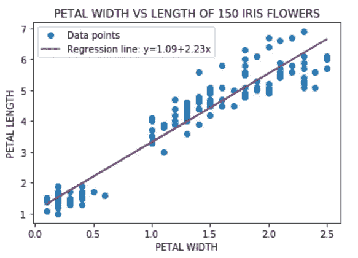

# 进入线性回归——第二部分

> 原文：<https://medium.datadriveninvestor.com/spring-into-linear-regression-part-2-da51c22ceb02?source=collection_archive---------15----------------------->

探索简单线性回归

大家好！两周前，我写了一篇关于线性回归的文章——投入线性回归。如果你没有看过那个帖子，你可以在这里赶上。我在那篇文章中谈了很多:

*   我介绍了简单线性回归和多元线性回归的方程。
*   我展示了一个关于鸢尾花数据的线性回归的例子。
*   我使用了两个 Python 包(statsmodels 和 scikit-learn)中的代码来计算一个线性回归模型，并写了其中一个优于另一个的情况。

今天我想深入探讨一下简单的线性回归。在这篇文章中，我将介绍:

*   线性回归模型的基本思想。
*   什么是最佳拟合线？
*   我们怎么知道那条线是“最好的”？
*   让我们重温一下鸢尾花的例子。

让我们从表格中的一些数据开始。

Seven data points displayed in a table format

哦，看哪！x 值(左列中代表自变量的值)和 y 值(右列中代表因变量的值)之间似乎存在关系。这种关系是直接的:随着 x 的增加，y 也变大。如果我们看一下数据的散点图，就很容易看出这一点。

Scatterplot of the values in Table 1

请注意，表格中的所有七个数据点都绘制在散点图中。请注意，x 值由水平轴表示。y 值由垂直轴表示。y 值也称为输出值，并基于 x 值(也称为输入值)进行更改。

 [## 数据驱动的投资者|微软比 Chrome 有“优势”

### 简史我从来不是浏览器的粉丝，确切地说，我只是一个浏览器的粉丝，Chrome。这是我的…

www.datadriveninvestor.com](https://www.datadriveninvestor.com/2020/03/29/microsoft-having-an-edge-over-chrome/) 

我们想对因变量和自变量之间的关系进行建模。既然似乎有线性关系，我们可以推断，一条线将很好地代表这种关系。但是，无论我们如何画线，我们都无法连接所有的数据点。

Lines that attempt to depict a relationship between the data points.

这引入了绘制最佳拟合线的思想。从名字上看，这是一条“最好”代表数据的线。该线可以穿过一些点，不穿过任何点，或者穿过所有点。线以上和线以下的点数大致相等。“最佳”的概念是通过最小二乘法在数学上定义的。我不会在这篇文章中详细介绍这个方法，但是花一分钟(或者更长时间)来看看[这个链接](https://www.varsitytutors.com/hotmath/hotmath_help/topics/line-of-best-fit)中对数学的描述和一个例子。或者，如果你想看视频，去 YouTube 上看《T2》这部《T3》。

咻——最小二乘法工作量很大，并且为错误提供了很大的空间。幸运的是，我们可以使用 Python 包 scipy 在 Python 中快速编写代码。

四舍五入到两位小数，该数据集的回归线(最佳拟合线)为:

这是用数据点绘制的线。

The line of best fit as defined by the least square method. Notice this line does not intersect all the points in the scatterplot.

好吧，那我怎么知道这条线是“好”的。我的意思是，是的——我们使用定义“最佳”拟合的最小二乘法来计算直线。有一个值用于衡量拟合的好坏，即线性回归拟合优度的度量值 r。这是一个衡量数据点与最佳拟合线接近程度的度量值。这个值可以是正的，也可以是负的，但是如果我们计算 r 的绝对值，它将介于 0 和 1 之间。

*   如果 r 接近 0，那么这条线不能很好地代表数据。换句话说，知道独立值无助于找到从属值。
*   如果 r 接近 1，那么这条线是数据的近乎完美的拟合。

我们上面的最佳拟合线的 r = 0.93，很好地代表了数据！

让我们重温一下鸢尾花的例子。数据表明，随着花瓣宽度的增加，花瓣长度也会增加。请看下表，它只有 6 个数据点(数据集中的 150 个数据点)。

在这种情况下，花瓣宽度是自变量，花瓣长度是因变量。这是数据集中所有 150 个数据点的图表。

事实上，随着花瓣宽度的增加，花瓣长度也会增加。让我们用一条线来模拟它。

r 值为 0.93，非常吻合。

让我们更进一步。假设一片花瓣的长度不仅可以用花瓣的宽度来描述，还可以用花朵接受阳光照射的程度来描述。然后我们有两个变量，可以描述为自变量。我们还用线性回归来模拟这个场景吗？请在以后的帖子中关注这个问题的答案！

各位，今天就到这里。一如既往——让我们在评论中聊天吧！