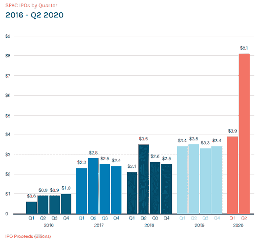
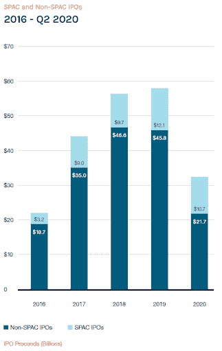

# SPV 和 spac——企业家的直接指南

> 原文：<https://medium.datadriveninvestor.com/spvs-and-spacs-a-straightforward-guide-for-entrepreneurs-35694b51b92?source=collection_archive---------17----------------------->

有投资者想做 SPV 吗？想知道这些关于垃圾的谈话是怎么回事吗？这篇文章关注的是希望了解更多的企业家。

**1)特殊目的载体(SPV)** —有时也称为特殊目的实体，基本上是一种隔离金融风险的方式。特殊目的机构可以包括来自个人和公司的任何组合的投资，并具有独立于他们的法律地位。例如，如果特殊目的机构的投资者破产，特殊目的机构仍然保持其义务。如果特殊目的机构包括来自政府的融资，那么即使管理发生变化，债务仍然存在。

在创业世界中，SPV 通常由一个投资者领导，将许多其他投资者置于同一保护伞下，通常收取一些费用让他们参与交易。围绕这些费用的共识比其他关于创业的规范要少得多，2%的管理费和 20%的套利是最接近标准的风险投资模式。设立一个特殊目的公司的价格也有很大差异——几乎任何律师事务所都可以根据复杂程度设置不同的费率，像 AngelList 这样的替代方案使他们特别负担得起。

如果一个投资者做 SPV 主要是为了聚集更多的现金，那么企业家应该没有什么理由担心。总是有一个问题，就是从一个更大的基金获得更大的投资，但作为一个企业家，你可能会对领导特殊目的机构的投资者和/或进入特殊目的机构创建的许多网络进行估值。但是如果特殊目的公司有其他条件，那么一定要理解它们。例如，众所周知，安然将大量员工股票放入特殊目的公司，然后用于对冲公司资产负债表上的资产。当安然无法支付其欠债权人和投资者的巨额款项时，特殊目的机构就会被触发，从而导致金融崩溃。

**2)特殊目的收购公司(特殊目的收购公司)** —通常也称为“空白支票公司”，是为特定并购筹集资金的一种方式&答:特殊目的收购公司是一个没有商业运作的实体，其组建目的完全是通过首次公开募股筹集资金，然后收购现有公司。对于那些关注金融界的人来说，这与杠杆收购(LBO)非常相似，只不过你不是在借钱，而是在公开市场融资。

SPACs 很少见，但近年来越来越受欢迎，尤其是在 2020 年，正如下面的绝对数字所示:

另一种看待 SPACs 增长的方式是，它们的相对百分比也有所增长，到 Q2 2020 年时几乎达到 IPO 资本的 1/3:

特殊目的收购公司正日益成为一个大数字游戏。潘兴控股公司的比尔·阿克曼在 7 月筹集了 40 亿美元，这是迄今为止最大的特殊目的收购公司。但海报儿童可以说是社交资本 Hedosophia Holdings 的 Chamath Palihapitiya，他在 2019 年为维珍投资了 8 亿美元，8 月为 Opendoor 投资了 48 亿美元，10 月为 Clover Health 投资了 37 亿美元。这对《创业世界》有什么意义？这是另一种选择——你不是创办一家公司，而是筹集资金收购一家公司，然后进一步发展。或者，如果你正在考虑在当前的现实中(当然是美国自 2008 年至 2009 年以来最混乱的时期)进行首次公开募股，那么 SPACs 应该在你的名单上。

*原载于* [*数据驱动投资人*](https://www.datadriveninvestor.com/2020/10/26/spvs-and-spacs-a-straightforward-guide-for-entreprenuers) *，《我很乐意在其他平台上辛迪加。我是*[*Tau Ventures*](https://www.linkedin.com/pulse/announcing-tau-ventures-amit-garg/)*的管理合伙人和联合创始人，在硅谷工作了 20 年，涉足企业、创业公司和风险投资基金。这些都是专注于实践见解的有目的的短文(我称之为 GL；dr —良好的长度；确实读过)。我的许多文章都在*[*https://www . LinkedIn . com/in/am garg/detail/recent-activity/posts*](https://www.linkedin.com/in/amgarg/detail/recent-activity/posts/)*上，如果它们能让人们对某个话题产生足够的兴趣，从而进行更深入的探讨，我会感到非常兴奋。如果这篇文章有对你有用的见解，请评论和/或给文章和* [*Tau Ventures 的 LinkedIn 页面*](https://www.linkedin.com/company/tauventures) *点赞，感谢你对我们工作的支持。这里表达的所有观点都是我自己的。*