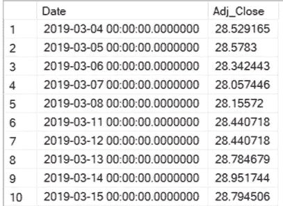
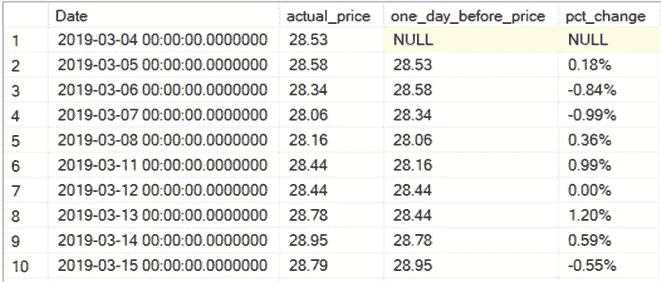
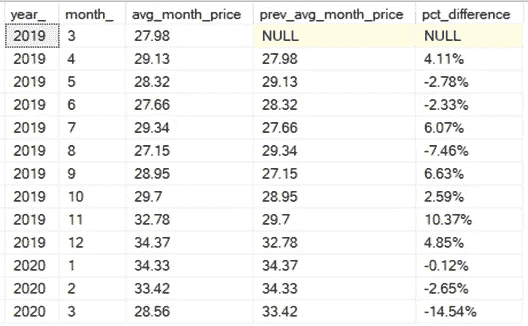

# 用于股票市场分析的 SQL

> 原文：<https://medium.datadriveninvestor.com/sql-for-stock-market-analysis-f2145031e125?source=collection_archive---------2----------------------->

## SQL 变得简单

## 用窗口函数比较收盘价

Don’t feel lost; use your friend SQL to get insights from your stock data! [Source](https://unsplash.com/photos/uCMKx2H1Y38)

在你做股票分析的工具带里，SQL 知识就像一把瑞士刀。您可以使用最容易学习的语言之一，以多种方式对数据进行切片、聚合、分离、过滤和比较。

今天，我将向您展示如何使用最酷的 Windows 功能之一，以及如何使用它来提高您的股票分析。我将使用 [SQL Server](https://www.microsoft.com/en-in/sql-server/sql-server-2019) ，所以请注意，如果您使用 [SQLite](https://www.sqlitetutorial.net/) 、 [PostgreSQL](https://www.postgresql.org/) 或其他变体，语法可能会发生变化，但是如果快速搜索，您可以很容易地找到等价的语法。

我们将使用的数据是美国银行股票的调整后收盘价，从 2019 年 4 月 3 日到 2019 年 3 月 3 日测量，因此它涵盖了这一特定股价的一年。让我们看看第一排:

Bank of America stock price (adjusted close), first 10 rows.

像往常一样，本教程的数据集和脚本可以在[这里](https://github.com/lucasmoratof/stock_projects)获得。

## 什么是窗口函数？

当我们需要基于一行或多行计算聚合值时，会使用窗口函数。它们非常方便，因为它们用于将一行中的值与其他行中的值进行比较。对于本教程，我们将使用一个最常用的窗口函数:

*   [**LAG**](https://docs.microsoft.com/en-us/sql/t-sql/functions/lag-transact-sql?view=sql-server-ver15) :用于访问当前行之前的行。

LAG 可用于进行强有力的比较，其结果也可用于进一步的计算，就像我们今天要做的那样。

## 将收盘价与前一天进行比较

股票市场最基本的一个问题就是:**这只股票过去表现如何？**我们通常喜欢在几天、几个月或几年之间比较这些信息，因此我们可以利用这些信息来了解股票行为，并尝试预测未来。为了回答这个问题，我们将每天比较股票，在我们比较了

*   创建一个临时表，以便我们可以使用适当的字段进行计算；
*   在临时表中，使用 LAG 函数创建一个包含前一天收盘价的新列；
*   在主查询中，比较价格与前一天的差异百分比。这个公式是:

> (实际价格-先前价格)/先前价格* 100

在查询中，我们使用的是**格式**函数，它用 100 代替乘法运算，并在我们传递参数‘P’时自动添加“%”符号。

 [## 数据科学和软件工程哪个更有前途？数据驱动的投资者

### 大约一个月前，当我坐在咖啡馆里为一个客户开发网站时，我发现了这个女人…

www.datadriveninvestor.com](https://www.datadriveninvestor.com/2019/01/23/which-is-more-promising-data-science-or-software-engineering/) 

现在看一下查询及其结果。如果您不熟悉 SQL，我为您留下了一些注释，以便让您更容易理解:

查询以创建每日收盘股票价格之间的比较。

Query Result. The last column shows how much a price has changed compared with the previous day.

很酷，不是吗？如果你熟悉股票市场，观察一段时间内的涨跌是很有趣的。关于查询，我们需要弄清楚关于滞后函数的几个关键点:

*   正如在任何窗口函数中一样，**我们总是需要 OVER 子句**。在我们的例子中，我们基本上是说按日期对数据进行排序，然后在排序后，将每一行与前一行进行比较。

在 LAG 中，我们需要两个参数，一个是我们要比较的列，它在实际的列之前很多行。因为我们需要前一天，所以我们使用数字“1”。

## 跨月价格比较

现在你对滞后现象更熟悉了，让我们用最后一个例子来说明如何比较全年的月平均价格。这个想法与最初的想法相似，但是我们还需要几个步骤来完成这个结果，所以请仔细阅读查询和注释:

将月平均价格与月间百分比变化进行比较。

以月、年等为单位汇总数据时，很少需要注意什么。：

*   聚合需要出现在主查询之前，这就是为什么我们在 FROM 语句中使用子查询；
*   由于我们要汇总不同年份的月份，因此在 LAG 函数和主查询的末尾使用额外的 ORDER BY 语句非常重要。否则，它将按月进行比较和排序，但会混淆年份。

让我们来看看结果:

Average price by month, with percentage change between months.

## 下一步是什么？

有了这些结果，你可以做很多事情！你可以分析股票的波动性，并试图找到原因，比如，为什么价格从 2019 年 8 月到 12 月开始强劲上涨？或者甚至将当前的事件，如冠状病毒，与 2020 年 3 月近 15%的显著下降联系起来。

您还可以使用这些数据绘制漂亮的图表，这将有助于您直观地了解价格变化。我有这个[教程](https://medium.com/datadriveninvestor/introduction-to-stock-analysis-in-python-574246e689e3)教你如何做到这一点。总之，我的目标是向您展示一些用于股票分析的 SQL 技巧，并让您了解该领域中使用的数据的可能性。我希望你能像我喜欢写它一样喜欢阅读！

你可以在 [Twitter](https://twitter.com/lmmfrederico) 、 [LinkedIn](https://www.linkedin.com/in/hey-i-am-lucas/) 、 [GitHub](https://gist.github.com/lucasmoratof) 和 [Tableau Public](https://public.tableau.com/profile/lucas.morato#!/?newProfile=&activeTab=0) 上找到我